## Prerequisites  
- **Proficiency:** Beginner
- **Tutorials:** [Protect your API Proxy by adding an Application Key Verification](https://www.sap.com/developer/tutorials/hcp-apim-verify-api.html)

## Next Steps
- This is the end of this series
- Select a tutorial from the [Tutorial Navigator](https://www.sap.com/developer/tutorial-navigator.html) or the [Tutorial Catalog](https://www.sap.com/developer/tutorials.html)


## Details
### You will learn  
Since SAP Cloud Platform, API Management is one of many services on the SAP Cloud Platform it also offers a deep integration in SAP Web IDE. With this integration you can easily browse and consume services from SAP Cloud Platform, API Management and directly create SAP Fiori like SAPUI5 applications leveraging one of the templates offered in SAP Web IDE.
 
### Time to Complete
**20 Min**.

---

[ACCORDION-BEGIN [Step 1: ](Learn about the SAP Cloud Platform Destinations needed)]

Create [SAP Cloud Platform Destinations](https://blogs.sap.com/2016/06/20/part-3-preparing-hcp-destinations-for-use-by-sap-web-ide/) that between them, give Web IDE both design time and runtime access to the API Proxies created in API Management.

[VALIDATE_1]
[ACCORDION-END]

[ACCORDION-BEGIN [Step 2: ](Learn about supplying an API Key to a request)]

You will see how a special security token known as the "API Key" or "Application Key" must often be sent as part of the request to invoke an API Proxy.  You will see how to identify whether the API Key should be sent as part of the query string or as an HTTP header field, and what variable name should be used to carry that value. Learn more about [providing your API key](https://blogs.sap.com/2016/06/21/part-4-supplying-the-api-key-at-runtime/) in a request to your API Proxy.

[VALIDATE_2]
[ACCORDION-END]

[ACCORDION-BEGIN [Step 3: ](Learn about accessing the Proxy through Web IDE)]

[Consume an API Proxy in Web IDE](https://blogs.sap.com/2016/06/21/part-5-consuming-api-proxies-in-web-ide/), assuming the API proxy exposes an `OData` service.

[VALIDATE_3]
[ACCORDION-END]

[ACCORDION-BEGIN [Step 4: ](Log onto the SAP Cloud Platform Cockpit)]

Log onto your [SAP Cloud Platform Cockpit](https://account.hanatrial.ondemand.com/cockpit).


[ACCORDION-END]

[ACCORDION-BEGIN [Step 5: ](Open your destinations)]

Under Connectivity, click on **Destinations**.


[ACCORDION-END]

[ACCORDION-BEGIN [Step 6: ](Create API Management Catalog destination)]

<<<<<<< Updated upstream
Enter/confirm all fields in the Destination configuration section with the information below.

Field Name     | Value
:------------- | :-------------
Name           | `APIM_DevPortal_Trial`
Type           | `HTTP`
Description    | `Destination to API Developer Portal`
URL            | take the URL of the developer Portal seen in [Activate SAP Cloud Platform, API Management on SAP Cloud Platform Trial](https://www.sap.com/developer/tutorials/hcp-apim-enable-service.html), e.g. `https://devportalu34f5b50f-YourIDtrial.hanatrial.ondemand.com`
Proxy Type     | `Internet`
Authentication | `AppToAppSSO`

=======
Click on **New Destination**.


>>>>>>> Stashed changes

Provide the following information to create a destination for the API Management Catalog. This will provide Web IDE access to all the API Proxies you have exposed through published products.

**Field** | **Value**
---- | ----
Name | `APIM_DevPortal_Trial`
Type | HTTP
Description | Destination to API Developer Portal
URL | take the URL of the Developer Portal seen in [Activate SAP Cloud Platform, API Management on SAP Cloud Platform Trial]( https://www.sap.com/developer/tutorials/hcp-apim-enable-service.html), e.g. `https://devportalu34f5b50f-<your-P-User>trial.hanatrial.ondemand.com`
Proxy Type | Internet
Authentication | `AppToAppSSO`


Click (twice) on **New Property** button. Enter the following information for the new properties.

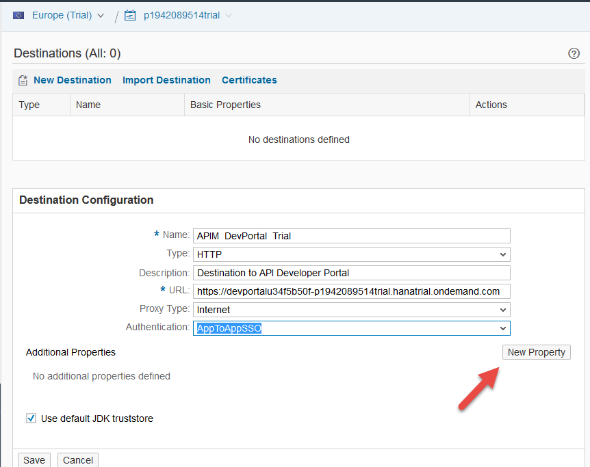

**Field** | **Value**
---- | ----
`WebIDEEnabled` | true
`WebIDEUsage` | `api_mgmt_catalog`


Click on **Save**.


[ACCORDION-END]

[ACCORDION-BEGIN [Step 7: ](Create destination for the API Proxy)]

To create a second destination click on **New Destination** again


Provide the following information to the new destination.

> Please make sure to enter the SAP Cloud Platform username and password, not the username and password for the ES4 SAP Developer System

**Field** | **Value**
---- | ----
Name | `APIM_Endpoint_Trial`
Type | HTTP
Description | Destination to API Portal
URL | `https://trial.apim1.hanatrial.ondemand.com:443`
Proxy Type | Internet
Authentication | Basic
Username | `<Your SAP Cloud Platform Username>`
Password | `<Your SAP Cloud Platform Password>`


Click on **New Property**.

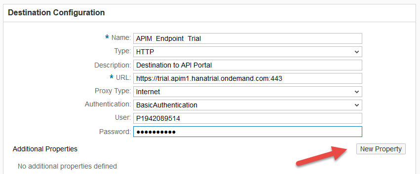

Add three **Additional Properties** fields by clicking on the **New Property** button once for each property.

**Field** | **Value**
---- | ----
`TrustAll` | `true`
`WebIDEEnabled` | true
`WebIDEUsage` | `api_mgmt_proxy`


Click on **Save**.

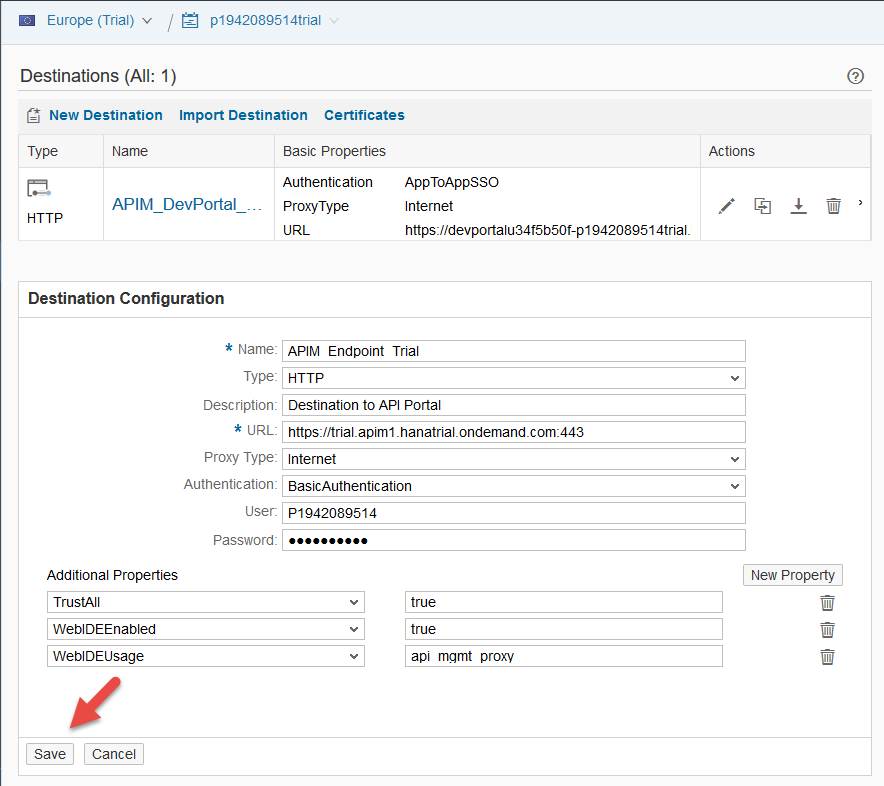


[ACCORDION-END]

[ACCORDION-BEGIN [Step 8: ](Open your Web IDE)]

You can find the SAP Web IDE by clicking on **Services**.

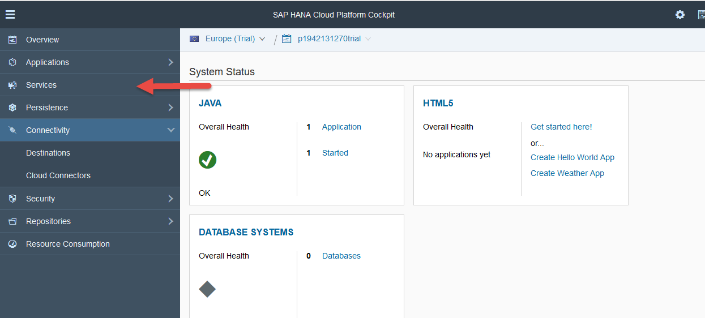

From the section **Dev & Ops**, select **SAP Web IDE**. (Not the full-stack version!)

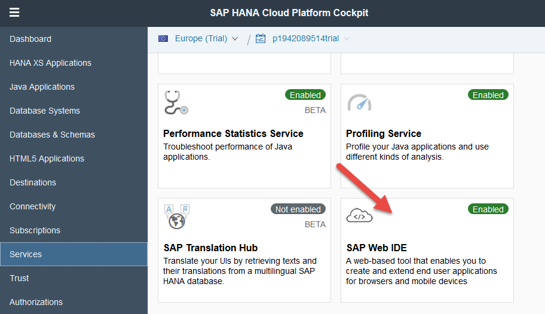

Click on **Open SAP Web IDE**

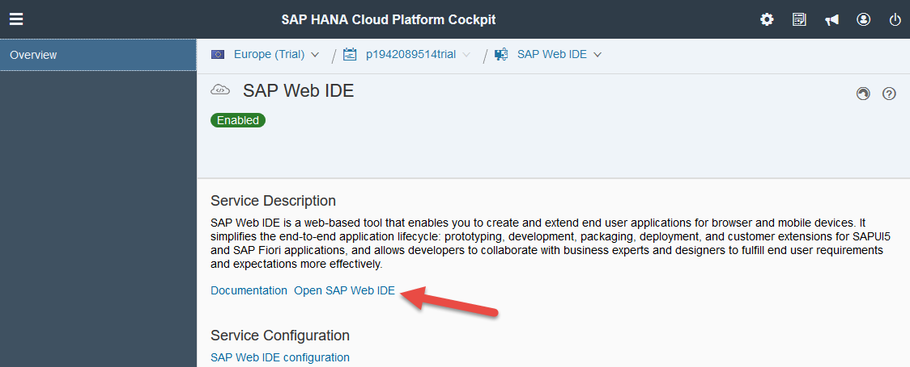


[ACCORDION-END]

[ACCORDION-BEGIN [Step 9: ](Create new project)]

Click on **`File > New > Project from Template`**.


[ACCORDION-END]

[ACCORDION-BEGIN [Step 10: ](Select template)]

From the Template Selection windows click on **SAP Fiori Master-Detail Application** and click on **Next**.

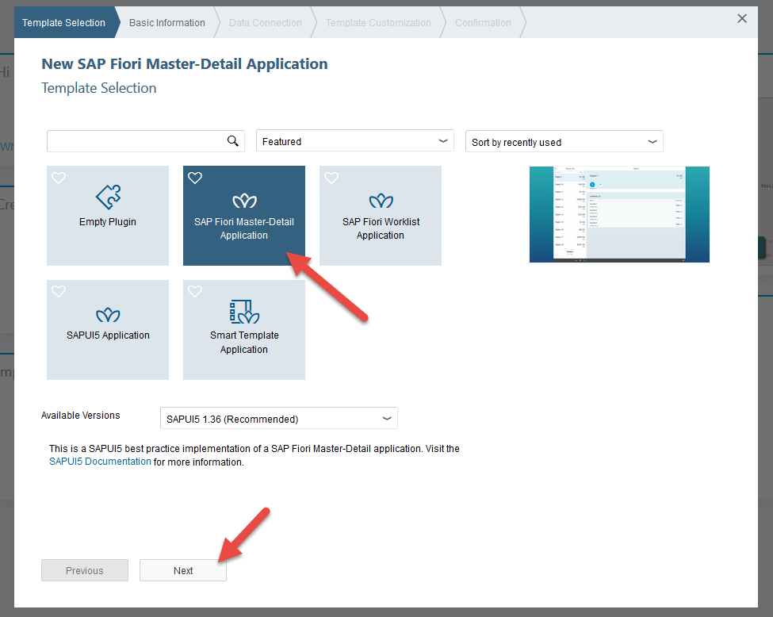


[ACCORDION-END]

[ACCORDION-BEGIN [Step 11: ](Name the project)]

Enter a project name: **`SAPWebIDEviaAPIManagement`** and click on **Next**.

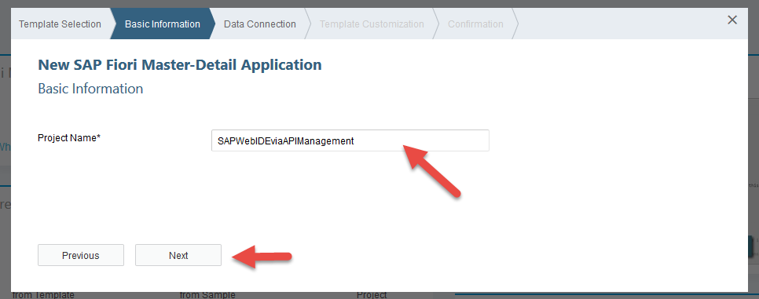


[ACCORDION-END]

[ACCORDION-BEGIN [Step 12: ](Select the Destination to API Developer Portal)]

From the **Service Catalog** drop-down, select the **Destination to API Developer Portal** which you created in one of the previous steps.

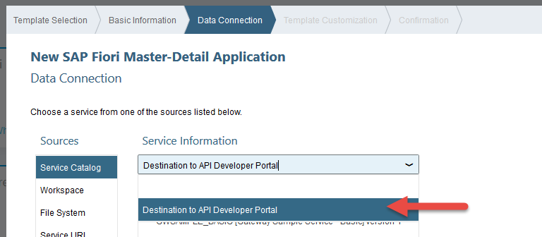


[ACCORDION-END]

[ACCORDION-BEGIN [Step 13: ](Select service and subscribe)]

Select the **`GWSAMPLE_BASIC`** API Proxy created in [Create an API Proxy](http://www.google.de)   https://www.sap.com/developer/tutorials/hcp-apim-create-api.html) and click on **Subscribe**. From there select the related Product from [Add the API Proxy](http://www.google.de)  https://www.sap.com/developer/tutorials/hcp-apim-create-product.html)

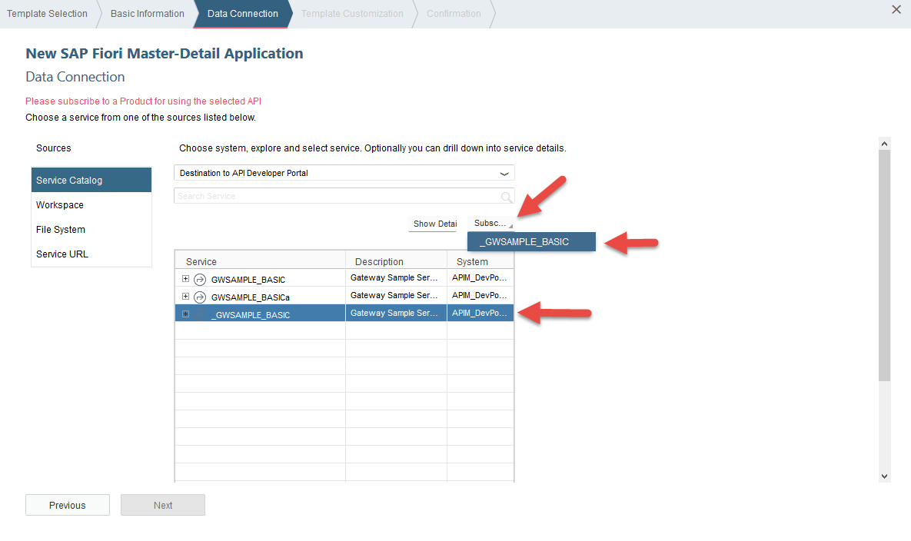


[ACCORDION-END]

[ACCORDION-BEGIN [Step 14: ](Click next)]

Click on **Next**


[ACCORDION-END]

[ACCORDION-BEGIN [Step 15: ](Enter mapping details)]

Enter:

Field Name                     | Value
:----------------------------- | :-------------
`Title`                        | `SAP Fiori App based on API Management`
`Namespace`                    | `com.sap.apim`
`Description`                  | `Fiori app leveraging API Management`
`Object Collection`            | `SalesOrderSet`
`Object Collection ID`         | `SalesOrderID`
`Object Title`                 | `SalesOrderID`
`Object Numeric Attribute`     | `GrossAmount`
`Object Unit of Measure`       | `CurrencyCode`
`Line Item Collection`         | `ToLineItems`
`Line Item Collection ID`      | `ItemPosition`
`Line Item Title`              | `ProductID`
`Line Item Numeric Attribute`  | `GrossAmount`
`Line Item Unit of Measure`    | `CurrencyCode`

and click on **Finish**

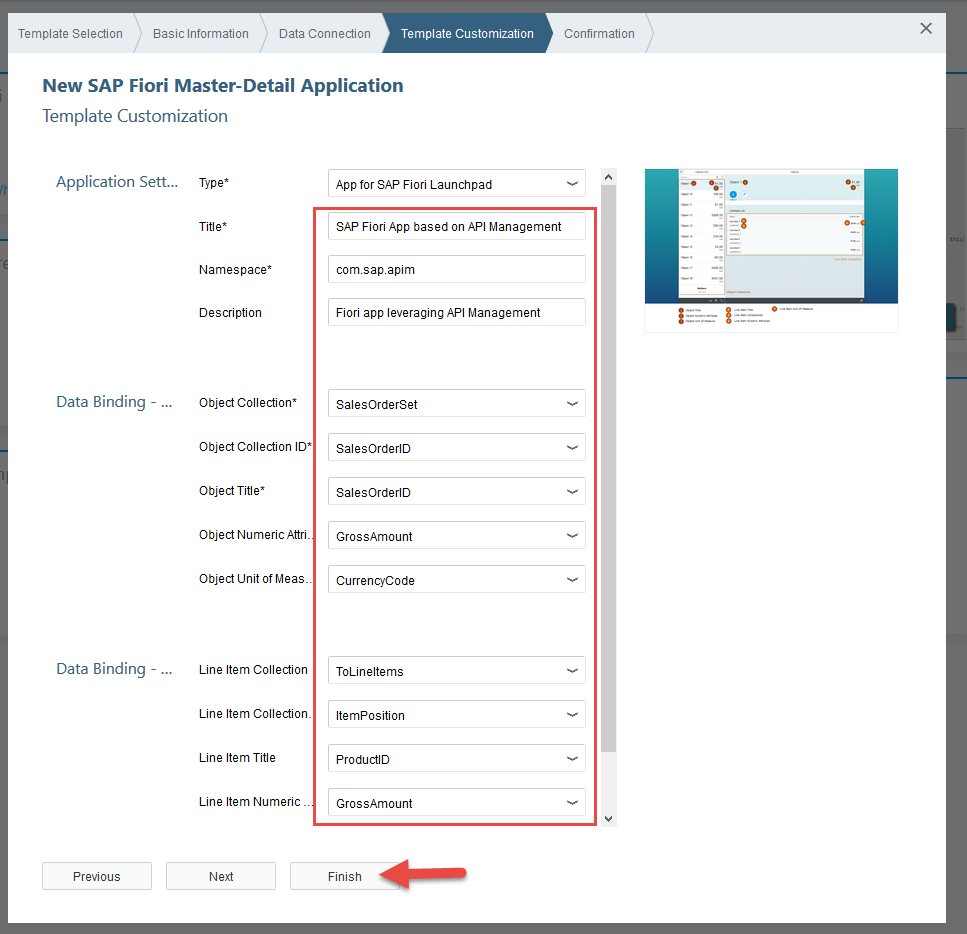


[ACCORDION-END]

[ACCORDION-BEGIN [Step 16: ](Open manifest.json)]

Double click on the **`manifest.json`** file from **`SAPWebIDEviaAPIManagement`** -> **`webapp`**

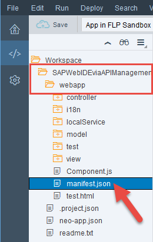


[ACCORDION-END]

[ACCORDION-BEGIN [Step 17: ](Open code editor)]

Switch to the *Code Editor* view by clicking on **Code Editor**

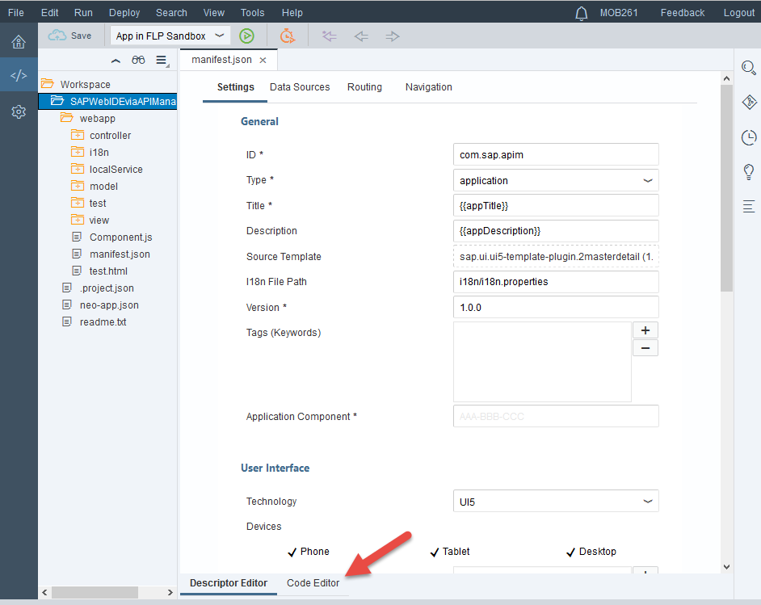


[ACCORDION-END]

[ACCORDION-BEGIN [Step 18: ](Add code)]

Search for **`sap.ui5`** and go to the **models** section. There add the following code snipped right after the **"sap-documentation": "heading" }** entry:

```javascript
      ,
			"headers": {
				"APIKey": "<yourAPIKey>"
			}
```
> Make sure not to forget the first ","

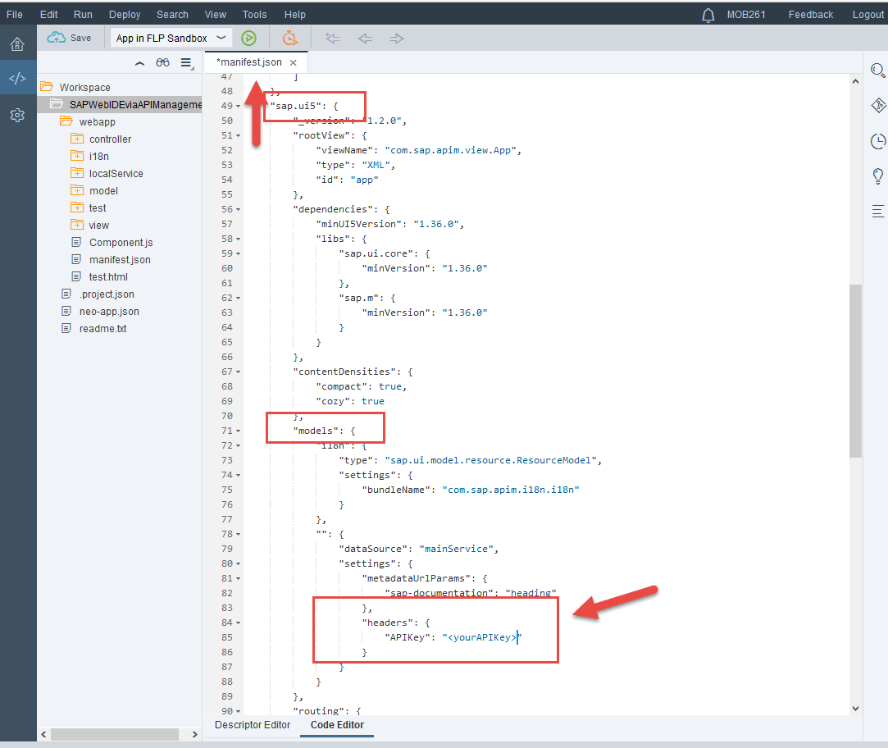


[ACCORDION-END]

[ACCORDION-BEGIN [Step 19: ](Open the API Developer Portal)]

In order to get the API Key you need to open the **API Developer Portal** in a new tab, e.g. `https://devportalu34f5b50f-<your-P-User>trial.hanatrial.ondemand.com/#/shell/discover`

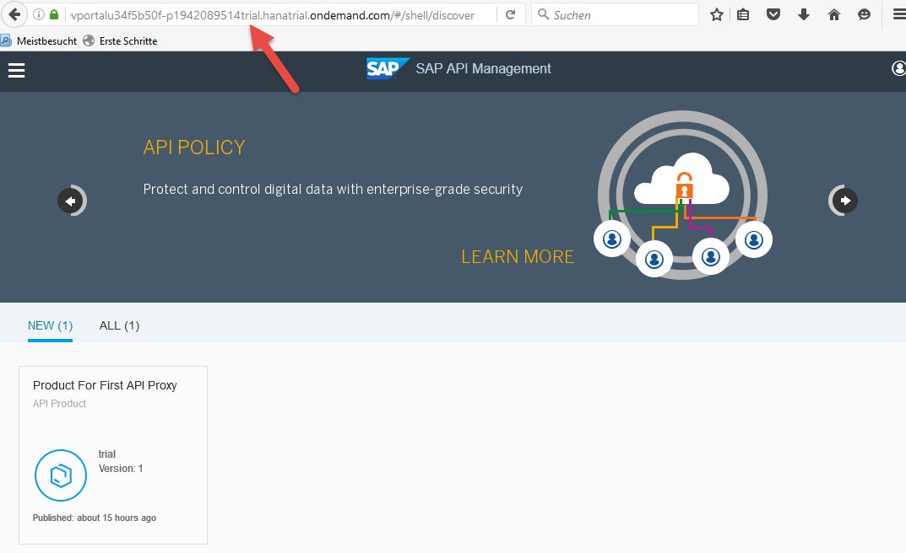


[ACCORDION-END]

[ACCORDION-BEGIN [Step 20: ](Click Consume)]

Click on the **Hamburger menu** and click on **Consume**   

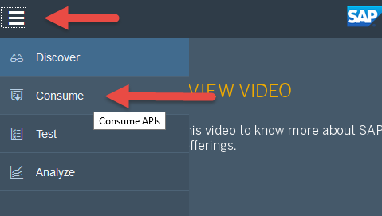


[ACCORDION-END]

[ACCORDION-BEGIN [Step 21: ](Open SAPWebIDEviaAPIManagement)]

Click on the Application **`SAPWebIDEviaAPIManagement`** which was automatically created by the SAP Web IDE Wizard

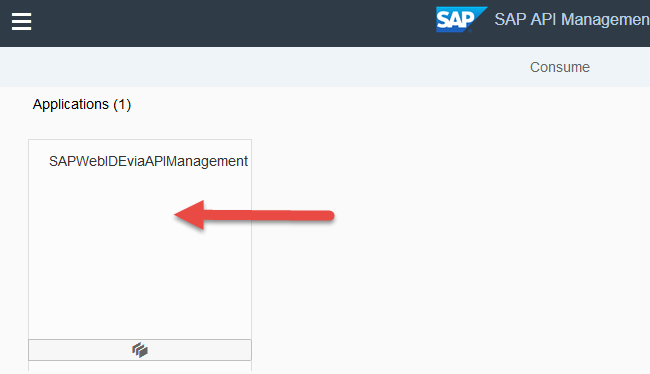


[ACCORDION-END]

[ACCORDION-BEGIN [Step 22: ](Copy application key)]

Mark and copy the **Application key**

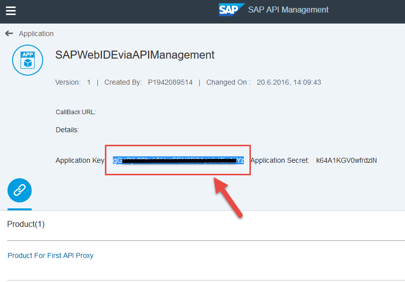


[ACCORDION-END]

[ACCORDION-BEGIN [Step 23: ](Paste application key)]

Go back to the **SAP Web IDE** and paste the correct application key in the **`<yourAPIKey>`** field from the **`manifest.json`** file


Click on **Save**


[ACCORDION-END]

[ACCORDION-BEGIN [Step 24: ](Run App in FLP Sandbox)]

Right click on the **Project** and select **Run > App in FLP Sandbox**

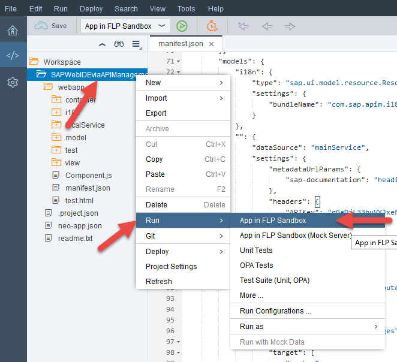

You should see a Fiori app connecting via SAP API Management to the SAP Gateway Developer System ES4.

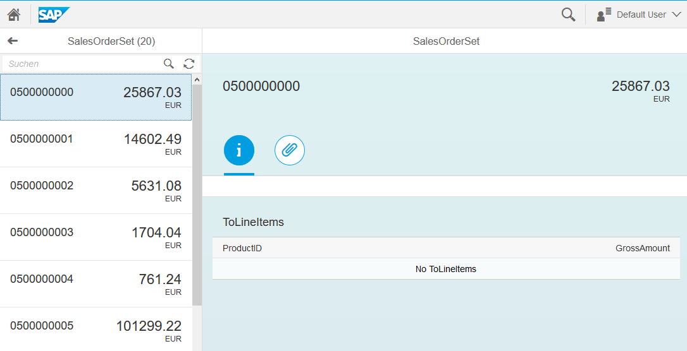


[ACCORDION-END]


## Next Steps
- This is the end of this series
- Select a tutorial from the [Tutorial Navigator](https://www.sap.com/developer/tutorial-navigator.html) or the [Tutorial Catalog](https://www.sap.com/developer/tutorials.html)
