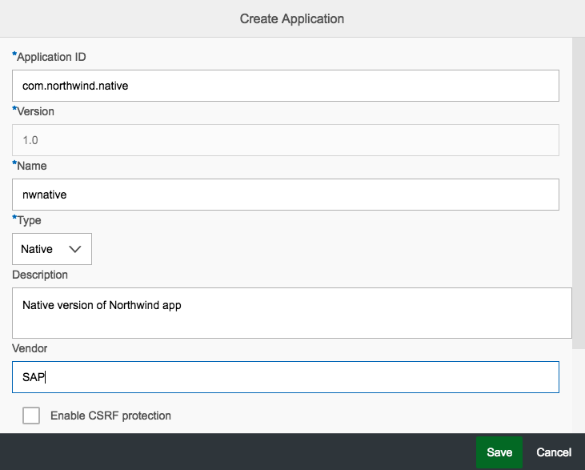
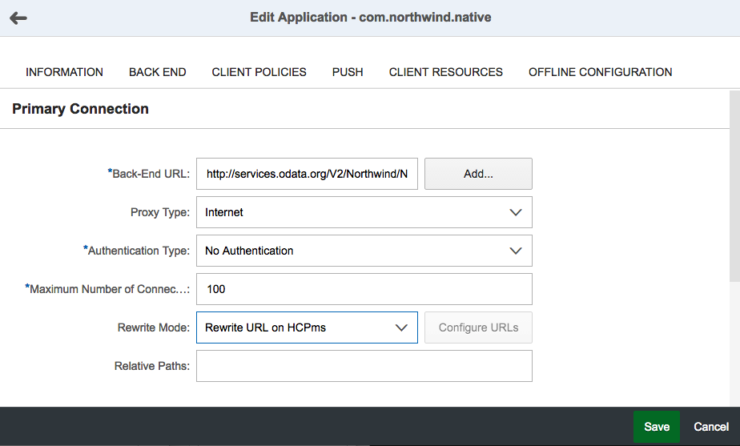
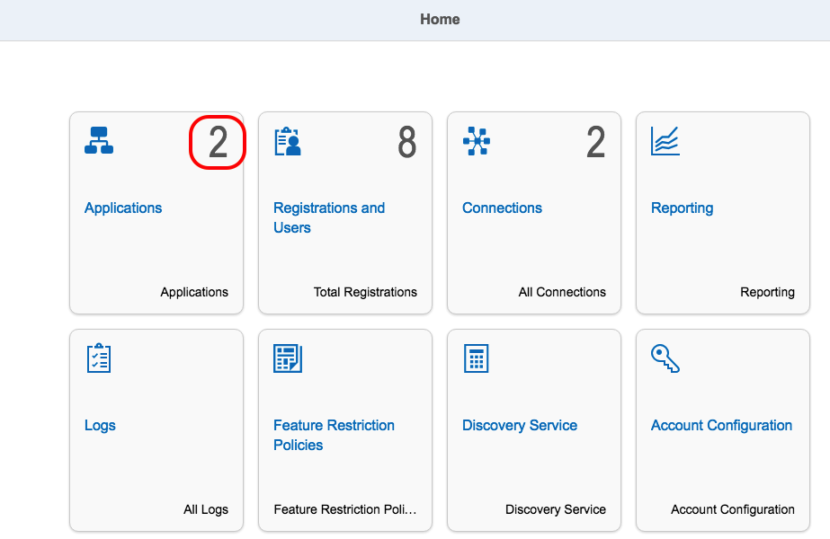

## Prerequisites  
- **Proficiency:** Intermediate
- **Tutorials:**
- [Sign up for an account on SAP Cloud Platform](http://www.sap.com/developer/tutorials/hcp-create-trial-account.html)
- [Enable SAP Cloud Platform mobile services for development and operations](http://www.sap.com/developer/tutorials/hcpms-enable-mobile-services.html)

## Next Steps
- [Create a basic native Android master-detail app](http://www.sap.com/developer/tutorials/hcpdo-basic-android-app.html)

## Details
### You will learn  
Creating an app in SAP Cloud Platform mobile service for development and operations will provide a server URL that a native mobile app will use for logon, registration and data access.

### Time to Complete
**5 Min**.

---

[ACCORDION-BEGIN [Step 1: ](Open the Development & Operations cockpit)]

Log on to your [SAP Cloud Platform account](https://account.hanatrial.ondemand.com/cockpit), click on the **Services** tab, click on  the **Development & Operations** tile. On the **Development & Operations** status page, click the **Go to Service** link to open the Development & Operations cockpit.

[ACCORDION-END]

[ACCORDION-BEGIN [Step 2: ](Open the create app dialog )]

Click on the **Applications** tile or on **Applications** in the left navigation bar.

The Click the **Create Application** icon to open the create app dialog box.

[ACCORDION-END]

[ACCORDION-BEGIN [Step 3: ](Enter settings and save)]

Enter the following and click **Save**.

Field Name              | Value
:---------------------- | :-------------    
App ID                  | `com.northwind.native`
Version                 | `1.0` (populated for you)
Name                    | `nwnative`
Type                    | ` Native`
Description             | `Native version of Northwind app`
Vendor                  | `SAP`
Enable CSRF protection  | (leave unchecked)
Ignore Case for User Name | (leave unchecked)
Security Configuration    | `None` (from drop-down)

[ACCORDION-END]

[ACCORDION-BEGIN [Step 4: ](Enter back-end settings and save)]

The Edit Application screen is displayed with the **INFORMATION** tab displayed.

Click on the **BACK END** tab and enter the following and click **Save**.

Field Name              | Value
:---------------------- | :-------------    
Backend URL             | `http://services.odata.org/V2/Northwind/Northwind.svc`
Proxy Type              | `Internet`
Authentication Type     | `No Authentication` (from drop-down)
Maximum Connections     | `100`
Rewrite Mode            | `Rewrite URL on HCPms`
Relative Paths          | (leave blank)

[ACCORDION-END]

[ACCORDION-BEGIN [Step 5: ](View applications)]

Once the application is created, click the **Home** navigation bar and you will see the number of Applications has increased.

[ACCORDION-END]

## Next Steps
- [Create a basic native Android master-detail app](http://www.sap.com/developer/tutorials/hcpdo-basic-android-app.html)
