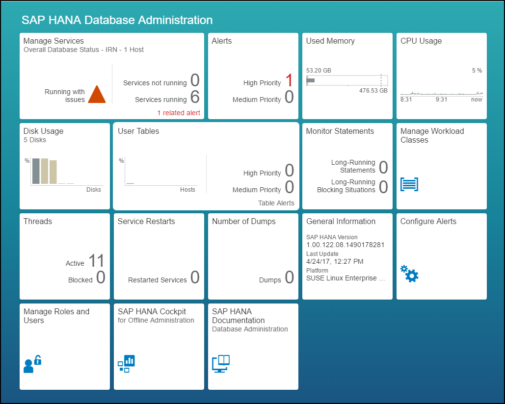
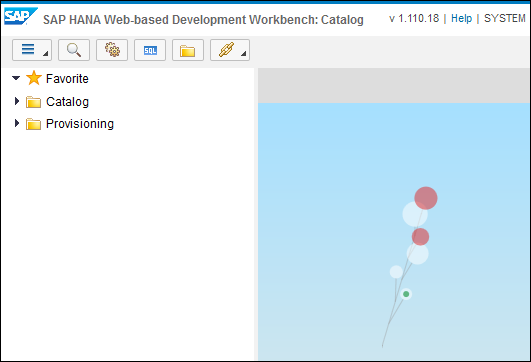
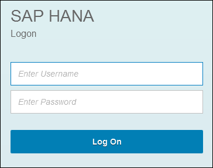

## Prerequisites
  - **Proficiency:** Beginner
  - **Tutorials:** [Create a HANA MDC instance](http://www.sap.com/developer/tutorials/hcpps-hana-create-mdc-instance.html)

## Next Steps
  - [Enable, deploy and configure the SAP Predictive services](http://www.sap.com/developer/tutorials/hcpps-ps-configure.html)

## Details
### You will learn
  - How to create a new user account on your HANA MDC instance using the ***SAP HANA Cockpit***. Each Trial HANA MDC instance comes with a ***HANA System Account***. This user account shall be used only to execute "System" related activities.
  In the "real world", it is uncommon to use this user account to develop an "end-user" application.
  - What are the user roles and privileges required on HANA to use the SAP Predictive services. As the SAP Predictive services use the HANA Automated Predictive Library, it is required to configure the user roles and privileges accordingly.

### Time to Complete
  **5 minutes**

[ACCORDION-BEGIN [Step 1: ](Access the Security Console)]
From the ***SAP HANA Cockpit*** and connected with the ***HANA System Account***, click on **Manage Roles and Users**. This will open the ***SAP HANA Web-based Development Workbench***.



[ACCORDION-END]

[ACCORDION-BEGIN [Step 2: ](Extend the SYSTEM user)]

In order to allow the **SYSTEM** user to run any SQL statement, you will need to grant him the Developer role.


Under **Security**, expand **Users**, then double click on **SYSTEM**.

Select the **Granted Roles** tab, then click on the  icon, then add the following role:

  - `sap.hana.ide.roles::Developer`

Click on the  button in the top menu bar

[ACCORDION-END]

[ACCORDION-BEGIN [Step 3: ](Create your user)]

Using the  menu bar icon, select **Catalog**.

The following screen should appear:



Click on the  button in the top menu bar, and paste the following SQL code:

```sql
DROP USER PSTRIAL CASCADE;
CREATE USER PSTRIAL PASSWORD Welcome17Welcome17 NO FORCE_FIRST_PASSWORD_CHANGE;
ALTER USER  PSTRIAL DISABLE PASSWORD LIFETIME;

call _SYS_REPO.GRANT_ACTIVATED_ROLE ('sap.hana.ide.roles::Developer','PSTRIAL');
call _SYS_REPO.GRANT_ACTIVATED_ROLE ('sap.pa.apl.base.roles::APL_EXECUTE','PSTRIAL');

GRANT AFL__SYS_AFL_APL_AREA_EXECUTE TO PSTRIAL;
GRANT AFLPM_CREATOR_ERASER_EXECUTE TO PSTRIAL;

GRANT "CREATE SCHEMA" TO PSTRIAL;

GRANT REPO.READ on "public" TO PSTRIAL;
GRANT REPO.MAINTAIN_IMPORTED_PACKAGES on "public" TO PSTRIAL;
GRANT REPO.MAINTAIN_NATIVE_PACKAGES   on "public" TO PSTRIAL;

GRANT REPO.EDIT_NATIVE_OBJECTS   on "public" TO PSTRIAL;
GRANT REPO.EDIT_IMPORTED_OBJECTS on "public" TO PSTRIAL;

GRANT REPO.ACTIVATE_NATIVE_OBJECTS   on "public" TO PSTRIAL;
GRANT REPO.ACTIVATE_IMPORTED_OBJECTS on "public" TO PSTRIAL;
```

**This script will delete any existing `PSTRIAL` user including its related object and tables.**

Click on the  **Run** button or press **F8**.


[ACCORDION-END]

[ACCORDION-BEGIN [Step 4: ](Verify that your user is properly created)]

Click on the  **Logout** icon located in the top right corner of the screen.



Now, you need to connect with your **`PSTRIAL`** ***HANA User Account***.

Enter **`PSTRIAL`** as ***Username*** user name and **`Welcome17Welcome17`** as ***Password***, click on **Logon**.

If you can login, then your ***HANA User Account*** is properly configured.

[ACCORDION-END]

## Next Steps
- [Enable, deploy and configure the SAP Predictive services](http://www.sap.com/developer/tutorials/hcpps-ps-configure.html)
