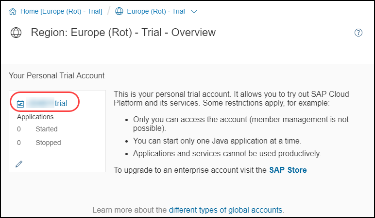
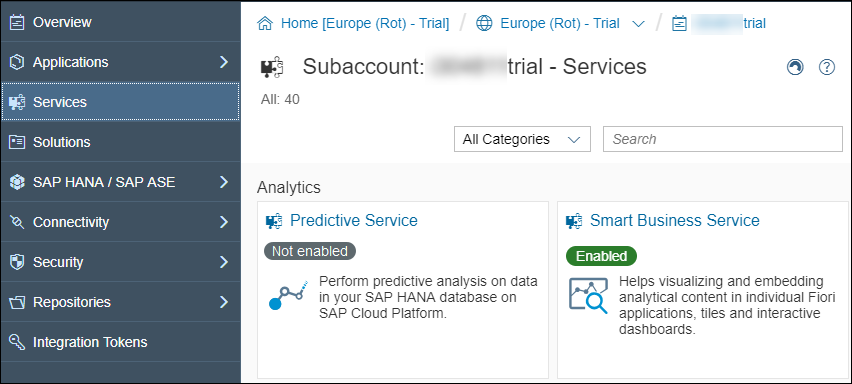
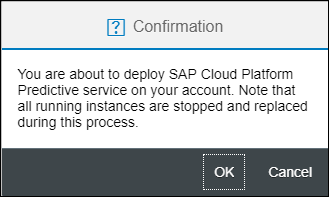
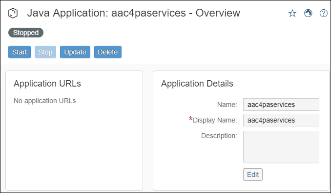
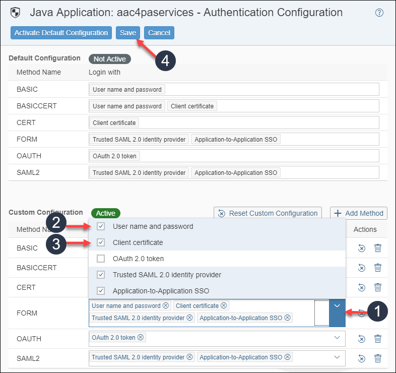
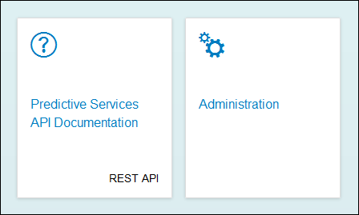
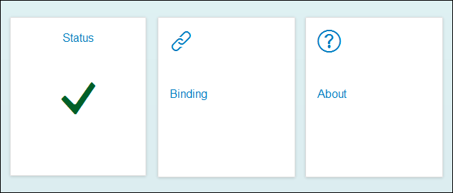

## Prerequisites
- **Proficiency:** Beginner
- **Tutorials:** [Import a series of predictive demo dataset](https://www.sap.com/developer/tutorials/hcpps-hana-dataset-import.html)

## Next Steps

- If you are running a developer account on the SAP Cloud Platform, you should continue with: [How to update the database pool configuration of the SAP Predictive services](https://www.sap.com/developer/how-tos/2017/03/hcpps-ps-configure-dbpool.html)
- Then, you can move to one of the following groups:
    - [Test the SAP Predictive services using a REST client](https://www.sap.com/developer/groups/ps-test-rest.html)
    - [Build an SAPUI5 application to interact with the SAP Predictive services](https://www.sap.com/developer/groups/ps-sapui5.html)

## Details
### You will learn

- How to enable, deploy and configure the SAP Predictive services for your SAP Cloud Platform developer Account

### Time to Complete
  **10 minutes**

[ACCORDION-BEGIN [Step 1: ](Enable the Predictive services)]
Let's go back to the [***SAP Cloud Platform Cockpit***](http://account.hanatrial.ondemand.com/cockpit) with your free trial account on **Europe (Rot) - Trial** and access "Your Personal Developer Account".

Click on your ***SAP Cloud Platform Account name*** as highlighted on the below screenshot.

> If you are unclear with what is your SAP Cloud Platform account name, you can refer to the following blog entry: [SAP Cloud Platform login, user name, account id, name or display name: you are lost? Not anymore!](https://blogs.sap.com/2017/01/31/sap-hana-cloud-platform-trial-login-name-user-name-account-name-account-identifier-you-are-lost-not-anymore/)

&nbsp;

On the left side bar, click on **Services**.

Click on the **Predictive services** tile

By default, the ***Predictive services*** are not enabled.

Click on **Enable**

Once enable, you will need to deploy the ***Cloud for Predictive Analytics*** application.

[ACCORDION-END]

[ACCORDION-BEGIN [Step 2: ](Deploy the Predictive services application)]
Click on **Go To Service**

You might receive the following information message, just click on **OK**

Next, you can deploy the ***Cloud for Predictive Analytics*** services application.

Click on the tile

In order to deploy the ***Cloud for Predictive Analytics*** services application in your ***Your Personal Developer Account***, you  need to provide your ***SAP Cloud Platform Account Password*** as highlighted on the screenshot.

The other settings, like ***SAP Cloud Platform Account User Name***, will be filled with your current information.

Click on **Deploy**

Click on **OK** to confirm the deployment

[ACCORDION-END]

[ACCORDION-BEGIN [Step 3: ](Configure the data source binding)]

Once deployed, you will be provided with the ***Application Dashboard*** URL.

Click on the highlighted link

Now, you need to add you a data source binding to your trial HANA MDC instance.

On the left side bar, navigate in **Configuration**, then click on **Data Source Binding**

The data source binding will allow the ***Cloud for Predictive Analytics*** application to locate the data to be consumed by the service and execute the ***SAP HANA Automated Predictive Library*** (`APL`) on it, but also to persist a set on internal tables.

Click on **New Binding**

It should propose you by default your HANA MDC instance (named `mdc`) we just created.

Enter your ***HANA User Account*** login (`PSTRIAL`) and password (`Welcome17Welcome17`).

Click on **Save**

[ACCORDION-END]

[ACCORDION-BEGIN [Step 4: ](Assign the roles to your user)]

Now, you need to configure security settings for your ***SAP Cloud Platform Account***.

On the left side bar, navigate in **Security**, then click on **Roles**  

Assign your user name to the **`C4PA-User`** role using the **Assign** button (make sure you are not including the 'trial' at the end).

Assign your user name to the **`C4PA-Admin`** role using the **Assign** button (make sure you are not including the 'trial' at the end).

The **`C4PA-User`** will enable your user to consume the services and the **`C4PA-Admin`** to administer the `C4PA` application.

> If you are unclear with what is your SAP Cloud Platform account name, you can refer to the following blog entry: [SAP Cloud Platform login, user name, account id, name or display name: you are lost? Not anymore!](https://blogs.sap.com/2017/01/31/sap-hana-cloud-platform-trial-login-name-user-name-account-name-account-identifier-you-are-lost-not-anymore/)
>
> Your ***SAP Cloud Platform Account User Name*** was displayed during the ***Deploy*** step.
>
> And in case you are using a trial account, make sure you don't include the "trial" at the end.

[ACCORDION-END]

[ACCORDION-BEGIN [Step 5: ](Modify the Authentication scheme)]
Now, you need to modify the authentication schemes for the `C4PA` application.

This will simplify the way we will build a SAPUI5 application that consumes these services.

On the left side bar, navigate in **Security**, then click on **Authentication Configuration**

Click on **Activate Custom Configuration**.

Check **User name and password** and **Client certificate** for the ***FORM*** authentication scheme

Click on **Save**

Next, you will receive next an alert regarding the fact that the changes will be applied on the next restart, which is what we will do next.

[ACCORDION-END]

[ACCORDION-BEGIN [Step 6: ](Start the application)]

Go back to the ***Overview*** page (via the left menu bar).

Click on **Start**

Once started, you will be provided with the **Application URLs** which will give us access to the online documentation and the administration panels.

Later, you will be using the ***Application URLs***, so you should save the highlighted URL in a notepad as your ***C4PA Application URL***.

[ACCORDION-END]

[ACCORDION-BEGIN [Step 7: ](Verify the setup)]

Click on the ***Application URLs*** link

Click on the **Administration** tile

Status is green! Congrats, you have configured the SAP Predictive services on your SAP Cloud Platform account.

   

[ACCORDION-END]

## Next Steps

- If you are running a developer account on the SAP Cloud Platform, you should continue with: [How to update the database pool configuration of the SAP Predictive services](https://www.sap.com/developer/how-tos/2017/03/hcpps-ps-configure-dbpool.html)
- Then, you can move to one of the following groups:
    - [Test the SAP Predictive services using a REST client](https://www.sap.com/developer/groups/ps-test-rest.html)
    - [Build an SAPUI5 application to interact with the SAP Predictive services](https://www.sap.com/developer/groups/ps-sapui5.html)
