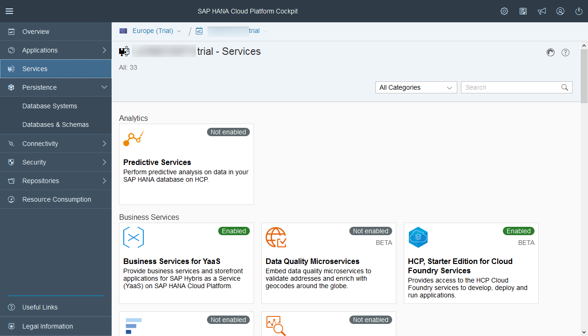
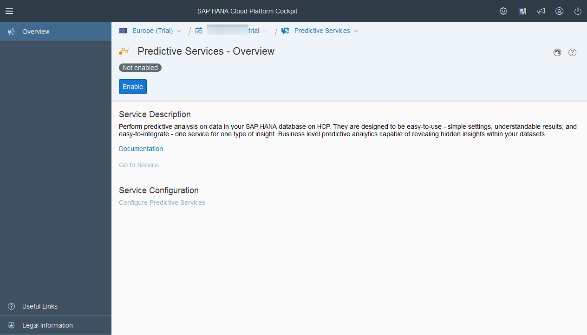
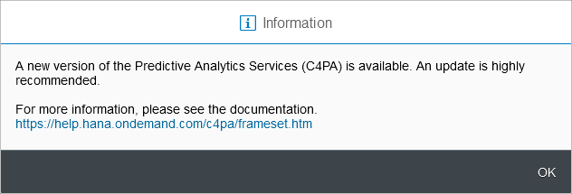
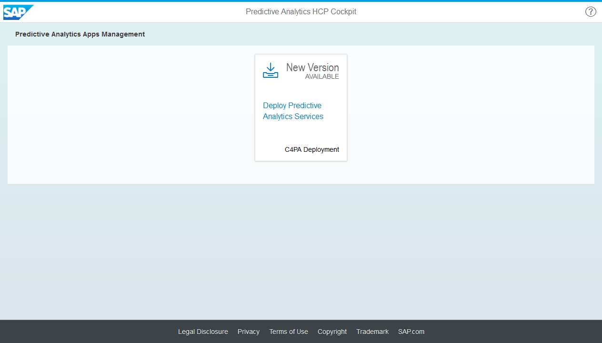
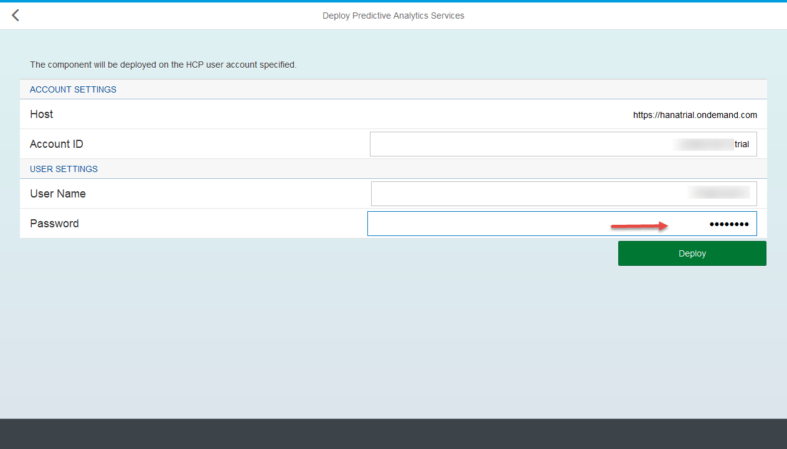
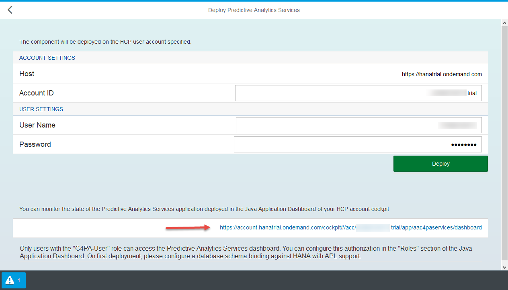
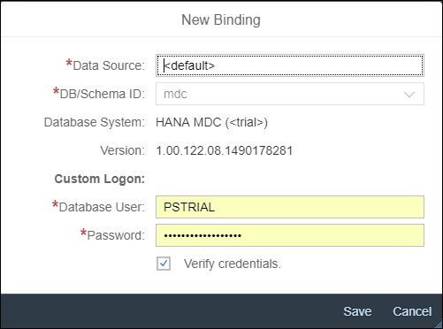
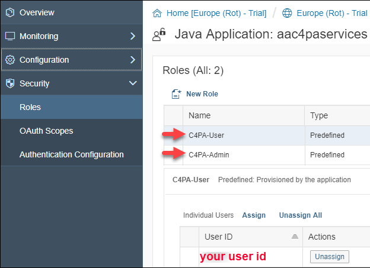
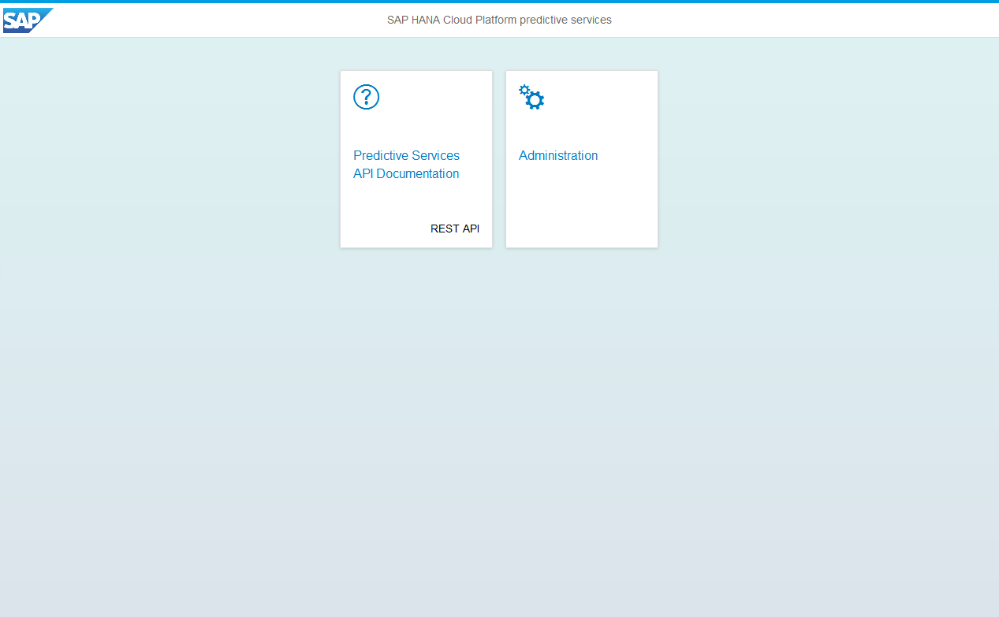
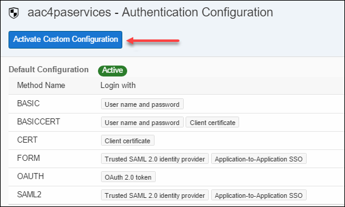

## Prerequisites
  - **Proficiency:** Beginner
  - **Tutorials:** [Expose your predictive demo dataset as an OData service](http://go.sap.com/developer/tutorials/hcpps-hana-dataset-odata.html)

## Next Steps
  - [Install a REST client to interact with the HCP predictive services](http://go.sap.com/developer/tutorials/hcpps-rest-client-install.html)

## Details
### You will learn
  - How to enable, deploy and configure the HCP predictive services for your HCP Developer Account

### Time to Complete
  **15 minutes**

---

1. Let's go back to the [***SAP HANA Cloud Platform Cockpit***](http://account.hanatrial.ondemand.com/cockpit) with your free trial account and access "Your Personal Developer Account".

    Click on your ***HCP Account*** identifier (which ends with *trial*) as highlighted on the below screenshot.

    

1. On the left side bar, click on **Services**.

    Click on the **Predictive Services** tile

    

1. By default, the ***Predictive Services*** are not enabled.

    Click on **Enable**

    

1. Once enable, you will need to deploy the ***Cloud for Predictive Analytics*** application.

    Click on **Go To Service**

    

1. You might receive the following information message that you may need to upgrade your ***Cloud for Predictive Analytics*** services application (***C4PA***) which we will do next.

    Click on **OK**

    

    Next, you can deploy the ***Cloud for Predictive Analytics*** services application.

    Click on the tile

    

1. In order to deploy the ***Cloud for Predictive Analytics*** services application in your ***Your Personal Developer Account***, you just need to provide your ***HCP Account Password*** as highlighted on the screenshot. The other settings, like ***HCP Account User Name***, will be filled with your current information.

    Click on **Deploy**

    

    Click on **OK** to confirm the deployment

    

1. Once deployed, you will be provided with the ***Application Dashboard*** URL.

    Click on the highlighted link

    

1. Now, you need to add you a data source binding to your trial HANA instance.

    On the left side bar, navigate in **Configuration**, then click on **Data Source Binding**

    

1. The data source binding will allow the ***Cloud for Predictive Analytics*** to locate the data to be consumed by the service and execute the ***SAP HANA Automated Predictive Library*** (`APL`) on it, but also to persist a set on internal tables.

    Click on **New Binding**

    

    Enter your ***HANA User Account*** login and password.

    Click on **Save**

      

1. Now, you need to configure security settings for your ***HCP Account***.

    On the left side bar, navigate in **Security**, then click on **Roles**  

    

1. Assign to the `C4PA-User`* and `C4PA-Admin` role your ***HCP Account User Name*** (which was displayed during the ***Deploy*** step, should start with a lower case "p", ) using the **Assign** button as highlighted on the screenshot.

    

1. Now, you need to configure the authentication schemes for the application.

    On the left side bar, navigate in **Security**, then click on **Authentication Configuration**

    Enable the **Custom** mode

    Check **User name and password** and **Client certificate** for the ***FORM*** authentication scheme

    Click on **Save**

    

    You receive next an alert that the changes will be applied on the next restart, which is what we will do next.

    

1. Go back to the ***Overview*** page (via the left menu bar).

    Click on **Start**

    

1. Once started, you will be provided with the **Application URLs** which will give us access to the online documentation and the administration panels.

    Click on the ***Application URLs*** link

    

    Later, you will be using the ***Application URLs***, so you should save the highlighted URL in a notepad as your ***C4PA Application URL***.

    Click on the **Administration** tile

    

1. Status is green! Congrats, you have configured the HCP predictive services on your HCP trial account.

        

## Next Steps
  - [Install a REST client to interact with the HCP predictive services](http://go.sap.com/developer/tutorials/hcpps-rest-client-install.html)
