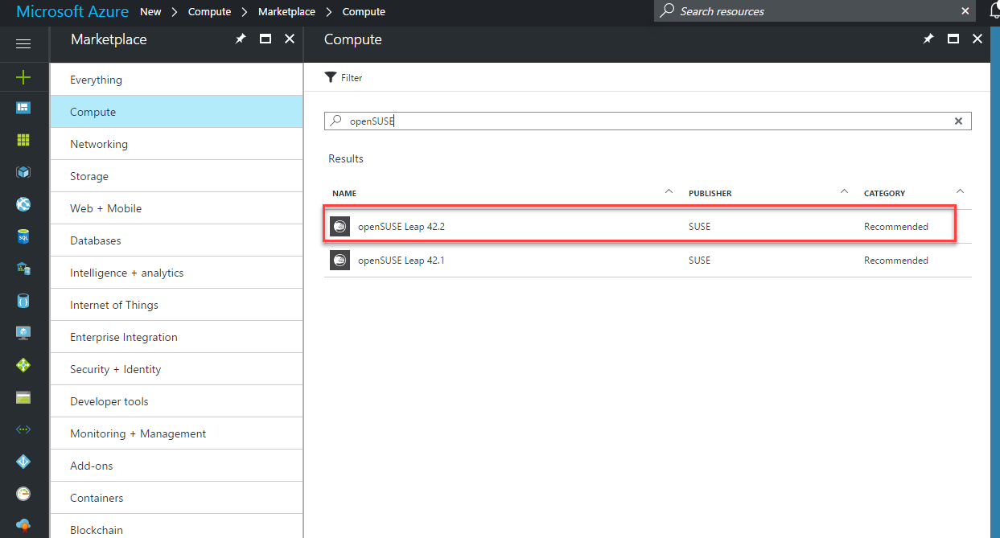
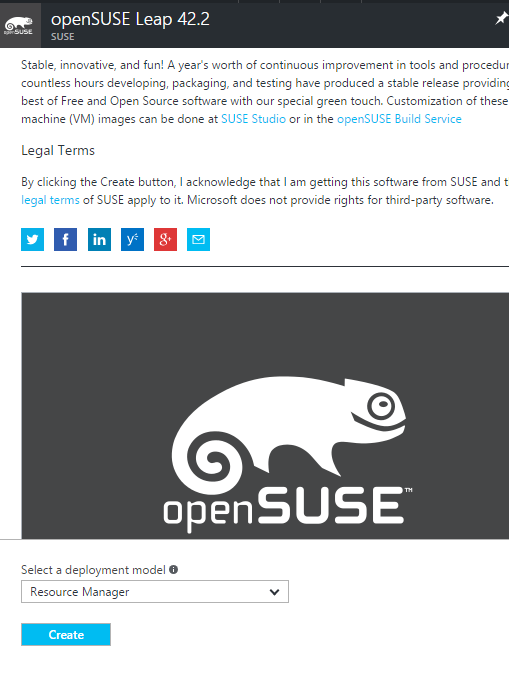
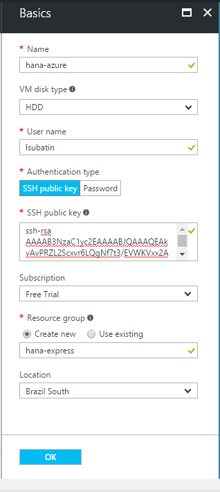
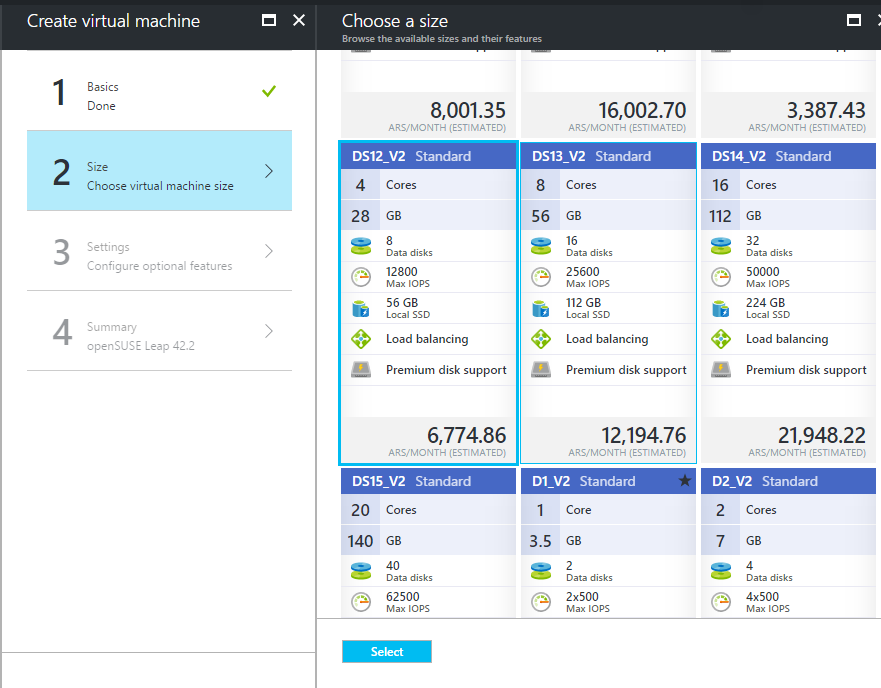
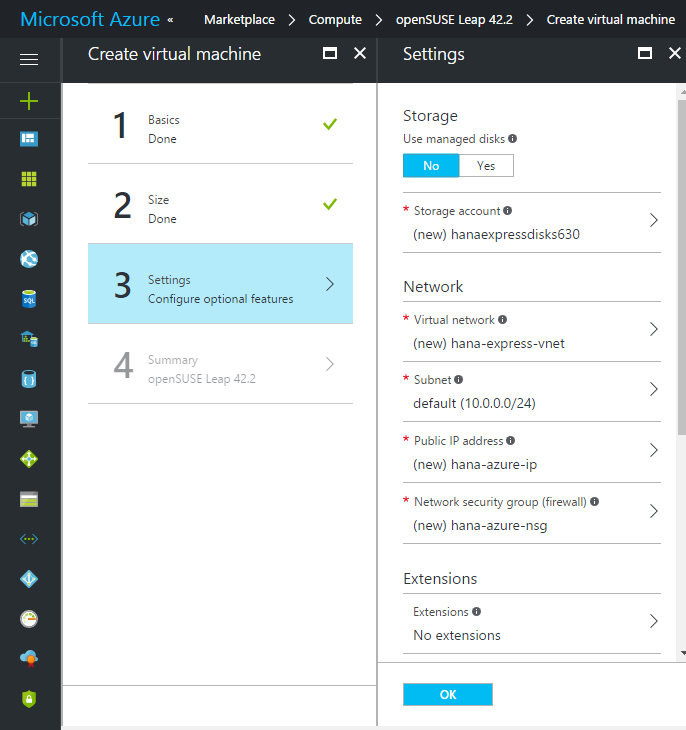
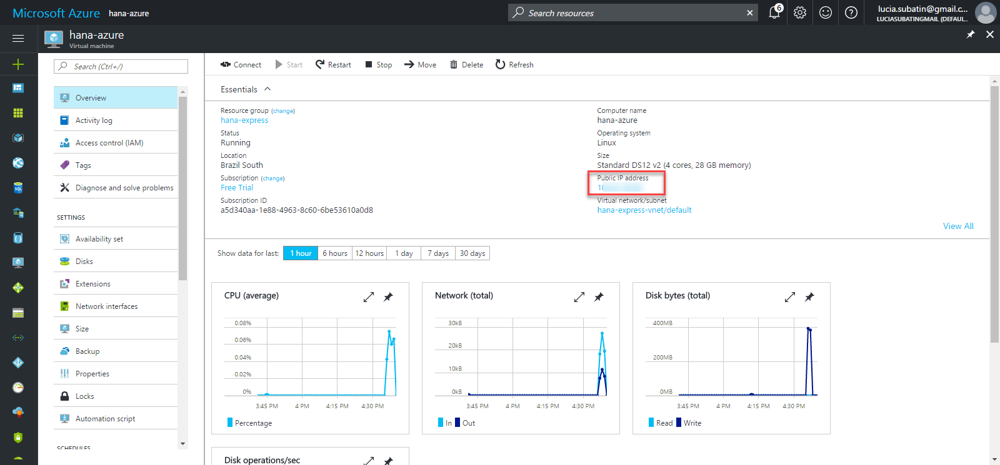
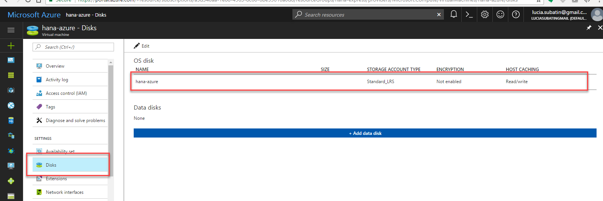
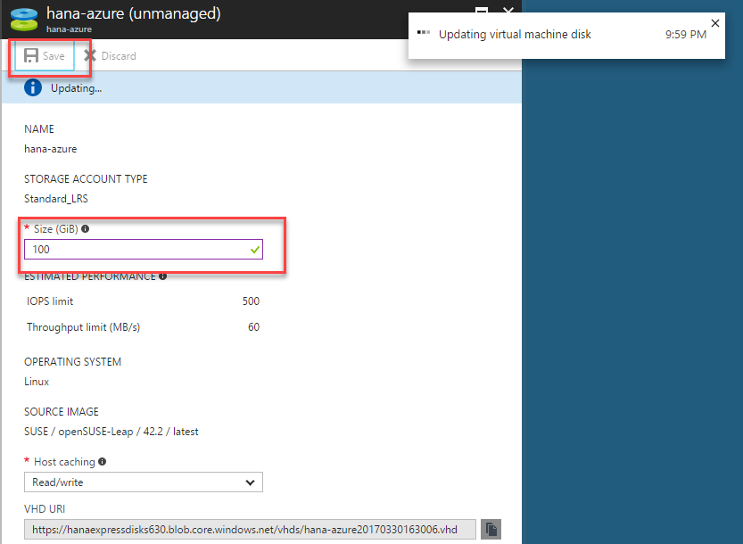
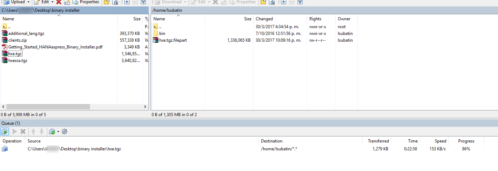
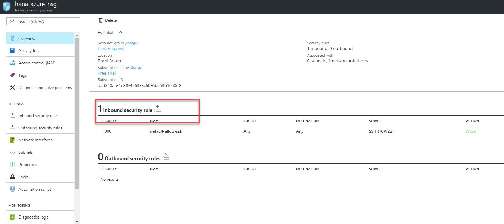

## Prerequisites  
 - **Proficiency:** Beginner | Intermediate | Advanced
 - [**Register and Download SAP HANA, express edition,**](https://www.sap.com/developer/topics/sap-hana-express.html)

## Next Steps
- [Install dependencies for SAP HANA, express edition, in open SUSE](http://www.sap.com/developer/tutorials/hxe-azure-opensuse-dependencies.html)

## Details
### You will learn  
This tutorial will walk you through the setup of a Virtual Machine in your Microsoft Azure dashboard.

### Time to Complete
**15 Min**

---

[ACCORDION-BEGIN [Step 1: ](Log in to your MS Azure account and Launch an openSUSE machine)]

Go into the [Azure portal](https://portal.azure.com/) and log in to your account or create one. Once logged in, from the `Compute` panel in the `Marketplace` search for openSUSE and choose the 42.2 version:

And click on **Create**:

Fill in the Basic information about your machine:

You can generate the SSH public key file with `PuTTYgen` or with command `ssh-keygen`. Alternatively, you can use a password. Be sure to keep the key file or the password safe and available to you.

[DONE]
[ACCORDION-END]

[ACCORDION-BEGIN [Step 2: ](Choose an Instance)]

Now you need to decide which type of machine you want to install. If you are planning on using the server-only version, you need at least 8GB RAM. If you are planning on also installing the XS Advanced applications, you need at least 16GB RAM. Finally, if you are planning on adding the XS Advanced applications later, take it into account when choosing the size of the disk (80GB Minimum).

>Note: If you are installing XSA, after installation is finished, it is advisable to move the data and log folders to the `/dev/sdb1` mount point.

You can now review the optional features. **Make sure the IP address is set to `Static`.** If this machine is for development or testing purposes, the default settings should suit those needs.

Click **OK**. Once deployed, you will see the administration console. Take note of the IP address to connect using your defined username and the password or `ssh-rsa` key you have generated

[DONE]
[ACCORDION-END]

[ACCORDION-BEGIN [OPTIONAL - XS Advanced installation: ](CREATE A BACKUP and Expand the OS disk)]

**WARNING**: If something in the following process fails, you could lose the data in your Virtual Machine. Make sure you create a backup if you do not want to start over or lose any data you may have in the disk in the Virtual Machine. You are responsible for safeguarding any data in the disk you are about to edit and you will proceed at your own risk. However, if you have just created the Virtual Machine and have not done anything with it, you can always create a new one.

>Note: You will need to reboot the Virtual Machine.

Go to the configuration of your disk

Change the size of the disk and **Save**:

Follow the steps as described by this [step-by-step blog](https://blogs.msdn.microsoft.com/cloud_solution_architect/2016/05/24/step-by-step-how-to-resize-a-linux-vm-os-disk-in-azure-arm/) from Microsoft. After you have completed the restart, use commands `resize2fs /dev/sda1` and `df -h` to confirm the operating system sees the expanded partition size:

>Note: You may want to reduce the size or delete the `/dev/sdb1` partition to reduce costs.

[DONE]
[ACCORDION-END]

[ACCORDION-BEGIN [Step 3: ](Upload the installation files into the Virtual Machine)]

You can now upload the installation files into your virtual machine using an SCP client, such as WinSCP. Upload `hxe.tgz` if you plan to install the server-only version or upload both `hxe.tgz` and `hxexsa.tgz` if you plan to install the XS Advanced applications.

Continue with the next steps as the upload completes.

[DONE]
[ACCORDION-END]

[ACCORDION-BEGIN [Step 4: ](Configure Network Rules for SAP HANA express edition on MS Azure)]

Configure Network rules by going into `Network interfaces` and then `Security Group`

Click on the network security group:

And then click on the Inbound rules:

Add each of the rules in the list below, where XX is the instance number you will use. The installer will suggest instance number `90`, although `00` is also used. The XX is the ports represent the instance number. **Remember this choice when you specify the instance number in the installation script**.

- 22 (SSH)
- 80 (HTTP)
- 443 (HTTPS)
- 80XX
- 43XX
- `5XX00-5XX99`

If you are also installing XS Advanced:
- 51002-51027
- `3XX00-3XX99`
- `4XX00-4XX99`
- 53001-53100

In the example below, instance number `00` has been chosen:

[DONE]
[ACCORDION-END]

## Next Steps
- [Install dependencies for SAP HANA, express edition, in Open SUSE](http://www.sap.com/developer/tutorials/hxe-azure-opensuse-dependencies.html)
