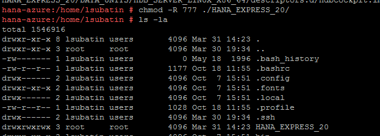
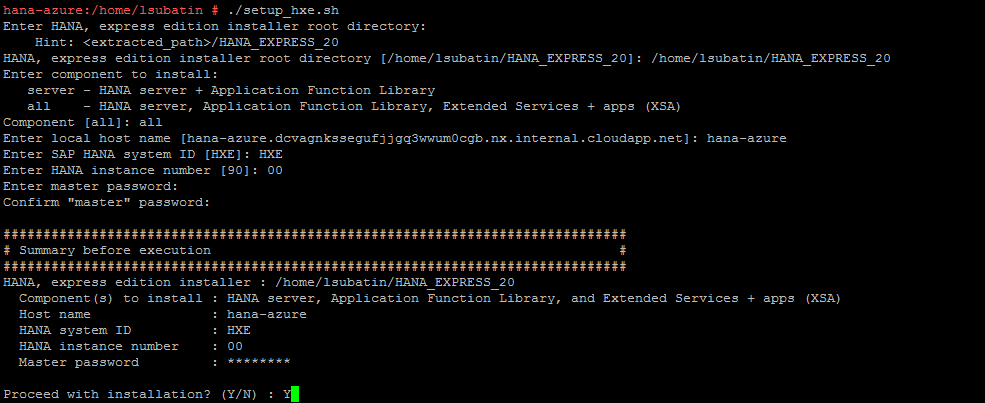

## Prerequisites  
 - **Proficiency:** Beginner | Intermediate | Advanced
 - **Tutorials:** [Install dependencies for SAP HANA Express Edition in openSUSE](http://www.sap.com/developer/tutorials/hxe-azure-opensuse-dependencies.html)


## Next Steps
 - Select a tutorial group from the [Tutorial Navigator](http://www.sap.com/developer/tutorial-navigator.html) or the [Tutorial Catalog](https://www.sap.com/developer/tutorial-navigator.tutorials.html)

## Details
### You will learn  
This tutorial will guide you through the final steps to finish installation of your SAP HANA, express edition, instance on Microsoft Azure and openSUSE.

### Time to Complete
**15 Min**

---

[ACCORDION-BEGIN [Step 1: ](Extract files and set permissions)]

As root, switch to the directory where you uploaded the files and will extract the installation binaries. You will extract and set permissions to the binaries by pasting the following into a console:

```ssh
sudo su -
cd /<<extraction_target_directory>>
tar -xvzf hxe.tgz
```


If you are also installing XS Advanced, extract those files and set permissions on them too

```ssh
tar -xvzf hxexsa.tgz
```

And now change permissions on the files:

```ssh
chmod -R 777  ./HANA_EXPRESS_20/

```




[DONE]
[ACCORDION-END]

[ACCORDION-BEGIN [Step 2: ](Take note of the name of your host)]

You will need this to feed it into the installation script parameters and to set up your computer's host file.

Run `hostname -s` to see what the hostname is. Take note of it before you begin installation.


[DONE]
[ACCORDION-END]


[ACCORDION-BEGIN [Step 3: ](Execute Installation script)]

From the same directory where you have just extracted the files, execute the installation script. Switch to root first.

```ssh
sudo su –
cd /<<extraction_target_directory>>
./setup_hxe.sh
```


The script will request the following parameters:

If installing XS Advanced, whether you want to install the server-only or **all**.




1.	Where the installer is: the path where you extracted the files + `/HANA_EXPRESS_20`. In this example, `/home/<<myuser id>>/HANA_EXPRESS_20`
2.	The local host name: use the short host name you checked on step 2. If you are in doubt, run command hostname -s in a separate console
3.	SAP HANA system ID: `HXE` is the default and what tutorials use but you can use whatever 3-digit id you like, .
4.	Instance number: **Make sure the instance matches what you entered in the firewall rules for the instance-dependent ports.** You can choose either `00` which is what many tutorials use or `90` which is the default for HXE. You can also choose any other number.
5.	Master password: Something you will remember as this will be the password for SYSTEM and `<<sid>>adm`, among others.
Password must be at least 8 characters in length.  It must contain at least 1 uppercase letter, 1 lowercase letter, and 1 number.  Special characters are allowed except for `\ ` (backslash),  `"` (double quotes), and `'` (backtick).
6.	If you need a proxy server to access the internet

Once the script finished successfully, your SAP HANA, express edition, will be ready to use. Check the **Getting started guide** PDF document downloaded with the binaries to learn how to continue from here.

[DONE]
[ACCORDION-END]


## Next Steps
- Select a tutorial from the [Tutorial Navigator](http://www.sap.com/developer/tutorial-navigator.html) or the [Tutorial Catalog](http://www.sap.com/developer/tutorials.html)
