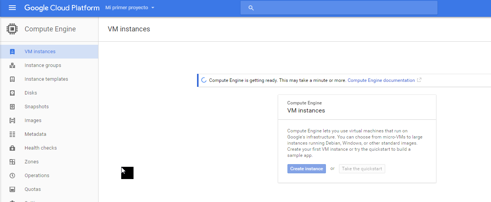
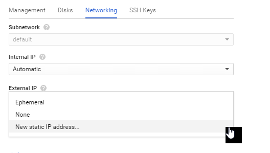
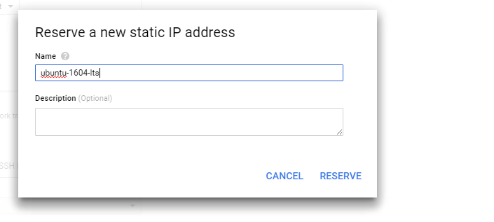
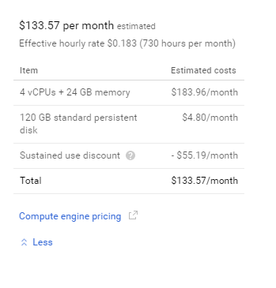
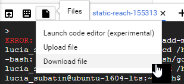
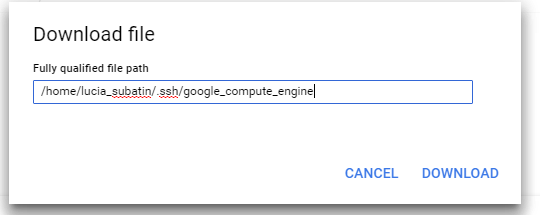

## Prerequisites  
 - You have a Google Account and have registered for the free trial on `cloud.google.com`
 - You have followed instructions to download Linux binaries from this [tutorial](http://www.sap.com/developer/tutorials/hxe-ua-installing-binary.html )


## Next Steps
  - [Install Dependencies for Ubuntu on Google Cloud Platform](http://www.sap.com/developer/tutorials/hxe-gcp-install-dependencies.html)
  - [**OPTIONAL** - Setup PuTTY and WinSCP to access your HANA Express Edition instance on Google Cloud Platform](http://www.sap.com/developer/tutorials/hxe-gcp-setup-putty-winscp-windows.html)  

## Disclaimer
SAP HANA, express edition (HXE) is officially supported on SLES and RHEL. SAP Community members have been successful in running HXE on other Linux operating systems that are not formally supported by SAP, such as Ubuntu, openSUSE and Fedora. SAP is not committing to resolving any issues that may arise from running HXE on these platforms.

## Details
### You will learn  
This tutorial will show you how to setup a Virtual Machine on  Google Cloud Platform using Ubuntu to run HANA Express Edition.
**Note: Update for HANA 2.0 SPS02 pending**]


### Time to Complete
**15 Min**

---

[ACCORDION-BEGIN [Step 1: ](Create your Google Cloud Platform Virtual Machine)]

From your [dashboard](https://console.cloud.google.com/home/dashboard) in your Google Cloud Platform landing page, follow the instructions to create a project.

Once created, enter the **Resources** tile, to create an instance of a virtual machine:



Pick a name for your VM instance. This name will also be the name of the host and the example used in this tutorial is `ubuntu-1604-lts`.

Here you can configure the resources you will allocate to your virtual machine. You can use the minimum requirements for the installation for now and adjust them later to your needs.

The minimum requirements for HANA Express Edition with XS Advanced installation are:
- 4 CPU cores
- 24 GB RAM
- 120 GB Disk

The minimum requirements for HANA Express Edition, server-only are:
- 4 CPU cores
- 16 GB RAM
- 100 GB Disk


Choose `Ubuntu 16.04 LTS` as the OS image under `Boot disk`, using the **Change** button:


**Remember** to increase the size of the disk.

You will also need an external IP to access the machine. Create a new static IP.



Assign a name to your IP:



Click on **Reserve**.

You can see the estimated costs for the Virtual Machine on the top right corner. The costs vary depending on the requirements and the hours while the machine is up and running:



Proceed to create the VM.

[DONE]
[ACCORDION-END]

[ACCORDION-BEGIN [Step 2: ](Generate Key pairs to connect to your VM instance)]

Once the instance has been created, if this is the first instance in your project and you have not done it before, you will need to generate key pairs to access the machine from SSH and SCP clients. From the `VM instances` menu, choose your newly-created virtual machine and connect using the `glcoud` command:


This will open the shell with a default command to access your virtual machine.


>Remember: These sessions are ephemeral. Anything you change from this console will not be persisted into future sessions. In other words, if you create a directory from this command prompt, you will not see it in the server from other SSH clients unless you create it in your own /home directory.

You will need to enter passphrases for the public and private keys. These passphrases will allow you to access any instance you create within this project, so choose something you will remember.


They key pairs are generated in your home directory, within a directory called `.ssh`. You can use command  `cd /home/your_home_directory` and then `ls` to list the names of the files in there:


You can copy the file name and download it using the file menu on the left top corner of the `gcloud` console:



>Hint: CTRL+C and CTRL+V work in this console!

And entering the full path:


You can use these files to access the machine from SSH or FTP clients, such as PuTTY or WinSCP.

The web SSH client is a good option for quick and background tasks, as it is intermittent. This is a known issue as explained  in the following link: https://cloud.google.com/compute/docs/ssh-in-browser#known_issues

For longer tasks such as file uploads or installations, use a client with a good handling of network micro-cuts.

Just in case, run the following command to make sure your `gcloud` console is updated:

```
gcloud components update

```

[DONE]
[ACCORDION-END]


[ACCORDION-BEGIN [Step 3: ](Upload the files into your home folder)]

Upload the HXE installation packages to your home folder (/home/<<your userid>>). Upload the files `hxe.tgz` and `hxexsa.tgz` for server + applications:


Since this step may take a while depending on your connection, you can move on with the other setup needed before installing HANA Express Edition.

[DONE]
[ACCORDION-END]


## Optional
- [Setup Putty and WinSCP in your Windows PC](http://www.sap.com/developer/tutorials/hxe-gcp-setup-putty-winscp-windows.html)

## Next Steps
- [Install Dependencies in Ubuntu on Google Cloud Platform](http://www.sap.com/developer/tutorials/hxe-gcp-install-dependencies.html)
