## Prerequisites  
 - **Proficiency:** Beginner
 - You have a Google Account and/or have registered for the free trial on `cloud.google.com`
 - You have enough permissions to edit the hosts file in your computer


## Next Steps
- [Review SAP HANA, express edition content, tutorials and quick start guides](https://www.sap.com/developer/topics/sap-hana-express.tutorials.html)
-  **Build your first app:** [Get started with XS Advanced development](https://www.sap.com/developer/groups/hana-xsa-get-started.html)
- Generate test data and check a sample enterprise application [deploying the SAP HANA `INteractive` Education model on XS Advanced](https://www.sap.com/developer/tutorials/xsa-ml-e2e-access-shine.html)
- **OPTIONAL** [Setup PuTTY and WinSCP to access your SAP HANA, express edition instance on Google Cloud Platform](https://www.sap.com/developer/tutorials/hxe-gcp-setup-putty-winscp-windows.html)


## Details
### You will learn  
Learn how to launch your own instance of SAP HANA, express edition including the Extended Application Services, advanced model (XS Advanced) on the Compute Engine in the Google Cloud Platform. Configure your instance and your computer to follow tutorials on development with XS Advanced.

If you are looking for the database server and do not need the XS Advanced application development platform, follow [this tutorial ](https://www.sap.com/developer/tutorials/hxe-gcp-getting-started-launcher.html) instead.

### Time to Complete
**15 Min**

---

[ACCORDION-BEGIN [Step 1: ](Create your Google Cloud Platform instance)]

Navigate to [Google Cloud Launcher](https://console.cloud.google.com/launcher) and search for SAP HANA, express edition.

You will be presented with two options:

- **SAP HANA, express edition (database server)**: You can connect using SQL clients like SAP HANA Studio or any other client. Includes the Predictive Analytic Library, Machine learning libraries and other advanced analytics. Follow [this tutorial if you prefer this option](https://www.sap.com/developer/tutorials/hxe-gcp-getting-started-launcher.html)
- **SAP HANA, express edition (Database + XS Advanced Applications)** (also referred to as XSA): Includes all of the other features plus the Cloud Foundry based development platform,  SAP Web IDE for SAP HANA, administration cockpit among other applications like SHINE and Smart Data Streaming. OData support, Node.js and Java runtime environments are also included. This option requires more resources.

Click on the option that includes applications:

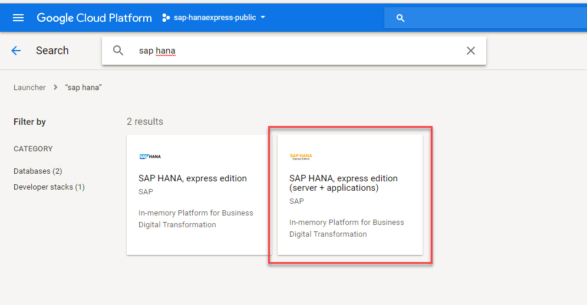

Click on the **Launch on Compute Engine** button

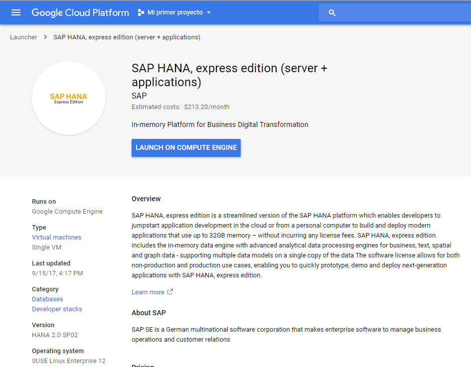

The next page will allow you to modify the default configuration for the Cloud Virtual Machine.

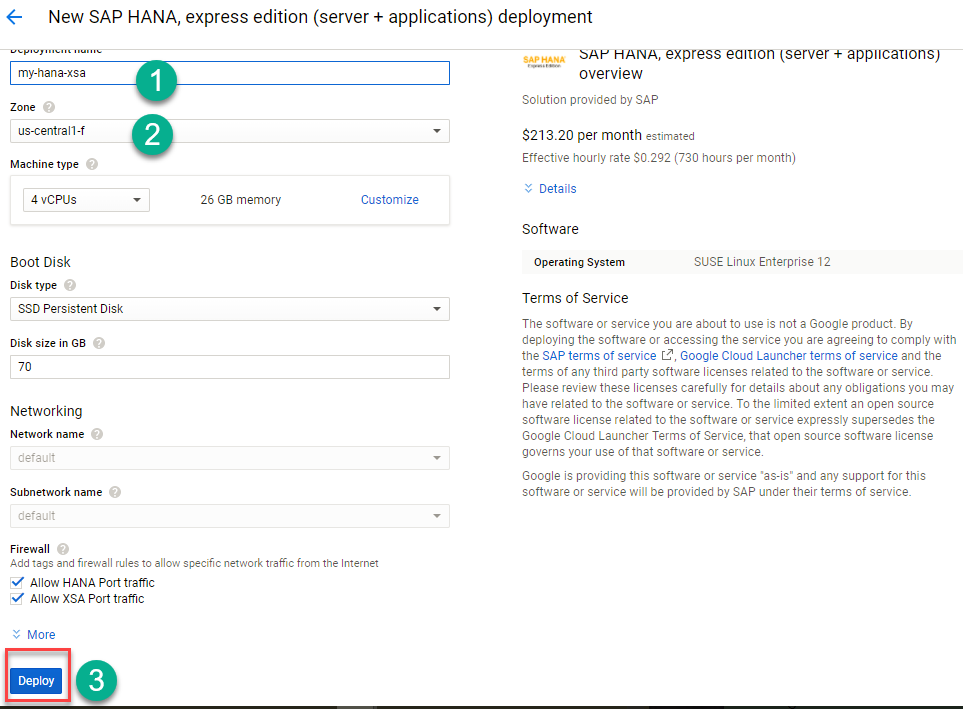

Type an identifying name for the instance, then select the desired geographic zone and machine type. Individual zones might have differing computing resources available and specific access restrictions.

>The default settings for RAM, CPU and Storage are appropriate for getting familiar with SAP HANA. The recommended minimum configuration is 24GB of RAM, with at least 4 virtual CPU and 70GB of storage.

By default, the firewall rules are configured specifically for SAP HANA, express edition. As new SAP HANA applications are created, additional ports might have to be opened up. The following ports are required to connect to SAP HANA, express edition: **8090, 4390, 39013, 39015, 59013, 59014**. Some additional ports are needed for the XS Advanced applications.

To connect to the instance from a local SSH client, like PuTTY, port **22** also has to be open.

After reviewing all configuration options, click **Deploy**. This will take a few minutes.

[DONE]
[ACCORDION-END]

[ACCORDION-BEGIN [Step 2: ](Log in to the instance and change the administration passwords)]

Upon successful deployment, use the web based SSH tool and log into your instance.

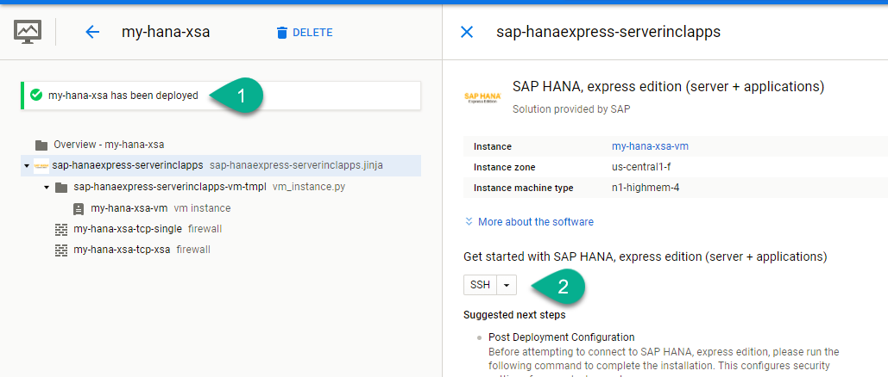

Type the following command:

```
sudo su - hxeadm
```

Hit **Enter**. Follow the prompts to change password. **IMPORTANT: SAP HANA will not be usable if this step is ignored**.

> ### **Note: Please check the password policy to avoid errors**
>
> SAP HANA, express edition requires a very strong password that complies with these rules:
>
> - At least 8 characters
> - At least 1 uppercase letter
> - At least 1 lowercase letter
> - At least 1 number
> - Can contain special characters, but not _&grave;_ (backtick), _&#36;_ (dollar sign),  _&#92;_ (backslash), _&#39;_ (single quote), or _&quot;_ (double quotes)
> - Cannot contain dictionary words
> - Cannot contain simplistic or systematic values, like strings in ascending or descending numerical or alphabetical order. Please review password requirements in [the SAP Help](http://help-legacy.sap.com/saphelp_hanaplatform/helpdata/en/61/662e3032ad4f8dbdb5063a21a7d706/frameset.htm)


You will be asked if you want to wait for XSA configurations to finish. If your internet connection might be interrupted, it is advisable to choose **no**. Continue with installation:

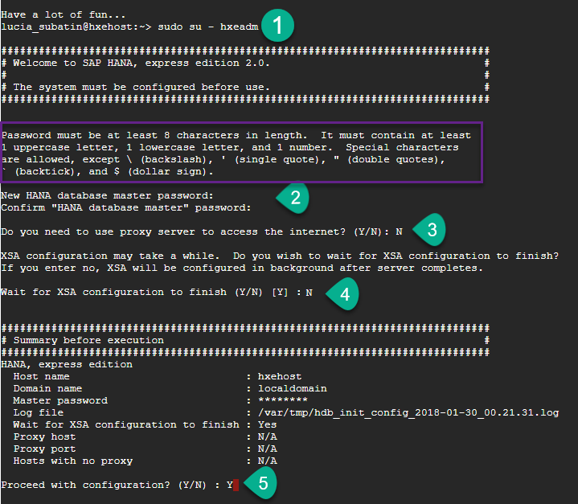

If you have chosen to run the XS Advanced installation in the background, you can check the progress by copying the status file and running the following command:

```
cat /usr/sap/HXE/home/xsa_config_status
```

For example:


The file will say either `in progress` or `success`. The installation is finished once the status changes to `success`.

Otherwise, if you have chosen to wait, you will see a success message once the installation has finished.

[DONE]
[ACCORDION-END]

[ACCORDION-BEGIN [Step 3: ](Take note of your external IP and connect)]

To connect to SAP HANA, you need to know what the external IP address is. Once deployment is finished, you can click on the menu and navigate to `Compute Engine -> VM instances` to see your newly created Virtual Machine.

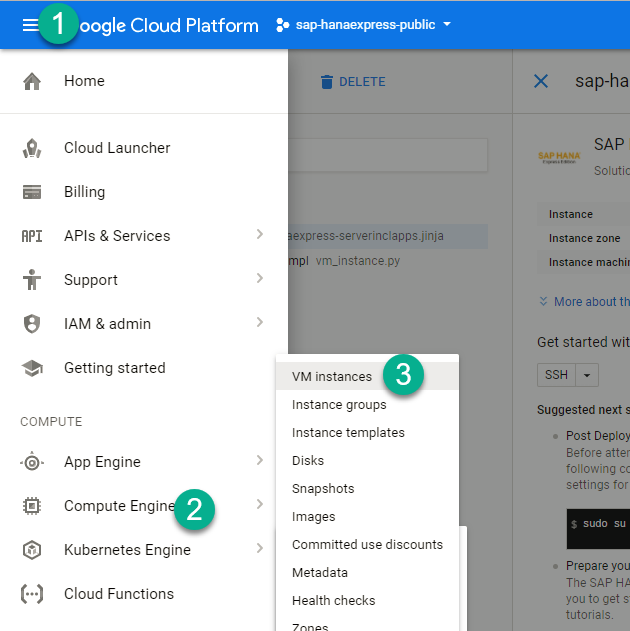

Take note of your IP address:


Alternatively, click `Learn more` and follow the steps to create and external IP address.


[ACCORDION-END]


[ACCORDION-BEGIN [Step 4: ](Map your hostname in the hosts file)]

Use your IP address to map it to the hosts file in your computer. You need administration permissions on your computer to do this.

- For Windows Computers:
  If your user is not an administrator but has administrator rights, right-click on Notepad and choose `Run as Administrator`. If you are an administrator user, proceed to the next point.

  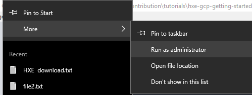

  Open the file or navigate with Windows explorer. You need to edit the file called `hosts` in the directory `C:\Windows\System32\drivers\etc`

  


- For Mac:
  Open a terminal (`Finder -> Applications -> Terminal`) and type `sudo nano /etc/hosts`

  


Add the IP address followed by the name of the host, which will be `hxehost`:


**Save** and close the editor.

> Note: If Notepad asks you to create a new file you do not have enough permissions to save the file. Creating a new file will not alter the configuration as intended.

</br>

You can test you have successfully modified your configuration by entering the following URL in your browser: `https://hxehost:39030/`


>If you get a privacy error, continue browsing. The error is related to using a self-signed certificate.

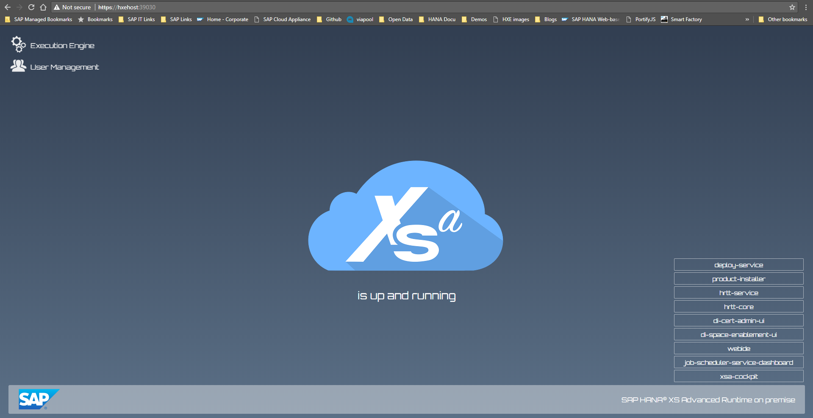

You can use the link to the SAP Web IDE (`https://hxehost:53075/`) to open it

>Note: If you get a 503 error, service unavailable, the service is probably still starting. Try again in a couple of minutes.

Log in with `XSA_DEV` and the master password.


You can now start to use your SAP HANA, express edition or continue with the optional steps. You can get started with your [first end-to-end XS Advanced application](https://www.sap.com/developer/groups/hana-xsa-get-started.html) or [explore additional tutorials at the Developer Center](https://www.sap.com/developer/topics/sap-hana-express.tutorials.html).
[DONE]
[ACCORDION-END]

[ACCORDION-BEGIN [Step 5: ](Log in to the instance and change the administration passwords)]
You should also change your default Operating System password for user `hxeadm`. **Open a new SSH console** and use the following command as your GCP user for this:

```
sudo passwd hxeadm

```

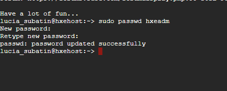

>Note: The default `hxeadm` password is `HXEHana1`

[DONE]
[ACCORDION-END]

[ACCORDION-BEGIN [Step 6 (Optional): ](Install additional components: EA Designer)]

**This step is optional.**

From the console, go into the `Downloads` folder in your virtual machine and list the contents.

```
cd /Downloads
ls
```

You will find the installation packages for the Enterprise Architecture Designer  (`eadesigner.tgz`). You may also find additional packages you may want to install.

To install any of these packages, decompress it first with the following command:

```
tar -xvzf <<name of the file>>

```

For example:


You can decompress any other installation packages you want. Change the permissions to the extract folder:
```
chmod 777 -R ./HANA_EXPRESS_20/

```


Switch to user `hxeadm`. Go into the decompressed folder and execute the installation script you want.

```
sudo su hxeadm
cd /Downloads/HANA_EXPRESS_20
```


Execute `install_eadesigner.sh` if you want to install the Enterprise Architecture Designer:

```
./install_eadesigner.sh
```
Make sure installation is successful when finished.


[DONE]
[ACCORDION-END]

[ACCORDION-BEGIN [Step 7 (Optional): ](Install Smart Data Streaming)]

This step is **optional**.

Open a new SSH console. Find out your internal IP address with the following command:

```
sudo ifconfig
```

Once the IP is shown, take note of it:

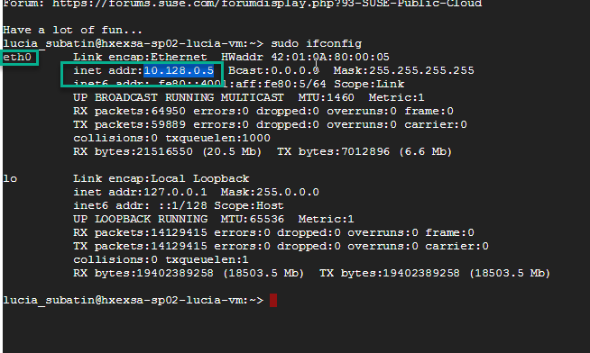

And map it in the hosts file in your virtual machine:

```
sudo edit /etc/hosts
```

A text-editor will open. Use the arrow keys to move to where `127.0.0.1` is. Once there, press letter `i` to enter insert mode. Delete IP `127.0.0.1` and enter your internal IP:

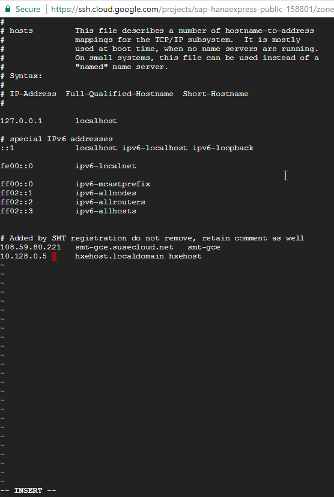

Once you are finished editing, press `Esc` and write `:wq` to save your changes. If you want to discard your changes, you can use `:!q`


>Note: If you are not comfortable with this text editor, you can download the file, edit it and upload it again using a root user.

Back in the console prompt, navigate to the Downloads folder, extract the installation files:

```
cd /Downloads
tar -xvzf sa.tgz
```


Once finished, execute the installation script. Be sure to enter **`hxehost`** as the name of the host when prompted:

```
sudo ./HANA_EXPRESS_20/install_sa.sh
```

As follows:


Once finished, you can verify it is running with the following command
```
ps -ef | grep streaming
```


You can later enable a link to the tool from the SAP Web IDE for SAP HANA:


[DONE]
[ACCORDION-END]

## Next Steps
 - [Review SAP HANA, express edition content, tutorials and quick start guides](https://www.sap.com/developer/topics/sap-hana-express.tutorials.html)
 -  [Get started with XS Advanced development](https://www.sap.com/developer/groups/hana-xsa-get-started.html)
 - Generate test data and check a sample enterprise application [deploying the SAP HANA INteractive Education model on XS Advanced](https://www.sap.com/developer/tutorials/xsa-ml-e2e-access-shine.html)
 - **OPTIONAL** [Setup PuTTY and WinSCP to access your SAP HANA, express edition instance on Google Cloud Platform](https://www.sap.com/developer/tutorials/hxe-gcp-setup-putty-winscp-windows.html)
