## Prerequisites  
 - **Proficiency:** Beginner
 - You have a Google Account and/or have registered for the free trial on `cloud.google.com`


## Next Steps
 - [Review SAP HANA, express edition content, tutorials and quick start guides](http://www.sap.com/developer/topics/sap-hana-express.html)
 - **XS Advanced:** [ Get started with XS Advanced development](http://www.sap.com/developer/topics/sap-hana-express.html)
 - **XS Advanced:** [Explore the administration cockpit in XS Advanced](https://www.sap.com/developer/tutorials/xsa-explore-basics.html)
 - **OPTIONAL** [Setup PuTTY and WinSCP to access your SAP HANA, express edition instance on Google Cloud Platform](http://www.sap.com/developer/tutorials/hxe-gcp-setup-putty-winscp-windows.html)

## Disclaimer
The image currently only includes the HANA database engine. XS Advanced is not installed by default.

## Details
### You will learn  
You will also learn how to set up your new instance and enable it for tutorials and developing your first application.


### Time to Complete
**15 Min**

---

[ACCORDION-BEGIN [Step 1: ](Create your Google Cloud Platform instance)]

Navigate to [Google Cloud Launcher](https://console.cloud.google.com/launcher) and search for SAP HANA, express edition.


You will be presented with two options:

- **SAP HANA, express edition (server-only)**: You can connect using SQL clients like SAP HANA Studio or any other client. Includes the Predictive Analytic Library, Machine learning libraries and other advanced analytics.
- **SAP HANA, express edition + XS Advanced Applications** (also referred to as XSA): Includes all of the other features plus the Cloud Foundry based development platform,  SAP Web IDE for SAP HANA, administration cockpit among other applications like SHINE and Smart Data Streaming. OData support, Node.js and Java runtime environments are also included. This option requires more resources.

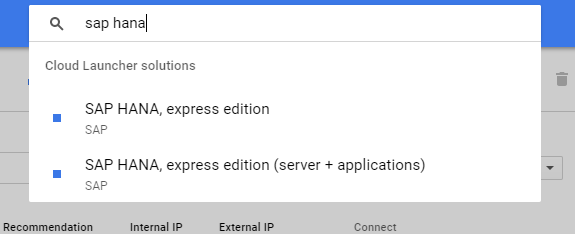

Click on the option of your choice.

Click on the **Launch on Compute Engine** button of the preferred option.


The next page will allow you to modify the default configuration for the Cloud Virtual Machine.

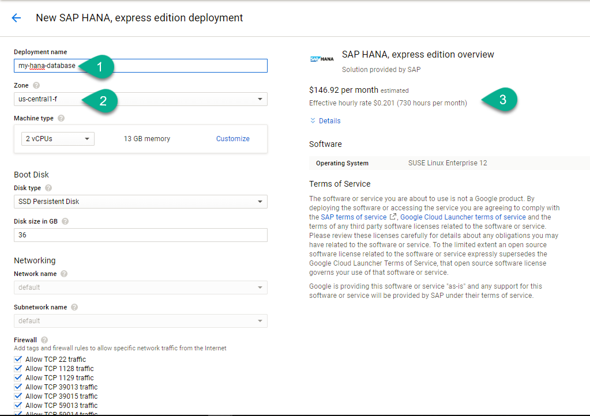

Type an identifying name for the instance, then select the desired geographic zone and machine type. Individual zones might have differing computing resources available and specific access restrictions.

>The default settings for RAM, CPU and Storage are appropriate for getting familiar with SAP HANA. The recommended minimum configuration is 13GB of RAM, with at least 2 virtual CPU and 36GB of storage.

By default, the firewall rules are configured specifically for SAP HANA, express edition. As new SAP HANA applications are created, additional ports might have to be opened up. The following ports are required to connect to SAP HANA, express edition: **8090, 4390, 39013, 39015, 59013, 59014**. Some additional ports are needed for the XS Advanced applications.

To connect to the instance from a local SSH client, like PuTTY, port **22** also has to be open.

After reviewing all configuration options, click **Deploy**. This will take a few minutes.


[ACCORDION-END]

[ACCORDION-BEGIN [Step 2: ](Log in to the instance and change the administration passwords)]

Upon successful deployment, use the web based SSH tool and log into your instance.

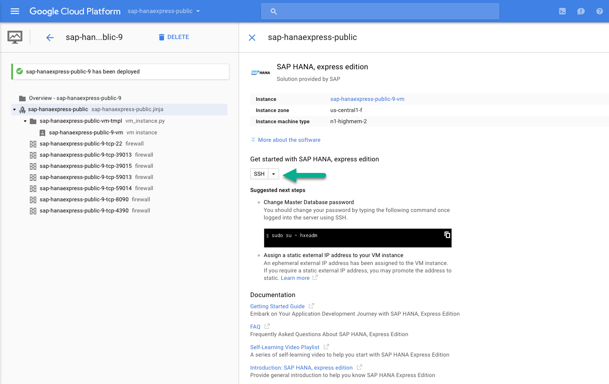

Type the following command:

```
sudo su - hxeadm
```

Hit **Enter**. Follow the prompts to change password. **IMPORTANT: SAP HANA will not be usable if this step is ignored**.

>The password needs to be at least eight characters-long and contain at least one digit, one uppercase and one lowercase letter. Special characters are optional but restricted. Please review password requirements in [the SAP Help](http://help-legacy.sap.com/saphelp_hanaplatform/helpdata/en/61/662e3032ad4f8dbdb5063a21a7d706/frameset.htm)


For **XS Advanced** installations, you will be asked if you want to wait for XSA configurations to finish. If your internet connection might be interrupted, it is advisable to choose **yes**:

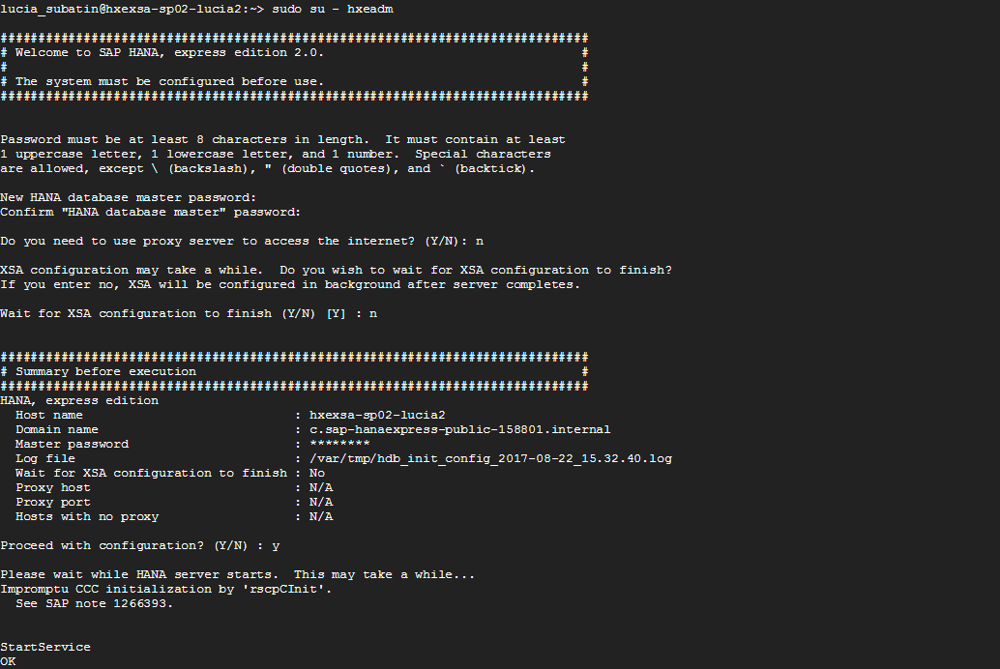

Enter `Y` to continue with configuration when prompted:


Once configuration is finished, you will see a success message:


If you have chosen to run XS Advanced in the background, you can check the status by copying the status file and running the following command:

```
cat /usr/sap/HXE/home/xsa_config_status
```
The file will say either `in progress` or `success`. The installation is finished once the status changes to `success`


You should also change your default Operating System password for user `hxeadm`. **Open a new SSH console** and use the following command as your GCP user for this:

```
passwd hxeadm

```


>Note: The default `hxeadm` password is `HXEHana1`


[ACCORDION-END]


[ACCORDION-BEGIN [Step 3: ](Take note of your external IP and connect)]

To connect to SAP HANA, we need to know what the external IP address is. Once deployment is finished, you can click on the menu and navigate to `Compute Engine -> VM instances` to see your newly created Virtual Machine. Take note of your IP address:


Alternatively, click on the `Learn more` and follow the steps to create and external IP address.

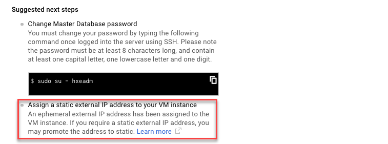

Your SAP HANA, express edition, instance is now up and running.


[ACCORDION-END]


[ACCORDION-BEGIN [Step 4: ](XS Advanced installation only: Map your hostname in the hosts file)]

Use your IP address to map it to the hosts file in your computer. You need administration permissions to do this.

- For Windows Computers:
  If your user is not an administrator but has administrator rights, right-click on Notepad and choose `Run as Administrator`. If you are an administrator user, proceed to the next point.

  

  Open the file or navigate with Windows explorer. You need to edit the file called `hosts` in the directory `C:\Windows\System32\drivers\etc`

  


- For Mac:
  Open a terminal (`Finder -> Applications -> Terminal`) and type `sudo nano /etc/hosts`


Add the IP address followed by the name of the host, which will be `hxehost`:

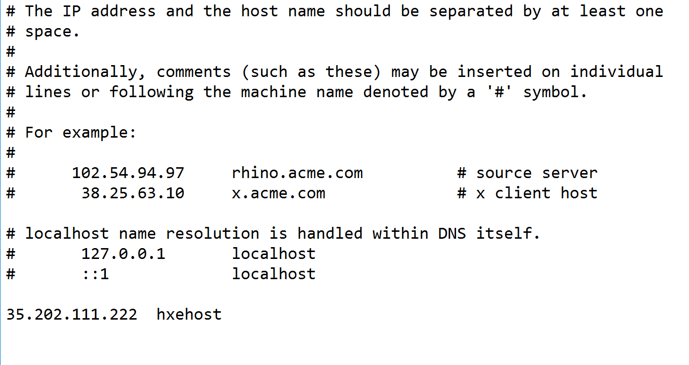

**Save** and close the editor.

> Note: If Notepad asks you to create a new file you do not have enough permissions to save the file. Creating a new file will not alter the configuration as intended.

</br>

For **XS Advanced installations**, you can test you have successfully modified your configuration by entering the following URL in your browser: `https://hxehost:53075/`


Log in with `XSA_DEV` and the master password. You will see the Web IDE.

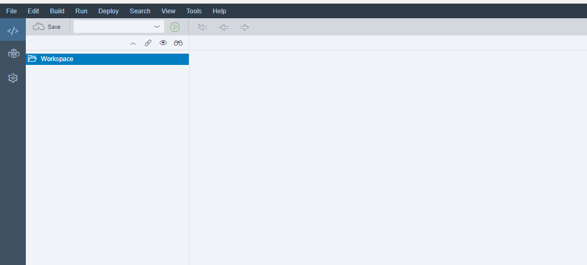


[ACCORDION-END]

[ACCORDION-BEGIN [Step 5: ](XS Advanced - Add application ports)]

XS Advanced will need a range of ports to run applications such as SHINE, EA Designer or your own development objects. To enable additional ports, open a `GCloud` console:

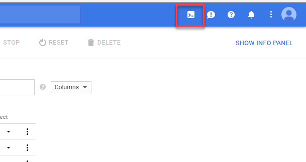

And copy the following command:

```SSH
gcloud compute firewall-rules create xsa --allow tcp:51000-51060
```
This will create a rule to enable traffic to ports 51000 up to 51060.


You may need additional ports in the fur, which you can enable using the same command.

>Note: This rule will apply to your entire project. If you want to restrict the ports for a specific virtual machine, check [Google Help](https://cloud.google.com/compute/docs/vpc/firewalls)

[ACCORDION-END]

[ACCORDION-BEGIN [Step 6 (Optional): ](XSA ONLY- Install additional components: SHINE or EA Designer)]

**This is only available in the XS Advanced option. Installations are optional**.

From the console, go into the `Downloads` folder and list the contents.

```
cd /Downloads
ls
```

You will find the installation packages for the Enterprise Architecture Designer  (`eadesigner.tgz`) and the SAP HANA Interactive Education (SHINE, `shine.tgz`).

To install any of these packages, decompress it first with the following command:

```
tar -xvzf <<name of the file>>

```

For example:


You can decompress any other installation packages you want. Change the permissions to the extract folder:
```
chmod 777 -R ./HANA_EXPRESS_20/

```


Switch to user `hxeadm`. Go into the decompressed folder and execute the installation script you want.

```
sudo su hxeadm
cd /Downloads/HANA_EXPRESS_20
```


Execute `install_eadesigner.sh` if you want to install the Enterprise Architecture Designer:

```
./install_eadesigner.sh
```

For example:

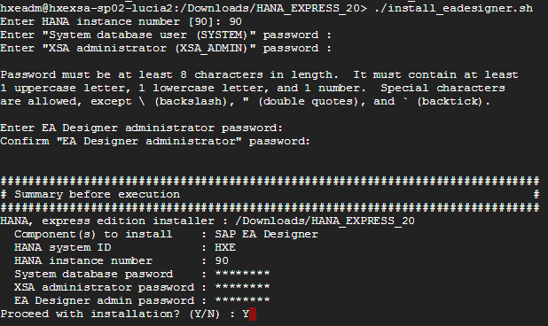

And/or `install_shine.sh` to install SHINE:

```
./install_shine.sh
```
For example:

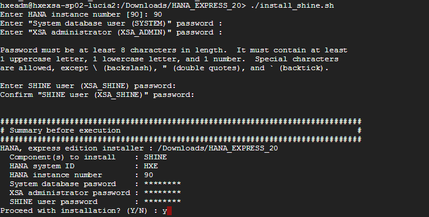

Make sure installation is successful when finished.


[ACCORDION-END]

[ACCORDION-BEGIN [Step 6 (Optional): ](XS Advanced - Install Smart Data Streaming)]

Open a new SSH console. Find out your internal IP address with the following command:

```
sudo ifconfig
```

Once the IP is shown, take note of it:


And map it in the hosts file in your virtual machine:

```
sudo edit /etc/hosts
```

A text-editor will open. Use the arrow keys to move to where `127.0.0.1` is. Once there, press letter `i` to enter insert mode. Delete IP `127.0.0.1` and enter your internal IP:


Once you are finished editing, press `Esc` and write `:wq` to save your changes. If you want to discard your changes, you can use `:!q`

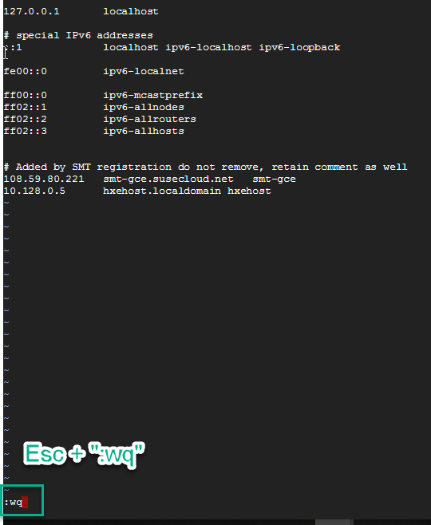

>Note: If you are not comfortable with this text editor, you can download the file, edit it and upload it again using a root user.

Back in the console prompt, navigate to the Downloads folder, extract the installation files:

```
cd /Downloads
tar -xvzf sa.tgz
```


Once finished, execute the installation script. Be sure to enter **`hxehost`** as the name of the host when prompted:

```
sudo ./HANA_EXPRESS_20/install_sa.sh
```

As follows:


Once finished, you can verify it is running with the following command
```
ps -ef | grep streaming
```


You can later enable a link to the tool from the SAP Web IDE for SAP HANA:


[ACCORDION-END]

[ACCORDION-BEGIN [Step 7 (Optional): ](Server-only installation: Create a development user)]

It is always safe to create a development user and even make a copy of the system user to use as an administrator in case you somehow lock yourself out. The XS Advanced installation creates a development user called `XSA_DEV`, so this step is unnecessary if you are using that option.

If you are using the server-only option, in a new SSH console, switch to the user `hxeadm` and connect to the database as follows:

```SSH
sudo su - hxeadm

hdbsql -i 90 -d SYSTEMDB -u SYSTEM
```

Enter the master password you chose at setup. When the `hdbsql` command prompt is ready, enter the following (replacing a the password and username for one of your choice):

```SQL
CREATE USER WORKSHOP_01 PASSWORD <password> NO FORCE_FIRST_PASSWORD_CHANGE ;

CALL GRANT_ACTIVATED_ROLE ('sap.hana.ide.roles::EditorDeveloper','WORKSHOP_01');
CALL GRANT_ACTIVATED_ROLE ('sap.hana.ide.roles::CatalogDeveloper','WORKSHOP_01');
```

>Note: You may need to add additional roles or permissions depending on your needs


[ACCORDION-END]

## Next Steps
 - [Review SAP HANA, express edition content, tutorials and quick start guides](http://www.sap.com/developer/topics/sap-hana-express.html)
 - **XS Advanced:** [ Get started with XS Advanced development](http://www.sap.com/developer/topics/sap-hana-express.html)
 - **XS Advanced:** [Explore the administration cockpit in XS Advanced](https://www.sap.com/developer/tutorials/xsa-explore-basics.html)
 - **OPTIONAL** [Setup PuTTY and WinSCP to access your SAP HANA, express edition instance on Google Cloud Platform](http://www.sap.com/developer/tutorials/hxe-gcp-setup-putty-winscp-windows.html)
