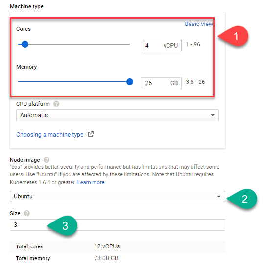
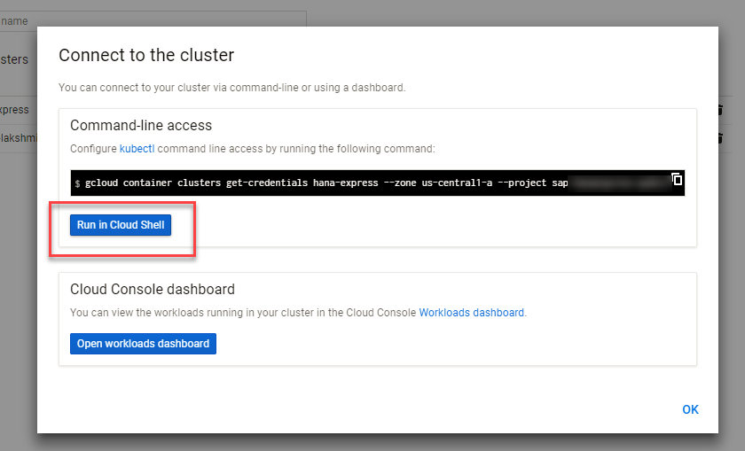
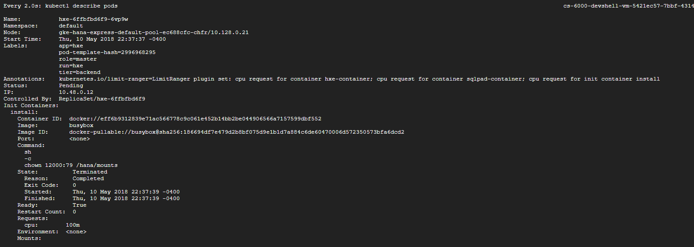

## Prerequisites  
 - **Proficiency:** Beginner

## Details
### You will learn  
This tutorial will guide you through the creation and configuration of a Kubernetes cluster on Google Kubernetes Engine (GKE). You will then learn how to connect to SAP HANA, express edition running on the pods.

The currently available image includes the **database server only**. The Extended Application Services, advanced and classic models (XS Advanced or XS Classic), are not included.

## Disclaimer
SAP HANA, express edition (HXE) is officially supported on SLES. SAP Community members have been successful in running HXE on other Linux operating systems that are not formally supported by SAP, such as Red Hat, Ubuntu, openSUSE and Fedora. SAP is not committing to resolving any issues that may arise from running HXE on these platforms.

### Time to Complete
**15 Min**

---

[ACCORDION-BEGIN [Step 1: ](Create a new Kubernetes cluster)]
Create an account or log into the [Google Cloud Platform console](https://console.cloud.google.com). If you do not have one, follow the steps to create a new project and enable the necessary APIs as detailed in this [`quickstart` from Google](https://cloud.google.com/kubernetes-engine/docs/quickstart):


Once there, use the menu on the top left corner to navigate a new Kubernetes cluster from the `Kubernetes Engine` menu.


Click **Create cluster**.


[ACCORDION-END]

[ACCORDION-BEGIN [Step 2: ](Configure your Kubernetes cluster)]

Fill in the basic details as per your preferences, and click **Customize**.


Configure the minimum requirements for your nodes. The **minimum** requirements for each container are:

- 4 `vCPU`
- 8 GB RAM
- Ubuntu operating system

If you are planning on running multiple containers per pod, you can adjust accordingly. This example is based on a single container per pod.



>Note: You can only run only one container with SAP HANA, express edition per pod.

Review the other options, scroll down, and click **Create**.

[ACCORDION-END]


[ACCORDION-BEGIN [Step 3: ](Connect to your cluster)]

Once the cluster has finished deploying, click **Connect**.


Use **Run in Cloud Shell** to connect from the web console.



>Note: Alternatively, you can download the Google Cloud SDK and execute the commands locally.

This will open a `gcloud` console with a command ready to connect to the cluster in your project and selected zone. Hit **enter** to execute the command.


Use command `kubectl get nodes` to list the nodes and their status.


[ACCORDION-END]

[ACCORDION-BEGIN [Step 4: ](Create the deployment configuration files)]

Go back to the `gcloud` console for your cluster.


In order to authenticate with `Docker` and pull the image, you will need to create a secret. Use the following command, with your logon data for `Docker`. If you do not have an account yet, you can [create one for free](https://store.docker.com/images/sap-hana-express-edition/plans/f2dc436a-d851-4c22-a2ba-9de07db7a9ac?tab=instructions)

```ssh
kubectl create secret docker-registry docker-secret --docker-server=https://index.docker.io/v1/ --docker-username=<<DOCKER_USER>> --docker-password=<<DOCKER_PASSWORD>> --docker-email=<<DOCKER_EMAIL>>
```

For example:


Locally on your computer, create a text file called `hxe.yaml` with the following content. **Replace** the path to password file with the one you have just created considering the following rules:


> ### **Note: Please check the password policy to avoid errors**
>
> SAP HANA, express edition requires a very strong password that complies with these rules:
>
> - At least 8 characters
> - At least 1 uppercase letter
> - At least 1 lowercase letter
> - At least 1 number
> - Can contain special characters, but not _&grave;_ (backtick), _&#36;_ (dollar sign),  _&#92;_ (backslash), _&#39;_ (single quote), or _&quot;_ (double quotes)
> - Cannot contain dictionary words
> - Cannot contain simplistic or systematic values, like strings in ascending or descending numerical or alphabetical order

Replace the password in the new file.

```text
kind: ConfigMap
apiVersion: v1
metadata:
  creationTimestamp: 2018-01-18T19:14:38Z
  name: hxe-pass
data:
  password.json: |+
    {"master_password" : "HXEHana1"}
---
kind: PersistentVolume
apiVersion: v1
metadata:
  name: persistent-vol-hxe
  labels:
    type: local
spec:
  storageClassName: manual
  capacity:
    storage: 150Gi
  accessModes:
    - ReadWriteOnce
  hostPath:
    path: "/data/hxe_pv"
`---`
kind: PersistentVolumeClaim
apiVersion: v1
metadata:
  name: hxe-pvc
spec:
  storageClassName: manual
  accessModes:
    - ReadWriteOnce
  resources:
    requests:
      storage: 50Gi
`---`
apiVersion: v1
kind: Pod
metadata:
  name: hxe-pod
  labels:
    name: hxe-pod
spec:
  initContainers:
    - name: install
      image: busybox
      command: [ 'sh', '-c', 'chown 12000:79 /hana/mounts' ]
      volumeMounts:
        - name: hxe-data
          mountPath: /hana/mounts
  restartPolicy: OnFailure
  volumes:
    - name: hxe-data
      persistentVolumeClaim:
         claimName: hxe-pvc
    - name: hxe-config
      configMap:
         name: hxe-pass
  imagePullSecrets:
  - name: docker-secret
  containers:
  - name: hxe-container
    image: "store/saplabs/hanaexpress:2.00.022.00.20171211.1"
    ports:
      - containerPort: 39013
        name: port1
      - containerPort: 39015
        name: port2
      - containerPort: 39017
        name: port3
      - containerPort: 8090
        name: port4
      - containerPort: 39041
        name: port5
      - containerPort: 59013
        name: port6
    args: [ "--agree-to-sap-license", "--dont-check-system", "--passwords-url", "file:///hana/hxeconfig/password.json" ]
    volumeMounts:
      - name: hxe-data
        mountPath: /hana/mounts
      - name: hxe-config
        mountPath: /hana/hxeconfig

```

Save it and use the **Upload file** tool to upload it to your cluster.

  

The file will be uploaded to your home directory (`/home/YOUR_GOOGLE_ID`).

[ACCORDION-END]

[ACCORDION-BEGIN [Step 5: ](Deploy a HANA Express docker container on your Docker pod)]

Use the following command to deploy the image on your pods and check deployment:

```
kubectl create -f hxe.yaml
kubectl describe pod hxe-pod
```
If you scroll down, you will probably see a message stating that the image is being pulled.

  

Repeat the command `kubectl describe pod hxe-pod` until you see the container has started.

  

The following command will give you more information about deployment and the `exec` command will log you into the container:

```
kubectl logs hxe-pod
kubectl exec -it hxe-pod bash
```

Once in the container, you can check SAP HANA, express edition is running using `HDB info`.

  

You can edit the name in the `yaml` to deploy additional containers in empty nodes.

[ACCORDION-END]
