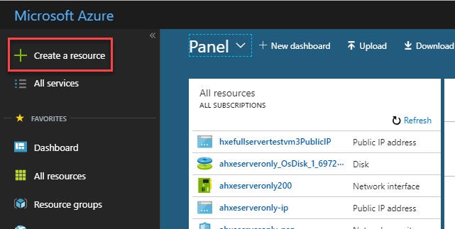
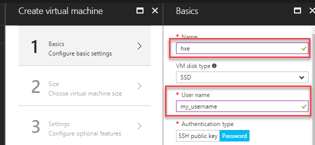
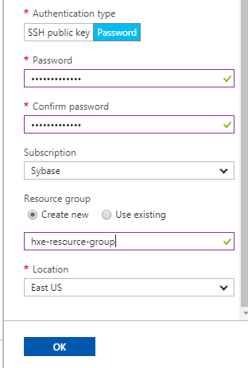
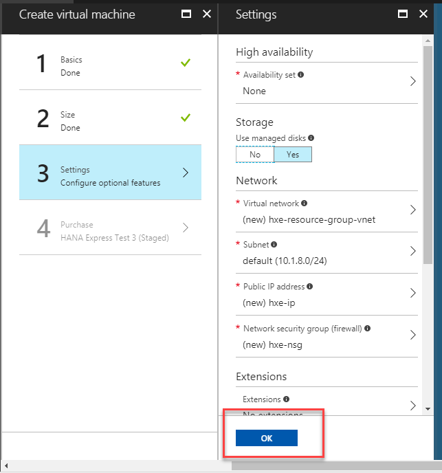
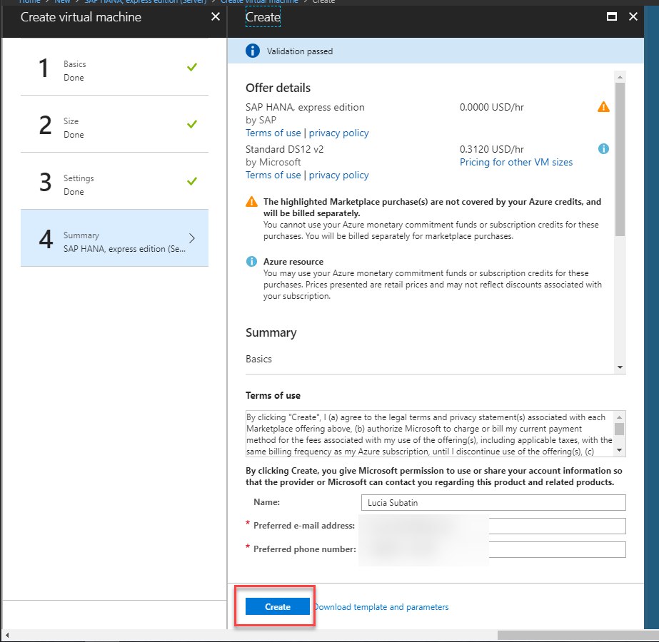
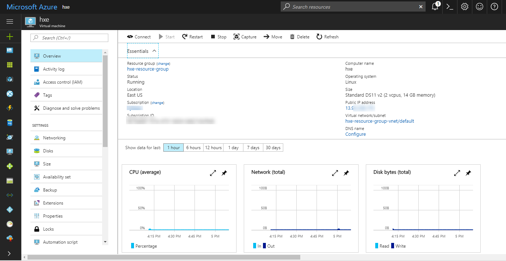
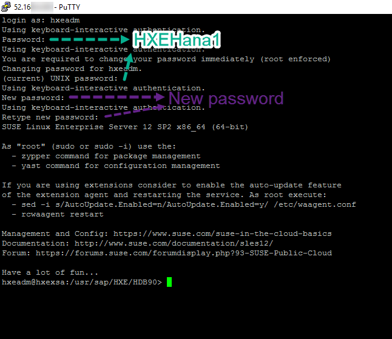
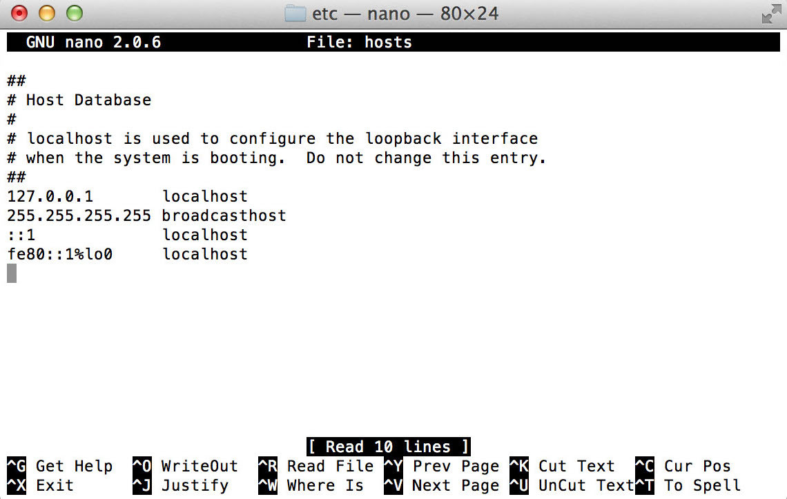

## Prerequisites  
 - **Proficiency:** Beginner | Intermediate | Advanced
 - Create an account in [MS Azure](https://portal.azure.com/)


## Next Steps
- [Review SAP HANA, express edition content, tutorials and quick start guides](https://www.sap.com/developer/topics/sap-hana-express.tutorials.html)
- **Drivers and connectors**: Connect to your SAP HANA, express edition system database instance [using the plug in for Eclipse](https://www.sap.com/developer/how-tos/2016/09/hxe-howto-eclipse.html) or connect to a [tenant database using HANA Studio](https://www.sap.com/developer/how-tos/2017/06/hxe-gcp-eclipse-tenant-connect.html)
- **Additional languages?**: Build applications using different drivers and languages [such as Node.js, Python ](https://www.sap.com/developer/groups/hxe-tiny-world.html)

## Details
### You will learn  
This tutorial will guide you through the provisioning and setup of SAP HANA, express edition, on Microsoft Azure.

### Time to Complete
**15 Min**

---

[ACCORDION-BEGIN [Step 1: ](Choose your instance)]

Connect to your account in [MS Azure](https://portal.azure.com/) and click on **New**



You will be presented with **two options**:

- **SAP HANA, express edition (server-only)**: You can connect using SQL clients like SAP HANA Studio or any other client. Includes the Predictive Analytic Library, Machine learning libraries and other advanced analytics. **This version is covered in this tutorial**.
- **SAP HANA, express edition + XS Advanced Applications** (also referred to as XSA): Includes all of the other features plus the Cloud Foundry based development platform,  SAP Web IDE for SAP HANA, administration cockpit among other applications like SHINE and Smart Data Streaming. OData support, Node.js and Java runtime environments are also included. This option requires more resources. Use this tutorial to learn how to set this version up.


In the search box, enter `HANA express`


**Click** on `SAP HANA, express edition (server)`.


[ACCORDION-END]

[ACCORDION-BEGIN [Step 2: ](Create your instance)]

Click on **Create** to start the process of creating your instance.


The wizard will walk you through the basic steps. Fill-in the **name** of the instance and a username:



You can now enter a password or generate an SSH key. Complete all the fields and click on **OK**:



>Note: Alternatively, you can follow [these steps](https://docs.microsoft.com/azure/virtual-machines/virtual-machines-linux-ssh-from-windows) if you prefer to generate an SSH key

[ACCORDION-END]


[ACCORDION-BEGIN [Step 3: ](Review pricing and finish setup)]

Step 2 in the wizard presents you with the pre-defined resources for your SAP HANA, express edition, instance. You can also review the pricing per month:


Click on **Select**.

Step 3 will provide you with additional options. Generally, the default values should suit your needs. Review them and modify them if necessary. Click **OK** when ready:



Review the final summary and click on **Purchase** to continue:



Once deployment is finished, you will be redirected to the dashboard for your new virtual machine:



[ACCORDION-END]

[ACCORDION-BEGIN [Step 4: ](Connect to your virtual machine using SSH)]

Take note of your external IP address:


- If you are using a **Windows** computer, you will need to download an SSH client [such as `PuTTY`](https://winscp.net/eng/download.php#putty).

      In `PuTTY`, add the IP to the Host field and click **OK**:

      

      Note: If you chose to use an SSH key as an authentication method, you will need to add it in `SSH->Auth`

- If you are using an **Apple** computer, open a terminal (`Finder -> Applications -> Terminal`)

      Run the following command in the terminal, replacing the username and IP by the one in your virtual machine:

      ```SSH
      ssh <<my_username>>@<<your_IP>>
      ```
      


[ACCORDION-END]

[ACCORDION-BEGIN [Step 5: ](Setup your machine)]

From the SSH console, enter the following command:

```SSH
  sudo su - hxeadm
```

You will be prompted for a password for the administration users. **Read the rules** carefully before selecting one:

> ### **Note: Please check the password policy to avoid errors**
>
> SAP HANA, express edition requires a very strong password that complies with these rules:
>
> - At least 8 characters
> - At least 1 uppercase letter
> - At least 1 lowercase letter
> - At least 1 number
> - Can contain special characters, but not _&grave;_ (backtick), _&#36;_ (dollar sign),  _&#92;_ (backslash), _&#39;_ (single quote), or _&quot;_ (double quotes)
> - Cannot contain dictionary words
> - Cannot contain simplistic or systematic values, like strings in ascending or descending numerical or alphabetical order

&nbsp;

Confirm the setup with **Y**. Once the configuration is finished, you will see a success message like the following one:


Your SAP HANA, express edition database is now up and running.

You can perform the optional setup steps below (recommended) or continue to [explore tutorials to get you started](https://www.sap.com/developer/topics/sap-hana-express.tutorials.html) or perform the optional steps below.

[ACCORDION-END]

[ACCORDION-BEGIN [Step 6 (Optional): ](Change the password for the operating system user)]

The default password for the operating system administration user is `HXEHana1`. You can change it to one of your choice.

Open a **new SSH session** and log in with user `hxeadm`.



>Alternatively, from a new SSH session, you can use command `sudo passwd hxeadm` to change the password.

[ACCORDION-END]

[ACCORDION-BEGIN [Step 7 (Optional): ](Create a development user)]

It is always safe to create a development user and even make a copy of the SYSTEM user to use as an administrator in case you somehow lock yourself out.

In a new SSH console, switch to the user `hxeadm` and connect to the database as follows:

```SSH
sudo su - hxeadm

hdbsql -i 90 -d SYSTEMDB -u SYSTEM
```

Enter the master password you chose at setup. When the `hdbsql` command prompt is ready, enter the following (replacing a the password and username for one of your choice):

```SQL
CREATE USER WORKSHOP_01 PASSWORD <password> NO FORCE_FIRST_PASSWORD_CHANGE ;

CALL GRANT_ACTIVATED_ROLE ('sap.hana.ide.roles::EditorDeveloper','WORKSHOP_01');
CALL GRANT_ACTIVATED_ROLE ('sap.hana.ide.roles::CatalogDeveloper','WORKSHOP_01');
```
>Note: You may need to add additional roles or permissions depending on your development needs


[ACCORDION-END]

[ACCORDION-BEGIN [Step 8 (Optional): ](Map the hosts file)]

Use your IP address to map it to the hosts file in your computer. You need administration permissions to do this.

- For Windows Computers:
  If your user is not an administrator but has administrator rights, right-click on Notepad and choose `Run as Administrator`. If you are an administrator user, proceed to the next point.

  

  Open the file or navigate with Windows explorer. You need to edit the file called `hosts` in the directory `C:\Windows\System32\drivers\etc`

  


- For Mac OS:
  Open a terminal (`Finder -> Applications -> Terminal`) and type `sudo nano /etc/hosts`

  


Add the IP address followed by the name of the host, `hxehost`:


**Save** and close the editor.

> Note: If Notepad asks you to create a new file you do not have enough permissions to save the file. Creating a new file will not alter the configuration as intended.

</br>


[ACCORDION-END]


## Next Steps
- [Review SAP HANA, express edition content, tutorials and quick start guides](https://www.sap.com/developer/topics/sap-hana-express.tutorials.html)
- **Drivers and connectors**: Connect to your SAP HANA, express edition system database instance [using the plug in for Eclipse](https://www.sap.com/developer/how-tos/2016/09/hxe-howto-eclipse.html) or connect to a [tenant database using HANA Studio](https://www.sap.com/developer/how-tos/2017/06/hxe-gcp-eclipse-tenant-connect.html)
- **Additional languages?**: Build applications using different drivers and languages [such as Node.js, Python ](https://www.sap.com/developer/groups/hxe-tiny-world.html)
