## Prerequisites  
 - **Proficiency:** Beginner | Intermediate | Advanced
 - Create an account in [MS Azure](https://portal.azure.com/)


## Next Steps
- [Review SAP HANA, express edition content, tutorials and quick start guides](http://www.sap.com/developer/topics/sap-hana-express.html)
- **XS Advanced:** [ Get started with XS Advanced development](http://www.sap.com/developer/topics/sap-hana-express.html)
- **XS Advanced:** [Explore the administration cockpit in XS Advanced](https://www.sap.com/developer/tutorials/xsa-explore-basics.html)

## Details
### You will learn  
This tutorial will guide you through the provisioning and setup of SAP HANA, express edition, on Microsoft Azure.

### Time to Complete
**15 Min**

---

[ACCORDION-BEGIN [Step 1: ](Choose your instance)]

Connect to your account in [MS Azure](https://portal.azure.com/) and click on **New**


You will be presented with **two options**:

- **SAP HANA, express edition (server-only)**: You can connect using SQL clients like SAP HANA Studio or any other client. Includes the Predictive Analytic Library, Machine learning libraries and other advanced analytics.
- **SAP HANA, express edition + XS Advanced Applications** (also referred to as XSA): Includes all of the other features plus the Cloud Foundry based development platform,  SAP Web IDE for SAP HANA, administration cockpit among other applications like SHINE and Smart Data Streaming. OData support, Node.js and Java runtime environments are also included. This option requires more resources.


In the search box, enter `HANA express`

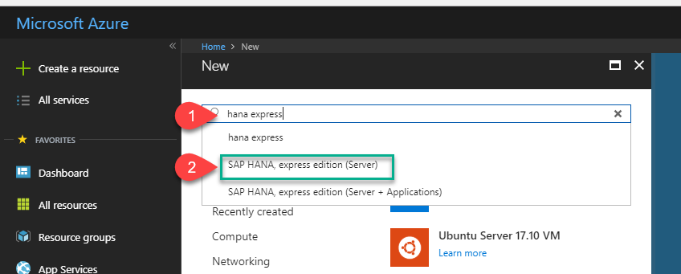


**Click** on the option that best suits your needs.


[ACCORDION-END]

[ACCORDION-BEGIN [Step 2: ](Create your instance)]

Click on **Create** to start the process of creating your instance.


The wizard will walk you through the basic steps. Fill-in the **name** of the instance and a username:


You can now enter a password or generate an SSH key. Complete all the fields and click on **OK**:


>Note: Alternatively, you can follow [these steps](https://docs.microsoft.com/azure/virtual-machines/virtual-machines-linux-ssh-from-windows) if you prefer to generate an SSH key

[ACCORDION-END]


[ACCORDION-BEGIN [Step 3: ](Review pricing and finish setup)]

Step 2 in the wizard presents you with the pre-defined resources for your SAP HANA, express edition, instance. You can also review the pricing per month:

For the server-only option:

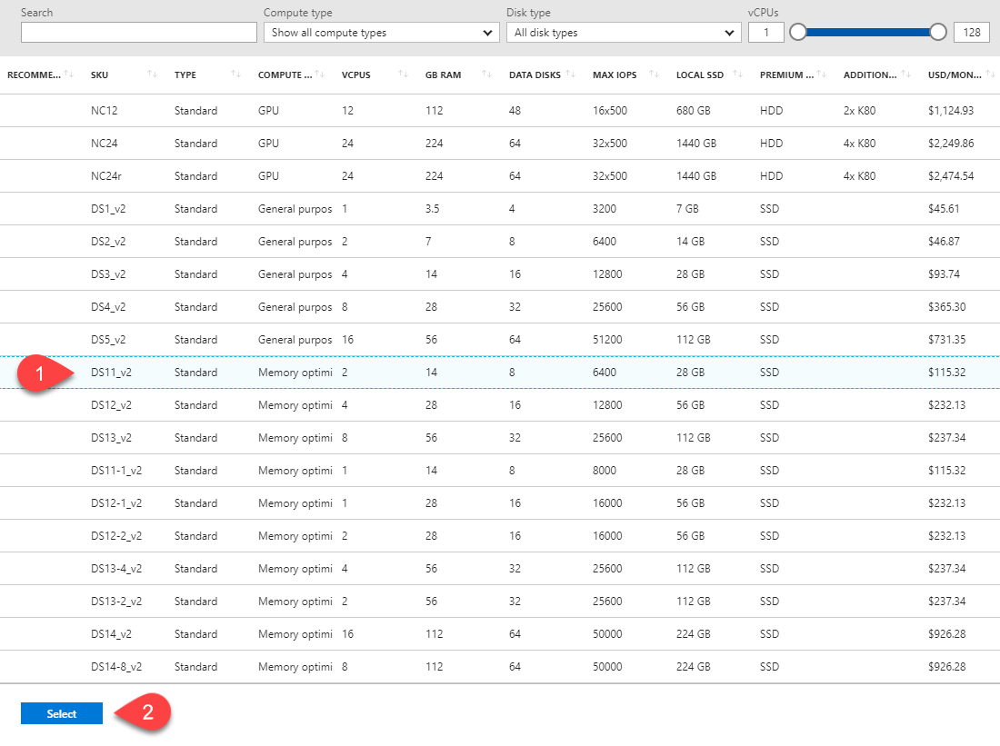

Or for the option with XS Advanced applications:

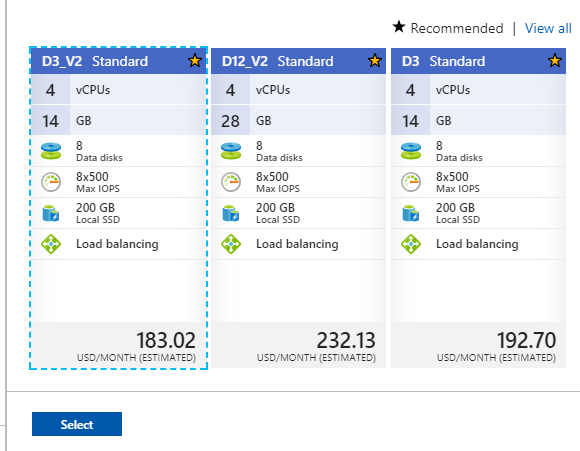

Click on **Select**.

Step 3 will provide you with additional options. Generally, the default values should suit your needs. Review them and modify them if necessary. Click **OK** when ready:


Review the final summary and click on **Purchase** to continue:


Once deployment is finished, you will be redirected to the dashboard for your new virtual machine:


[ACCORDION-END]

[ACCORDION-BEGIN [Step 4: ](Connect to your virtual machine using SSH)]

Take note of your external IP address:

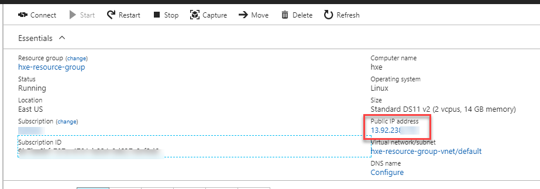

- If you are using a **Windows** computer, you will need to download an SSH client [such as `PuTTY`](https://winscp.net/eng/download.php#putty).

      In `PuTTY`, add the IP to the Host field and click **OK**:

      

      >Note: If you chose to use an SSH key as an authentication method, you will need to add it in `SSH->Auth`

- If you are using an **Apple** computer, open a terminal (`Finder -> Applications -> Terminal`)

      Run the following command in the terminal, replacing the username and IP by the one in your virtual machine:

      ```SSH
      ssh <<my_username>>@<<your_IP>>
      ```
      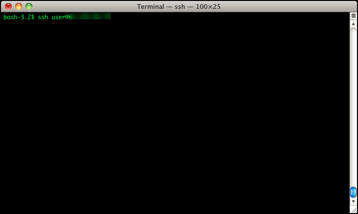


[ACCORDION-END]

[ACCORDION-BEGIN [Step 5: ](Setup your machine)]

From the SSH console, enter the following command:

```SSH
  sudo su - hxeadm
```

You will be prompted for a password for the administration users. **Read the rules** carefully before selecting one:

Password must be at least 8 characters in length.  It must contain at least 1 uppercase letter, 1 lowercase letter, and 1 number.  Special characters are allowed, except `\` (backslash), `"` (double quotes), and `backtick`.

> If you are installing the option with **XS Advanced applications**,  you will also be asked if you want to wait for the configuration to finish. If you choose not to, you can check the status of the installation using the command `cat /usr/sap/HXE/home/xsa_config_status`


Once the configuration is finished, you will see the following message:


[ACCORDION-END]

[ACCORDION-BEGIN [Step 6: ](Map the hosts file)]

**This step is optional for server-only installations. You only need to do it if you chose the XS Advanced applications option**.

Use your IP address to map it to the hosts file in your computer. You need administration permissions to do this.

- For Windows Computers:
  If your user is not an administrator but has administrator rights, right-click on Notepad and choose `Run as Administrator`. If you are an administrator user, proceed to the next point.

  

  Open the file or navigate with Windows explorer. You need to edit the file called `hosts` in the directory `C:\Windows\System32\drivers\etc`

  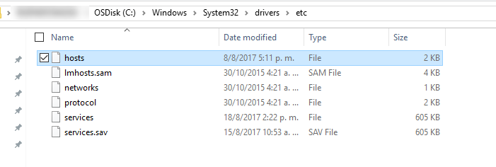


- For Mac OS:
  Open a terminal (`Finder -> Applications -> Terminal`) and type `sudo nano /etc/hosts`

  


Add the IP address followed by the name of the host, `hxehost`:


**Save** and close the editor.

> Note: If Notepad asks you to create a new file you do not have enough permissions to save the file. Creating a new file will not alter the configuration as intended.

</br>

For **XS Advanced installations**, you can test you have successfully modified your configuration by entering the following URL in your browser: `https://hxehost:53075/`


Log in with `XSA_DEV` and the master password. You will see the Web IDE.


[ACCORDION-END]

[ACCORDION-BEGIN [Step 7 (Optional): ](Change the password for the operating system user)]

The default password for the operating system administration user is `HXEHana1`. You can change it to one of your choice.

Open a **new SSH session** and log in with user `hxeadm`.


[ACCORDION-END]

[ACCORDION-BEGIN [Step 8 (Optional): ](XS Advanced applications ONLY - Install SHINE or Enterprise Designer)]

If you chose the **XS Advanced** applications, you can install additional components. These components are **OPTIONAL** and independent among themselves.

Open a new console and log in with your MS Azure id. Go into the `Downloads` folder and list the contents.

```
cd /Downloads
ls
```

You will find the installation packages for the Enterprise Architecture Designer  (`eadesigner.tgz`) and the SAP HANA Interactive Education (SHINE, `shine.tgz`).


To install any of these packages, change permissions and decompress it first with the following command:

```
sudo chmod 777 -R <<compressed_file>>
sudo tar -xvzf <<name of the file>>

```

For example:


Switch to user `hxeadm`. Go into the decompressed folder and execute the installation script you want.

```
sudo su hxeadm
cd /Downloads/HANA_EXPRESS_20
```
</br>


Execute `install_eadesigner.sh` if you want to install the Enterprise Architecture Designer:


```
./install_eadesigner.sh
```

For example:


If you want to know the URLs to connect to the Enterprise Designer, type `xs apps`:


And/or `install_shine.sh` to install SHINE:

```
./install_shine.sh
```
For example:

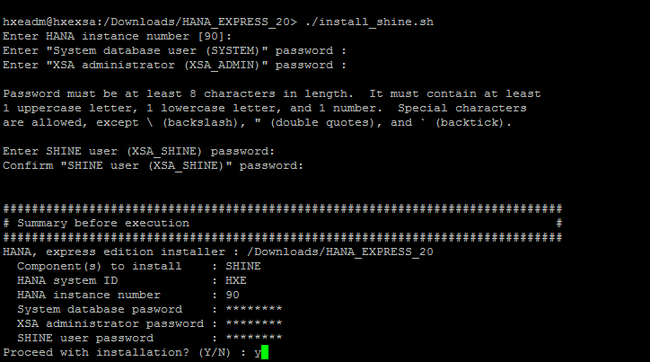

Make sure installation is successful when finished.


You can find more information on the SHINE module in the [official GitHub repository](https://github.com/SAP/hana-shine-xsa)


[ACCORDION-END]

[ACCORDION-BEGIN [Step 9 (Optional): ](XS Advanced applications ONLY - Install Smart Data Streaming)]

Open a new SSH console and log in as you MS Azure VM user ID. Find out your internal IP address with the following command:

```
sudo ifconfig
```

Once the IP is shown, take note of it:

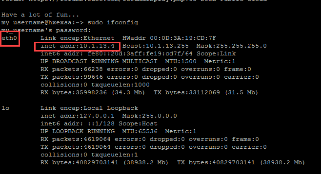

And map it in the hosts file in your virtual machine:

```
sudo edit /etc/hosts
```

A text-editor will open. Use the arrow keys to move to where `127.0.0.2` is. Once there, press letter `i` to enter insert mode. Use the Delete key to delete IP `127.0.0.1` and enter your internal IP:

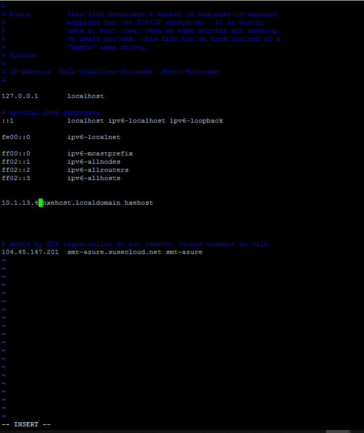

Once you are finished editing, press `Esc` and write `:wq` to save your changes. If you want to discard your changes, you can use `:!q`

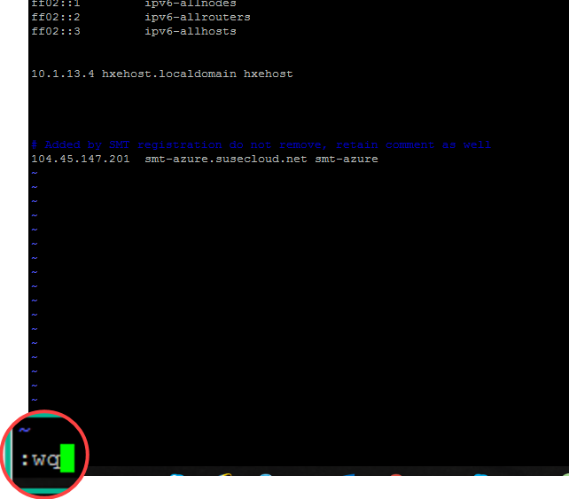

Back in the console prompt, navigate to the Downloads folder, extract the installation files:

```
cd /Downloads
sudo tar -xvzf sa.tgz
```


Once finished, execute the installation script. Be sure to enter **`hxehost`** as the name of the host when prompted:

```
sudo ./HANA_EXPRESS_20/install_sa.sh
```

As follows:

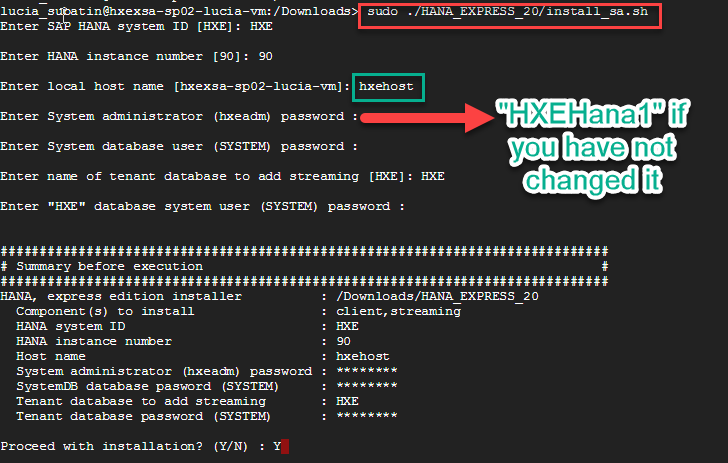

Once finished, you can verify it is running with the following command
```
ps -ef | grep streaming
```


You can later enable a link to the tool from the SAP Web IDE for SAP HANA:

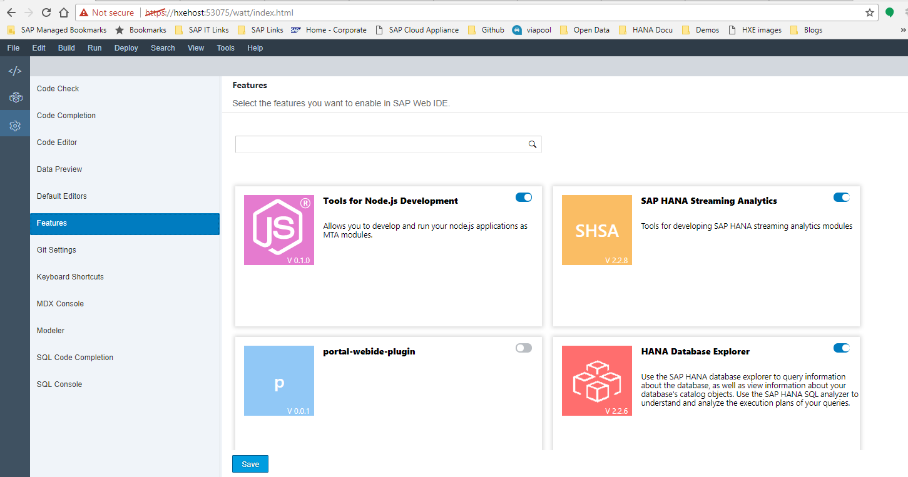


[ACCORDION-END]


## Next Steps
- [Review SAP HANA, express edition content, tutorials and quick start guides](http://www.sap.com/developer/topics/sap-hana-express.html)
- **XS Advanced:** [ Get started with XS Advanced development](http://www.sap.com/developer/topics/sap-hana-express.html)
- **XS Advanced:** [Explore the administration cockpit in XS Advanced](https://www.sap.com/developer/tutorials/xsa-explore-basics.html)
