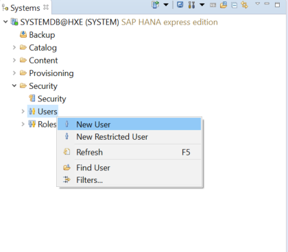
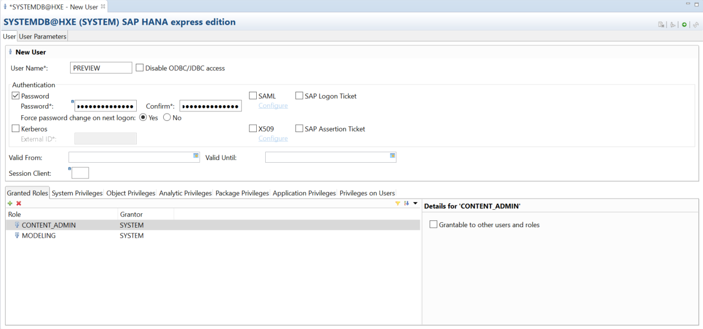
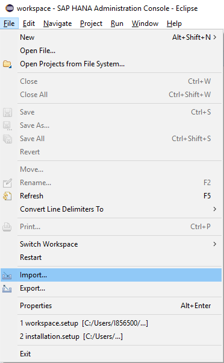
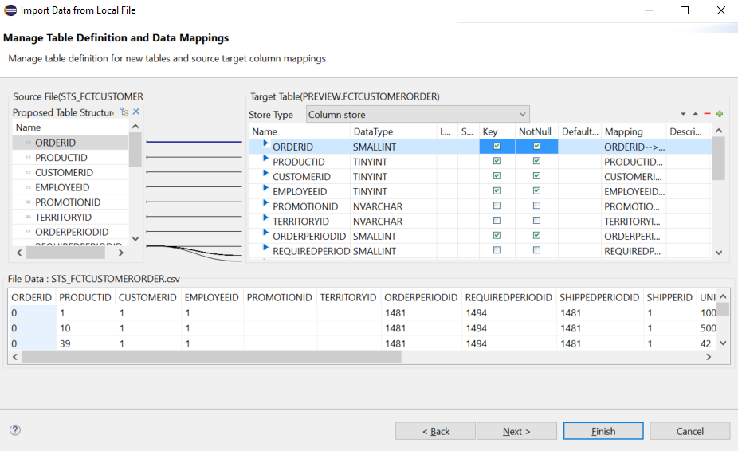
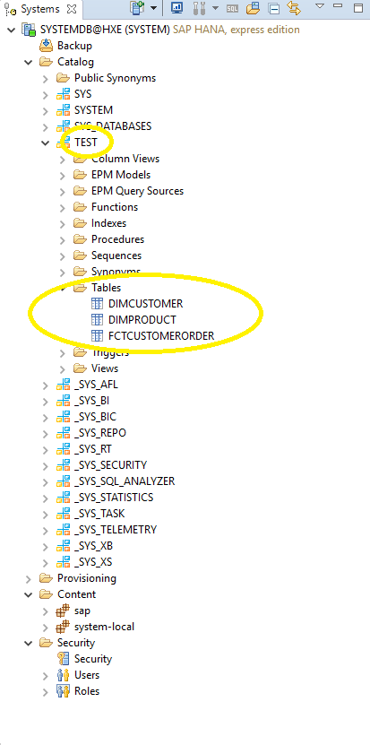

## Prerequisites  
 - **How To's:** [Install the HANA Eclipse plugin](http://www.sap.com/developer/how-tos/2016/09/hxe-howto-eclipse.html)
 - **Files:** Download the `.csv` files from the SAP HANA Academy GitHub page: https://github.com/saphanaacademy/HXE/tree/master/STS.


## Next Steps
 - [Sample Project Level 1 Part II - Packages and Connecting, Editing, and Previewing Data](https://www.sap.com/developer/tutorials/hxe-ua-dbbasics-level1-pt2.html)

## Details
### You will learn  
How to use SAP HANA Studio load data onto your SAP HANA 2.0, express edition installation and create the proper user and schema in preparation of previewing that data.

### Time to Complete
**5 Min**

---
IN SAP HANA Studio, do the following:


[ACCORDION-BEGIN [Step 1: ](Create a New User)]

1. Under your _SYSTEM_ user login, expand the **Security** folder.

2. Right-click on **Users** and select **New User**.

    

    The security editor opens.

3. Create the new user and give it the proper permissions.

    1. Give your new user a name.

    2. Give your user a strong password. You may wish to force a password change upon first login.

    3. Under **Granted Roles**, click .

    4. Select **`MODELING`**.

    5. Click **OK**.

    6. Repeat steps 3, 4, and 5 while selecting **`CONTENT_ADMIN`**.

    7. Click Deploy  to create your new user.

    


[DONE]
[ACCORDION-END]


[ACCORDION-BEGIN [Step 2: ](Create a Schema)]

1. Under the _Systems_ panel, right-click on your _SYSTEM_ login and select **Open SQL console**.

2. Create your new schema.

    ```bash
    CREATE SCHEMA <schema_name>
    ```

    Click Execute .

3. Grant rights and permissions for your new user to work on your new schema.

    ```bash
    GRANT SELECT on SCHEMA <schema_name> to <new_user>
    ```

    Example:

    ```
    GRANT SELECT on SCHEMA TEST to PREVIEW
    ```

    ```bash
    GRANT SELECT, CREATE ANY on SCHEMA <schema_name> to <new_user>
    ```

    Example:

    ```
    GRANT SELECT, CREATE ANY on SCHEMA TEST to PREVIEW
    ```

    ```bash
    GRANT SELECT, INSERT, UPDATE, DELETE, EXECUTE ON SCHEMA <schema_name> to _SYS_REPO WITH GRANT OPTION
    ```

    Example:

    ```
    GRANT SELECT, INSERT, UPDATE, DELETE, EXECUTE ON SCHEMA TEST to _SYS_REPO WITH GRANT OPTION
    ```

    Click Execute  for each line.

[DONE]
[ACCORDION-END]

[ACCORDION-BEGIN [Step 3: ](Load Table Data)]

1. Import the `STS_FCTCUSTOMERORDER.csv` file.

    1. On the **SAP HANA Studio** window, click _File_ then _Import..._. 

    2. Select _SAP HANA Content_ then _Data from local file_.

    3.  Select your _SYSTEM_ repository and click **Next**.

    4. Browse for and select the `STS_FCTCUSTOMERORDER.csv` file. Click **Open**.

    5. Select **Header row exists**.

    6. Select **New Schema** and choose the schema you created earlier in this series.

        > Note:
        > Be sure to select your new schema and not the user you create to ensure that the data is in the proper location.

    7. Give your table a name and click **Next**.

2. Choose the Data Types for the table. Select **Key** for `ORDERID`, `PRODUCTID`, `CUSTOMERID`, `EMPLOYEEID`, and `ORDERPERIODID`. Click **Next** to see a preview of your table, otherwise click **Finish** to complete the upload.

    

3. Repeat steps 1 and 2 to import the remaining two `.csv` files.

    For `STS_DIMPRODUCT.csv`, select **Key** for `PRODUCTID`. For `STS_DIMCUSTOMER.csv`, select **Key** for `CUSTOMERID`.

4. Refresh your schema.

    

You should see your new tables under the _Tables_ folder under your schema.

[DONE]
[ACCORDION-END]


## Next Steps
- [Sample Project Level 1 Part II - Packages and Connecting, Editing, and Previewing Data](https://www.sap.com/developer/tutorials/hxe-ua-dbbasics-level1-pt2.html)
