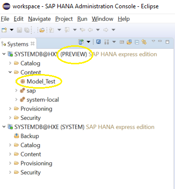
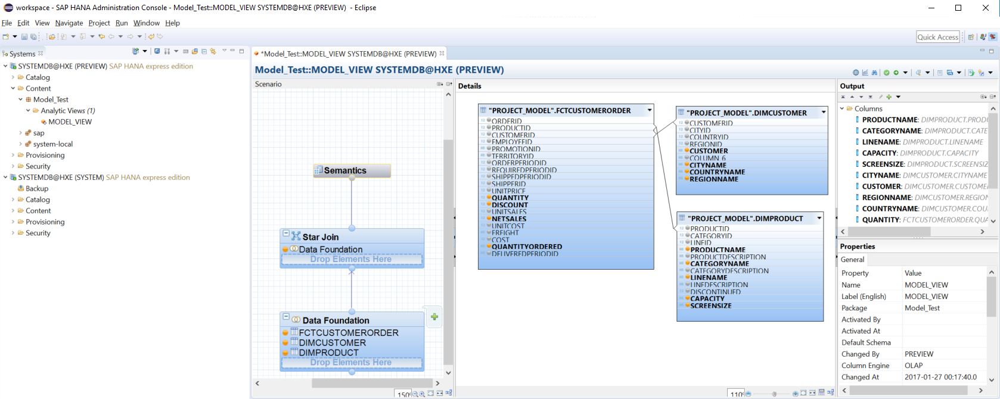
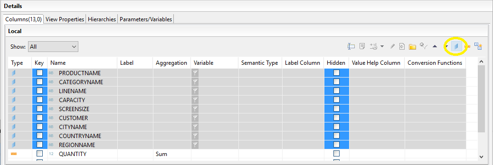
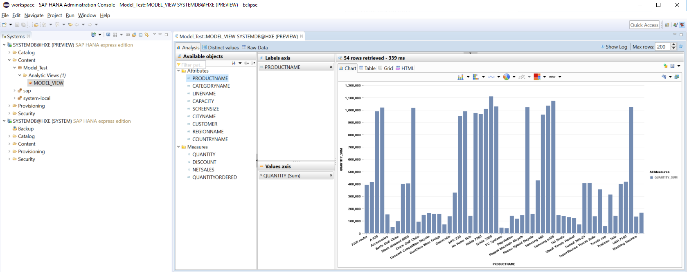

## Prerequisites  
 - **Tutorials:** [Sample Project Level 1 Part I - User, Schema, and `.csv` Data](https://www.sap.com/developer/tutorials/hxe-ua-dbbasics-level1-pt1.html)

## Next Steps

- Select a tutorial from the [Tutorial Navigator](http://www.sap.com/developer/tutorial-navigator.html) or the [Tutorial Catalog](http://www.sap.com/developer/tutorials.html)

## Details
### You will learn  
How to create a package, load data to that package, and preview that data.

### Time to Complete
**10 Min**

---

[ACCORDION-BEGIN [Step 1: ](Create a New Package)]

1. Log into SAP HANA Studio as your new user.

    1. Right-click on your current system.

    2. Select **Add System with Different User...**.

    3. Enter your new user name and the appropriate password.

    > Note:
    > If prompted, change your new user's password.

2. Under the _Systems_ tab, right-click on **Content**.

3. Select **New** then **Package...**.

4. Enter a name for the package. Click **OK**.

The new package will appear under your _Content_ folder under your new user login.

[DONE]
[ACCORDION-END]

[ACCORDION-BEGIN [Step 2: ](Load and Connect Data)]

1. Right click on the package you created earlier and select **New** then **Analytic View...**.

2. Give your new _Information View_ a name.

    A new viewing window opens and a folder is added under your package.

3. Select **Data Foundation** and click _Add Objects_ .

4. Under _Type the object name to search for_, add the `FCTCUSTORDERS`, `DIMPRODUCT`, and `DIMCUSTOMER` tables you created in the previous tutorial.

5. Under the **Details** window panel, link the related information between the tables.

    Connect _PRODUCTID_ under **`"<schema_name>".DIMPRODUCT`** to _PRODUCTID_ under **`"<schema_name>".FCTCUSTOMORDERS`** by clicking the phrase, holding, and dragging your mouse. Repeat this and connect _CUSTOMERID_ under **`"<schema_name>".DIMCUSTOMER`** to _CUSTOMERID_ under **`"<schema_name>".FCTCUSTOMORDERS`**.

    > Note:
    > You can move the individual tables to better view your information.

6. Add output columns.

    1. Under **`"<schema_name>".DIMPRODUCT`**, hold the `Ctrl` button and select `PRODUCTNAME`, `CATEGORYNAME`, `LINENAME`, `CAPACITY`, and `SCREENSIZE`.

    2. Right-click on one of the selected elements and click **Add To Output**.

    3. Repeat previous steps for **`"<schema_name>".DIMCUSTOMER`** and select `CUSTOMER`, `CITYNAME`, `COUNTRYNAME`, and `REGIONNAME`.

    4. Repeat previous steps for **`"<schema_name>".FCTCUSTOMORDERS`** and select `QUANTITY`, `DISCOUNT`, `NETSALES`, and `QUANITYORDERED`.

Here is an example: 

[DONE]
[ACCORDION-END]

[ACCORDION-BEGIN [Step 3: ](Edit Semantics)]

1. Select **Semantics** under the _Scenario_ panel.

    > Note:
    > Make sure the __Show__ menu pulldown is set to _All_ otherwise you may not see your information.

2. Label _Attributes_ columns.

    1. Highlight the following columns: `PRODUCTNAME`, `CATEGORYNAME`, `LINENAME`, `CAPACITY`, `SCREENSIZE`, `CUSTOMER`, `CITYNAME`, `COUNTRYNAME`, and `REGIONNAME`.

    2. Click _Mark as Attribute_ .

    

3. Label _Measure_ columns.

    1. Highlight the following columns: `QUANTITY`, `DISCOUNT`, `NETSALES`, and `QUANTITYORDERED`.

    2. Click _Mark as Measure_ .

    

4. Adjust your data as necessary.

    - Under the _Label_ column, you can provide new names for your columns.

    - You can also hide any columns by selecting its **Hidden** column box.

5. Click _Save and Validate_  to save and check your changes.

    An entry will be added to the **Job Log** window panel.

    > Note:
    > The system may return the status _Completed with warnings_. This is expected and the system should still run successfully.

6. Click _Save and Activate_  to deploy the scenario.

    An entry will be added to the **Job Log** window panel.

[DONE]
[ACCORDION-END]

[ACCORDION-BEGIN [Step 4: ](Preview Data)]

1. Refresh your package's _Analytic View_ folder.

2. Double-click the Analytic View file you created earlier.

3. Preview your data. Right-click on your Analytic View file and select **Data Preview**.

You can now preview your data by dragging _Attributes_ to the **Label axis** panel and _Measures_ to the **Values axis** window panel.

Here is an example: 

[DONE]
[ACCORDION-END]

## Next Steps
- Select another SAP HANA 2.0, express edition tutorial from the [Tutorial Navigator](http://www.sap.com/developer/topics/sap-hana-express.tutorials.html)
