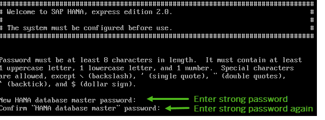

<!-- loio6b3090fbfef64012a05475a833a7e77a -->

## Prerequisites
 - **Proficiency:** Beginner
 - **Tutorials:** 

## Details
### You will learn
You'll learn how to start the server. At the end of this tutorial you'll be ready to test your installation, and install optional components.

### Time to Complete
15 min

---

> Note:
> This tutorial is available as a [video](https://www.sap.com/assetdetail/2016/09/d2900513-8a7c-0010-82c7-eda71af511fa.html).
> 
> 

> Note:
> This is an on-premise installation tutorial. Other installation methods are available. See [https://www.sap.com/developer/topics/sap-hana-express.html](https://www.sap.com/developer/topics/sap-hana-express.html).
> 
> 

[ACCORDION-BEGIN [Step 1: ](Note the VM IP address.)]

The IP address of the VM is displayed on the login screen. Make a note of the IP address, since you'll need it in future steps.

> Note:
> If the IP address and other information in this image does not show, wait few seconds and press `Enter`. If the IP address still doesn't show, check and correct the network setting on your hypervisor then restart your VM.
> 
> 

[ACCORDION-END]

[ACCORDION-BEGIN [Step 2: ](Log in.)]

At the *`hxehost` login* prompt, enter `hxeadm`.

For *Password*, enter the temporary password `HXEHana1`.

When prompted for *(current) UNIX password*, enter the temporary password again: `HXEHana1`

[ACCORDION-END]

[ACCORDION-BEGIN [Step 3: ](Enter new password.)]

When prompted for *New password*, enter a strong password with at least 8 characters. If your password is not strong enough, the system logs you off and you must log in again.

> Note:
> SAP HANA, express edition requires a `very strong password` that complies with these rules:
> 
> -   At least 8 characters
> -   At least 1 uppercase letter
> -   At least 1 lowercase letter
> -   At least 1 number
> -   Can contain special characters, but not backtick, `$` (dollar sign), `\` (backslash), `'` (single quote), or `"` (double quotes)
> -   Cannot contain dictionary words
> -   Cannot contain simplistic or systematic values, like strings in ascending or descending numerical or alphabetical order
> 
> 

Strong password example: `E15342GcbaFd`. Do not use this password example, since it is public and not secure. This example is for illustrative purposes only and must not be used on your system. Define your own strong password.

[ACCORDION-END]

[ACCORDION-BEGIN [Step 4: ](Retype new password.)]

When prompted to *Retype new password*, enter your strong password again.

[ACCORDION-END]

[ACCORDION-BEGIN [Step 5: ](Enter new HANA database master password.)]

When prompted for *New HANA database master password*, enter a strong password. Make a note of this password, since you'll need it later. You can enter the same password you used in step 3, or a new password. If you are entering a new password, see the password rules in step 3.

Entering the HANA database master password changes the SYSTEM user password. If you are installing the `server + applications virtual machine`, it also changes the `XSA_ADMIN` and `XSA_DEV` user passwords.

[ACCORDION-END]

[ACCORDION-BEGIN [Step 6: ](Confirm HANA database master password.)]

When prompted to *Confirm "HANA database master password"*, enter the strong password again.

[ACCORDION-END]

[ACCORDION-BEGIN [Step 7: ](Enter proxy settings.)]

When prompted *Do you need to use the proxy server to access the internet?* enter Y or N.

-   Contact your IT administrator for your company's proxy settings. If you are inside a corporate firewall, you might use a proxy for connecting to http and https servers.

-   If `Y`, enter your proxy host name, proxy port number, and (if desired) a comma-separated list of hosts that do not need a proxy. Proxy host name needs a fully qualified domain name.
-   Make sure the Non Proxy Host list includes `localhost`, `hxehost`, and `hxehost.localdomain`.

[ACCORDION-END]

[ACCORDION-BEGIN [Step 8: ](Wait for XSA configuration.)]

Decide whether you want to wait for XSA configuration to complete before starting the server. When prompted to *Wait for XSA configuration to finish*, enter *Y* if you want to wait.

Enter *N* if you want XSA to configure in the background after server configuration completes.

[ACCORDION-END]

[ACCORDION-BEGIN [Step 9: ](Complete the installation.)]

When prompted to *Proceed with configuration?* enter `Y`.

Wait for the success message *Congratulations! SAP HANA, express edition 2.0 is configured.*

SAP HANA 2.0, express edition is now running.

[ACCORDION-END]

