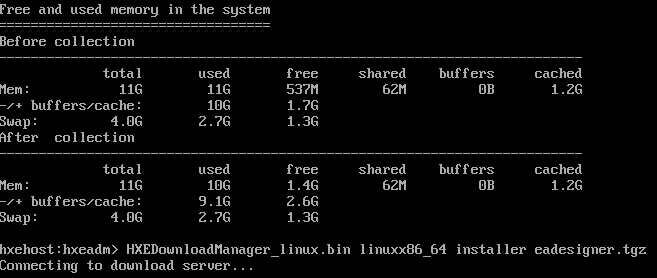
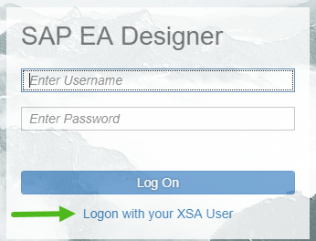

<!-- loio8f68fc9f49774010a5d438fea258f61f -->

## Prerequisites
 - **Proficiency:** Beginner
 - **Tutorials:**  You have completed [Start SAP HANA, express edition Server](http://www.sap.com/developer/tutorials/hxe-ua-getting-started-vm.html)  
You edited your laptop's hosts file.


## Details
### You will learn
You will learn how to download, install, and configure the `eadesigner.tgz` SAP EA Designer package.

### Time to Complete
15 min

---

SAP EA Designer lets you capture, analyze, and present your organization's landscapes, strategies, requirements, processes, data, and other artifacts in a shared environment. Using industry-standard notations and techniques, organizations can leverage rich metadata and use models and diagrams to drive understanding and promote shared outcomes in creating innovative systems, information sets, and processes to support goals and capabilities.

SAP EA Designer is a separate download in the Download Manager.

In this procedure you'll download the SAP EA Designer package (`eadesigner.tgz`) using the built-in Download Manager (Console Mode), extract the package, and run the installation script.

> Note:
> Use the server's built-in Download Manager (Console Mode) for Linux to download `eadesigner.tgz`. When logged-in as `hxeadm`, you can access the download manager (`HXEDownloadManager_linux.bin`) in directory `/usr/sap/HXE/home/bin`.
> 
> 

[ACCORDION-BEGIN [Step 1: ](Run the memory management script.)]

The `hxe_gc` memory management script frees up available VM memory.

-   In your VM, log in as `hxeadm` and enter:

    ```bash
    cd /usr/sap/HXE/home/bin
    ```

-   Execute:

    ```bash
    
    hxe_gc.sh
    ```

-   When prompted for `System database user (SYSTEM) password`, enter the `New HANA database master password` you specified during SAP HANA, express edition installation.


The cleanup process runs. The command prompt returns when the cleanup process is finished.

[ACCORDION-END]

[ACCORDION-BEGIN [Step 2: ](Download `eadesigner.tgz` using the built-in Download Manager.)]

In your VM, from the same directory where you ran `hxe_gc` (`/usr/sap/HXE/home/bin`), enter:

```bash
HXEDownloadManager_linux.bin linuxx86_64 vm eadesigner.tgz
```



[ACCORDION-END]

[ACCORDION-BEGIN [Step 3: ](Navigate to the `Downloads` directory.)]

In your VM, enter:

```bash
cd /usr/sap/HXE/home/Downloads
```

[ACCORDION-END]

[ACCORDION-BEGIN [Step 4: ](View the contents of the `Downloads` directory to confirm `eadesigner.tgz` exists.)]

In your VM, enter:

```bash
ls
```

[ACCORDION-END]

[ACCORDION-BEGIN [Step 5: ](Extract the file.)]

In your VM, enter:

```bash
tar -xvzf eadesigner.tgz
```


[ACCORDION-END]

[ACCORDION-BEGIN [Step 6: ](Navigate to the `HANA_EXPRESS_20` directory.)]

In your VM, enter:

```bash
cd HANA_EXPRESS_20
```

[ACCORDION-END]

[ACCORDION-BEGIN [Step 7: ](Run the installation script.)]

In your VM, enter:

```bash
sh ./install_eadesigner.sh
```

Installation begins.

[ACCORDION-END]

[ACCORDION-BEGIN [Step 8: ](Follow the installation prompts.)]

-   When prompted for `HANA instance number [90]` press `Enter` to accept the default.

-   When prompted for `System database user (SYSTEM) password`, enter the `hxeadm` login password.

-   When prompted for `XSA administrator (XSA_ADMIN) password`, enter the `HANA database master password` you specified when you installed SAP HANA 2.0, express edition.


[ACCORDION-END]

[ACCORDION-BEGIN [Step 9: ](Complete the installation.)]

When prompted to `Proceed with installation`, enter `Y`. Wait for installation to finish.

A success message displays when installation completes.


[ACCORDION-END]

[ACCORDION-BEGIN [Step 10: ](Confirm the status of SAP EA Designer.)]

In your VM, enter:

```bash
xs apps
```

The output will include all the applications of your organization and space. You should see:

-   `eadesigner` - The SAP EA Designer application
-   `eadesigner-service` - The SAP EA Designer Node application
-   `eadesigner-backend` - The SAP EA Designer Java application
-   `eadesigner-db` - The SAP EA Designer database creation application. This application will have a state of `STOPPED` when the installation is complete.


[ACCORDION-END]

[ACCORDION-BEGIN [Step 11: ](Log in.)]

-   Note the URL for `eadesigner`.

-   Launch a web browser on your laptop and enter the URL in your web browser address bar. The SAP EA Designer login page displays.

    

-   Click *Login with your XSA User* on this logon page.

-   Enter `XSA_ADMIN` user and password. You are logged in as administrator of SAP EA Designer.

    


[ACCORDION-END]


