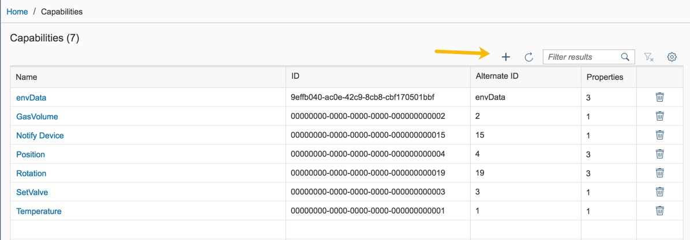
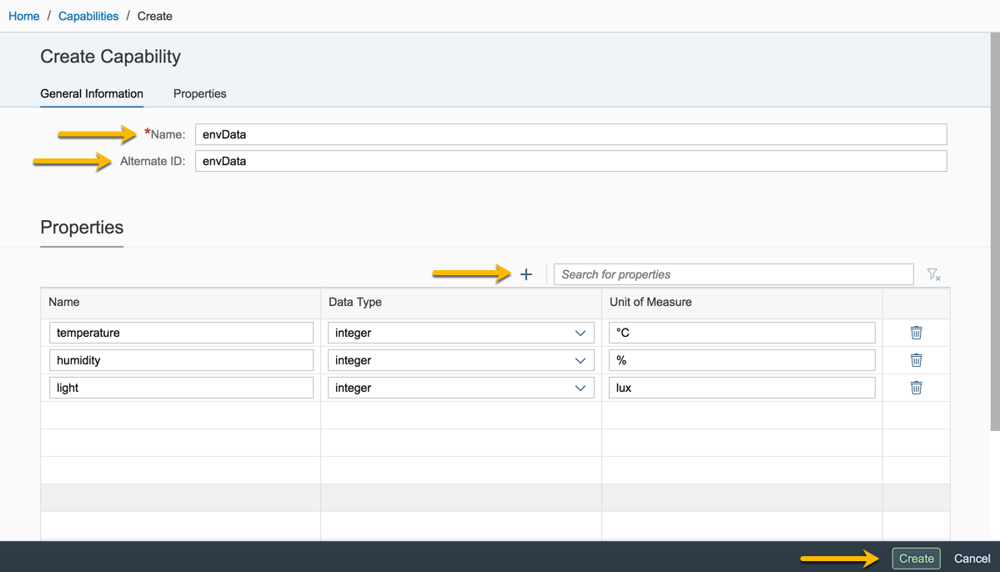
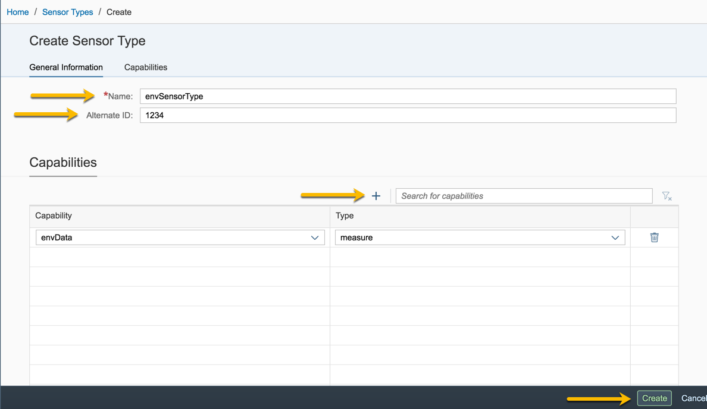
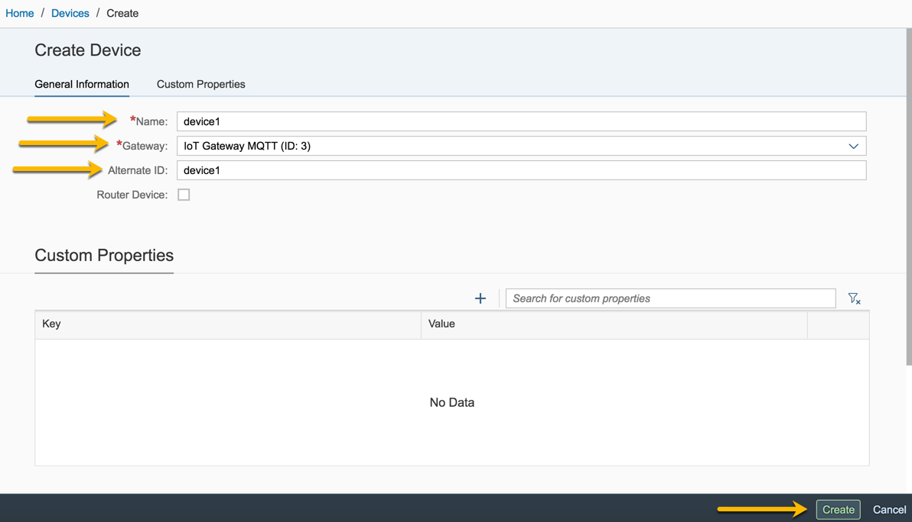
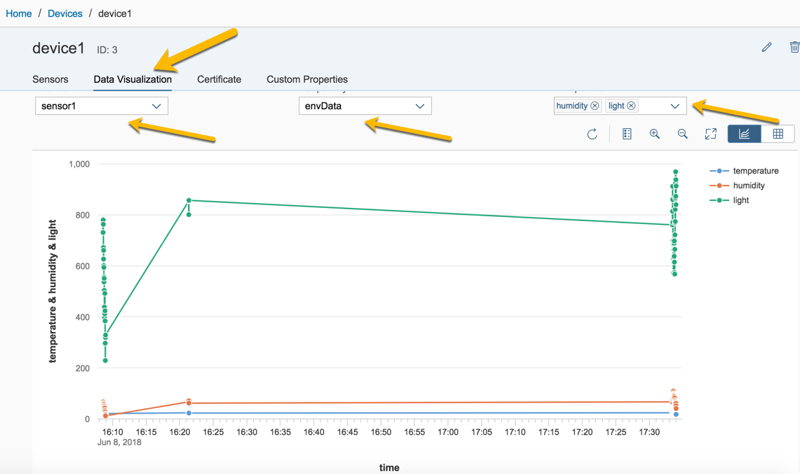

## Prerequisites  
- **Proficiency:** Beginner
- **Tutorials:** [Tutorial: Buy Leonardo IoT Foundation in the Store]
- **Configuration:**
1. You should have followed this guide [Enabling the Internet of Things Service for the Cloud
  Foundry Environment](https://help.sap.com/doc/7806fb7e4de04b0089e93781f10527c4/Cloud/en-US/iot.enabling.service.pdf)
2. You should have created a tenant and a user to work in for yourself based on the instance owner credentials from the previous step and this guide [Creating User and Tenant](https://help.sap.com/viewer/78ac6b240a97447986e09b991d8a570a/Cloud/en-US)
2. If you want your data to feed into the Thing Model (aka Digital Twin) then you should have sent an email to `sapiotappenablement@sap.com` to ask for your SAP Cloud Platform IoT Service instance to be hooked up to your SAP IoT Application Enablement subscription and have received a confirmation. Please make sure you check out the subsequent tutorials in this case.

## Details
### You will learn
- How to create a Device Model
- How to ingest simulated data using a Node.js script
- How to ingest data using SAP Leonardo IoT Foundation Starter Kit


### Time to Complete
**15 Min**

## Next Steps
[Tutorial: Configure Device Hardware] or you can skip to [Tutorial: Create a Thing Model to bind your Digital Twin in a business context] if you do not have the time or do now want to use real hardware at this point

---

[ACCORDION-BEGIN [Step 1: ](Login to your IoT service instance)]

  1. Go to `https://<INSTANCE-NAME>.eu10.cp.iot.sap/iot/cockpit/#/welcome` (replace `<INSTANCE-NAME>` with your own, it looks like this for example: https://76eae3d3-9de6-4345-b26c-ff35be052652.eu10.cp.iot.sap/). You can refer back to above mentioned configuration guide to find it.
  2. Login with your user name and password (in the cloud cockpit you can find the root user credentials in the cloud foundry space in the service key area of the service instance)

[ACCORDION-END]


[ACCORDION-BEGIN [Step 2: ](Create a new capability)]

  1. On the left side menu expand the **Device Management** group
  2. Click on **Capabilities** menu item
  3. From the `+` button found on top of the right side **Capabilities List** you may create a new one
  4. Set the name for the new Capability as : `envData`
  5. Type the `AlternateID` exactly the same : `envData`
  6. Add records to the `Properties List` using the `+` button (near the Search field on its left side)
  7. Add property with name `temperature`, type `integer` and unit of measure `°C`
  8. Add property with name `humidity`, type `integer` and unit of measure `%`
  9. Add property with name `light`, type `integer` and unit of measure `lux`
  10. Click the `Create` button (bottom-right of the page, on the grey stripe)





[ACCORDION-END]


[ACCORDION-BEGIN [Step 3: ](Create a new sensor type)]

You need to define a Sensor Type to assign Sensors on devices later

  1. On the left side menu expand the **Device Management** menu group
  2. Click on **Sensor Types** menu item
  3. From the `+` button found on top of the right side **Sensor Types List** you may create a new one
  4. Type the name as : `envSensorType`
  5. Type in an integer number between 0 and 2147483647 in the **Alternate ID** field
  6. Add in the **Sensor Type** List the `envData` capability with Type `measure`
  7. Click the **Create** button (bottom-right of the page, on the grey stripe)




[ACCORDION-END]


[ACCORDION-BEGIN [Step 4: ](Create a new MQTT device)]

You will create a new device with a sensor using the already defined **Sensor Type** and **Capability** described in previous steps.

  1. On the left side menu expand the **Device Management** menu group
  2. Click on **Devices** menu item
  3. From the `+` button found on top of the right side **Devices List** you may create a new one
  4. Write the device name `device1` in the Name field
  5. Select the **MQTT Gateway**
  6. Write `device1` as an Alternate ID
  7. Click the **Create** button (bottom-right of the page, on the grey stripe)
  8. After the Device is created you must Add a new Sensor with the type `envSensorType`





Your device has a sensor now. Check the Sensor Alternate ID that was auto generated in the Sensor List.

[ACCORDION-END]

[ACCORDION-BEGIN [Step 5: ](Download PEM certificate for device)]

You will download the certificate. Be sure you write down the secret password from the pop-up window.

  1. Navigate to the newly created device using the **Devices List** (see Step 4 if you need more details)
  2. Click on the **Certificate** tab page
  3. Click on the **Generate Certificate** button
  4. Choose Certificate Type : `pem`
  5. Click the **Generate** button found on the pop-up window
  6. Copy/Paste and persist the secret displayed on screen and the certificate file that was downloaded in the background (check your browser default folder for Downloads or your browser Downloads section to see the file)

  note > Do not forget to back-up the certificate and secret password. You can email the Certificate and the Secret password to yourself in case you'll need it to access the device

  note > You can always generate a new certificate. The old one will remain valid.


[ACCORDION-END]


[ACCORDION-BEGIN [Step 6: ](Send simulated data to device via MQTT)]

You'll need to have installed Node.js on your machine or on the SAP IoT Foundation Hardware Kit to continue.

You will learn to Ingest Simulated Data using MQTT using Node.js and the device certificate.
If you have the hardware kit than replace lines 195-199 with the actual reading for the values

  1. Create a new folder named `node-mqtt-simulator`
  2. Create and save a new file in the new folder, file with name `package.json` and copy/paste the following code :

```javascript
{
  "name": "data-ingestion-iot-services",
  "version": "1.0.0",
  "description": "",
  "main": "index.js",
  "scripts": {
    "start": "node app.js",
    "test": "echo \"Error: no test specified\" && exit 1"
  },
  "author": "",
  "license": "ISC",
  "dependencies": {
    "mqtt": "^2.15.2",
    "random-js": "^1.0.8"
  }
}
```

Lastly create and save a new file called `app.js` in the new folder and copy/paste the following code :

```javascript
const mqtt = require('mqtt')
var fs = require("fs");
var random = require('random-js')();

const deviceAlternateId = "device1";
const sensorAltenateId = "check_your_sensor_alternate_id_because_it_is_autogenerated";
const capabilityAlternateId = "envData";

const certFile = "./certificates/device1-device_certificate.pem";
const secretPasswordFile = "./certificates/device1-device_password.txt";

var connectOptions = {
    keepalive: 10,
    clientId: deviceAlternateId,
    clean: true,
    reconnectPeriod: 2000,
    connectTimeout: 2000,
    cert: fs.readFileSync(certFile),
    key: fs.readFileSync(certFile),
    passphrase: fs.readFileSync(secretPasswordFile).toString(),
    rejectUnauthorized: false
};

var mqttClient = mqtt.connect("mqtts://76eae3d3-9de6-4345-b26c-ff35be052652.eu10.cp.iot.sap:8883", connectOptions);

mqttClient.on('connect', function() {

	console.log("mqttClient connect");
});

mqttClient.on("error", function(err) {
	console.log("mqttClient ERROR : ");
	console.log(err);
});

mqttClient.on('offline', function() {
    console.log("mqttClient offline");
});

mqttClient.on('reconnect', function() {
    console.log("mqttClient reconnect");
});

mqttClient.on('close', function(){
	console.log("mqttClient close");
});

var refTemperature = 25;
var refHumidity = 70;
var refLight = 800;

var lastTemperature = refTemperature;
var lastHumidity = refHumidity;
var lastLight = refLight;

function generateDataAndSendViaMQTT() {

    console.log(new Date().toISOString(), "Creating random data...");

    var data = {
        temperature : random.integer(lastTemperature - 1, lastTemperature + 1),
        humidity : random.integer(lastHumidity - 10, lastHumidity + 10),
        light : random.integer(lastLight - 100, lastLight + 100)
    }

    sendValuesToSCPIoTService(data);

    lastTemperature = data.temperature;
    lastHumidity = data.humidity;
    lastLight = data.light;
}

function sendValuesToSCPIoTService(data){

    var pushData = {
        "sensorAlternateId" : sensorAltenateId,
        "capabilityAlternateId" : capabilityAlternateId,
        "measures" : [
            data.temperature.toString(),
            data.humidity.toString(),
            data.light.toString()
        ]
    }

    var topicName = 'measures/' + deviceAlternateId;

    mqttClient.publish(topicName, JSON.stringify(pushData), [], function(err){
        if(!err){
            console.log("MQQT client pushed data : ", pushData);
        }
        else{
            console.log("MQQT client error :");
            console.log(pushData);
            console.log(err);
        }
    });

}

setInterval(generateDataAndSendViaMQTT, 1000);
```

  3. Make sure you change the code in 2 places:
    - Change the `sensorAlternateId` to the one that was generated for you in the device management cockpit
    - Change the endpoint for MQTT to your endpoint (check the URL of the cockpit which you brought up earlier to create the device model)
  4. Go to the command line tool on your computer, change into the directory created before and then run `npm install` to install required modules
  5. Create a subfolder called `certificates`
  6. Download the certificate file and save it in the `certificates` folder with name `device1-device_certificate.pem`
  7. Copy the secret and paste it in a new file, in the same folder as the certificate, with name `device1-device_password.txt`. Make sure you only add the password and no `newline`or `return` character.
  8. Run the app with `npm start` or `node app.js`
  9. Check the console log for errors and additional informations. The console log should look like this :

  

[ACCORDION-END]

[ACCORDION-BEGIN [Step 7: ](Check device ingested data)]

To check the device data you must navigate using the `Device Management`

  1. Click on the the device the `Data Visualisation` section
  2. Select the Sensor, Capability and all Properties
  3. You should see data flowing in the system



[ACCORDION-END]

---
