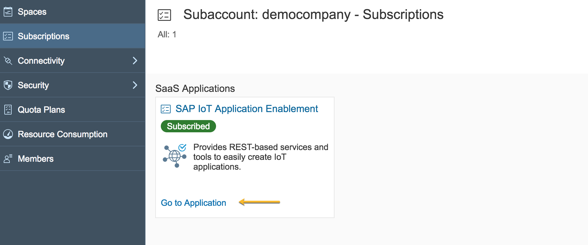
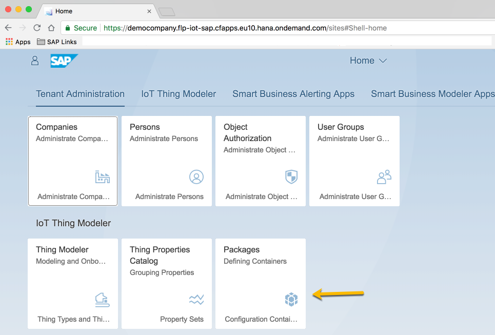
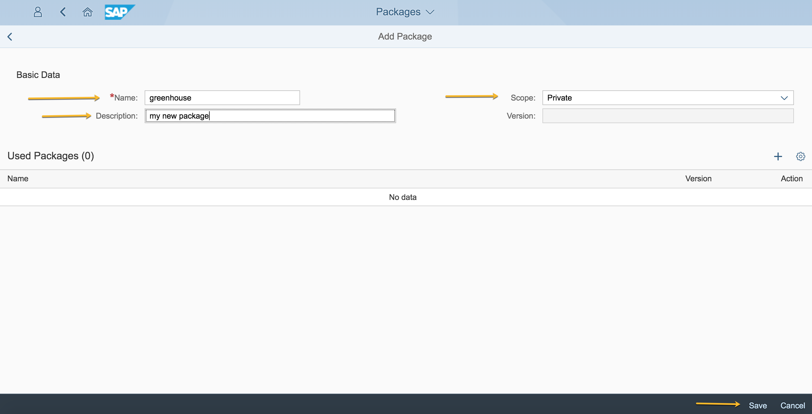
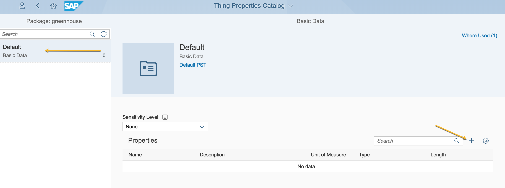
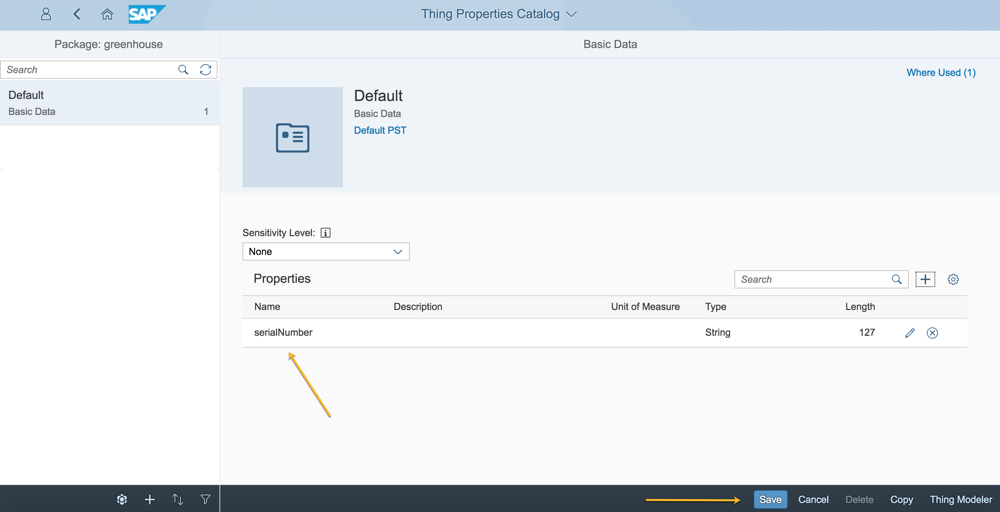
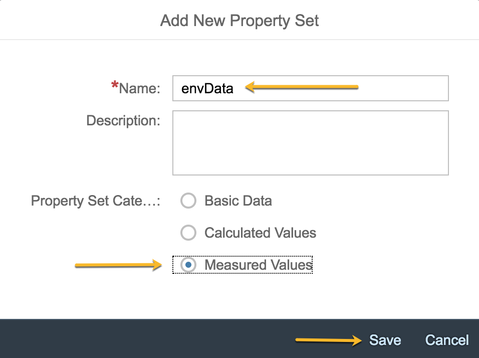
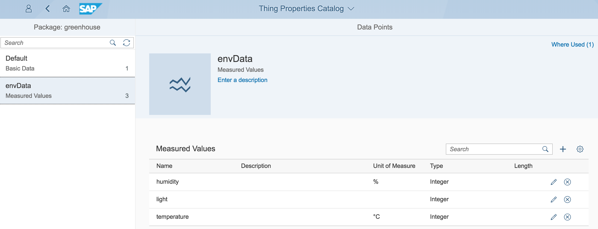
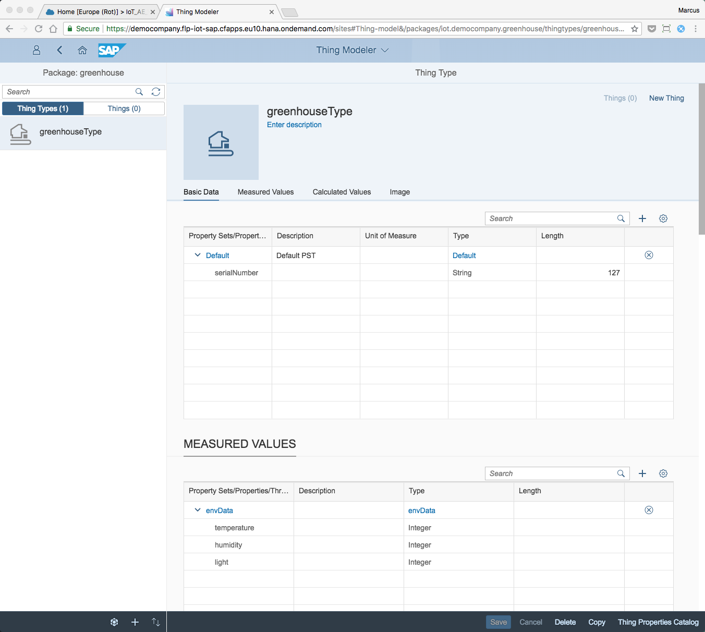

## Prerequisites  
 - **Proficiency:** Beginner
 - **Tutorials:** [Configure Device Hardware](https://www.sap.com/developer/tutorials/iot-express-3-configure-device.html) or at least [Create a Device Model](https://www.sap.com/developer/tutorials/iot-express-2-create-device-model.html)
 - **Configuration** You or someone else, that is an administrator in your global account, has walked through the following end-to-end configuration and onboarding guide: [SAP IoT Application Enablement: Onboarding - Setting up Your Account](https://help.sap.com/viewer/9dfedbe95cbe4a9f9a5ceddbef7f88e5/latest/en-US/c5b72d23880240dcb4b0d7b9523b065a.html).

## Next Steps
- **Tutorials:** [Build an application with the Multi Stack Web IDE](https://www.sap.com/developer/tutorials/iot-express-5-use-webide-template.html)

## Details
### You will learn
- Create new thing packages
- Manage thing properties and thing property sets
- Use thing types
- Add a new thing that is connected to your device
- Secure thing data using access rights

### Time to Complete
**20 Min**

---

[ACCORDION-BEGIN [Step 1: ](Access the Fiori Launchpad with the IoT Application Enablement apps)]

  The Launchpad provides all the tools for creating thing types, properties, things but also persons, companies and KPI's. In this first step you find out how to access it.

  1. Go to SAP Cloud Platform Cockpit Home Page [SAP Cloud Platform](https://account.eu1.hana.ondemand.com/cockpit#/home/allaccounts)
  2. Drill down into the `Global Account` and the Cloud Foundry `Subaccount` where you have configured the subscription to IoT Application Enablement
  5. From the left side menu click on the `Subscriptions` button
  6. Click the `Go to Application` link from the `SAP IoT Application Enablement` tile

  note > Enter the email address used with your SAP Cloud Platform account and the password if you are asked for one.

  

[ACCORDION-END]

[ACCORDION-BEGIN [Step 2: ](Create a package `greenhouse`)]

  As the next step we will create a package. A package allows re-use of thing types and properties within your tenant and across tenants. As we want to put the environment sensor that we have to use in the context of a greenhouse condition monitoring application we call this package greenhouse.

  1. `Go to Application` link from the `SAP IoT Application Enablement` tile (more info in Step 2)
  2. From the `IoT Thing Modeler` section click on the `Packages` tile
  3. Check if no similar package already exists using the top right Search field
  4. To create a new Package click on the `+` button found in the right of the search field
  5. Enter your package name as `greenhouse`. Your may create a namespace like package name using dots. (Eg: `my.first.greenhouse`). Take notice on the Scope selection : mark your package as Private if your do not want to share it's content in the tenant
  6. Click the `Save` button found on the bottom right grey slice of the page

  

  

  

[ACCORDION-END]

[ACCORDION-BEGIN [Step 3: ](Create new property in the `Default` property set)]

 Now that we have a package we can start putting properties reflecting the measurements but also the master data that we need for out `Things`. Lets assume we are producing these green house and for processing warranty claims we use a serial number to track every individual greenhouse.

  1. Go to `Thing Properties Catalog` by clicking on the tile with the same name in the Home Page
  2. Select your `greenhouse` package (using the little package icon at the bottom)
  3. Select `Default` property set from the left side list.
  4. On the right side you'll see the `Properties List`
  5. Click on the `+` button found just on the right of the `Search` field, on top of the list.
  6. Type in the new property name as : `serialNumber`
  7. Select its type as : `String`
  8. Adjust the Length fields value (no chars) to : 64
  9. Click the `Save` button found on the grey bar, bottom-right of the page

  note > If you have sensitive data or personal data (defined as personal by EU GDPR) please mark the property set `Sensitivity Level` as `Personal Data` or `Sensitive Data`

  

  

  

  

[ACCORDION-END]

[ACCORDION-BEGIN [Step 4: ](Create a new property set)]

Now that our green house has a property set to capture the serial number for business process integration lets add next the properties required to capture the measurements/time series of data coming from the environment sensor. Note that we focus on the data we want to use in the business application - the actual physical sensor or its manufacturer does not matter. We could even get the different measurements from different devices across different communication technologies - what matters in the thing model is what you need to know in the applications built on top.

1. Click the `Home` icon button found top-left of your page after the package creation or `Go to Application` link from the `SAP IoT Application Enablement` tile (more info in Step 2)
2. From the `IoT Thing Modeler` section click on the `Thing Properties Catalog` tile. On the left side of the screen you'll see the list of existing `Property Sets` in the selected package that is written on the top of the search field of the list.
4. Select your package from the grey slice of the screen found below the list. Click the package icon button (first one)
5. Search and choose your package by entering `greenhouse` in the search field and click on the search icon or press the `Enter` key from your keyboard
6. Click on the package name to select it. Your left side `Property Sets` list content will refresh and you see the Default property set that is meant for master data and that is created along with the package
7. To create a new property set click on the `+` button found near the package selection button. (second icon on the grey bar, under the property set list)
8. Type in the name of the property set : `envData`
9. Select `Property Set Category` as `Measured Values` (third option)
10. Click `Save` button
11. In the Measured Values list (see Step 4 for details about adding a new property)
12. Add property with name `temperature` with type Integer and unit of measure `DegreeCelsius`, symbol `°C` and choose to have an upper and lower threshold for the temperature
13. Add property with name `humidity`, type Integer and and unit of measure `Percentage`, symbol `%`
14. Add property with name `light`, type Integer and without unit of measure
15. Click `Save` button found on the bottom grey bar, right side of the screen

[ACCORDION-END]

[ACCORDION-BEGIN [Step 5: ](Create a new thing type in your package using the Thing Modeler)]

The last step, to setup our meta-data required to capture things and measurements, is the creation of a Thing Type. A Thing Type brings together multiple property set and adds additional generic properties like location, name, description to allow to understand the full context of the thing.

1. Use the Thing Modeler button in the lower right corner to jump from the Properties Catalog to the Thing Modeller.
2. Use the `+` at the bottom left to add a new thing type and call it `greenhouseType`.
3. Add the 2 property sets you worked on earlier and then save your work - the thing type will then look like this:

[ACCORDION-END]

[ACCORDION-BEGIN [Step 6: ](Create a new thing of the new thing type)]

Now we are ready to create a new thing and map it to the device you have created earlier.

1. Press `New Thing` from the upper right corner to get started
2. In the dialog that pops up choose `greenhouse1` as the name (1 indicating that this is your first instance of this type of greenhouse)
3. Add a description and select the default authorisation group. Note that this authorisation group will be something that later, when you automate onboarding of things and you define differentiated access rights to the time series, will be very specific authorisation groups you have created to make sure the your application users see only the things and time series data for those things, that they should see.
4. Then choose the device and sensors created in the earlier Tutorials

You now should see the properties from the sensor mapped to the properties of the thing as in the following image. Data types are being converted automatically where required. This initial mapping forwards the values as they are from the device to the thing model.

If you have your device running and connected to the Internet you should now see data popping in for the measurements.

[ACCORDION-END]

[ACCORDION-BEGIN [Step 7: ](Set you thing master data properties and location)]

Lastly we will set the things serial number and the location to make sure we can integrate into business processes and to be able to show it on a map.

1. In the Thing Modeler set a value for the property `serialNumber` for the Thing (not for the Thing Type), see below image for where to enter it
2. Use [HTML5 geolocation lookup example](https://www.w3schools.com/Html/tryit.asp?filename=tryhtml5_geolocation) to find your current location or choose any other location using another tool (mobile phone, google maps)
3. Enter the Location in the location fields in the thing modeler (see below image)
4. Enter a lower and upper threshold for the temperature (under Measured Values)
4. Save your change

You are now ready to build interactive or batch applications on top of your greenhouse things.

[ACCORDION-END]
