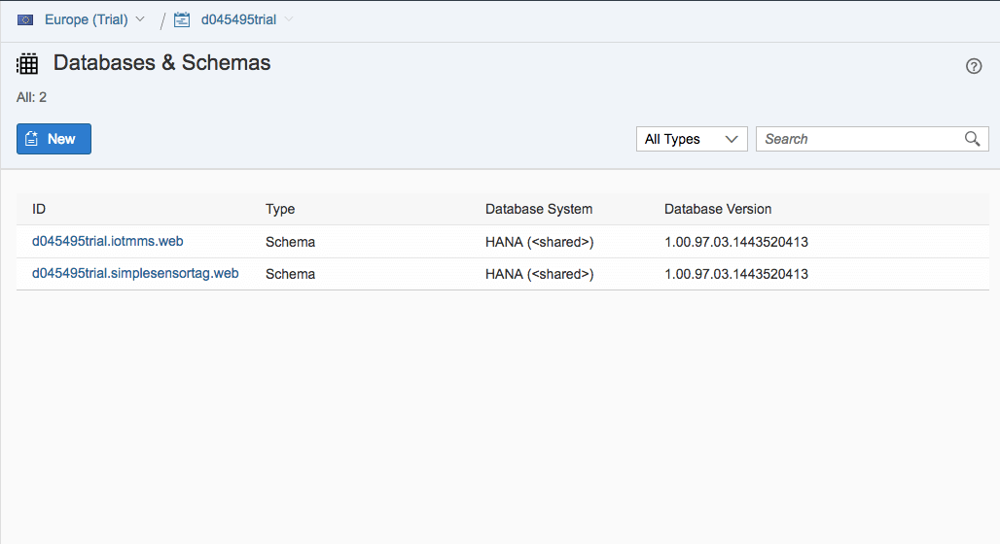
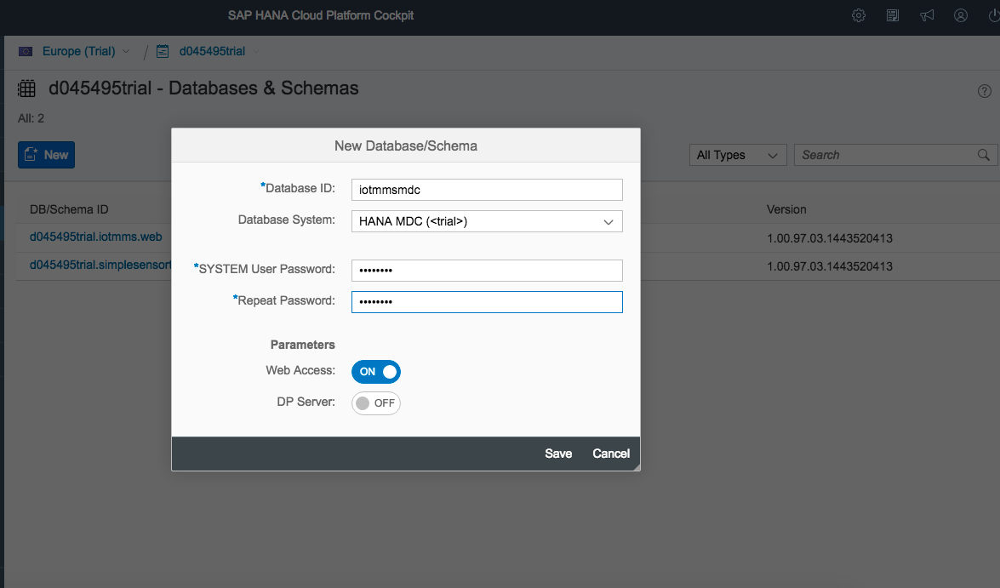
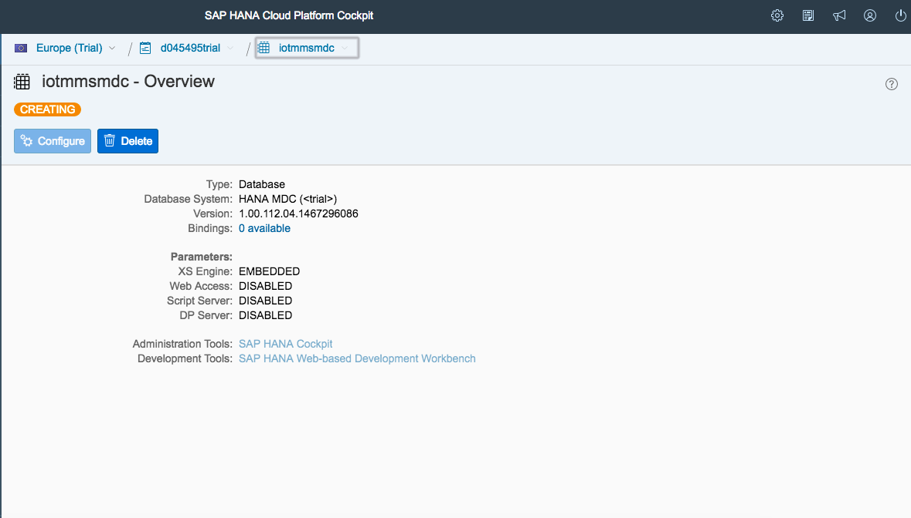
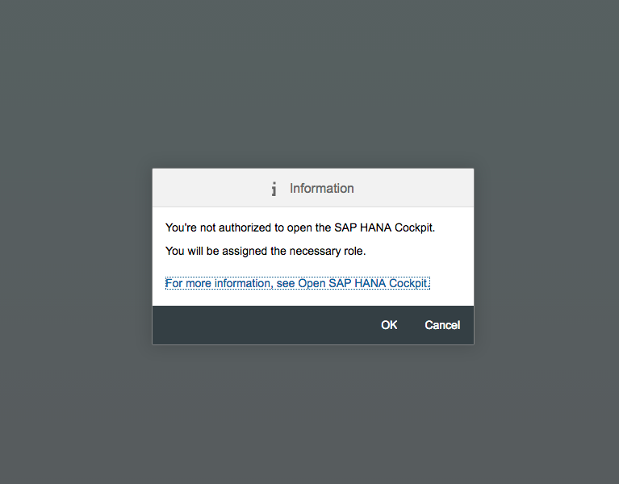
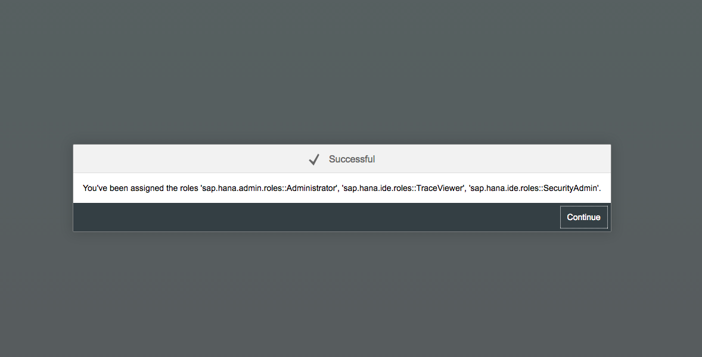
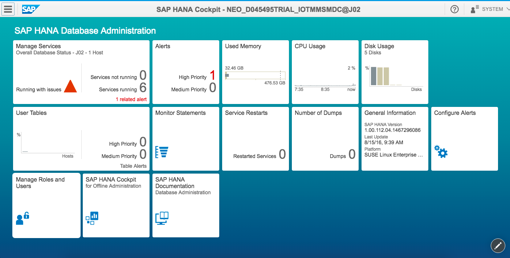
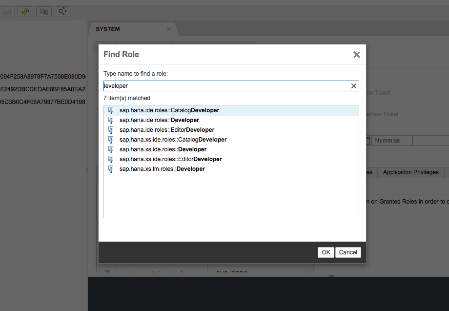
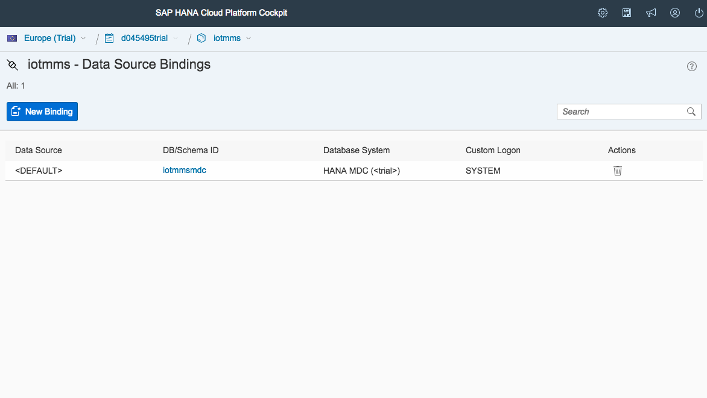

## Prerequisites  
 - **Proficiency:** Beginner
 - **Tutorials:** [Internet of Things (IoT) Viewing your Tessel data from IoT Services](http://go.sap.com/developer/tutorials/iot-part9-hcp-services-viewdata.html)

## Next Steps
 - Select a tutorial from the [Tutorial Navigator](http://go.sap.com/developer/tutorial-navigator.html) or the [Tutorial Catalog](http://go.sap.com/developer/tutorials.html)


## Details
### You will learn  
Now that your IoT Services are collecting data and you were able to view it your deployed Java application, now how about redirecting the data to a shared SAP HANA MDC instance and making a small SAP HANA XSC application to show the data.  


### Time to Complete
**20 Min**.

---

1. To be on the safe side go ahead and stop your `iotmms` Java application.


2. From within the cockpit now choose Databases & Schemas and create a new SAP HANA XS Shared instance. 

    

    

3. Once the instance has fully created you will need to follow a couple of steps to allocate your user the proper authorizations.

	 

4. Now select the "SAP HANA Cockpit" link where you will receive two messages indicating a missing authorization followed by authorizations being granted.

	 
	 
	
5. Now select the "Manage Users and Roles" where you will apply additional authorizations to your user or to a new user.

	 

6. Once you here you will select the "SYSTEM" user or right click on the "SYSTEM" user and choose copy user first. Then under the first tab "Granted Roles" you will select the "+" symbol and search for "developer" then select each role listed and mark "OK" then again search for "admin" and do the same. Basically this gives your user "super user" access to the database. As you are currently the only one with access use it wisely.

	 

7. Now return to your Java applications within the SAP HANA Cloud Platform and choose the `iotmms` application and then the data bindings option. We need to remove the existing `XXXXXXtrial.iotmms.web`. Then create a  new binding to your new HANA XS MDC instance.

	

7. Now stop and restart the Java application.

8. With that finished you should be able to go back to your MDC instance and select the "Catalog" under the menu options along the top of the page and see your tables now listed under "SYSTEM" schema - if not return to the IoT Services and send another test message. ([see tutorial](http://go.sap.com/developer/tutorials/iot-part7-add-device.html)). So provided you received the “200” status in your messages then you should now have data in your tables and can begin working on your XS application.

	 

9. Choose the “SAP HANA Web-based Development Workbench,” now right click on the top level, `Content`, and choose “New Application”. Choose the “Blank Application” option and the “sub package” - `codejam.iotmmsxs`

	 

10. Now you’ll want to create a new file in this new sub package called `iotmmsxs` called `.xsprivileges` (remember the . in the front)

	```
	 	{
		 	"privileges": [
		 		{
					"name":"Basic",
		 			"description":"Basic IoT MMS privilege"
				}  
		  	]
		}
	```

11. Now switch to the catalog view to determine the next values you will need.

    

12. Now check under the `SYSTEM` schema. Under this schema you will find your tables. These are the tables created by the IoT Services for our devices.

13. Your table `T_IOT_1_XXXXXXXXXXXXX` will be the other item you need to make note of for use in a moment. Now back in your other window the “Editor” should still be open and running and there we need to make another new file in our sub package `iotmmsxs`. This file will be called `iotaccess.hdbrole`.

	```
	 role codejam.iotmmsxs::iotaccess {
	 application privilege: codejam.iotmmsxs::Basic;
	 catalog schema "SYSTEM": SELECT;
	}
	```

	This will give a specific user read access to our table. As soon as you save it and it’s successfully activated that is.

14. Now you will need to modify your `.xsaccess` file.

	```
	{
	 "exposed" : true ,
	 "authentication" : [{"method" : "Basic"}],
	 "authorization": ["codejam.iotmmsxs::Basic"]
	}
	```
	Save these changes. At this point go back over to the “Catalog” window and give your user access to the application.

15. Within the “Security” across the top menu just like before with adding the roles to the SYSTEM user you will now add this role to your user as well.

16. Back in the “Editor” it’s time to select your sub package `iotmmsxs` and then add a new file. This will be `iotservice.xsodata`.

	```
	service {
	  "T_IOT_<table_postfix>" key generate local "GEN_ID";
	```

	So this file you can open in your web browser right now and have full access to all of the built in odata functionality.

17. You will use this when modifying the `index.html` file.

	

18. You will replace the existing code with the following, which is quite a bit but should be easily readable and understandable as we are adding a table to a page. This is not the only way to do but that is a matter for you to explore and discover!

	```html
	 <!DOCTYPE HTML>
	 <html>
	 <head>
		 <meta http-equiv="X-UA-Compatible" content="IE=edge" />
		 <meta charset="UTF-8"/>
		 <title>My Sensor Data</title>
		 <script id='sap-ui-bootstrap'
		 	src='/sap/ui5/1/resources/sap-ui-core.js'
		 	data-sap-ui-theme='sap_goldreflection'
		 	data-sap-ui-libs='sap.ui.core,sap.ui.commons,sap.ui.table'></script>
		 <script language="JavaScript">
			 var oModel = new sap.ui.model.odata.ODataModel("/codejam/iotmmsxs/iotservice.xsodata/", false);
			 var arrayHeaders = new Array();
			 	oTable = new sap.ui.table.Table("test",{tableId: "tableID", visibleRowCount: 10});
			 //Bring the table onto the UI
			 oTable.placeAt("sensor_table");
			 //Table Column Definitions
			 var oMeta = oModel.getServiceMetadata();
			 var oControl;
			 for ( var i = 0; i < oMeta.dataServices.schema[0].entityType[0].property.length; i++) {
			 var property = oMeta.dataServices.schema[0].entityType[0].property[i];
			  oControl = new sap.ui.commons.TextField().bindProperty("value",property.name);
			  oTable.addColumn(new sap.ui.table.Column({label:new sap.ui.commons.Label({text: property.name}), template: oControl, sortProperty: property.name, filterProperty: property.name, filterOperator: sap.ui.model.FilterOperator.EQ, flexible: true, width: "125px" }));
			    }
			 oTable.setModel(oModel);
			 var sort1 = new sap.ui.model.Sorter("C_TIMESTAMP");
			 <body>
			oTable.bindRows("/<table name>",sort1);
		 </script>
	 </head>
	  <div id="sensor_table"/>
	 </body>
	 </html>
	```

	


## Next Steps
 - Select a tutorial from the [Tutorial Navigator](http://go.sap.com/developer/tutorial-navigator.html) or the [Tutorial Catalog](http://go.sap.com/developer/tutorials.html)
