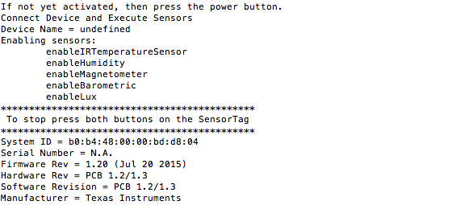

## Prerequisites  
 - **Proficiency:** Beginner
 - **How-To:** [Do this tutorial first](http://go.sap.com/developer/tutorials/hcp-create-trial-account.html)
 - **Tutorials:** [Internet of Things (IoT) Adding a new device to the IoT Services](http://go.sap.com/developer/tutorials/iot-part7-add-device.html)

## Next Steps
 - [Internet of Things (IoT) Viewing your Tessel data from IoT Services](http://go.sap.com/developer/tutorials/iot-part9-hcp-services-viewdata.html)

## Details
### You will learn  
In the previous tutorial you saw how to add your message type, device type and devices to the IoT Services of the SAP HANA Cloud Platform. Now those instructions were based on using a Tessel device however you can just as easily use a different device such as a TI `SensorTag`.

### Time to Complete
**10 Min**.

---

1. You can use the same settings you have for the Tessel or you can repeat the previous tutorial with the TI `SensorTag` in mind.
2. Next create a new Node.js file called `readTags.js`
3. The Code:

	```
	/* 	sensorTag IR Temperature sensor example
	 *  Craig Cmehil, SAP SE (c) 2015
	*/
	
	/* Choose the proper HTTP or HTTPS, HCP requires HTTPS */
	var http = require('https');
	
	var SensorTag = require('sensortag');
	var lv_temp;
	var lv_humid;
	var lv_deviceid = "";
	var DEBUG_VALUE = true;
	var xtimestamp;
	var date = new Date();
	var time = date.getTime ();

	// SAP HANA Cloud Platform connection details
	var portIoT = 443;
	var pathIoT = '/com.sap.iotservices.mms/v1/api/http/data/';
	var hostIoT = 'iotmmsXXXXXXXXXXtrial.hanatrial.ondemand.com';
	var authStrIoT = 'Bearer XXXXXXXXXXXX';
	var deviceId = 'XXXXXX-XXXX-XXXX-XXXX-XXXXXXXXX';
	var messageTypeID = 'XXXXXXXXXXXX';
	
	var options = {
	      host: hostIoT,
		  port: portIoT,
	      path: pathIoT + deviceId,
	      agent: false,
	      headers: {
	         'Authorization': authStrIoT,
	         'Content-Type': 'application/json;charset=utf-8',
			 'Accept': '*/*'
	      },
	      method: 'POST',     
	};
	
	/***************************************************************/
	/* Coding to access TI SensorTag and values of various sensors */
	/***************************************************************/
	
	console.log("If not yet activated, then press the power button.");
	SensorTag.discover(function(tag) {
		tag.on('disconnect', function() {
			console.log('disconnected!');
			process.exit(0);
		});
	
		function connectExecute() {
			console.log('Connect Device and Execute Sensors');
			tag.connectAndSetUp(enableSensors);
		}
	
		function enableSensors() {	
			/* Read device specifics */	
			tag.readDeviceName(function(error, deviceName) {
				console.log('Device Name = ' + deviceName);
			});
			tag.readSystemId(function(error, systemId) {
				console.log('System ID = ' + systemId);
				lv_deviceid = systemId;
			});
			tag.readSerialNumber(function(error, serialNumber) {
				console.log('Serial Number = ' + serialNumber);
			});
			tag.readFirmwareRevision(function(error, firmwareRevision) {
				console.log('Firmware Rev = ' + firmwareRevision);
			});
			tag.readHardwareRevision(function(error, hardwareRevision) {
				console.log('Hardware Rev = ' + hardwareRevision);
			});
			tag.readHardwareRevision(function(error, softwareRevision) {
				console.log('Software Revision = ' + softwareRevision);
			});
			tag.readManufacturerName(function(error, manufacturerName) {
				console.log('Manufacturer = ' + manufacturerName);
			});
			/* Enable Sensors */
			console.log("Enabling sensors:");
			console.log('\tenableIRTemperatureSensor');
			tag.enableIrTemperature(notifyMe);
			console.log('\tenableHumidity');
			tag.enableHumidity(notifyMe);
			console.log("*********************************************");
			console.log(" To stop press both buttons on the SensorTag ");
			console.log("*********************************************");
		}
	
		function notifyMe() {
			tag.notifySimpleKey(listenForButton);
			setImmediate(function loop () {
				tag.readIrTemperature(function(error, objectTemperature, ambientTemperature){
	        		lv_obj = objectTemperature.toFixed(1);
	        		lv_ambient = ambientTemperature.toFixed(1);
	      		});
				tag.readHumidity(function(error, temperature, humidity) {
					lv_temp = temperature.toFixed(1);
					lv_humid = humidity.toFixed(1);
				});
				if(DEBUG_VALUE)
					console.log("Sending Data: " + lv_deviceid + " " + lv_temp + " " + lv_humid);
				setSensorData(lv_temp, lv_humid);
				setTimeout(loop, 10000);
			});
	    }
	
		function listenForButton() {
			tag.on('simpleKeyChange', function(left, right) {
				if (left && right) {
					tag.disconnect();
				}
		   });
		}
		
		connectExecute();
	});
	
	/******************************************************************/
	/* FUNCTION to get Temperature from the Sensor & update into HANA */
	/******************************************************************/
	function setSensorData(lv_temp,lv_humid){	
		date = new Date();
	    time =date.getTime();
	    
		var data = {
			"mode":"sync",
			"messageType": messageTypeID,
			"messages": [{
				"timestamp": time,
				"temperature": lv_temp,
				"humidity": lv_humid
			}]
	    };
		var strData = JSON.stringify(data);	
		if(DEBUG_VALUE)
			console.log("Data: " + strData);
		if(strData.length > 46){
			if(DEBUG_VALUE)
				console.log("Sending Data to server");
			/* Process HTTP or HTTPS request */
			options.agent = new http.Agent(options);
			var request_callback = function(response) {
				var body = '';
				response.on('data', function (data) {
					body += data;
				});
				response.on('end', function () {
					if(DEBUG_VALUE)
						console.log("REQUEST END:", response.statusCode);
				});
				response.on('error', function(e) {
					console.error(e);
				});    
			}
			var request = http.request(options, request_callback);
			request.on('error', function(e) {
				console.error(e);
			});
			request.write(strData);
			request.end();
		}else{
			if(DEBUG_VALUE)
				console.log("Incomplete Data");
		}
	}
	```
	
4. Add in your parameters from your newly added **Message Type** and **Device**
	
	```
	var hostIoT = 'iotmmsXXXXXXXXXXtrial.hanatrial.ondemand.com';
	var authStrIoT = 'Bearer XXXXXXXXXXXX';
	var deviceId = 'XXXXXX-XXXX-XXXX-XXXX-XXXXXXXXX';
	var messageTypeID = 'XXXXXXXXXXXX';
	```

5. Save and execute.

	```
	node readTags.js
	```
	 
	


## Next Steps
 - [Internet of Things (IoT) Viewing your Tessel data from IoT Services](http://go.sap.com/developer/tutorials/iot-part9-hcp-services-viewdata.html)
