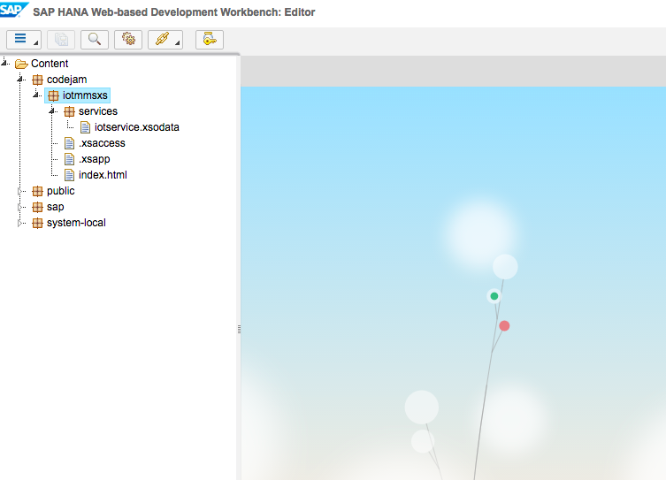
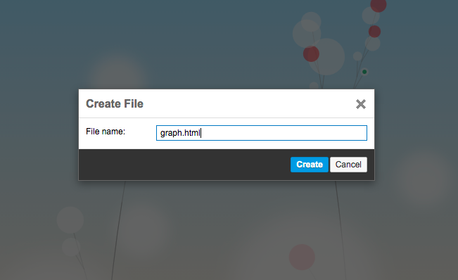
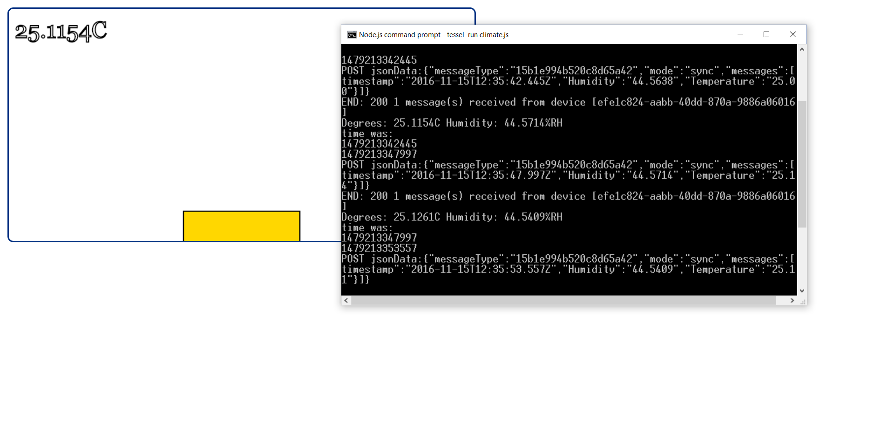

## Prerequisites  
 - **Proficiency:** Beginner
 - **Tutorials:** [Internet of Things (IoT) Viewing your Tessel data in a SAP HANA XS application](http://go.sap.com/developer/tutorials/iot-part10-hcp-services-hanaxs.html)

## Next Steps
 - Select a tutorial from the [Tutorial Navigator](http://go.sap.com/developer/tutorial-navigator.html) or the [Tutorial Catalog](http://go.sap.com/developer/tutorials.html)


## Details
### You will learn  
Now that you have a basic application and service created you can now do a bit more dynamic displaying of the your data.  


### Time to Complete
**10 Min**.

---

1. Return to the “SAP HANA Web-based Development Workbench,” and go to the  “sub package” - `codejam.iotmmsxs`

	 

	

2. right click and create a new file called `graph.html`. You will use the following code to display your data now in a graph as opposed to the table from the previous tutorial. There are a ton of open source and other libraries out there for creating graphs, below is a simple use of the canvas tag.

	```html
	 <!DOCTYPE html>
<html>
<head>
    <meta http-equiv="X-UA-Compatible" content="IE=edge" />
    <meta http-equiv="Content-Type" content="text/html;charset=UTF-8" />
    <meta name="apple-mobile-web-app-capable" content="yes" />
    <meta name="viewport" content="width=device-width,initial-scale=1">
    <script id='sap-ui-bootstrap'
	 	src='/sap/ui5/1/resources/sap-ui-core.js' 
	 	data-sap-ui-theme='sap_goldreflection'
	 	data-sap-ui-libs='sap.ui.core,sap.ui.commons,sap.ui.table'>
 	</script>
 	<style>
        .canvas {
        	margin:5px;
        	border-radius: 10px;
        	border:3px solid #003283;
        }
</style>
</head>
<body>
    <canvas class="canvas" id="myCanvas" width="800" height="400">
    
    <script>
        var canvas = document.getElementById('myCanvas');
        var context = canvas.getContext('2d');

        context.beginPath();
        context.rect(300, 300, 200, 300);
        context.fillStyle = 'gold';
        context.fill();
        context.lineWidth = 2;
        context.stroke();

        setInterval(function() {
            // Do something every 5 seconds
            getLatestValue();
        }, 5000);

        function getLatestValue(){
            var aData;
    		$.ajax({
    		  type: "GET",
    		  url: "/codejam/iotmmsxs/services/iotservice.xsodata/<table name>?$format=json&$orderby=C_TIMESTAMP desc&$top=1",
    		  dataType: 'json',
    		  async: false,
    		  success: function (data, status){
    			  aData = data.d.results[0]['C_TEMPERATURE'];
    		  } 
    		}); 
    		console.log("Called for data");
    		redraw(aData);
        }
        
        function redraw(aData){
            // clear the canvas
            context.clearRect(0,0,canvas.width,canvas.height);
        
            // redraw one or more things based on their javascript objects
            context.beginPath();
            context.rect(300, aData*10, 200, 400);
            context.fillStyle = 'gold';
            context.fill();
            context.lineWidth = 2;
            context.stroke();
            context.closePath();
        }
    </script>
</body>
</html>
	```

	


## Next Steps
 - Select a tutorial from the [Tutorial Navigator](http://go.sap.com/developer/tutorial-navigator.html) or the [Tutorial Catalog](http://go.sap.com/developer/tutorials.html)
