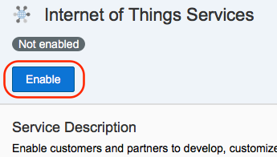
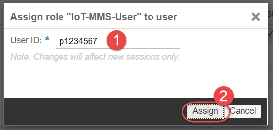

## Prerequisites  
 - **Proficiency:** Beginner
 - **Tutorials:** [Internet of Things (IoT) Setup the Tessel](http://go.sap.com/developer/how-tos/iot-tessel.html)

## Next Steps
 - [Internet of Things (IoT) Adding a new device to the IoT Services](http://go.sap.com/developer/tutorials/iot-part7-add-device.html)

## Details
### You will learn  

This tutorial will detail the steps needed to simply the process of connecting your hardware device to SAP. As you saw in the previous section connecting our device directly to an SAP HANA server left plenty of room for errors as well as a number of security holes.

SAP’s IoT Services provide a robust and secure way of connecting your device as well as simplified way of specifying your data structures and changing those structures.

This procedure assumes you are using the trial edition of the SAP HANA Cloud Platform, but you can use a production account if you have one.  

### Time to Complete
**15 Min**.

---

1. Go to the [SAP HANA Cloud Platform trial edition](https://account.hanatrial.ondemand.com/cockpit) log in (or sign up if you don't have an account yet).

2. One you log in, click on **Services** in the left-hand navigation bar, scroll down to find **Internet of Things Services** and click on that tile.

    

3. Click on the **Enable** button. After a few seconds the page will update and show **Enabled**.

    

4. Once the service is enabled click the **Go to Service** link and a new browser tab will open.

    

5. With IoT services enabled, you can begin the steps necessary to connect your device and enable message communication. The first step will be to configure and deploy the Message Management Service (MMS). Click on the **Deploy Message Management Service** tile.

6. Enter in your information in the fields, where your account ID is your p-number (or s-number if you are SAP's customer or partner, or i-/d-number if you are SAP employee) with the world “trial” (no space between the p-number and trial) and your user name is just your p-number.

    

7. Once successfully deployed then you can assign the role to our user and continue the next steps. Return to the HCP Cockpit view and click on **Java Applications** in the left navigation bar. You will see the new `iotmms` application you just deployed. Click on the `iotmms` link to display the **IoT MMS dashboard**.

    

8. With the **IoT MMS dashboard** displayed click on the Roles link in the left navigation bar. Select the **IoT-MMS-User** (click the empty cell next to the Name to select the row if it is not highlighted in blue).

    

9. Then under **Individual Users**, click **Assign** and enter your HCP user ID (e.g. your p-number without the word “trial” on the end).

    

     Once user is assigned to the role, stop and start `iotmms` application.


## Next Steps
 - [Internet of Things (IoT) Adding a new device to the IoT Services](http://go.sap.com/developer/tutorials/iot-part7-add-device.html)
