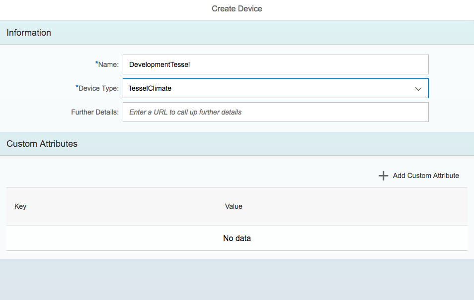
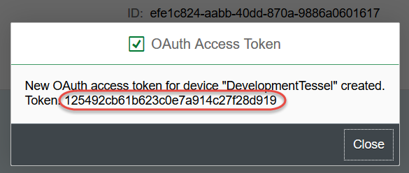
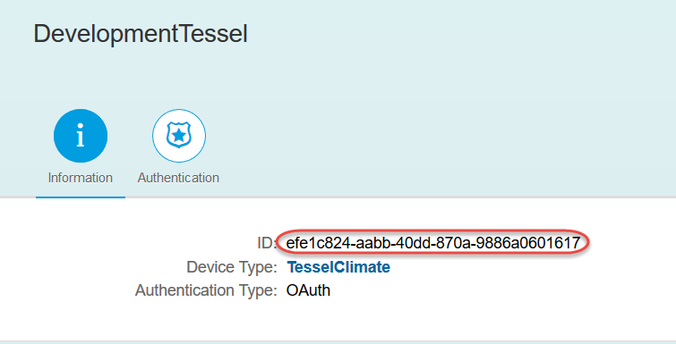
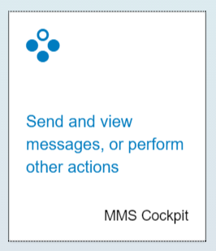
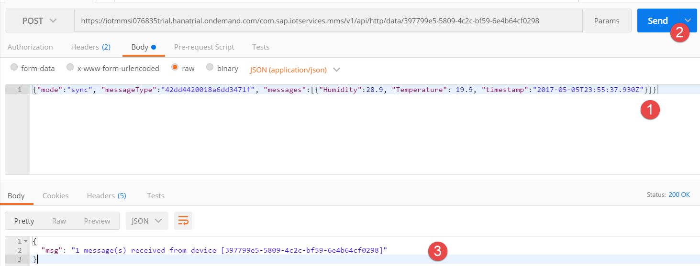

## Prerequisites  
- **Proficiency:** Beginner
- **Tutorials:** [SAP Cloud Platform IoT for Neo: Enable and configure](http://www.sap.com/developer/tutorials/iot-part6-hcp-services.html)


## Next Steps
- [SAP Cloud Platform IoT for Neo: Sending messages from Tessel1 device](http://www.sap.com/developer/tutorials/iot-part8-hcp-services-tessel.html)
- [SAP Cloud Platform IoT for Neo: Sending messages from TI SensorTag device](http://www.sap.com/developer/tutorials/iot-part11-hcp-services-ti.html)

## Details
### You will learn  
With the MMS service now deployed, and your user assigned the appropriate role it's time for to add your device(s) so you can communicate with it. To do this you will add your device to the service.

### Time to Complete
**10 Min**.

---


[ACCORDION-BEGIN [Step 1: ](Open Message Management Service Cockpit)]

From the SAP Cloud Platform cockpit, select **Java Applications**, then select the `iotmms` application. Open the **Message Management Service Cockpit** by clicking on the **Application URL**.


[ACCORDION-END]

[ACCORDION-BEGIN [Step 2: ](Open IoT Services Cockpit)]

Click on the **View registered devices and device types** tile to open the **IoT Services Cockpit**. You will use this page frequently, so it is worth bookmarking it.


[ACCORDION-END]

[ACCORDION-BEGIN [Step 3: ](Add a new message type)]

Click the **Message Types** tile, then the **+** symbol at the bottom of the list to add a new message type and to define the structure of the data you will collect.

In the **Information** section, enter a name "`climateData`".


In the **Fields** section, click the **+ Add Field** button to add in two more fields, then enter the following for name and data types. Click the **Create** button (bottom right corner) when complete. When the message type is created, copy the **ID** string. You will need it later.

> Note: Be sure to follow the names and capitalization specified below.

Name            | Type
--------------- | -------------
`timestamp`     | `date`
`Humidity`      | `double`
`Temperature`   | `double`

Copy and save the message type ID, which you will need later:


[ACCORDION-END]

[ACCORDION-BEGIN [Step 4: ](Create a new device type)]

Click the `<` ("back arrow") again to return the the IoT Services Cockpit. Click on **Device Types**, then the **+** symbol to create a new device. Give it a simple name that makes sense for what you are doing, like "`TesselClimate`".

Now click the  **+ Add Message Type** to attach your previously created message type "`climateData`". Make sure the **Direction** is "From Device" and click **Create**.


[ACCORDION-END]

[ACCORDION-BEGIN [Step 5: ](Create a new device)]

Finally you can now click the `<` ("back arrow") icon and click **Devices** tile.

Click `+` to add a new device, name it `DevelopmentTessel` and make sure its device type is `TesselClimate`. No other fields need to be populated at this step.

> This is extremely important, once you click **Create** a pop-up will appear that will display the **OAuth access token** for this new device. Copy that and save it somewhere, as you will need it soon.  Should you lose it, click into the **Authorization** tab and generate a new token.




[ACCORDION-END]

[ACCORDION-BEGIN [Step 6: ](Copy device and token IDs)]

When the OAuth Access Token is displayed, copy the token ID and save it. Click **Close**.



Now copy and save the **Device ID** string




[ACCORDION-END]

[ACCORDION-BEGIN [Step 7: ](Use HTTP API built-in client)]

With the device type, message type and device configured, it is time to send some data.

First you will do it using built-in client. Go to the **IoT Service Cockpit** and click the **Send and view messages...** tile.



Then click the **Messaging through HTTP** tile in **Data Services** group.


[ACCORDION-END]

[ACCORDION-BEGIN [Step 8: ](Adjust device ID)]

On the **HTTP API** page, you will have a client to **Send Message** with an **Data Endpoint** like this:

`https://iotmmsYOURUSERtrial.hanatrial.ondemand.com/com.sap.iotservices.mms/v1/api/http/data/d000-e000-v000-i000-c000-e001`

Change `d000-e000-v000-i000-c000-e001` to your device's ID (it is a GUID) you copied in step 8 above. Note: the GUID is the device ID, not its authorization token.

Example: `https://iotmmsp1234567trial.hanatrial.ondemand.com/com.sap.iotservices.mms/v1/api/http/data/85e0ce4e-09bf-47ea-a5a9-a0469f642c20`


[ACCORDION-END]

[ACCORDION-BEGIN [Step 9: ](Adjust message to post)]

You will next formulate your HTTP POST payload. Since you are sending OData, numbers (`float`, `int`, `double`, etc) are not placed in double quotes, while strings and the Key of the Key/Value pair are in quotes.

Under **Message to post** replace the existing content with the following which matches the message type your used earlier.

```json
{"mode":"sync", "messageType":"m0t0y0p0e1", "messages":[{"Humidity":25.7, "Temperature": 21.5, "timestamp":"2017-05-05T23:45:37.930Z"}]}
```

> NOTE - the `messageType` value `"m0t0y0p0e1"` must be changed to match your `message type ID`.

> The date format is a combined date and time representation in ISO 8601 format. It is in UTC (Coordinated Universal Time) as indicated by a `Z` directly after the time without a space.


[ACCORDION-END]

[ACCORDION-BEGIN [Step 10: ](Send the sample message)]

Click the **Send** button. If everything goes OK, you should see a response code of `200` similar to this screen shot or response code `202` when you post for the very first time.


You receive response code `202` when your request was not immediately processed, but instead was placed in a processing queue. You should copy returned HTTP endpoint into **Receive acknowledgments** field and click **Send** to receive the status of your queued request.

Response codes `4xx` or `5xx` indicate that post request has failed.


[ACCORDION-END]

[ACCORDION-BEGIN [Step 11: ](Display stored messages)]

To verify that the posting worked, switch back **IoT Service Cockpit**, click **Send and view messages, or perform other actions** tile, then click the **Display stored messages** tile.

Find table `T_IOT_<YourMessageType>` and click on it. When the page updates you should see something like this:


Please note **OData API** link in the up right corner. Clicking it will give you the URL which you can use to query this data from your applications using OData protocol.


[ACCORDION-END]

[ACCORDION-BEGIN [Step 12: ](Starting Postman application)]

Now you will an external REST client to post from. This will require authentication mechanism not required when used built-in client.

In this step you will use [Postman Application](https://chrome.google.com/webstore/detail/postman/fhbjgbiflinjbdggehcddcbncdddomop) for Google Chrome.

>There is no need to create a Postman account, if you are asked during the first run of the Postman application.


[ACCORDION-END]

[ACCORDION-BEGIN [Step 13: ](Set method, URL and HTTP header)]

In Postman select **POST** from the drop down menu. Copy the HTTP endpoint from your account's sample client to Postman's `Enter request URL` field.

Open the **Headers** section and set:

- the "`Authorization`" value to "`Bearer [TOKEN ID]`" using the token id you copied when you added your device to the system,
- the "`Content-Type`" to "`application/json`".


[ACCORDION-END]

[ACCORDION-BEGIN [Step 14: ](Set body)]

Select **Body**, then the **RAW** type. Copy and paste the same content you just had in a simple client. Make a few value changes to make easier spotting this insert. Make sure you change the `messageType` to your ID.

```json
{"mode":"sync", "messageType":"m0t0y0p0e1", "messages":[{"Humidity":28.9, "Temperature": 19.9, "timestamp":"2017-05-05T23:55:37.930Z"}]}
```


[ACCORDION-END]

[ACCORDION-BEGIN [Step 15: ](Send message)]

Click **Send** and you should receive a message similar to that from the SAP Cloud Platform simple client.


This indicates that your POST was successful and if you return to the "Display Stored Messages" in SAP Cloud Platform you should see this new entry sent from the Postman application.


[ACCORDION-END]


## Next Steps
- [SAP Cloud Platform IoT for Neo: Sending messages from Tessel1 device](http://www.sap.com/developer/tutorials/iot-part8-hcp-services-tessel.html)
- [SAP Cloud Platform IoT for Neo: Sending messages from TI SensorTag device](http://www.sap.com/developer/tutorials/iot-part11-hcp-services-ti.html)
