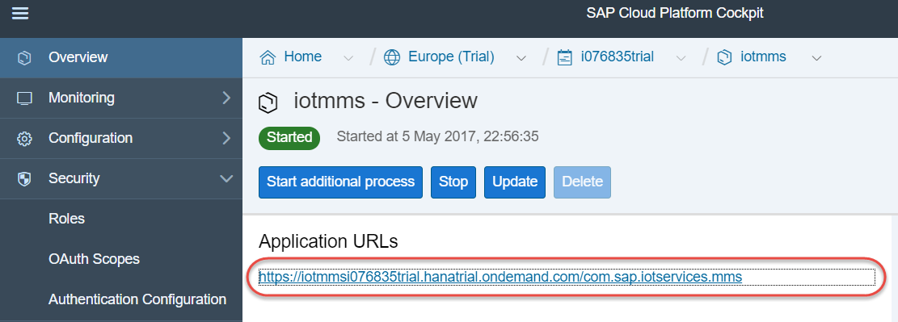
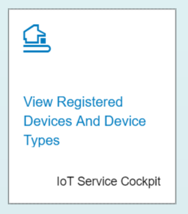
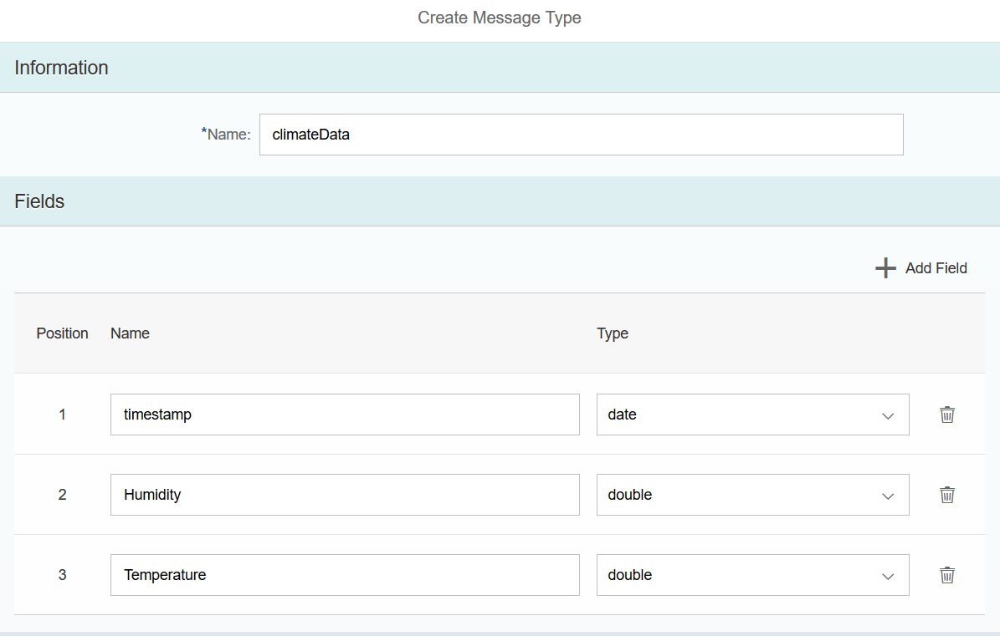
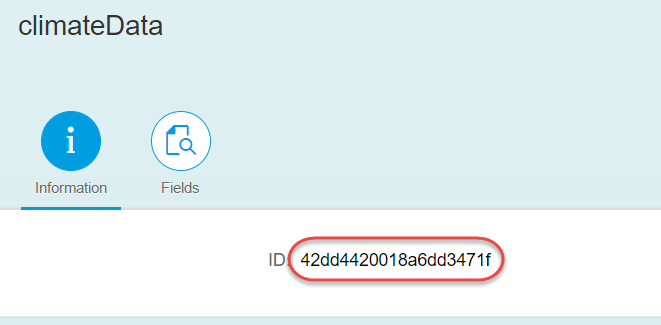
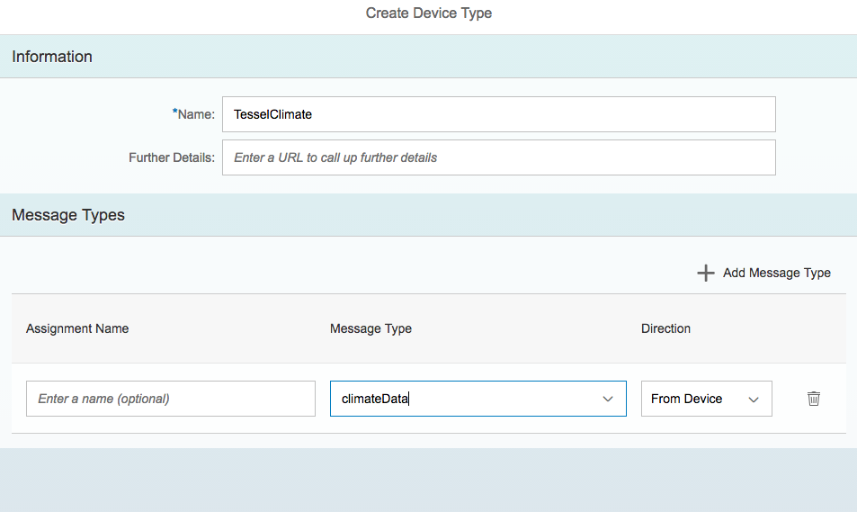
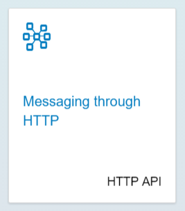
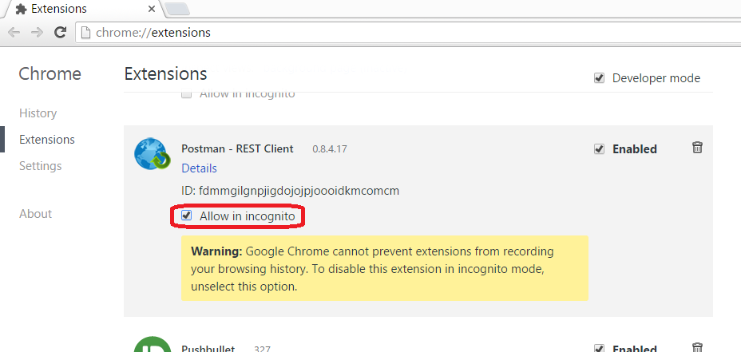

## Prerequisites  
 - **Proficiency:** Beginner
 - **Tutorials:** [Internet of Things (IoT) Explore the SAP HCP IoT Services](http://go.sap.com/developer/tutorials/iot-part6-hcp-services.html)


## Next Steps
 - [Internet of Things (IoT) Connecting your Tessel to IoT Services](http://go.sap.com/developer/tutorials/iot-part8-hcp-services-tessel.html)
 [Internet of Things (IoT) Connecting your TI `SensorTag` to IoT Services](http://go.sap.com/developer/tutorials/iot-part11-hcp-services-ti.html)

## Details
### You will learn  
With the MMS service now deployed, and your user assigned the appropriate role it’s time for to add your device(s) so you can communicate with it. To do this you will add your device to the service.

### Time to Complete
**10 Min**.

---

1. From the HCP cockpit, select **Java Applications** then select the `iotmms` application. Open the **Message Management Service Cockpit** by clicking on the **Application URL**.

    

2. Click on the **View registered devices and device types** tile to open the **IoT Services Cockpit**. You will use this page frequently, so it is worth bookmarking it.

    

3. Click the **Message Types** tile, then the **+** symbol to add a new message type and define the structure of the data you will to collect. In the **Information** section, enter a name (`climateData`)

    

4. In the **Fields** section, click the **+ Add Field** button to add in two more fields, then enter the following for name and data types. Click the **Create** button (bottom right corner) when complete. When the message type is created, copy the **ID** string. You will need it later.

    > Note: Be sure to follow the names and capitalization specified below.

    Name            | Type
    --------------- | -------------
    `timestamp`     | `long`
    `Humidity`      | `double`
    `Temperature`   | `double`

    > **Make sure `timestamp` in your definition has data type `long`, and not default `date`.**

    The message type ID:

    

5. Click the “back arrow” again to return the the IoT Services Cockpit. Click on **Device Types**, then the **+** symbol to create a new device. Give it a simple name that makes sense for what you are doing (e.g. `TesselClimate`). Now click the  **+** symbol to attach your previously created **Message Type** and click **Create**.

    

6. Finally you can now click the "back arrow" and create the final item, your **Device**.

    > This is extremely important, once you click **Create** a pop-up will appear that will display the **OAuth access token** for this new device. Copy that and save it somewhere, you will need it soon.  If you lose it, click into the **Authorization** tab and you can generate a new token.

    

7. When the OAuth Access Token is displayed, copy the token ID and save it. Click **Close**.

    

8. Copy and save the **Device ID** string

    

9. With the device type, message type and device configured, it is time to send some data. Go to the **IoT Services Cockpit** and click the **Send and view messages...** tile.

    

    Then click the **Messaging through HTTP** tile in **Data Services** group.

    

10. On the **HTTP API** page, you will see a **Sample Client** to **Send Messages** with an **HTTP endpoint** like this:
 - https://iotmms[youraccount]trial.hanatrial.ondemand.com/com.sap.iotservices.mms/v1/api/http/data/[deviceID]

    Change [device ID] to your device’s ID (it is a GUID) you copied in step 8 above.

    - Example: https://iotmmsp1234567trial.hanatrial.ondemand.com/com.sap.iotservices.mms/v1/api/http/data/85e0ce4e-09bf-47ea-a5a9-a0469f642c20

    > Note: the GUID is the device ID, not its authorization token.  

11. You will next formulate your HTTP POST payload. Since you are sending OData, numbers (`float`, `int`, `double`, etc) are not placed in double quotes, while strings and the Key of the Key/Value pair are in quotes.

    Under **Message to post** replace the existing content with the following which matches the message type your used earlier.

    ```JSON
    {"mode":"sync", "messageType":"6c7a02f24cc32ee07174", "messages":[{"Humidity":25.7, "Temperature": 76.5, "timestamp":1431450313}]}
    ```

    > NOTE - the `messageType` value needs to be changed to match your `message type ID`.

12. Click the POST button. If everything goes OK, you should see a response code of `200` similar to this screen shot.

    

    You may receive as well with response code `202` which indicates your request was not immediately processed, but is placed in a processing queue. You should copy returned HTTP endpoint into **Receive acknowledgments** field to receive the status of your queued message.

    Response codes `4xx` or `5xx` indicate that post request has failed.

13. To verify that the posting worked, switch back **IoT Services Cockpit**, click **View messages received, use sample clients, etc.** tile, then click the **Display stored messages** tile. When the page updates you should see something like this:

    


14. Now you will post from an external REST client. In this step you will use [Postman Extension](https://chrome.google.com/webstore/detail/postman-rest-client/fdmmgilgnpjigdojojpjoooidkmcomcm?hl=en) for Google Chrome.

    Once installed in Chrome open the Postman extension in incognito mode to avoid authentication issues in the same browser session with SAP HCP. For that you might need to allow the Postman extension to run in Chrome's incognito mode.

    

15. Copy the HTTP endpoint to it and select “POST” from the drop down menu.

    Open the “Headers” section and change the “Authorization” value to “Bearer [TOKEN ID]” using the Token you copied when you added our device to the system.

    

16. Select then the “RAW” type and copy and paste in the same content you just had (with a few value changes to make it easier to spot this insert. Make sure you change the `messageType` to your ID.

    ```JSON
    {"mode":"sync", "messageType":"6c7a02f24cc32ee07174", "messages":[{"Humidity":35.7, "Temperature": 86.5, "timestamp":1431450313}]}
    ```

17. Click **Send** and you should receive a message similar to when you used the HCP tool. This indicates that your POST was successful and if you return to the “Display Stored Messages” you will see your new entry.

    If you receive `40x` authorization error in return, then check if you are running Postman client in Chrome's incognito mode.

## Next Steps
 - [Internet of Things (IoT) Connecting your Tessel to IoT Services](http://go.sap.com/developer/tutorials/iot-part8-hcp-services-tessel.html)
 - [Internet of Things (IoT) Connecting your TI SensorTag to IoT Services](http://go.sap.com/developer/tutorials/iot-part11-hcp-services-ti.html)
