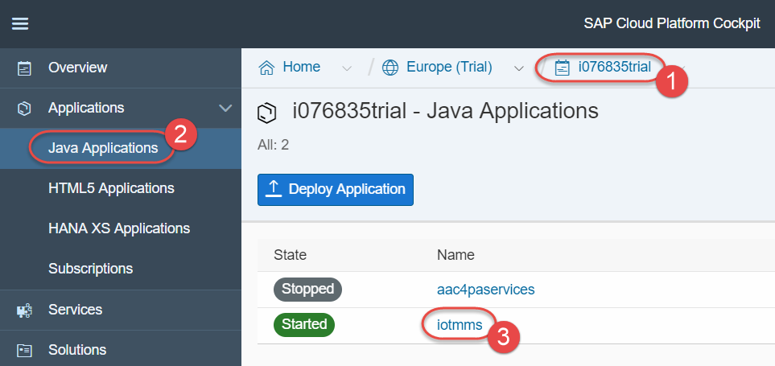
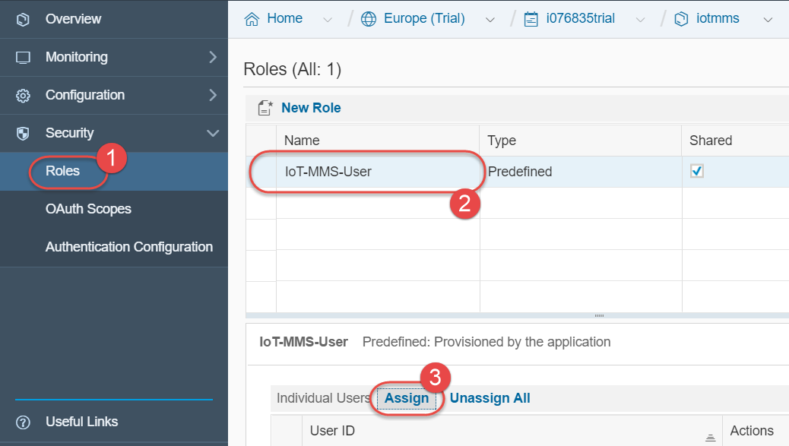

## Prerequisites  
 - **Proficiency:** Beginner
 - **Tutorials:** [Sign up for a free trial account on SAP Cloud Platform Neo environment](https://www.sap.com/developer/tutorials/hcp-create-trial-account.html)

## Next Steps
- [Configuring the device for computer sensors data - coming soon]

## Details
### You will learn  
You will learn how to enable and configure IoT service in SAP Cloud Platform Neo environment. This procedure assumes you are using the trial account of the SAP Cloud Platform, but will work with the production account as well.

### Time to Complete
**15 Min**

---

[ACCORDION-BEGIN [Step 1: ](Log into SAP Cloud Platform Neo trial)]

Go to the [SAP Cloud Platform Neo trial edition](https://account.hanatrial.ondemand.com/cockpit) log in.

>This tutorial assumes you have signed up for a trial account already.

[ACCORDION-END]

[ACCORDION-BEGIN [Step 2: ](Enable IoT service)]

Once you log in, click on **Services** in the left-hand navigation bar, scroll down to find **Internet of Things** tile and click on it.

Click on the **Enable** button. After a few seconds the page will update and show **Enabled**.

[ACCORDION-END]

[ACCORDION-BEGIN [Step 3: ](Go to IoT Service Cockpit)]

Once the service is enabled click the **Go to Service** link and a new browser window will open with IoT Service Cockpit.

[ACCORDION-END]

[ACCORDION-BEGIN [Step 4: ](Deploy Message Management Service)]

With IoT service enabled, you can begin the steps necessary to configure your device's digital twin and to enable message communication.

The first step will be to deploy and to configure the Message Management Service (MMS). Click on the **Deploy Message Management Service** tile.

Enter in your information in the fields, where your account ID is your p-number (or s-number if you are SAP's customer or partner, or i-/d-number if you are SAP employee) with the world "trial" (no space between the p-number and trial) and your user name is just your p-number.

[ACCORDION-END]

[ACCORDION-BEGIN [Step 5: ](Go to IoT MMS application dashboard)]

Once successfully deployed then Java application `iotmms` is started in your account.

Return to the SAP Cloud Platform cockpit view and click on **Java Applications** in the left navigation bar. You will see the new `iotmms` application you just deployed. Click on the `iotmms` link to display the **IoT MMS dashboard**.

[ACCORDION-END]

[ACCORDION-BEGIN [Step 6: ](Assign IoT MMS user role)]

With the **IoT MMS dashboard** displayed click on the Roles link in the left navigation bar. Select the **IoT-MMS-User** (click the empty cell next to the Name to select the row if it is not highlighted in blue).

Then under **Individual Users**, click **Assign** and enter your SAP Cloud Platform user ID (e.g. your p-number without the word "trial" on the end).

Once user is assigned to the role, stop and start `iotmms` application.

[ACCORDION-END]

---

### Optional

[ACCORDION-BEGIN [Step 7: ](Review official documentation)]

Check the official documentation at https://help.sap.com/viewer/product/SAP_CP_IOT_2.0/Cloud/en-US

[ACCORDION-END]

## Next Steps
- [Configuring the device for laptop sensors data - coming soon]
