[ACCORDION-BEGIN [Step 1: ](Create a Group)]

Groups are a big part of SAP Jam Collaboration – they're the places where you bring together people, data, best practices and content to solve business problems and get stuff done.

Groups are a membership of users who can upload, create, or reference material specific to a department, project, or team. Members can participate in a topic discussion with a select number or all members in a group.

Lets start by creating a new group. We are creating this group as the Administrator but end users can also create groups.

Go to the **Groups** drop-down menu and choose **Create a Group**. As we are starting with a new environment there are no pre-built templates to use so we will create our own. We can create a re-usable group template from our new group once we are happy with the design.

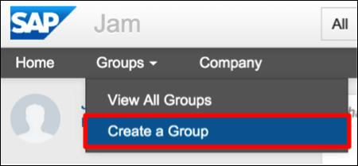

Figure 1: Select the 'Create a Group' option in the SAP Jam 'Groups' menu

Provide a group name and a group description that describes the purpose of the group. Click on **Public** to set the permissions of the group. Click **Create**. For this example, the group I created is focused on Innovation such that a product team can share product updates, facilitate discussion and drive suggestions and ideas for product improvement.

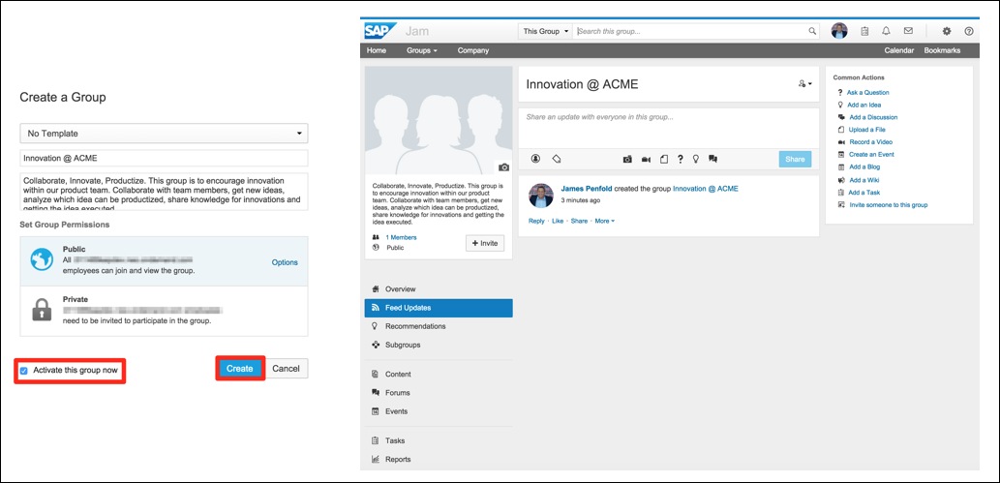

Figure 2: The 'Create a Group' form

We can now customize our group to meet our requirements. Let's customize the Overview page to meet our requirements. Click the **Customize the Overview page** link at the top of the page. This will take you to the Overview Page Designer.

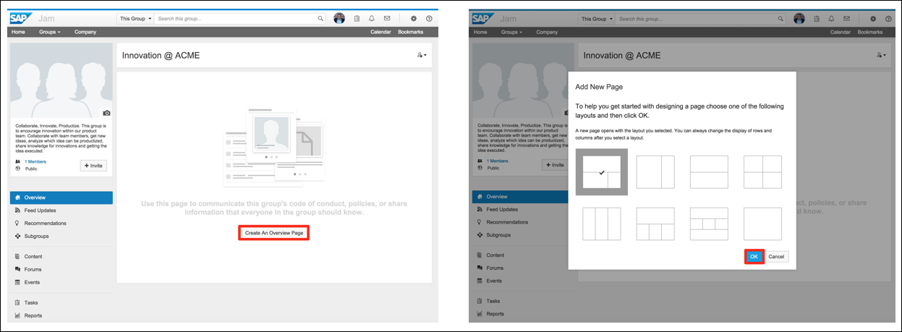

Figure 3: The 'Create an Overview Page' and the 'select layout' options

Provide a Title for your Overview Page.

Figure 4: Using the 'Page Designer', part 1

Using the Page Designer, you can very easily add widgets to the Overview Page.

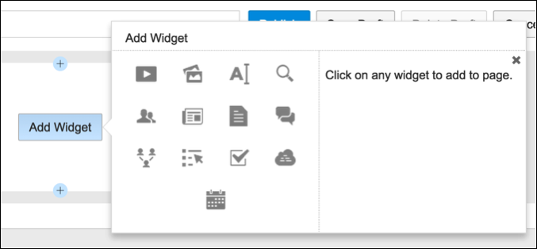

Figure 5: Using the 'Page Designer' to add a widget

There are widgets available for adding feeds, content, video, photos, forums, people and business data. Using these tools you can quickly build a structured, fully featured group for collaboration.

For the Innovation group, you can use the Forum widget, along with the provided filters, to create areas for Submitted, Accepted and Delivered Ideas. This will allow group members to post their ideas and track how the ideas are being managed and hopefully delivered.

Using the Page Designer, it is possible to very quickly create an engaging group using the provided widgets. By clicking the + icons you can start to add columns and rows to your page.

Once you are happy with your group design, Activate your group to make it accessible to other users using the button at the top of the screen.

Figure 6: The created Group page

For the Innovation group, I used the Text, Photo, Forum, Feed and People widgets.

[ACCORDION-END]

[ACCORDION-BEGIN [Step 2: ](Invite users)]

Now that we have created our group we can invite additional users to drive collaboration. Using the **Invite** button you can invite other users to the group. Let's invite one of the users that you setup earlier. Click the **Invite** button.

As you start entering the users name their details will appear. Once selected, their name will appear in the Invitation List. Click the **Send** button to invite them to the group.

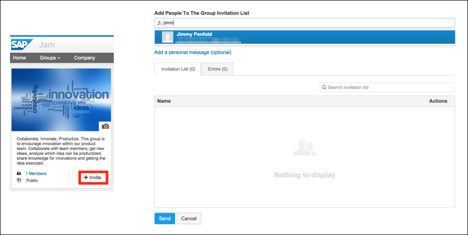

Figure 1: Click the 'Invite' button, 'Add People To The Group Invitation List', and 'Send'

The invited user will receive their invitation as a Notification inside SAP Jam Collaboration – note the red numbered notification at the top of the page.

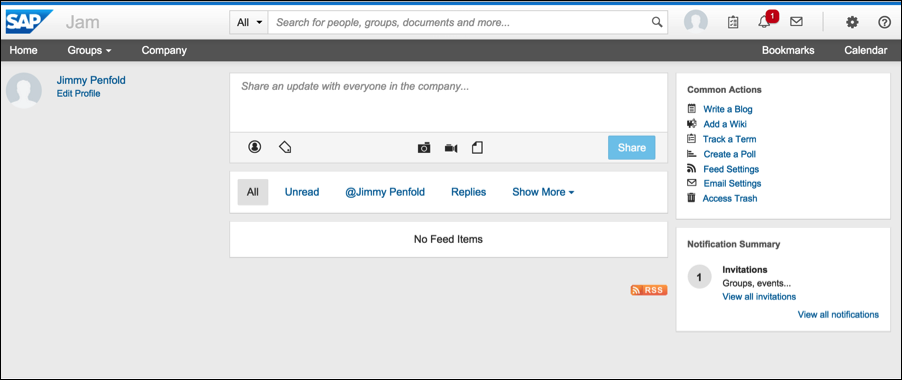

Figure 2: Invited users receive a notification

Clicking on the Notification icon will display all of the users notifications – in this case the group invitation, which also displays a button that allows the user to 'Join' the group.

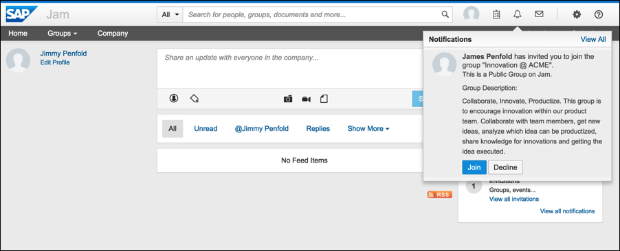

Figure 3: The invitation as it appears in the user's notifications

[ACCORDION-END]

[ACCORDION-BEGIN [Step 3: ](Add content)]

Now that we have our group, and users, we now need content to drive collaboration and discussion\!

Content items are blog posts, decision tools, links, planning tools, videos, wiki pages, images, documents (PowerPoint, Word, Excel), polls, and any other file that you upload to SAP Jam. Group members can provide feedback on the information that content items contain, and use this information to collaborate and make decisions.

Let's add a document. Click on the **Feed Updates** menu option within the group and in the Feed Widget at the top of the page, click the **Add a Document** icon. For this example, I uploaded a PowerPoint document.

Figure 1: Add a document in the group's feed widget

Once uploaded, the document will be displayed inline inside SAP Jam.

Figure 2: The added document displayed in the group's 'Content' section

The uploaded document will appear in the Group feed. Group members can then add general comments or select areas of the document to comment upon.

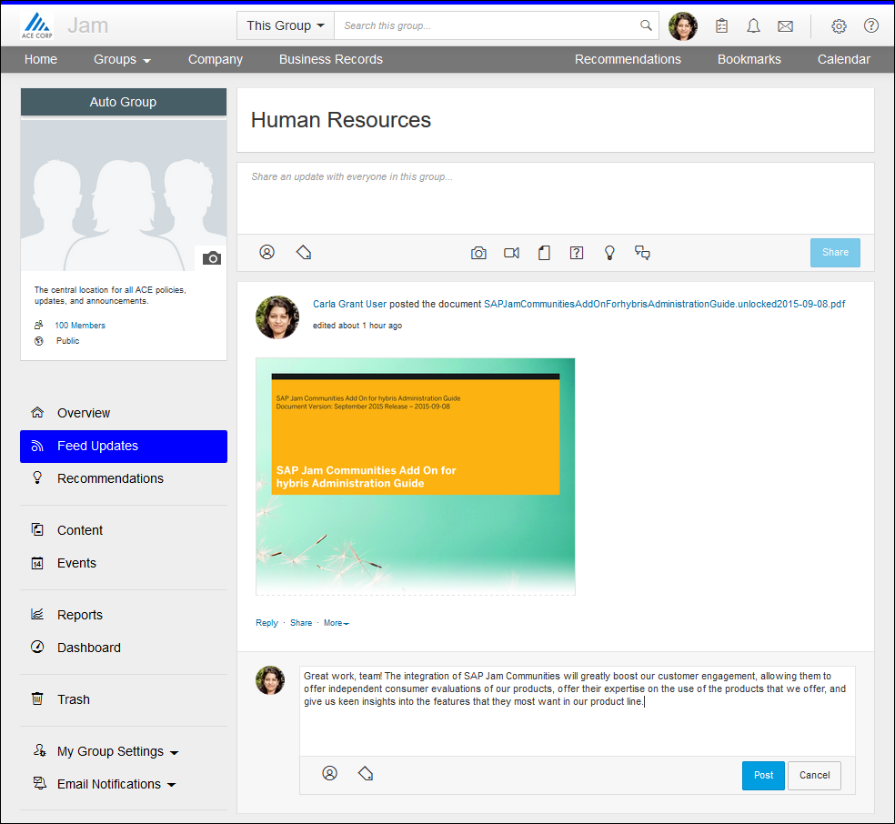

Figure 3: The added document is also displayed in the group's 'Feed' section

[ACCORDION-END]

[ACCORDION-BEGIN [Step 4: ](Create a poll)]

Let's now create a poll asking for product input and feedback. Click on the **Content** menu option.

To create a poll, navigate to your group's Content section, and select **Create** > **Decision-Making Tools** > **Poll**  from the top **Actions** bar.

Figure 1: In a SAP Jam group's 'Content' section, select Create > Decision-making Tools > Poll

The Create a Poll page is displayed. The Poll decision-making tool allows you to ask a multiple-choice question. Enter the question, the multiple choice options that you want to present, and any other options that you want set, and then click **Create Poll**.

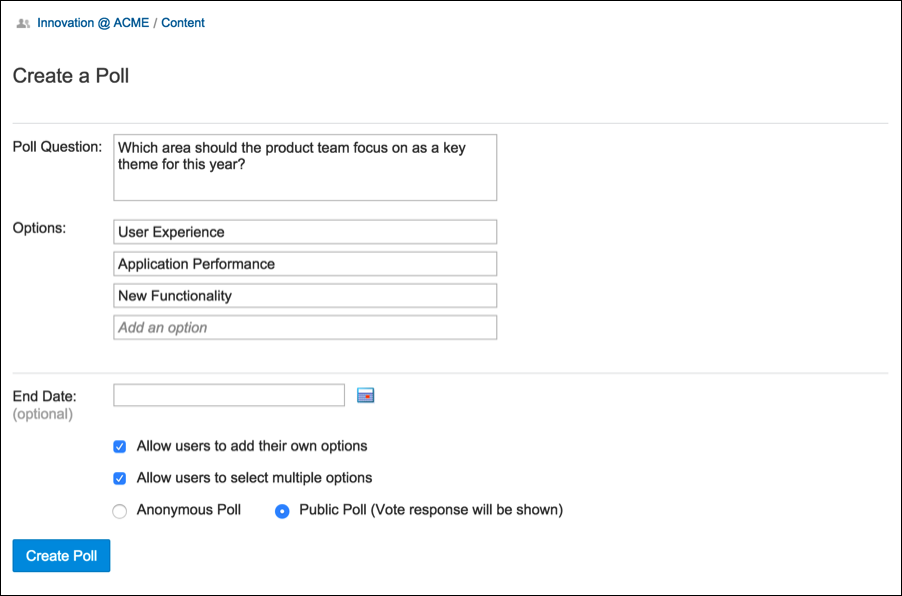

Figure 2: Set the question, the multiple choice options, and any other options

The Poll appears on the group feed and as people vote, the results are displayed graphically.

[ACCORDION-END]

[ACCORDION-BEGIN [Step 5: ](Add ideas)]

Finally, let's add some product suggestions as Ideas. If you have added Forum widgets to your Overview page then you can click the **Go To Forums** link at the bottom of the widget and then click on **Ideas**. Alternatively, you can click on the **Feed Updates** menu option within the group and in the Feed Widget at the top of the page click the **Add an Idea** icon.

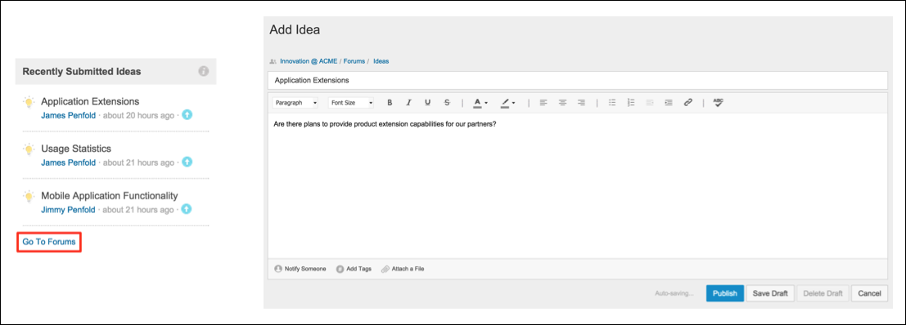

Figure 1: Add an Idea

Once published, the Idea will appear in the Group feed and should also appear in the Forum widgets. Experiment with the widget filters to display Submitted, Accepted and Completed Ideas.

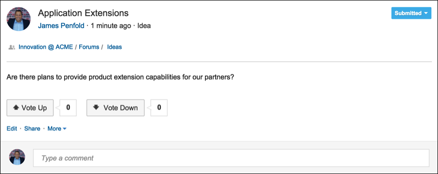

Figure 2: Once posted, group members can comment on, and vote for, or against, the idea

Users can now vote on the idea and the product team can review the ideas and decide whether to consider the idea or reject the idea. Filters on the Forum widgets allow us to see the Ideas as they flow through the product development process.

[ACCORDION-END]

[ACCORDION-BEGIN [Step 6: ](Test your changes)]

Now that we have added users, created a group and added content we can now test out our changes. Log in as each of the users to test out the collaboration capabilities, comment on documents, vote ideas etc.

As you go through and submit, and comment, on content, vote in polls and post ideas you will see notifications appear in the top of the screen. Click on the **Notification** icon to view them.

Figure 1: The 'Notifications' indicator on your SAP Jam tool bar

Figure 2: Notifications

You should now have an SAP Jam Collaboration group containing content, decision-making tools as well as comments and discussion.

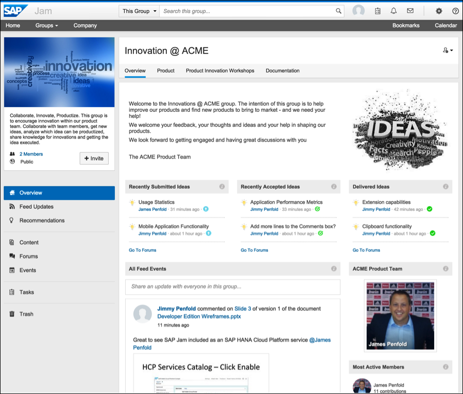

Figure 3: A group with content, decision-making tools, and comments

[ACCORDION-END]

---

## Next Steps
- Select a tutorial from the [Tutorial Navigator](http://www.sap.com/developer/tutorial-navigator.html) or the [Tutorial Catalog](http://www.sap.com/developer/tutorials.html)
