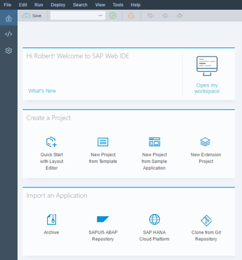
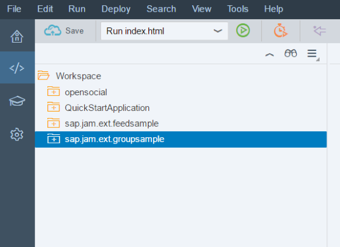
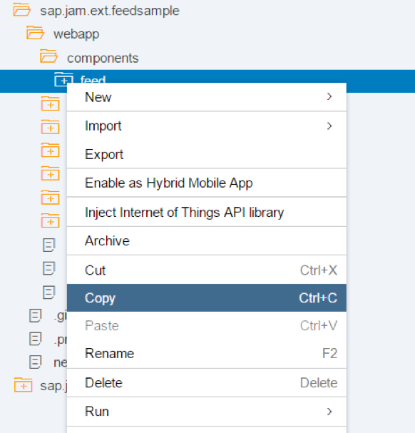
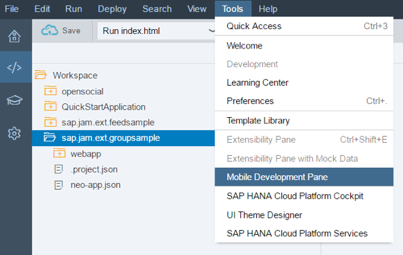
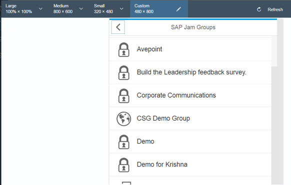

## Prerequisites  
 - **Proficiency:** Intermediate
 - **Tutorials:** [Activate SAP Web IDE plugins on SAP Cloud Platform](https://www.sap.com/developer/tutorials/jam-cloud-webide-plugins-activate.html)

## Next Steps
- Select a tutorial from the [Tutorial Navigator](https://www.sap.com/developer/tutorial-navigator.html) or the [Tutorial Catalog](https://www.sap.com/developer/tutorials.html)

## Details
### You will learn  
In this tutorial, you will learn how to build and run a new project with SAP Jam Collaboration UI5 sample applications.

### Time to Complete
**15 Min**

---


[ACCORDION-BEGIN [Step 1: ](Building a new project with the SAP Jam Collaboration UI5 Sample Applications)]

1. In the SAP Web IDE home page create a new Project by clicking on the **New Project from Sample Application** option.

    Figure 1: SAP Web IDE home page
2. In the categories drop down select **SAP Jam Extension Sample Projects**.

    Figure 2: SAP Jam Extension Sample Projects
3. Select the **SAP Jam Feed Demo** and press the **Next** button. Then press **Finish** on the next screen. This creates a project titled `sap.jam.ext.feedsample`. The project calls the _SAP Jam Collaboration feed API_ for the current user and displays it in a UI5 application. If the application is empty you might want to check that your Jam feed has any events inside the SAP Jam Collaboration home page. The code can be modified to display the feed for a specific group or user.
4. Although there are two other sample applications for this exercise we will duplicate these steps for the _SAP Jam Group Demo_. The Group Demo displays a list of groups and provides an interface to easily create a SAP Jam Collaboration group using the sample.

    Figure 3: SAP Jam Group Demo
5. Once you built the two applications, right click on the folder representing each application and select **`Run`** | **`Run Index.html`**. When you do this you will be able to see the default set of code for each application. The _Feed application_ will display the home feed for your wall in Jam, and the _Group application_ will display a list of existing groups in your Jam system and provide an option to create new groups.

    Figure 4: Run `Index.html`


[ACCORDION-END]


[ACCORDION-BEGIN [Step 2: ](Add the "showFeed handler" to the GroupList Component)]

1.  Go to the group sample application, navigate to `webapp/components/grouplist/view/GroupList.view.xml` and add the properties `press="showFeed"` and `type="Navigation"` to the `_StandardListItem_`.
    ```
    <StandardListItem
        title="{JamOData>Name}"
        description="{JamOData>Description}"
        press="showFeed"
        type="Navigation"
        icon="{path:'JamOData>GroupType', formatter:'.typeIconFormatter'}"
        iconDensityAware="false" iconInset="false"
    />
    ```
2.  Go to the controller under `webapp/components/grouplist/controller/GroupList.controller.js`, and add the following implementation for `"showFeed"`. This will trigger the `groupFeed` route, passing in the ID of the currently-selected group:
    ```
    showFeed: function(oEvent) {
        var groupId = oEvent.getSource().getBindingContext("JamOData").getProperty("Id");
        this.getRouter().navTo("groupFeed", {groupId : groupId});
    },
    ```


[ACCORDION-END]


[ACCORDION-BEGIN [Step 3: ](Copy the Feed component and hook it up to the "groupFeed" route)]

1.  Now navigate to your `sap.jam.ext.feedsample` application, and select the **`webapp/components/feed`** folder. Make sure that the feed folder is selected, and select **edit > copy** from the menu (or the appropriate keyboard short-cut).

    Figure 5: Copy the Feed Component
2.  Navigate back to the `webapp/components` folder of the group sample application and select **edit > paste**. This should copy the SAP Jam feed component into your project.

    Figure 6: Paste the Feed Component
3.  Open the feed controller under `webapp/components/feed/controller/Feed.controller.js`, and change the `"memberFeed"` route handler to a `"groupFeed"` route handler in the `onInit()` function:
    ```
    onInit: function() {
        // Attach route handlers
        //this.getRouter().getRoute("memberFeed").attachPatternMatched(this.onMemberFeedMatched, this);
        this.getRouter().getRoute("groupFeed").attachPatternMatched(this.onGroupFeedMatched, this);
    }
    ```
4.  To navigate from the group feed back to the group list, add a back button handler to `Feed.controller.js`:
    ```
    onNavBack: function() {
        this.getRouter().navTo("groupList", {}, true);
    },
    ```


[ACCORDION-END]


[ACCORDION-BEGIN [Step 4: ](Configure the new UI5 route and target)]

Almost there. Navigate to the top-level (application) `manifest.json` file, under `sap.jam.ext.groupsample/webapp/manifest.json`. Ensure that you have it open in the _Code Editor_ and not the _Descriptor Editor_ (see tab controls at the bottom of the SAP Web IDE code editor screen).

1.  Register the new `"groupFeed"` route in the `"routes"` sub-section of the `"routing"` section, and add the new `"groupFeed"` target to point to the Feed component view. The final JSON snippet should look like this:
    ```
    "routes": [{
        "name": "groupList",
        "pattern": "",
        "target": ["groupList"]
    }, {
        "name": "groupFeed",
        "pattern": "/Groups/{groupId}/Feed",
        "target": ["groupFeed"]
    }],
    "targets": {
        "groupList": {
            "viewName": "components/grouplist/view/GroupList",
            "viewId": "groupList",
            "viewLevel": 1
        },
            "groupFeed": {
            "viewName": "components/feed/view/Feed",
            "viewId": "groupFeed",
            "viewLevel": 2
        }
    }
    ```


[ACCORDION-END]


[ACCORDION-BEGIN [Step 5: ](Run the application in the Mobile Development Pane)]

You are done\! Run your application\! You should now be able to navigate from a group, to its feed, and back again.

1.  Select your project in the code editor and press **Tools** \> **Mobile Development Pane**

    

    Figure 7: Mobile Development Pane
2.  View your application in different responsive screen sizes.

    

    Figure 8: Responsive screen sizes


[ACCORDION-END]


---

## Next Steps
- Select a tutorial from the [Tutorial Navigator](https://www.sap.com/developer/tutorial-navigator.html) or the [Tutorial Catalog](https://www.sap.com/developer/tutorials.html)
