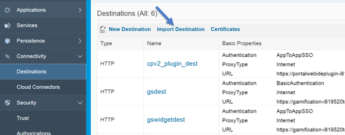

## Prerequisites  
 - **Proficiency:** Intermediate
 - **Tutorials:** [Configure the SAP Cloud Platform Destination for SAP Jam Collaboration API SSO](https://www.sap.com/developer/tutorials/jam-cloud-api-sso-configure.html)

## Next Steps
- [Activate SAP Web IDE plugins on SAP Cloud Platform](https://www.sap.com/developer/tutorials/jam-cloud-webide-plugins-activate.html)

## Details
### You will learn  
In this tutorial, you will learn how to configure the SAP Web IDE SAP Jam Collaboration Destination on SAP Cloud Platform.

To enable your SAP Web IDE to recognize the SAP Jam Collaboration UI5 mobile components you will need to register a second destination on SAP Cloud Platform.

### Time to Complete
**15 Min**

---

[ACCORDION-BEGIN [Step 1: ](Create the destination configuration file on SAP Cloud Platform)]

1.  Create a file named `sapjam\_webide\_repo`
2.  Copy and paste the following into this file:
    ```
    Description=SAP Jam Plugins
    Type=HTTP
    TrustAll=true
    Authentication=NoAuthentication
    WebIDEUsage=plugin_repository
    Name=sapjam_webide_repo
    WebIDEEnabled=true
    CloudConnectorVersion=2
    URL=https:\//raw.githubusercontent.com/SAP/SAPJamSampleCode/master/hcp_samples/
    ProxyType=Internet  
    ```
3.  Save this file.
4.  If you configure the destination manually, all values must be the same including the name of the destination.


[ACCORDION-END]

[ACCORDION-BEGIN [Step 2: ](Import the destination configuration file into SAP Cloud Platform)]

1.  Login to the _Hana Cloud Server Cockpit_
2.  Select your account
3.  Click **Connectivity**
4.  Click **Destinations**
5.  Click **Import Destination**
6.  Select your destination configuration file `sapjam\_developer` and click **Open**.
7.  Click **Save**



Figure 1: Import your destination configuration file into SAP Cloud Platform


[ACCORDION-END]

---

## Next Steps
- [Activate SAP Web IDE plugins on SAP Cloud Platform](https://www.sap.com/developer/tutorials/jam-cloud-webide-plugins-activate.html)
