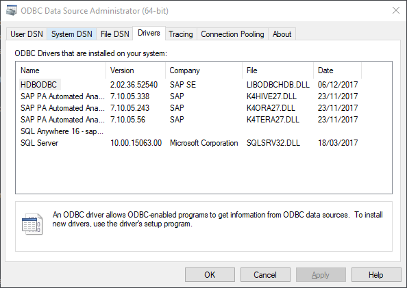
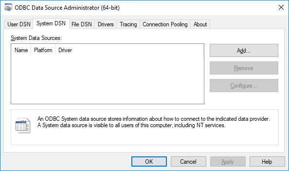
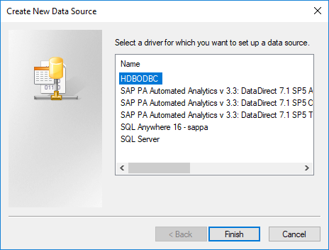
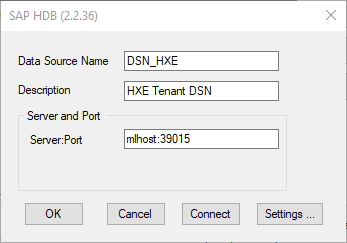
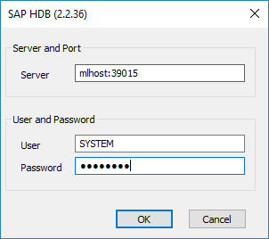
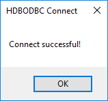
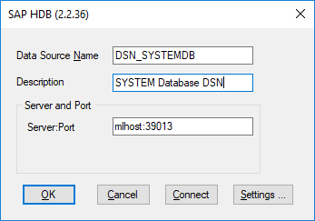
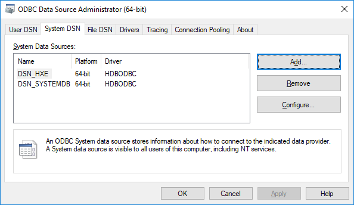

## Prerequisites  
- Proficiency: intermediate

### You will learn
In this tutorial, you will install the SAP HANA client for SAP HANA, express edition.

Then, you will learn how to connect your SAP HANA, express edition instance using the Linux `isql` tool as a ODBC based querying tool.

The Linux `isql` tool is included in the `unixODBC` package. Please refer to your system documentation for installation instructions.

On Windows environments, there is no pre-installed tool available.

## Details

### Time to Complete
**10 Min**.

[ACCORDION-BEGIN [Step 1: ](Download the SAP HANA client)]

After registering to download [SAP HANA, express edition](https://www.sap.com/developer/topics/sap-hana-express.html), use the **Download Manager** to retrieve the client package for the system you will connect from.

The package names are:

 - Linux (x86/64) : `clients_linux_x86_64.tgz`
 - Windows: `clients_windows.zip`

The downloaded archive for the client package contains both the ***SAP HANA HDB Client*** and the ***SAP HANA XS CLI***.

The ***SAP HANA HDB Client*** software package includes the following connectivity/drivers:

 - SQLDBC
 - ODBC
 - JDBC
 - Python (`PyDBAPI`)
 - Node.js
 - Ruby

Here you will install the ***SAP HANA HDB Client*** only.

[ACCORDION-END]

[ACCORDION-BEGIN [Step 2: ](Install the SAP HANA client)]

#### **Connecting from Linux environments**

First, you need to extract the contents of the downloaded package:

```bash
tar -xvzf /opt/hxe/clients_linux_x86_64.tgz -C /opt/hxe
```

The following files will be extracted:

 - ***`hdb_client_linux_x86_64.tgz`*** : the *SAP HANA HDB Client* software package
 - ***`xs.onpremise.runtime.client_linuxx86_64.zip`*** : the *SAP HANA XS CLI* software package

You need now to decompress the *SAP HANA HDB Client* package executing the following command:

```bash
tar -xvzf /opt/hxe/hdb_client_linux_x86_64.tgz -C /opt/hxe/installer
```

And now you can run the installer program executing the following commands:

```bash
sudo su -l hxeadm

cd /opt/hxe/installer/HDB_CLIENT_LINUX_X86_64
./hdbinst

exit
```

Accept the prompts default values to configure your installation:

 - Installation Path : `/usr/sap/hdbclient`

Once the installation is completed, you should get the following elements in your console:

```
Installation done
```

#### **Connecting from Windows environments**

First, you need to extract the contents of the downloaded package using your favorite archive manager (for example `7zip`, `WinZip` or `WinRar`).

The following files will be extracted:

 - ***`hdb_client_windows_x86_32.zip`*** : the *SAP HANA HDB Client* software package for Windows 32 bits platforms
 - ***`hdb_client_windows_x86_64.zip`*** : the *SAP HANA HDB Client* software package for Windows 64 bits platforms
 - ***`xs.onpremise.runtime.client_ntamd64.zip`*** : the *SAP HANA XS CLI* software package

You need now to decompress the *SAP HANA HDB Client* package for your target platform.

And now you can run the installer program executing the `hdbsetup.exe` application located in the `HDB_CLIENT_WINDOWS_X86_64` directory.

Accept the prompts default values to configure your installation:

 - Installation Path : `C:\Program Files\sap\hdbclient`

Once the installation is completed, you should get the following elements in your console:

```
Installation finished successfully
```

[ACCORDION-END]

[ACCORDION-BEGIN [Step 3: ](Locate the ODBC Driver)]

The driver (`lbodbcHDB.dll/so`), which is installed as part of the SAP HANA client, is located at (unless specified otherwise during the installation):

 - on Linux and UNIX platforms `/usr/sap/hdbclient/`
 - on Microsoft Windows platforms: `C:\Program Files\SAP\hdbclient\`

[ACCORDION-END]

[ACCORDION-BEGIN [Step 4: ](Configure the driver)]

#### **Connecting from Linux environments**

For the Linux environment, you will first need the **`unixODBC`** package to be installed.

Please refer to your system documentation for installation instructions.

In addition, it is important to create the following addition symbolic links:

```shell
ln -s /etc/unixODBC/odbc.ini /etc/odbc.ini
ln -s /etc/unixODBC/odbcinst.ini /etc/odbcinst.ini
```

To validate that **`unixODBC`** is properly installed, you can run the following command to print the current version:

```shell
odbcinst --version
```

Now, you can append HDBODBC driver definition to the `unixODBC` drivers file (in **`/etc/odbcinst.ini`**):

```shel
[ODBC]
TraceFile   = /tmp/sql.log
Trace       = No

[HDBODBC]
Driver      = /usr/sap/hdbclient/libodbcHDB.so
Description = SAP HANA ODBC Driver
FileUsage   = 1

```

To validate that the SAP HANA ODBC Driver is properly registered, you can run the following command:

```shell
odbcinst -q -d
```

The following output should be returned:

```
[HDBODBC]
```

#### **Connecting from Windows environments**

To validate that the SAP HANA ODBC Driver is properly registered, run the **ODBC Data Source Administrator (64 bits)** using the following command and switch to the **Drivers** tab:

```shell
odbcad32
```



[ACCORDION-END]

[ACCORDION-BEGIN [Step 5: ](Configure your connections)]

Before connecting  with ODBC, you need to create an ODBC DSN (Data Source Name).

ODBC DSN can either be added as ***User*** or ***System*** DSN. A ***System*** DSN will be visible to any user compared to ***User*** DSN which are defined per users.

We will be configuring ***System*** DSN in this tutorial, but if you don't have the permission you can replicate with ***User*** DSN .

#### **Connecting from Linux environments**

To add your ODBC DSN on Linux environments, you need to add the a new section to your `odbc.ini` file.

This section will be based on the following template:

```
[<ODBC DSN Name>]
ServerNode  = <host>:<port>
Driver      = HDBODBC
Description = <description>
```

Edit the System DSN `odbc.ini` file is located in `/etc/odbc.ini` and append the following:

```shell
[DSN_HXE]
ServerNode  = <server ip>:39015
Driver      = HDBODBC
Description = HXE Tenant

[DSN_SYSTEMDB]
ServerNode  = <server ip>:39013
Driver      = HDBODBC
Description = SYSTEM Database
```

Make sure to update the `<server ip>` with the proper information.

> ### **Note** : for Docker users you will need to update the HXE port to ***39041*** and the SYSTEMDB one to ***39017***.
&nbsp;

To validate that your ODBC DSN are properly registered, you can run the following command:

```shell
odbcinst -q -s
```

The following output should be returned:

```
[HXE]
[SYSTEMDB]
```

#### **Connecting from Windows environments**

To add a new ODBC DSN, run the **ODBC Data Source Administrator (64 bits)** using the following command and switch to the **System DSN** tab:

```shell
odbcad32
```
Click on **Add...**.



Select **HDBODBC** and click on **Finish**.



Enter the following details (replace <server host> by your instance host name or IP address):

|-------------------|-------------|
| Data Source Name  | `DSN_HXE`
| Description       | HXE Tenant DSN
| Server:Port       | &lt;server host&gt;:39015

Click on **Connect**.



Enter the database user credentials and click on **OK**



The connection should be successful. Click on **OK**.



Repeat the steps for the SYSTEMDB:

|-------------------|-------------|
| Data Source Name  | `DSN_SYSTEMDB`
| Description       | SYSTEM Database DSN
| Server:Port       | &lt;server host&gt;:39013



At the end, you should have both the HXE and SYSTEMDB ODBC DSN listed.



> ### **Note** : for Docker users you will need to update the HXE port to ***39041*** and the SYSTEMDB one to ***39017***.
&nbsp;

[ACCORDION-END]

[ACCORDION-BEGIN [Step 6: ](Test the connections with SQL)]

#### **Connecting from Linux environments**

The `unixODBC` package comes with a command-line interactive SQL tool called `isql`.

You can run the `isql` command to get more details about the program options and switches:

In order to connect to the **`DSN_HXE`** DSN, you can run the following command (after adjusting the password):

```shell
echo "select * from M_DATABASES;" | isql DSN_HXE SYSTEM password -c -m10 -b
```

The result should look like this:

```
+-----------+-----------+-----------+-----------+-----------+-----------+-----------+
| DATABASE_N| DESCRIPTIO| ACTIVE_STA| ACTIVE_STA| OS_USER   | OS_GROUP  | RESTART_MO|
+-----------+-----------+-----------+-----------+-----------+-----------+-----------+
| HXE       | HXE-90    | YES       |           |           |           | DEFAULT   |
+-----------+-----------+-----------+-----------+-----------+-----------+-----------+
SQLRowCount returns 1
1 rows fetched
```

In order to connect to the **`DSN_SYSTEMDB`** DSN, you can run the following command (after adjusting the password):

```shell
echo "select * from M_DATABASES;" | isql DSN_SYSTEMDB SYSTEM password -c -m10 -b
```

The result should look like this:

```
+-----------+-----------+-----------+-----------+-----------+-----------+-----------+
| DATABASE_N| DESCRIPTIO| ACTIVE_STA| ACTIVE_STA| OS_USER   | OS_GROUP  | RESTART_MO|
+-----------+-----------+-----------+-----------+-----------+-----------+-----------+
| SYSTEMDB  | SystemDB-H| YES       |           |           |           | DEFAULT   |
| HXE       | HXE-90    | YES       |           |           |           | DEFAULT   |
+-----------+-----------+-----------+-----------+-----------+-----------+-----------+
SQLRowCount returns 2
2 rows fetched
```

#### **Connecting from Windows environments**

As stated before, there is no pre-installed querying tool installed by default on Windows environment.

There are several options available like:

 - `ODBC Test` by Microsoft:

    As part of the [Microsoft Data Access Components (MDAC) Software Development Kit](https://msdn.microsoft.com/en-us/library/ms810805.aspx) (which can be downloaded from the [Microsoft Download Center](https://www.microsoft.com/en-us/download/details.aspx?id=21995)), this tool shows all the ODBC API function call and allow you to run SQL

 - [`FlySpeed SQL Query`](https://www.activedbsoft.com/download-querytool.html) free edition by `ActiveDBSoft`

 - [`ODBC QueryTool`](https://sourceforge.net/projects/odbcquerytool/) on `SourceForge`

Make sure you always use a 64 bit version else your DSN won't be listed.

[ACCORDION-END]
