## Prerequisites  
 - **Proficiency:** Beginner
 - **Tutorial:** [Step 3 - Create the Bootstrap Template](http://www.sap.com/developer/tutorials/react-add-javascript.html)

## Next Steps
 - **Tutorial:** [Step 5 - Convert components from static to dynamic](http://www.sap.com/developer/tutorials/react-dynamic-components.html)


## Details
### You will learn  
In this tutorial series, we will explore another technology for Single Page Application (SPA) development - React.  React is another popular web framework, and is used by many companies for both internal and client-facing systems.  These tutorials will parallel our SAPUI5 tutorials, building a visual interface using Angular, and connecting it to an OData back end service.

### Time to Complete
**10 Min**.

---

#### REACT tutorial series
**Step 4**: Move the JavaScript and CSS to separate files.  This file structure will make extending our application easier, and will more closely match a production application.

There are two steps:

1.  Move the JavaScript to a separate file
2.  Move the CSS to a separate file


---

### Move the JavaScript to a Separate File

First, let's move the JavaScript out of our application, and in to a proper place in our project.

1.  Right click on the folder `HelloReact` and select **New** --> **Folder**

    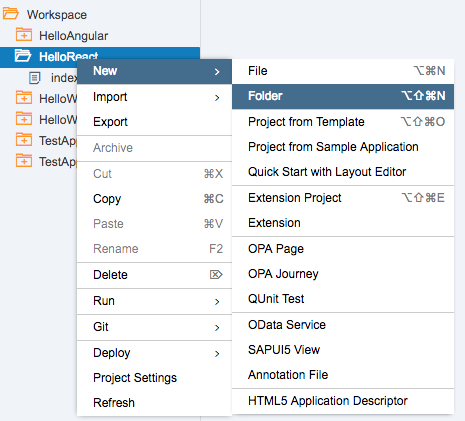

2.  Name the folder `js`, and click **OK**

    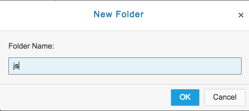

3.  Next, right click on the new `js` folder, and select **New** --> **File**

    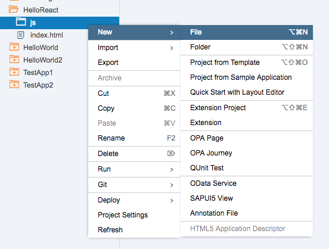

4.  Name this file `main.js` and click **OK**.

    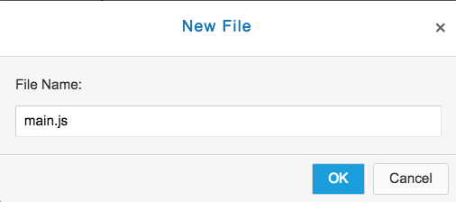

5.  Next, copy this code in to the new `main.js` file.  (It is the same code that is in your `index.html` file.)  Then click **Save**.

    ```javascript
    var ListBox = React.createClass({
        render: function() {
            return (
    			<button type="button" className="list-group-item" id="product-list">
    				<div className="row vertical-align">
    					<div className="col-sm-8 top">
    						<h4>Top Label</h4>
    						<p>10 boxes at 20 bags</p>
    					</div>
    					<div className="col-sm-3 text-right top">
    						<h4>
    							99.99
    							<small className="text-muted"> EUR</small>
    						</h4>
    						<p>Available</p>
    					</div>
    					<div className="col-sm-1 center">
    						<span className="glyphicon glyphicon-chevron-right pull-right" aria-hidden="true"></span>
    					</div>
    				</div>
    			</button>
    		);
        }
    });

    var ProductList = React.createClass({
    	render: function() {
    		return (
    			<div className="list-group">
    				<ListBox />
    				<ListBox />
    				<ListBox />
    			</div>
    		)
    	}
    });

    ReactDOM.render(
        <ProductList />,
        document.getElementById('product-list')
    );
    ```

    > **RED ERROR BOX**
    >
    > You will see a red error box next to your code.  You can ignore this error.
    >
    > This error comes from the JavaScript parser in Web IDE.  The current parser does not understand the JMX notation inside of our JavaScript.  The web application will still work correctly.

    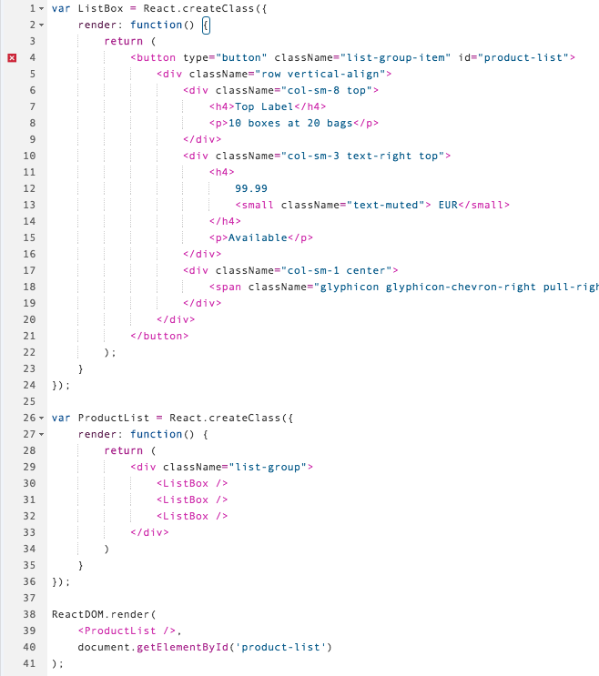

6.  Next, we will delete the JavaScript out of the `index.html` file.  Select the entire text from `<script type="text/babel">` to `</script>`, and then press the delete key.  Save your file.

    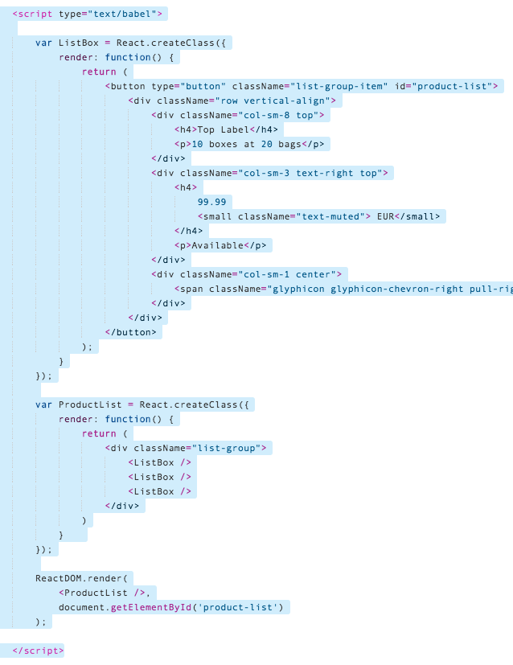

7.  Insert a link to the new file, so that the `index.html` file loads your new JavaScript file.  

    Under the `</style>` tag, add the following HTML

    ```html
    <script src="/js/main.js" type="text/babel"></script>
    ```

    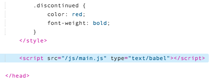

8.  Run your application.  The page should look exactly the same, as the JavaScript now runs from an external file.

    


---

### Move the CSS file to a separate file

Follow the same procedures to move the CSS file

1.  Right click on the folder `HelloReact` and select **New** --> **Folder**

    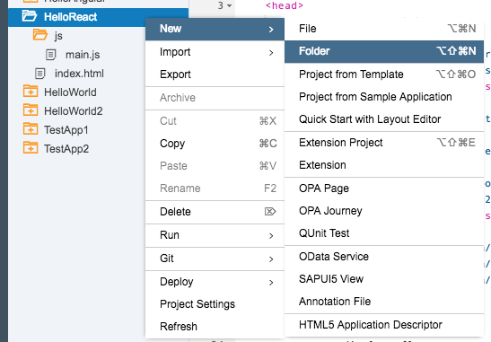

2.  Name the folder `css`, and click **OK**

    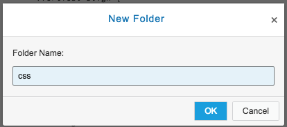

3.  Next, right click on the new `css` folder, and select **New** --> **File**

    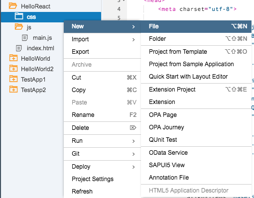

4.  Name this file `main.css` and click **OK**.

    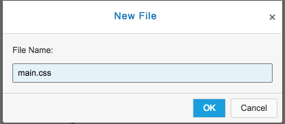

5.  Next, copy this code in to the new `main.css` file.  (It is the same CSS that is in your `index.html` file.)  Then click **Save**.

    ```css
    .vertical-align {
        display: flex;
        align-items: baseline;
    }

    .vertical-align .top {
        align-self: baseline;
    }

    .vertical-align .center {
        align-self: center;
    }

    .available {
        color: green;
        font-weight: bold;
    }

    .discontinued {
        color: red;
        font-weight: bold;
    }
    ```

    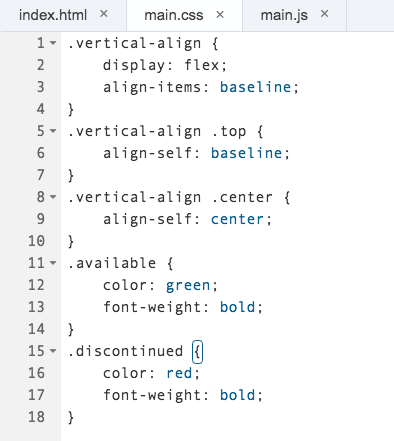

6.  Next, we will delete the `<style>` tag out of the `index.html` file.  Select the entire text from `<style>` to `</style>`, and then press the **delete** key.  Save your file.

    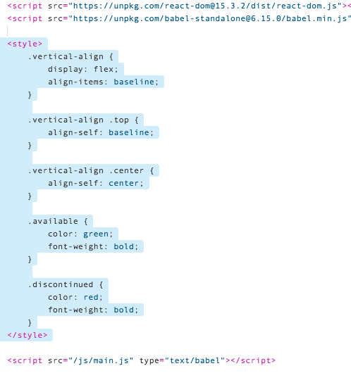

7.  Insert a link to the new file, so that the `index.html` file loads your new JavaScript file.  

    Under the last `<script>` tag (the one you just inserted), add the following HTML:

    ```html
    <link href="/css/main.css" rel="stylesheet">
    ```

    

8.  Run your application.  The page should look exactly the same, as the CSS file now loads from an external file.

    


---

## Final Code

Your project should now contain three files.  Here is the complete text of each file:

-  `index.html`

    ```html
    <!DOCTYPE HTML>
    <html lang="en">
    	<head>
    		<meta charset="utf-8">

    		<script src="https://code.jquery.com/jquery-3.1.0.min.js"
    			integrity="sha256-cCueBR6CsyA4/9szpPfrX3s49M9vUU5BgtiJj06wt/s="
    			crossorigin="anonymous"></script>

    		<link href="https://maxcdn.bootstrapcdn.com/bootstrap/3.3.7/css/bootstrap.min.css"
    			rel="stylesheet"
    			integrity="sha384-BVYiiSIFeK1dGmJRAkycuHAHRg32OmUcww7on3RYdg4Va+PmSTsz/K68vbdEjh4u"
    			crossorigin="anonymous">
    		<script src="https://maxcdn.bootstrapcdn.com/bootstrap/3.3.7/js/bootstrap.min.js"
    			integrity="sha384-Tc5IQib027qvyjSMfHjOMaLkfuWVxZxUPnCJA7l2mCWNIpG9mGCD8wGNIcPD7Txa"
    			crossorigin="anonymous"></script>

    		<script src="https://unpkg.com/react@15.3.2/dist/react.js"></script>
        	<script src="https://unpkg.com/react-dom@15.3.2/dist/react-dom.js"></script>
        	<script src="https://cdnjs.cloudflare.com/ajax/libs/react-bootstrap/0.30.5/react-bootstrap.js"></script>
        	<script src="https://unpkg.com/babel-standalone@6.15.0/babel.min.js"></script>

    		<script src="/js/main.js" type="text/babel"></script>
    		<link href="/css/main.css" rel="stylesheet">

    	</head>

    	<body>

    	    <div class="container">
    			<div id="product-list"></div>
    		</div>

    	</body>
    </html>
    ```

-  `main.css`

    ```css
    .vertical-align {
        display: flex;
        align-items: baseline;
    }
    .vertical-align .top {
        align-self: baseline;
    }
    .vertical-align .center {
        align-self: center;
    }
    .available {
        color: green;
        font-weight: bold;
    }
    .discontinued {
        color: red;
        font-weight: bold;
    }
    ```

-  `main.js`

    ```javascript
    var ListBox = React.createClass({
        render: function() {
            return (
    			<button type="button" className="list-group-item" id="product-list">
    				<div className="row vertical-align">
    					<div className="col-sm-8 top">
    						<h4>Top Label</h4>
    						<p>10 boxes at 20 bags</p>
    					</div>
    					<div className="col-sm-3 text-right top">
    						<h4>
    							99.99
    							<small className="text-muted"> EUR</small>
    						</h4>
    						<p>Available</p>
    					</div>
    					<div className="col-sm-1 center">
    						<span className="glyphicon glyphicon-chevron-right pull-right" aria-hidden="true"></span>
    					</div>
    				</div>
    			</button>
    		);
        }
    });

    var ProductList = React.createClass({
    	render: function() {
    		return (
    			<div className="list-group">
    				<ListBox />
    				<ListBox />
    				<ListBox />
    			</div>
    		)
    	}
    });

    ReactDOM.render(
        <ProductList />,
        document.getElementById('product-list')
    );
    ```


## Next Steps
 - **Tutorial:** [Step 5 - Convert components from static to dynamic](http://www.sap.com/developer/tutorials/react-dynamic-components.html)
