## Prerequisites  
 - **Proficiency:** Beginner
 - **Tutorials:** [Core Data  Services, Preparing views for Associations/Joins]

## Next Steps
[Creating OData-Service based on CDS-view. ](http://go.sap.com/developer/tutorials/s4hana-cds-creating-odata-service.html)


## Details
You will learn  
- How to join many views together.

### Time to Complete
 Beginners might take **15-20 minutes** to execute this tutorial.

---


**Availability of the basic view from previous tutorials of this series**

- Make sure that the basic view from the previous tutorials of this series is available

     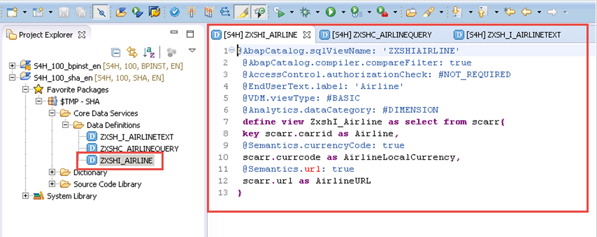


**Enhancement of the basic view `ZXSHI_AIRLINE` with Annotations**

- Let's consider the coding of the view `ZXSHI_AIRLINE` again. We will enhance that code by inserting new annotations:
  - Annotation to make the view usable for BW by inserting the line below after line 6
    ```abap
      @Analytics.dataExtraction.enabled: true
     ```

    

    

  - Annotation  to enable the Joins by inserting the line below after line 7
    ``` abap
      @ObjectModel.representativeKey: 'Airline'
      ```

     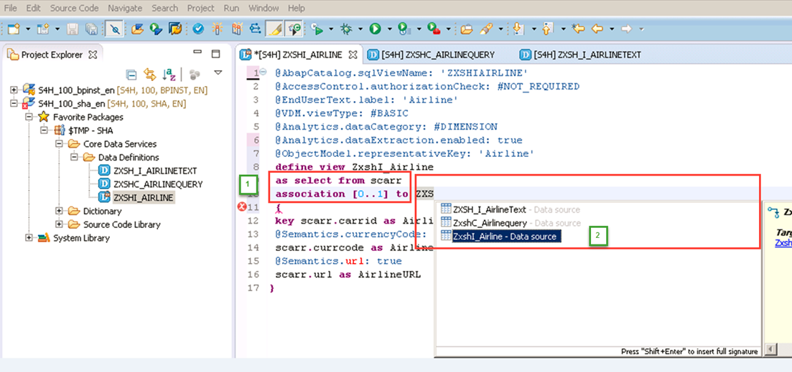

     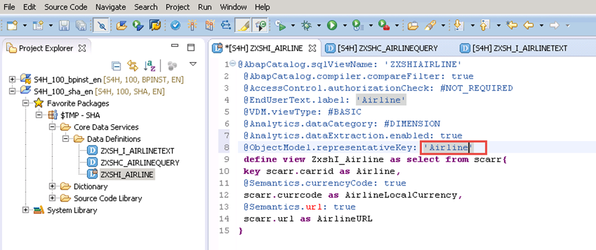


**Removing the filter from the code**  

- Since we do not use any filter, we will delete the line 2 ( `@AbapCatalog.compiler.compareFilter: true`) from the code.

     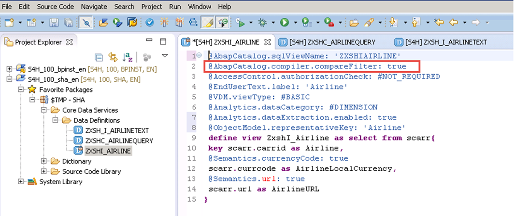

     


**Adding Association annotations**

- We will enhance the code to make it capable for joins. To achieve this the following line code will be inserted after line 8 in the code.

`...as select from scarr association [0..1] to ZXSH_I_AirlineText `

    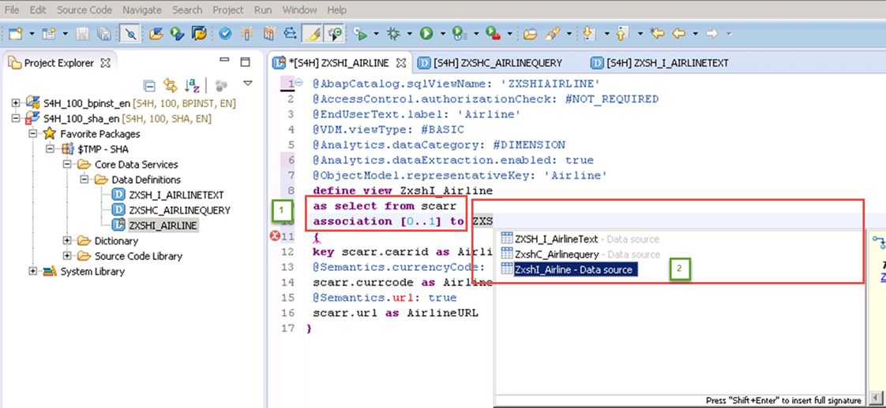

    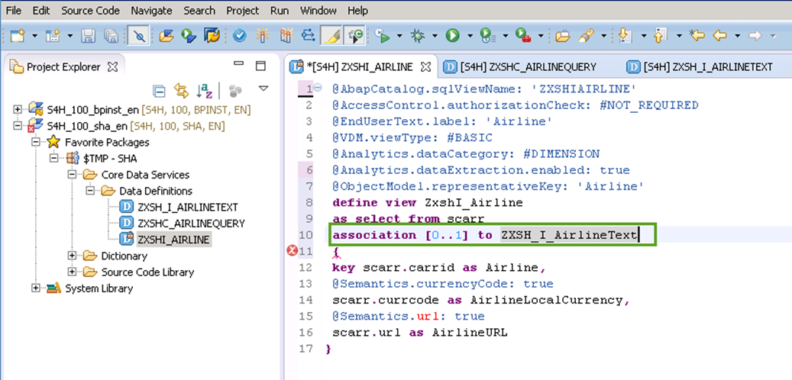


**Inserting the alias text `_Text`**

- To display the Carrer name we will enhance the code  by inserting the alias `_Text`

     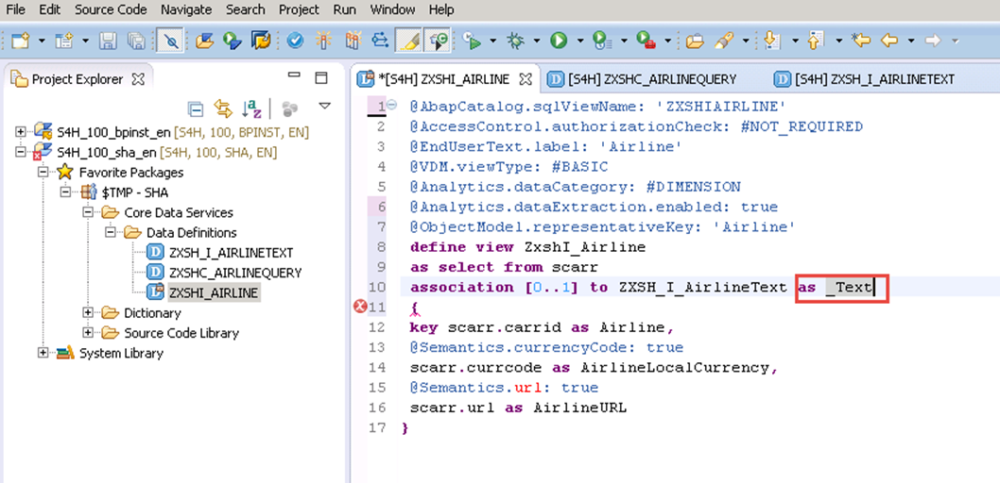


**Define the Join projection**

- Further enhancement  for e.g. projection capacity to make the view joinable is necessary. To achieve this,  we will extend the above alias insertion with `on $projection.Airline = _Text.Airline`  

    

> If you hover the icon on the line 10 the following message will be displayed:  `Association _Text is not used`

   

- The alias `_Text` must be declared (`2`) and the comma (`1`) at the end of line 17 must not be omitted. Afterwards, save and activate the code.

    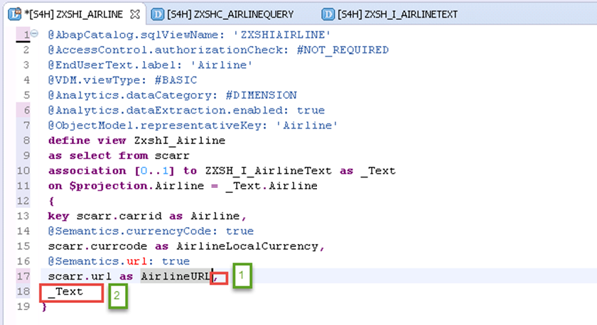

**Preview the content of the view**

- We can now preview the content of the  view `ZXSHI_AIRLINE`. On the left panel, select and right-click on the view `ZXSHI_AIRLINE`, select `Open Data Preview` and then press `Enter`.

      

   

> As you may have noticed, the Airline Name is not visible on the preview screen.

- Let us now enhance line 18 of the code as follow: `_Text.AirlineName`. Save the change, activate it and preview the view's content again.


   

   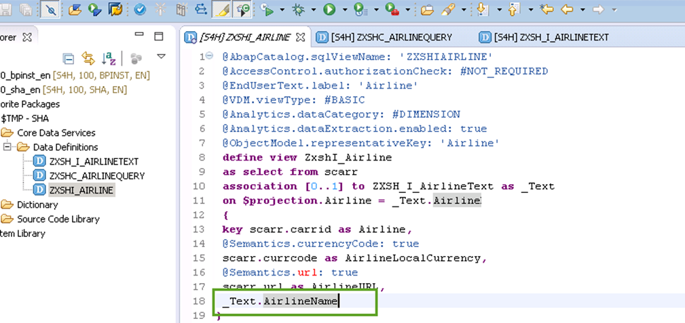

   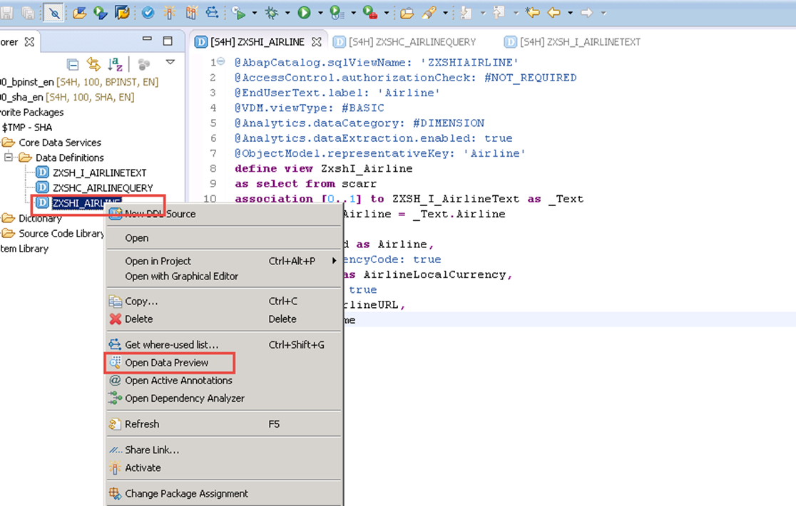

> In the preview screen you will see now a new column labeled with `AirlineName` displaying the Carrer name.

    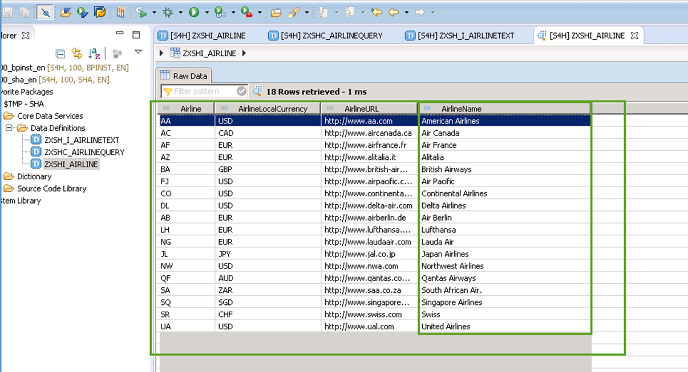

- To handle the next exercise of this series , we will modify  the line 18 again by removing the extension `AirlineName` from `_Text.AirlineName` to have `_Text`. We will now have to save and activate our change.

    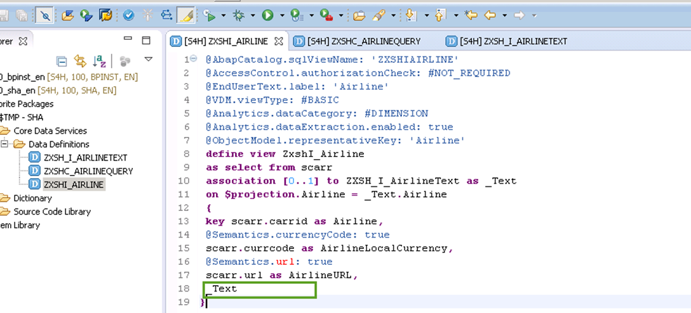

**Help:** You can copy this content from here and paste it to the code editor of your ABAP perspective as well, instead of enhancing the generated code and typing on your own:
``` abap
@AbapCatalog.sqlViewName: 'ZXSHIAIRLINE'
@AccessControl.authorizationCheck: #NOT_REQUIRED
@EndUserText.label: 'Airline'
@VDM.viewType: #BASIC
@Analytics.dataCategory: #DIMENSION
@Analytics.dataExtraction.enabled: true
@ObjectModel.representativeKey: 'Airline'
define view ZxshI_Airline
as select from scarr
association [0..1] to ZXSH_I_AirlineText as _Text
on $projection.Airline = _Text.Airline
{
key scarr.carrid as Airline,
@Semantics.currencyCode: true
scarr.currcode as AirlineLocalCurrency,
@Semantics.url: true
scarr.url as AirlineURL,  
_Text

}
```

**Notes**
> Although SAP offers trial editions for free you will still have to cover the costs for running these trial editions on AWS!

### Related information
This tutorial is part of the S/4HANA Core Data Services

1. [Amazon Web Services](http://aws.amazon.com/)
2. [SAP Cloud Appliance Library (CAL)](https://scn.sap.com/community/cloud-appliance-library)
3. [Alternative AWS Deployment for SAP Trials provided as Virtual Appliance](https://scn.sap.com/docs/DOC-46908)
4. [Virtual Private Cloud with VPN Access for SAP Trials provided as Virtual Appliance](https://scn.sap.com/docs/DOC-46629)
