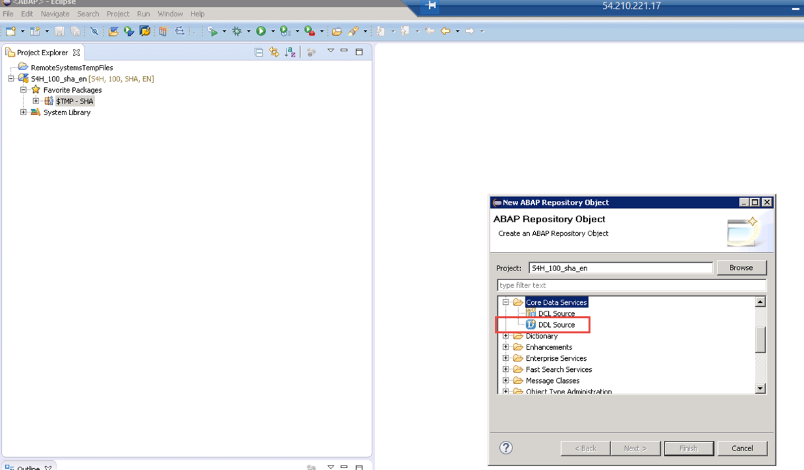
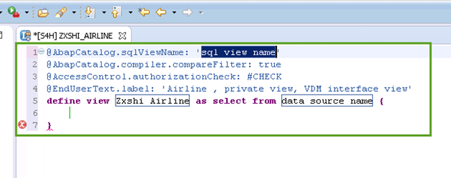

## Prerequisites  
 - **Proficiency:** Beginner
 - **Tutorials:** [Setting and starting an S4/HANA CAL instance and connecting to a Window instance on Amazon Web Services. ](http://go.sap.com/developer/tutorials/hana-setup-cloud.html)

## Next Steps
[Creating consumption view based on basic/interface view. ](http://go.sap.com/developer/tutorials/s4hana-cds-creating-consumption-view.html)


## Details
You will learn  
- How to create a basic view on top of data content in the  demo table SCARR from ABAP system.

### Time to Complete
 Beginners might take **15-25 minutes** to execute this tutorial.

---

**Preparing the ABAP perspective**

- Make sure that your Eclipse framework from the S/4HANA instance is opened in the ABAP perspective:

     

- You are now in the ABAP Eclipse perspective. Make sure you are in the Project Explorer tab. Here we will create in the `TMP-SHA` Package a new repository ABAP object for type DDL source.
Select the package `TMP-SHA`. Right-click on the selected package, select `New` and then press `Others ABAP Repository Objects`, in the opened  ABAP Repository Object window scroll down to the folder `Core Data Services`. Expand the folder `Core Data Services`, select `DDL Source` and press `Finish`.  

    

    

- In the new window DDL Source (Specify a value for field Name), Project and Package are named respectively as `S4H_100_sha_en` and `$TMP`. Enter `Airline, private view, VDM interface view`  as Description and `ZXSHI_AIRLINE` as Name and press `Finish`.

    

    

- In the new window DDL Source (Templates Select one of the available templates), select `Define View` and press `Finish`

    

**Generating a Code for the view**

- A code for the new created view named `ZXSHI_AIRLINE` is generated:

    

- At the line 5 of the generated code, we will replace `data source name` with the ABAP table `scarr`.  To achieve this delete  the text `data source name` and then enter `sca` follows by the taste combination `Crtl + Space bar`. Doing so a window will appear when you will select `scarr-data`.

    

**The Table SCARR**
- We will now open the ERP System(by Clicking the SAP Log On icon)`S4H Client 100`.
Enter `sha` as User and `Welcome1` as Password. Afterward press Enter.

      

- In the next window enter the  ABAP transaction `se16` (`1`) and afterward press the `Enter` button(`2`)

   

- In the next window enter `scarr` as Table Name (`1`) and press the Table Contents icon (`2`):

    

- The content of the table `scarr` will be displayed. The table has `18` entries.

    
- Now we will switch back to the project explorer view of the Eclipse ABAP perspective. Here let's consider our generated coding again. We will enhanced the code by inserting the columns of the table `scarr`. To achieve this, position the mouse pointer before the bracket near the table name `scarr`, press `Ctrl + Space bar`. Within the displayed window select `insert all elements` and press `Enter`.

    

All the columns of the table `scarr` are now inserted in the previous code. Enhance each column with an Alias as following:
 - Line 6:  `scarr.carrid` as `Airline`,
 - Line 7:  `scarr.currcode` as `AirlineLocalCurrency`,
 - Line 8:  `scarr.url` as `AirlineURL`
Expand the folder `$TMP-SHA` on the left panel. Afterward  expand its subfolder `Core Data Services`. Doing so, you will see in the subfolder `Data Definitions` the newly created basic view named `ZXSHI_AIRLINE`

  

**Display the content of the basic view `ZXSHI_AIRLINE`**

- On the left panel, select and right-click on the view `ZXSHI_AIRLINE`, select `Open With` and then press `Data Preview`  

    

- In the new opened window, the content of the basic view `ZXSHI_AIRLINE` is displayed , showing `18` rows in tree columns.

     
- Switch back to the generated code of the basic view. There  we will enhance the blue marked lines.

     

In the code area, replace texts as following:
 - Line 1: `sql_view_name` with `ZXSHIAIRLINE`
 - Line 4: `Airline, private..` with `Airline`
After Airline, insert a new annotation  as following:
 `@VDM.view.Type:#BASIC`.

    

    

    
    
    

- After line 5, insert line 6 with a new annotation `@Analytics: DataCategory: #DIMENSION`

     

     

     

- Enhance the code by inserting two new annotations as
  following:
     `(1)` after the line including `scarr.carrid` as `Airline` insert `@Semantics.currencyCode: true`
     `(2)`after the line including `scarr.currcode` as `AirlineLocalCurrency` insert `@Semantics.url: true`

     

- In the line 3 of the code, replace `CHECK` with `NOT_REQUIRED`

    

- On the right panel, select and right-click on the view `ZXSHI_AIRLINE`, select `Open With` and then press `Data Preview`

    

    

**Help:** You can copy this content from here and paste it to the code editor of your ABAP perspective as well instead of enhancing the generated code on your own:

``` abap
 @AbapCatalog.sqlViewName: 'ZXSHIAIRLINE'
 @AbapCatalog.compiler.compareFilter: true
 @AccessControl.authorizationCheck: #NOT_REQUIRED
 @EndUserText.label: 'Airline'
 @VDM.viewType: #BASIC
 @Analytics.dataCategory: #DIMENSION
 define view ZxshI_Airline as select from scarr{
 key scarr.carrid as Airline,
 @Semantics.currencyCode: true
 scarr.currcode as AirlineLocalCurrency,
 @Semantics.url: true
 scarr.url as AirlineURL    
}
```

**Notes**
> Although SAP offers trial editions for free you will still have to cover the costs for running these trial editions on AWS!

### Related information
This tutorial is part of the S/4HANA Core Data Services

1. [Amazon Web Services](http://aws.amazon.com/)
2. [SAP Cloud Appliance Library (CAL)](https://scn.sap.com/community/cloud-appliance-library)
3. [Alternative AWS Deployment for SAP Trials provided as Virtual Appliance](https://scn.sap.com/docs/DOC-46908)
4. [Virtual Private Cloud with VPN Access for SAP Trials provided as Virtual Appliance](https://scn.sap.com/docs/DOC-46629)
