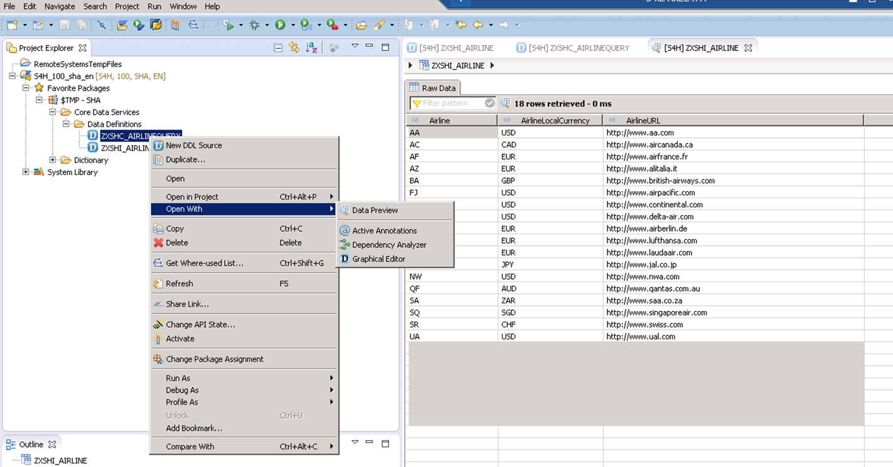
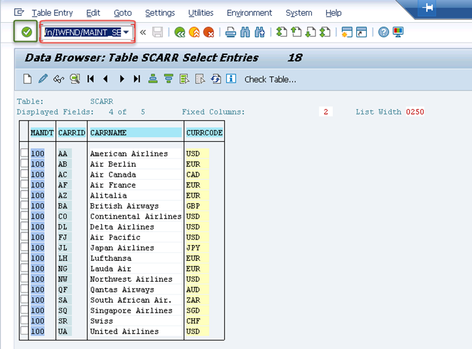
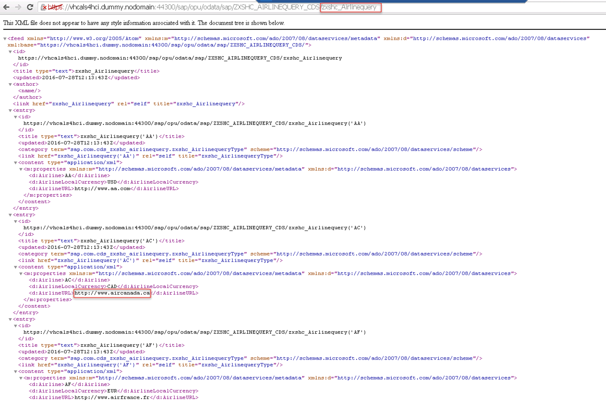
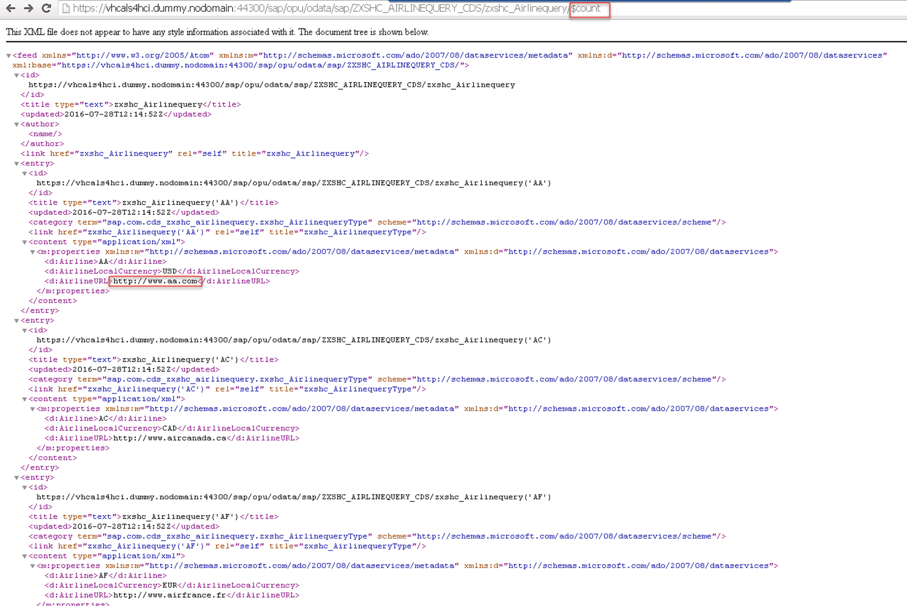

## Prerequisites  
 - **Proficiency:** Beginner
 - **Tutorials:** [Creating Consumption views based on basic/interface views.
  ](http://go.sap.com/developer/tutorial-navigator.html)

## Next Steps
 - Select a tutorial from the [Tutorial Navigator](http://go.sap.com/developer/tutorial-navigator.html) or the [Tutorial Catalog](http://go.sap.com/developer/tutorials.html)

## Details
You will learn  
- How to create OData Services based on the exposure of Consumption views.

### Time to Complete
Beginners might take **15-20 minutes** to execute this tutorial.

---

**Preview the content of the consumption view `ZXSHC_AIRLINEQUERY`**

- Make sure that your Eclipse Framework is opened in the ABAP perspective. In the project explorer tab select  `ZXSHC_AIRLINEQUERY` in the sub folder Core Definitions.  Right-click on that folder, select `Open With` and then press `Data Preview`, in the opened  tab on the right side, the content of the consumption view is displayed.

    

- Switch back to the tab **`ZXSHC_AIRLINEQUERY`** of the code editor. Mouse over the small icon preceding the line 6. In the new displayed embedded window  the following text is displayed: `...Service ZXSHC_AIRLINEQUERY is created. Activation to be done manually(/IWFND/MAINT_SERVICE/)[OData Exposure] ...` . The command `/IWFND/MAINT_SERVICE` has to be executed in the ERP System for the service Exposure.

    

**Service registration OData activation and OData Exposure**

- Open the ERP System SHA from the SAP Log on, enter the command(transaction) `/IWFND/MAINT_SERVICE` and execute it.
    

- After the execution of the command `/IWFND/MAINT_SERVICE`  the `Activate and Maintain Services` window is displayed. This is where we register the consumption view and expose it as OData.

    

- On the `Activate and Maintain Services` window , click on the icon `Add Service`  

     

- A new window(`Add Selected Services`) get opened. In the new opened window, maintain the System Alias by pressing the `F4-Help` and selecting `LOCAL_PGW` in the system alias pop-up window.

   

- Enter as  Technical Service Name `ZXSHC_AIRLINEQUERY_CDS` (the name of the service)

   

- Press the icon `Get Services`, then press `Add Selected Services` and afterwards press Enter to complete this step.

   

   

- The pop-up window `Add Service` is opened with `prefilled` information therefore you don't need to make any change. Press on the icon `Local Object` to fill the package assignment(this will be filled with $TMP) and press `Enter` to continue. An information pop-up with the information `Service 'ZXSHC_AIRLINEQUERY_CDS' was created and it metadata was loaded successfully` will show up. Afterwards press Enter to complete the step.

   

   

- Switch back to the ABAP perspective. Now if you hover the icon(`1`) on the code editor you will read on the pop-up window that the view has been exposed as OData. Furthermore, if you press the `Check ABAP Developer Object` icon (`2`)

  

 and afterwards hover the icon on the code editor a new pop-up window will display the information that, the OData service has been generated.

   

- In the pop-up window on the code editor, click on the link labeled `OData-Service`

   

 After the above link's click, your default browser will be launched.

    

 You are now requested to log in.
 Fill User Name as`SHA`.
 Fill Password with your current ERP System password and press `Enter`.

  

- If you get this screen , that means actually everything is working properly and that the service has been correctly exposed.

  

- If you replace the URL extension `?sap-ds-debug=true` with `$metadata`  and press `Enter` , detailed information about the service will be displayed.

 

 

- If you now replace the above URL extension with  the query data name `zxshc_Airlinequery` follows by `/` , more detailed information as well as  service entities will be displayed

   

   

- If you replace the URL with `$count`  and afterwards press `Enter`, the number of entries will be displayed.

    

    

**Notes**
> Although SAP offers trial editions for free you will still have to cover the costs for running these trial editions on AWS!    

### Optional
 - Put any option steps here or remove this section if not applicable.

## Next Steps
 - Select a tutorial from the [Tutorial Navigator](http://go.sap.com/developer/tutorial-navigator.html) or the [Tutorial Catalog](http://go.sap.com/developer/tutorials.html)

## Related Information
- This tutorial is part of the S/4HANA Core Data Services
- If you want to learn more about the OData, click on the above link , all the OData syntax are explained and good documented: http://www.odata.org/documentation/
