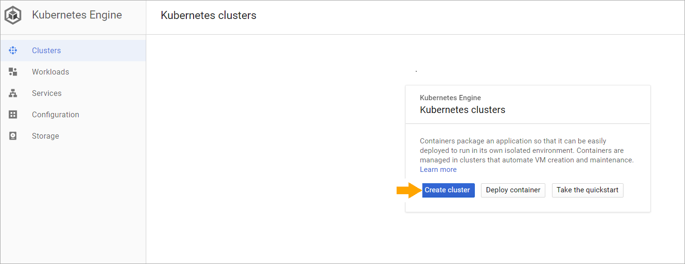
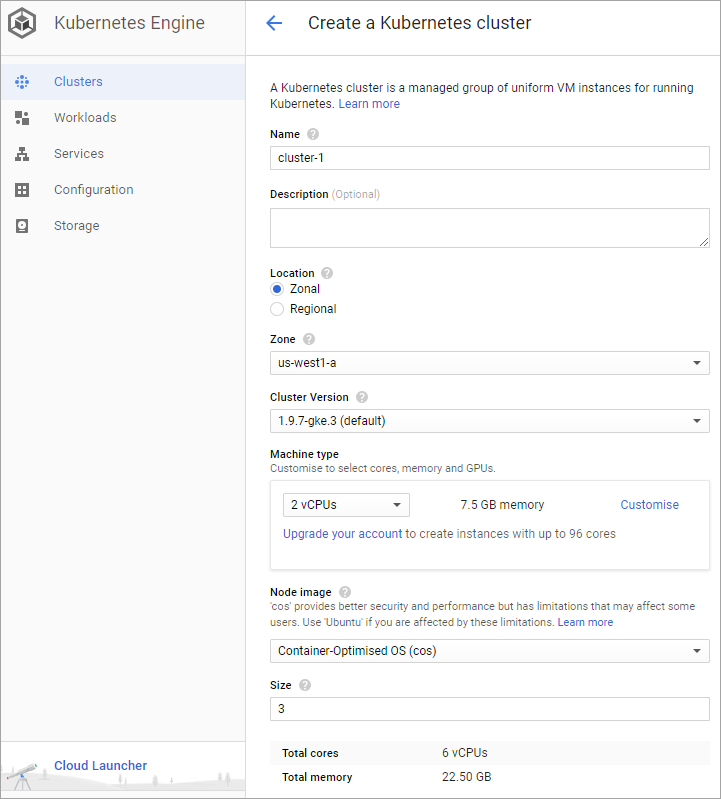
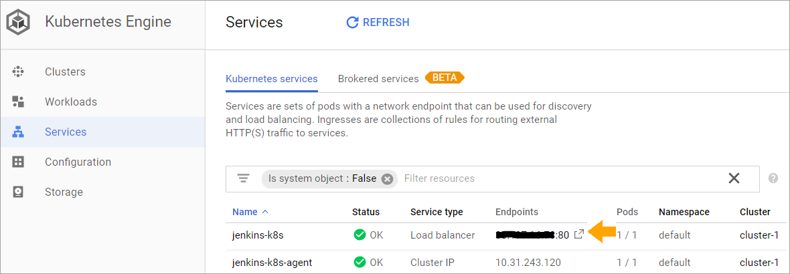
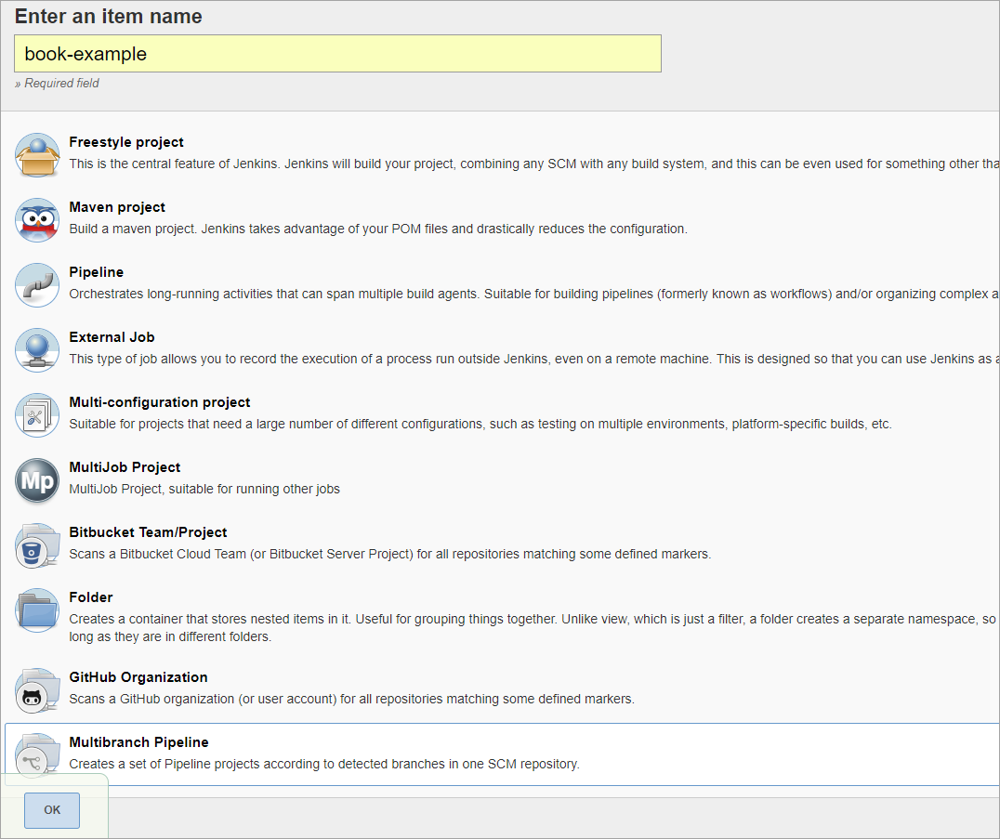
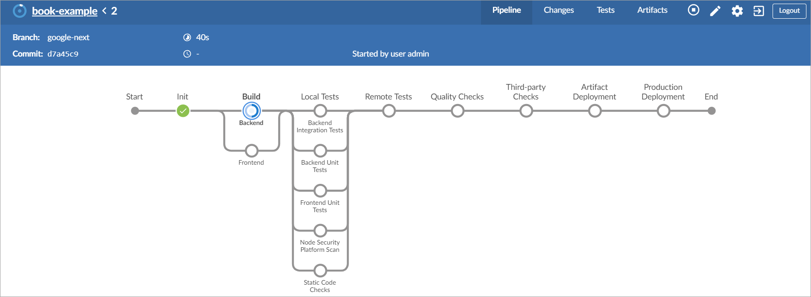
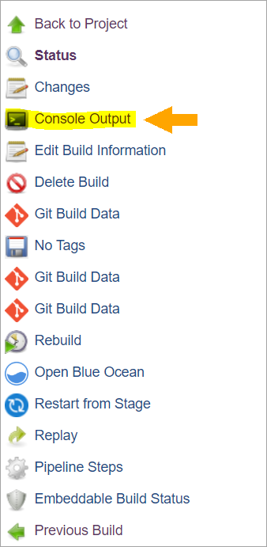

## Prerequisites  
 - **Proficiency:** intermediate

### You will learn
The SAP S/4HANA Cloud SDK helps developers in building cloud-native extensions to SAP's S/4HANA ERP system. For this, it offers a Java library, project archetypes, and a attuned Continuous Delivery Toolkit. In this tutorial, we will see how to set up a scalable SAP S/4HANA Cloud SDK CI/CD server on Google Kubernetes Engine within few minutes. We will also build an SAP S/4HANA Cloud SDK based example application using the out of the box pipeline.

### Win a Goodie
In addition to gaining hands-on experience, you can also win a goodie if you can successfully build the example project using this guide.

### Time to Complete
**15 Min**

[ACCORDION-BEGIN [Step 1: ](Prepare the Infrastructure)]
### Setup Kubernetes cluster

In this step, we will create a Kubernetes cluster which will be used in the following steps.  Let us create a Kubernetes cluster with 3 nodes which will contain 2 CPUs each.

To begin with, log in to your Google Cloud Platform account. In the Google Cloud Platform dashboard, navigate to `Kubernetes Engine` and click on the `Create cluster` button.



In the following page, change `Machine type` to use 2vCPUs. We will use default values for other parameters.



Click on create cluster. This will create a cluster named `cluster-1` with 3 nodes.  The creation of cluster might take a few minutes. Once it is created, you should see it in your cluster overview like illustrated below:


### Connect to Kubernetes cluster

Next, we need to connect to our freshly created cluster. Therefore, click on the `Connect` button displayed next to the cluster name. This will open a dialogue. Click on the `Run in Cloud Shell` option. This will open a browser based shell and open the connection from there.


Once the Cloud Shell is open, hit Enter. This will import `auth` data for the cluster and initializes the `kubeconfig` entries. This will be later used by the Kubernetes command line interface `kubectl` to communicate with the cluster.

Example:

```
Welcome to Cloud Shell! Type "help" to get started.
Your Cloud Platform project in this session is set to dulcet-provider-210508.
Use “gcloud config set project” to change to a different project.
user@my-project:~$ gcloud container clusters get-credentials cluster-1 --zone us-central1-a --project my-project
Fetching cluster endpoint and auth data.
kubeconfig entry generated for cluster-1.
```

[DONE]
[ACCORDION-END]

[ACCORDION-BEGIN [Step 2: ](Setup Jenkins)]

SAP S/4HANA Cloud SDK CI/CD Toolkit makes use of a pre-configured Jenkins to run the continuous delivery Pipeline. Next, we will start the Jenkins server with auto-scaling capabilities on our Kubernetes cluster. Thanks to the helm package manager tool, setting up the Jenkins on Kubernetes our cluster is super simple.

In order to make the installation even more convinient, we wrapped the installation in a small `setup_jenkins` shell script. To run it, execute the below commands in the cloud shell that is open. The `setup_jenkins` script will execute a `helm` command with custom values. This will create the service account that is required to run the Jenkins and agents along with the services to cater internal and external traffic to Jenkins.

```
wget -O setup_jenkins https://raw.githubusercontent.com/SAP/cloud-s4-sdk-book/google-next/cx-server/setup_jenkins
chmod 700 setup_jenkins
./setup_jenkins
```


The Jenkins that we have deployed is preconfigured with the libraries and the plugins that are required to execute the SAP S/4HANA Cloud SDK Pipeline.
In order to examine the deployment status, please navigate to `Workloads` menu and please wait until the deployment status turns to green. This will take a few minutes.


[DONE]
[ACCORDION-END]

[ACCORDION-BEGIN [Step 3: ](Connect to Jenkins)]

Once the setup is completed, it is time to build our first application with SAP S/4HANA Cloud SDK Pipeline. Navigate to Services menu under Kubernetes Engine and click on the endpoint of the `LoadBalancer` service.



### Login to Jenkins

Now you should see the Jenkins login page, which looks like the screenshot below:


In the login screen please key-in *admin* as both user and password.

[DONE]
[ACCORDION-END]

[ACCORDION-BEGIN [Step 4: ](Setup SAP S/4HANA Cloud SDK Pipeline)]

Once the login is successful you will see a Jenkins dashboard.


Click on create new jobs. In the following page choose a name of your choice for the item name field.  Choose a Multibranch Pipeline. Click on OK.



In the following page, choose the source location. For this demo, we have created an example application that you can make use of. Please select Git from the dropdown in `Add source` option.


Please provide https://github.com/SAP/cloud-s4-sdk-book.git as the location for Project Repository.

Our example repository has multiple branches and contains the example application for this tutorial in the branch `google-next`. If we do not limit the build job to this branch, Jenkins will start building dozens of branches. This might be too much work - even for our powerful Kubernetes cluster ;) In order to configure Jenkins to only build our branch of interest, let's configure this behavior by clicking on `add` in the `Behaviors` section.


Choose `Filter By Name (with wildcards)`. This will expand the options. Please use `google-next` as a value for the `include` field.  This will build only the branch `google-next`.


Save the configuration.

That’s All. You are done.

Congratulations! You have successfully setup your CI/CD infrastructure on Google Kubernetes Engine and started building the application from the `google-next` branch using SAP S/4HANA Cloud SDK Pipeline.

You can check the status of the pipeline execution in the Jenkins dashboard. Navigate to Jenkins dashboard and click on the `Open Blue Ocean` in the left hand side of the menu.




[DONE]
[ACCORDION-END]

[ACCORDION-BEGIN [Step 5: ](Win a Goodie)]

Please check the console output of the pipeline you have setup. Kindly show us the code that is displayed at the end of your log and win a Goodie.

First click on the branch name `google-next`. In the following window, click on the build number of the job.


Now click on the `Console output` menu and scroll down to the bottom of the log.



You will find a code for the goodie once the job is successfully completed.


[DONE]
[ACCORDION-END]

[ACCORDION-BEGIN [Step 6: ](Conclusion and Further reading)]

Unlike the standalone Jenkins instance, the Jenkins instance which is deployed on the Kubernetes cluster gives us the flexibility to scale it based on the load. In addition Kubernetes will ensure the availability of the service by regular health check of the containers.

To get an detailed insight in to SAP S/4HANA Cloud SDK, please go through our [blog posts]((https://blogs.sap.com/2017/05/10/first-steps-with-sap-s4hana-cloud-sdk/).  


