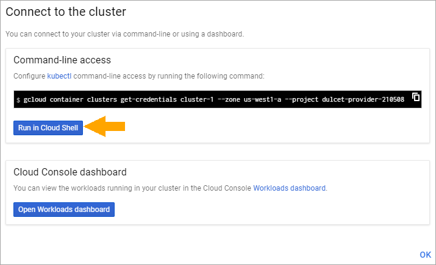
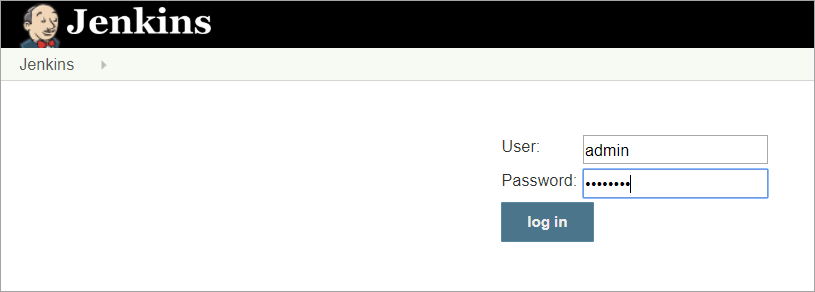
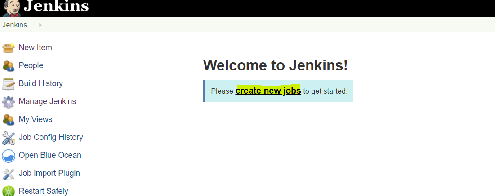
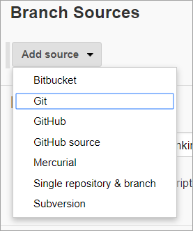
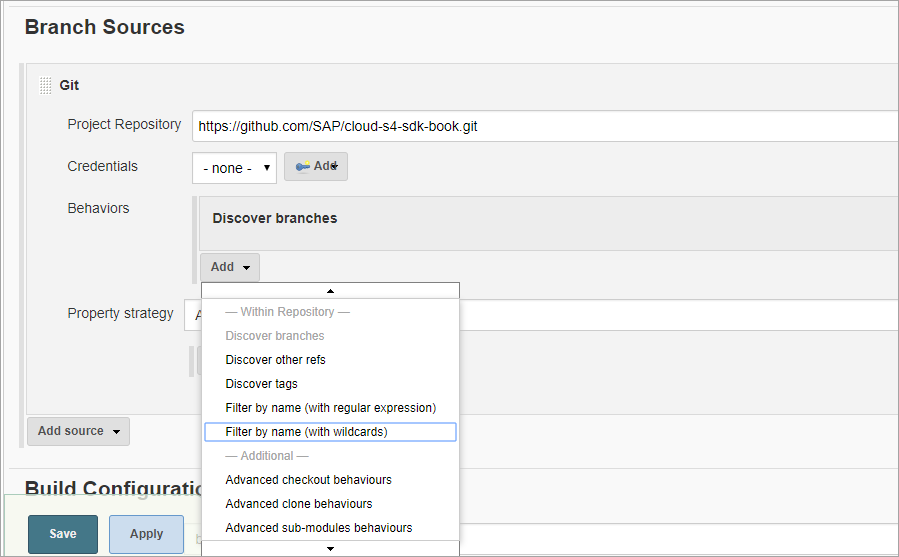
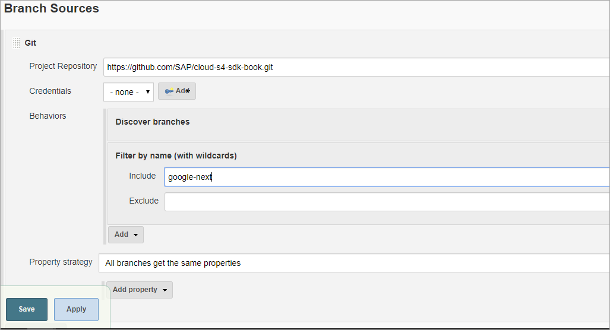

## Prerequisites  
 - **Proficiency:** intermediate

## Details
For a complete overview visit the [SAP S/4HANA Cloud SDK Overview](https://blogs.sap.com/2017/05/10/first-steps-with-sap-s4hana-cloud-sdk/).

### You will learn  
In this tutorial, we will see how to set up a scalable [SAP S/4HANA Cloud SDK CI/CD server ](https://www.sap.com/germany/developer/topics/s4hana-cloud-sdk.html) on Google Kubernetes Engine within few minutes. We will also build an example application using the out of the box pipeline.

### Win a Goodie
In addition to gaining hands-on experience, you can also win a goodie if you can successfully build the example project using this guide.

### Time to Complete
**15 Min**

[ACCORDION-BEGIN [Step 1: ](Prepare the Infrastructure)]
### Setup Kubernetes cluster

In this step, we will create a Kubernetes cluster which will be used in the following steps.  Let us create a Kubernetes cluster with 3 nodes which will contain 2 CPUs each.

To begin, log in to your Google Cloud Platform account. In the Google Cloud Platform dashboard, navigate to `Kubernetes Engine` and click on `create cluster`.


In the following page, change `Machine type` to use 2vCPUs. We will use default values for other parameters.


Click on create cluster. This will create a cluster named `cluster-1` with 3 nodes.  The creation of cluster might take a few minutes.


### Connect to Kubernetes cluster

Click on the `Connect` button displayed next to the cluster name. This will open a dialogue. Click on `Run in Cloud Shell` option.



Once the Cloud Shell is open, hit Enter. This will import `auth` data for the cluster and initializes the `kubeconfig` entries. This will be later used by a command line interface `kubectl` to communicate with the cluster.

Example:

```
Welcome to Cloud Shell! Type "help" to get started.
Your Cloud Platform project in this session is set to dulcet-provider-210508.
Use “gcloud config set project” to change to a different project.
user@my-project:~$ gcloud container clusters get-credentials cluster-1 --zone us-central1-a --project my-project
Fetching cluster endpoint and auth data.
kubeconfig entry generated for cluster-1.
```

[DONE]
[ACCORDION-END]

[ACCORDION-BEGIN [Step 2: ](Setup Jenkins)]

SAP S/4HANA Cloud SDK CI/CD Toolkit makes use of Jenkins to run the continuous delivery Pipeline. Let us set up the Jenkins with auto-scaling capabilities. we will use helm package manager tool to set up the Jenkins on Kubernetes cluster.

Execute the below commands in the cloud shell that is open. The `setup_jenkins` script will execute a `helm` command with custom values. This will create all the service account that are required to run the Jenkins ad agents along with the services to cater internal and external traffic.

```
wget -O setup_jenkins https://raw.githubusercontent.com/SAP/cloud-s4-sdk-book/google-next/cx-server/setup_jenkins

chmod 700 setup_jenkins

./setup_jenkins

```


The Jenkins that we have deployed is preconfigured with the libraries and the plugins that are required to execute the SAP S/4HANA Cloud SDK Pipeline.

In order to examine the deployment status, please navigate to `Workloads` menu and please wait until the deployment status turns to green. This will take few minutes.


[DONE]
[ACCORDION-END]

[ACCORDION-BEGIN [Step 3: ](Connect to Jenkins)]

Once the setup is completed, it is time to build our first application with SAP S/4HANA Cloud SDK Pipeline. Navigate to Services menu under Kubernetes Engine and click on the endpoint of a `LoadBalancer` service.


### Login to Jenkins

In the login screen please key-in *admin* as both user and password.  



[DONE]
[ACCORDION-END]

[ACCORDION-BEGIN [Step 4: ](Setup SAP S/4HANA Cloud SDK Pipeline)]

Once the login is successful you will see a Jenkins dashboard.



Click on create new jobs. In the following page choose a name of your choice for the item name field.  Choose a Multibranch Pipeline. Click on OK.


In the following page, choose the source location. For this demo, we have created an example application that you can make use of. Please select Git from the dropdown in `Add source` option.



Please provide https://github.com/SAP/cloud-s4-sdk-book.git as the location for Project Repository.

The example project has multiple branches. If we do not choose the branch to build, then Jenkins will build all the branches. But we would like to build only one branch, which is of our interest. Let us configure this. Click on `add` in the behavior section.



 Choose `Filter By Name (with wildcards)`. This will expand the options. Please use `google-next` as a value for the `include` field.  This will build only the branch `google-next`.



Save the configuration.

That’s All!! You have successfully setup your CI/CD infrastructure on Google Kubernetes Engine and started building your application using SAP S/4HANA Cloud SDK Pipeline.

You can check status of the pipeline execution in the Jenkins dashboard.


[DONE]
[ACCORDION-END]

[ACCORDION-BEGIN [Step 5: ](Win a Goodie)]

Please check the console output of the pipeline you have setup. Kindly show us the code that is displayed at the end of your log and win a Goodie.

First click on the branch name `google-next`. In the following window, click on the build number of the job.


Now click on the `Console output` menu and scroll down to the bottom of the log.


You will find a code for the goodie once the job is successfully completed.


[DONE]
[ACCORDION-END]
