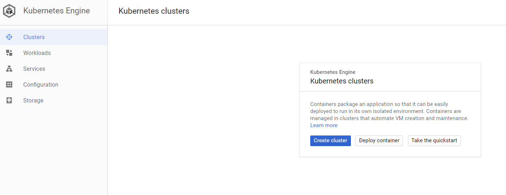
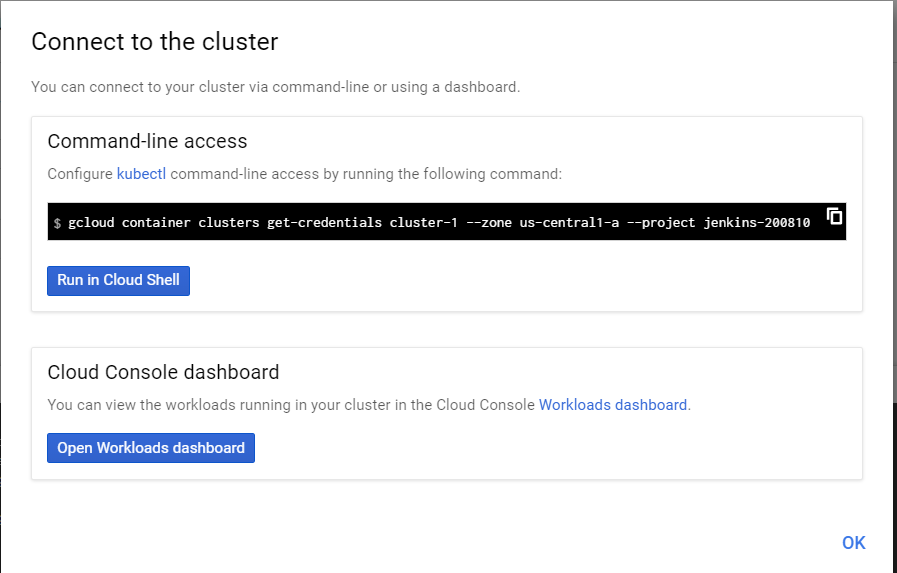
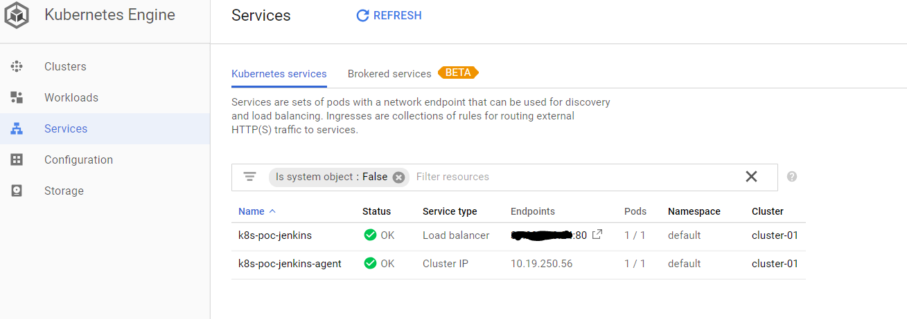
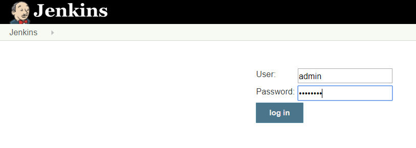
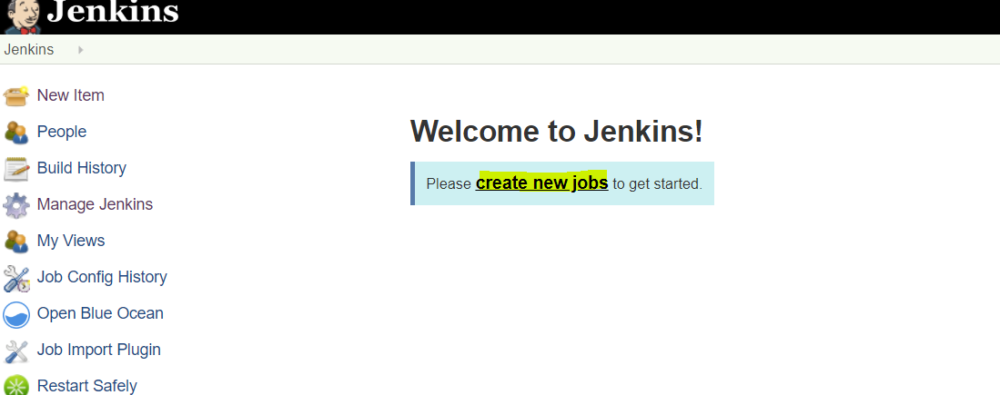
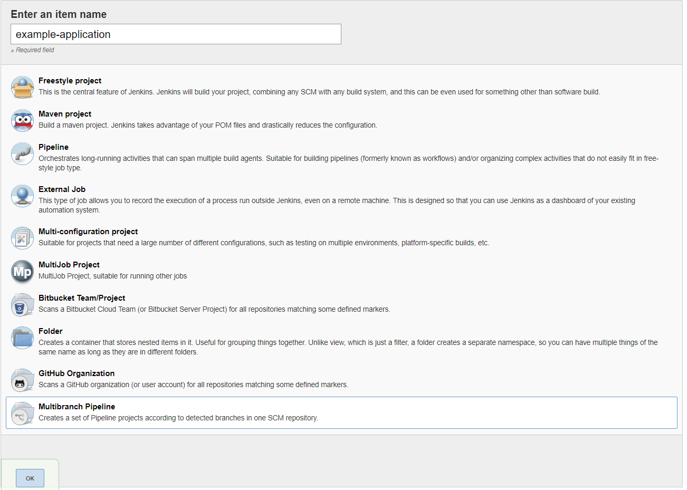
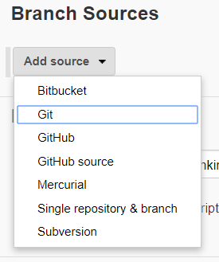

## Prerequisites  
 - **Proficiency:** intermediate
 - **Google Cloud Platform account:** required

## Details
For a complete overview visit the [SAP S/4HANA Cloud SDK Overview](https://blogs.sap.com/2017/05/10/first-steps-with-sap-s4hana-cloud-sdk/).

### You will learn  
In this tutorial, you will go through the steps required to install the scalable [SAP S/4HANA Cloud SDK CI/CD Toolkit ](https://www.sap.com/germany/developer/topics/s4hana-cloud-sdk.html) on Google Kubernetes engine and execute an example pipeline on the Jenkins that you have setup.

### You will win a Goodie
When you successfully setup the pipeline and build the example project, we will provide you with a coupon code. Please bring that to the booth to win an exciting goodie.

### Time to Complete
**15 Min**

[ACCORDION-BEGIN [Step 1: ](Prepare the Infrastructure)]
### Setup Kubernetes cluster

In this step, let us create a Kubernetes cluster which we can then make use of in following steps. Let us create a cluster with 3 nodes which has 2 CPUs each. In your Google Cloud Platform dashboard, navigate to Kubernetes Engine and click on create cluster.



In the following page, change Machine type to use 2vCPUs. We will use default values for other parameters.


Click on create cluster. This will create cluster named `cluster-1` with 3 nodes.  The creation of cluster might take few minutes.


### Connect to Kubernetes cluster

Click on the Connect button displayed next to the cluster name. This will open a dialogue. Click on `Run in Cloud Shell` option.



Once the Cloud Shell is open, hit Enter. This will import `auth` data for the cluster and initializes the `kubeconfig` entries. This will be later used by a command line interface `kubectl` to communicate with the cluster.

```
Welcome to Cloud Shell! Type "help" to get started.
Your Cloud Platform project in this session is set to dulcet-provider-210508.
Use “gcloud config set project” to change to a different project.
user@my-project:~$ gcloud container clusters get-credentials cluster-1 --zone us-central1-a --project my-project
Fetching cluster endpoint and auth data.
kubeconfig entry generated for cluster-1.
```

[DONE]
[ACCORDION-END]

[ACCORDION-BEGIN [Step 2: ](Setup Jenkins)]

SAP S/4HANA Cloud SDK CI/CD Toolkit makes use of Jenkins to run the Pipeline. Let us setup the Jenkins with auto-scaling capabilities. Even though it is possible to use `kubectl` to setup the Jenkins on Kubernetes cluster, we will use helm, a package management tool for Kubernetes.

Execute below command in the cloud shell that is open.

```
wget -O setup_jenkins https://raw.githubusercontent.com/rkamath3/cloud-s4-sdk-book/master/cx-server/setup_jenkins

chmod 700 setup_jenkins

./setup_jenkins

```


With this, we have setup a Jenkins master which makes use of the custom Docker image that was created for SAP S/4HANA Cloud SDK, using Kubernetes deployment. The Jenkins master exposes port 8080 on an external `LoadBalancer`. We have also created the service user which is required to create Jenkins agents on-demand.

The Jenkins that we have deployed is preconfigured with the libraries and the plugins that are required to execute the SAP S/4HANA Cloud SDK Pipeline.

In order to examine the deployment status, please navigate to `Workloads` menu and please wait until the deployment status turns green. This will take few minutes.


[DONE]
[ACCORDION-END]

[ACCORDION-BEGIN [Step 3: ](Connect to Jenkins)]

Once the setup is completed, it is time to build our first application with SAP S/4HANA Cloud SDK Pipeline. Navigate to Services menu under Kubernetes Engine and click on the endpoint of a `LoadBalancer` service.



### Login to Jenkins

In the login screen please key-in *admin* as both user and password.  



[DONE]
[ACCORDION-END]

[ACCORDION-BEGIN [Step 4: ](Setup SAP S/4HANA Cloud SDK Pipeline)]

Once the login is successful you will see a Jenkins dashboard.



Click on create new jobs. In the following page choose a name of your choice for the item name field.  Choose a Multibranch Pipeline. Click on OK.



In the following page, choose the source location. For this demo, we have created an example application that you can make use of. Please select Git from the dropdown in `Add source` option.



Please provide https://github.com/rkamath3/cloud-s4-sdk-book.git as the location for Project Repository. Save the configuration.


That’s All!! You have successfully setup your CI/CD infrastructure on Google Kubernetes Engine and started building your application using SAP S/4HANA Cloud SDK Pipeline.

You can check status of the pipeline execution in the Jenkins dashboard.

[DONE]
[ACCORDION-END]
