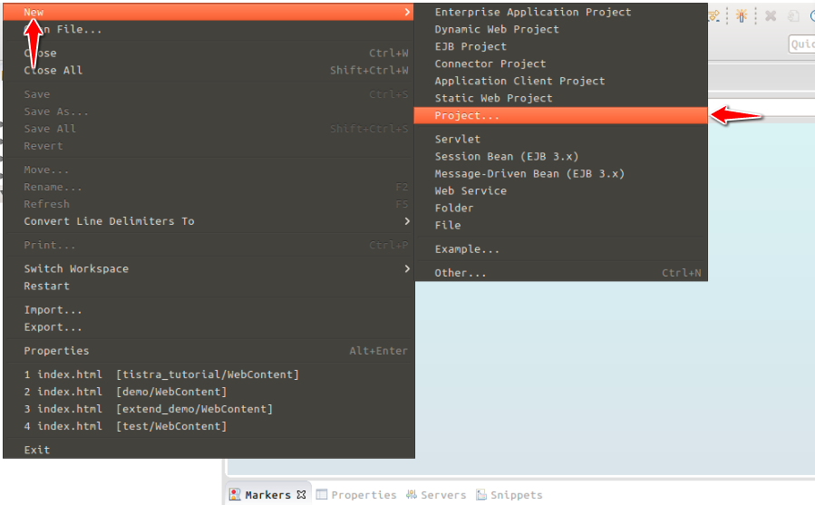
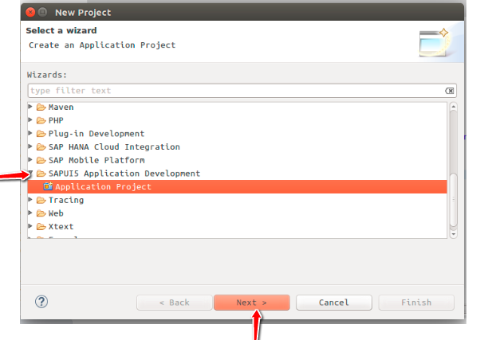
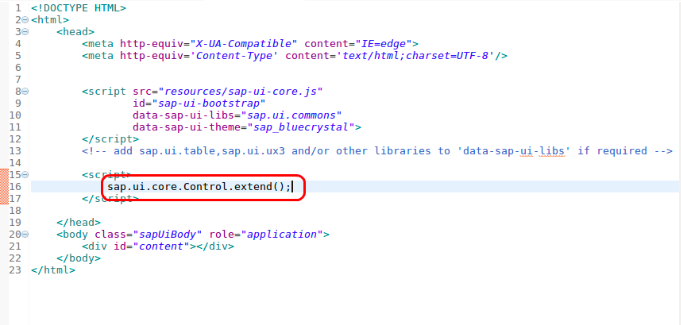
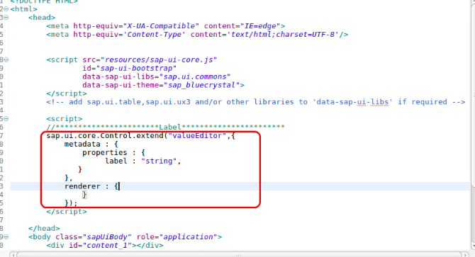
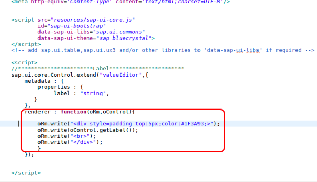
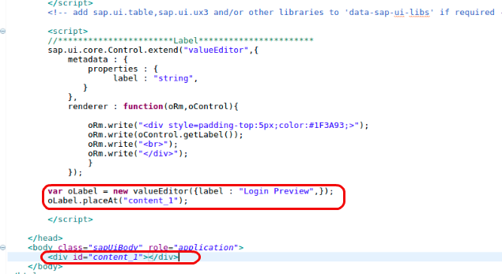
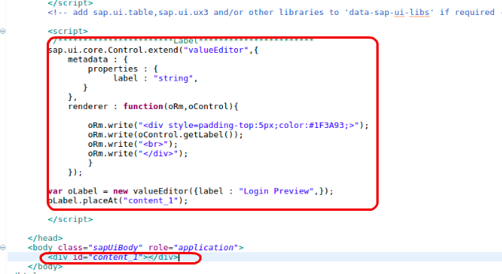
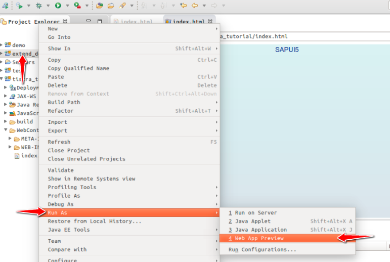
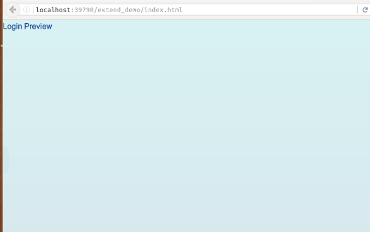

## Prerequisites  
- **Proficiency:** Beginner
- **Tutorials** [Configuring Eclipse with SAPUI5](http://go.sap.com/developer/tutorials/sapui5-install-eclipse.html)
- Should have basic understanding of HTML, CSS and JavaScript.

## Next Steps
 - [SAPUI5 Extending Button Control](http://go.sap.com/developer/tutorials/sapui5-extending-button-control.html)

## Details
### You will learn  

You will learn how to extend a control in your application from scratch.
Understand the basic flow of control and it's required parameters.

### Time to Complete
  **10 Min**

---
1.    Open Eclipse IDE and Create a new **SAP Project in Eclipse** as follows:

    

    

    

2.    In your `index.html` file between the scripts tag add the following:

    ```javascript
       sap.ui.core.Control.extend()
    ```
    

3. Then you have to define the extended control by adding **Metadata** to it.

    ```javascript
    sap.ui.core.Control.extend("valueEditor",{

    metadata : {
  	    properties : {
  		     label : "string"
       }
    },
    renderer: {
        }
    });
    ```

    

4.  Now add the renderer  which defines the HTML structure that will be added to the DOM tree of your application whenever the control is instantiates in a view.

    ```javascript
    renderer : function(oRm,oControl){

        oRm.write("<div style=padding-top:5px;color:#1F3A93;>");
        oRm.write(oControl.getLabel());
        oRm.write("<br>");
        oRm.write("</div>");

    }
    ```

    

5. Now you will create an object of the extended control, pass the values for it's property and place the object in the content. Since you are going to add other elements in the content you will edit the existing `<div id="content">` as `<div id="content_1">`

    ```javascript
    var oLabel = new valueEditor({
  				label : "Login Preview",

  			 });
    oLabel.placeAt("content_1");

    ```
    

6. Your final code will look like this:

     

7. Now to run the code, right-click on the project file and select run as **Web App Preview**.

     

     

---

## Next Steps
 - [SAPUI5 Extending Button Control](http://go.sap.com/developer/tutorials/sapui5-extending-button-control.html)
