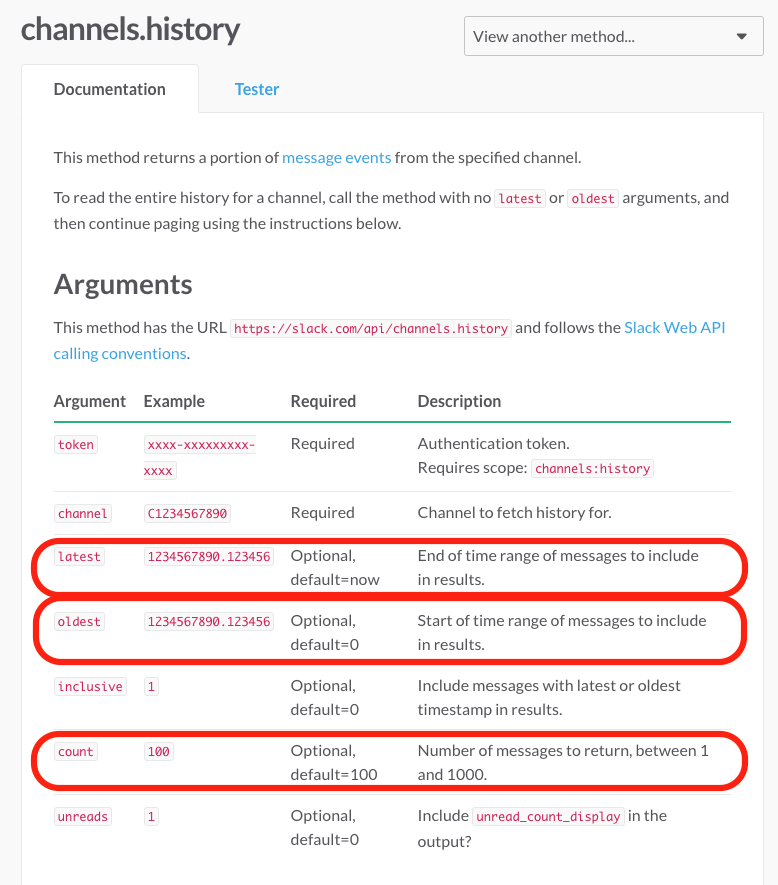
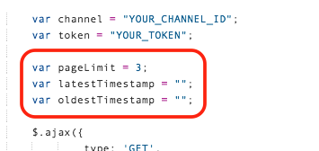
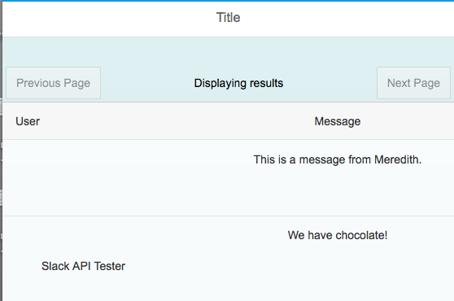
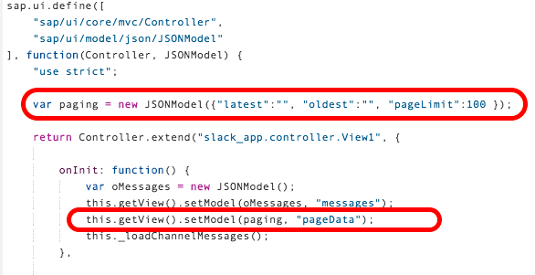
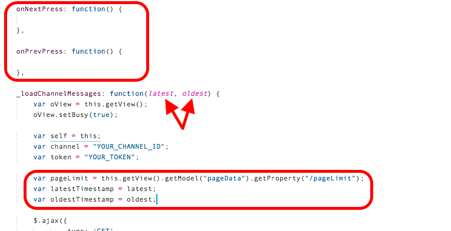
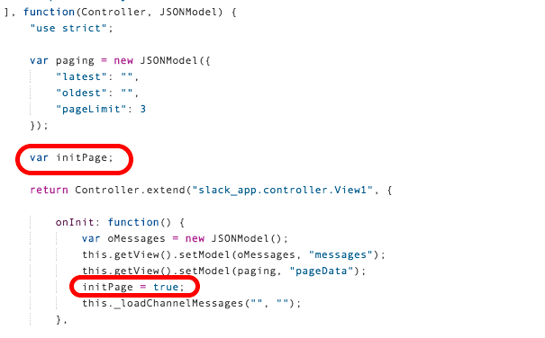
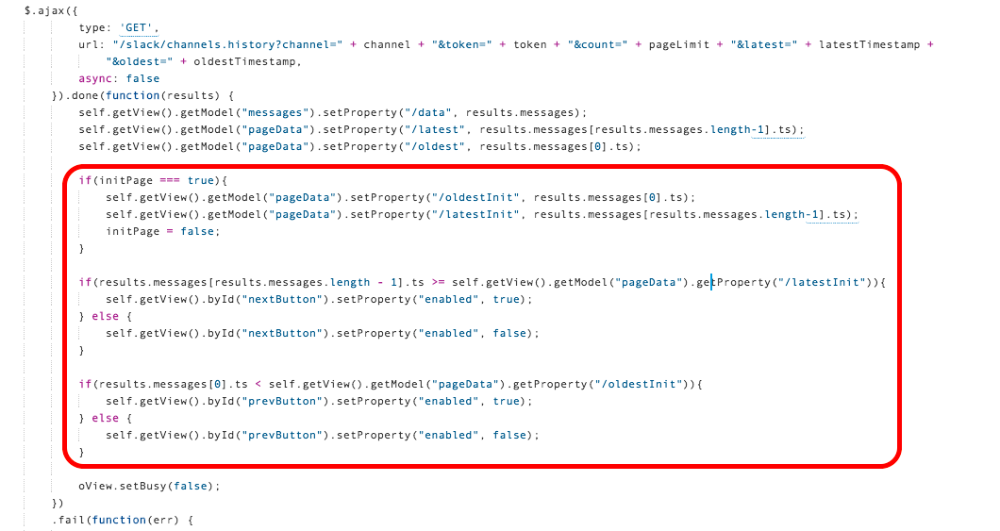
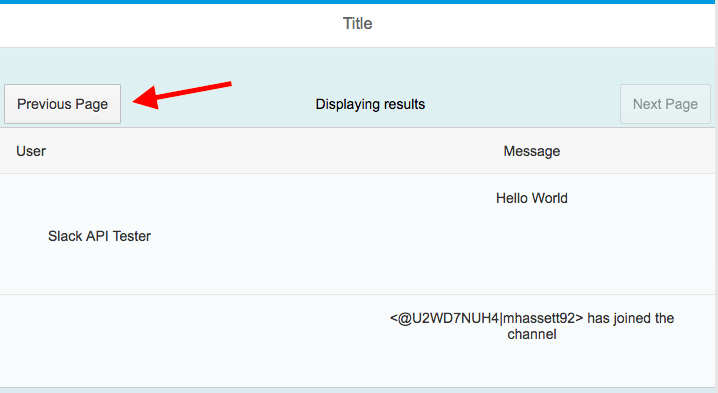

## Prerequisites  
 - **Proficiency:** Intermediate
 - **Tutorials:** [Add an API call to your app](https://www.sap.com/developer/tutorials/sapui5-insert-rest-api.html)

## Next Steps
 - [Add navigation with your API call](https://www.sap.com/developer/tutorials/sapui5-navigate-api.html)

## Details
### You will learn  
All APIs handle paging a little differently. In this tutorial, you will learn how to implement paging in the Slack API. Paging with the Slack API, or at least the method you are using, as not as intuitive as some other APIs. When working with other APIs, you may find that the paging data is actually provided for you.


### Time to Complete
**20 Min**.

---

[ACCORDION-BEGIN [Step 1: ](Review the Slack Method Documentation)]
Take some time to review the [channel history method documentation](https://api.slack.com/methods/channels.history) to learn more about the method you are working with. In order to page with this Slack method, there are a couple arguments to get familiar with. You will need to include the **count** parameter, the **latest** parameter, and the **oldest** parameter in your API call.



The count parameter will be your page size and the latest parameter will tell the API which message to start the page with.


[ACCORDION-END]

[ACCORDION-BEGIN [Step 2: ](Add new parameter variables to your controller)]
Open you Web IDE and open `View1.controller.js` for your Slack API project, found in the `slack_app > webapp > controller` folder.

In order to page with Slack, you need 3 additional parameters as part of the API call. Define a new `pageLimit` variable which will correspond to the **count** parameter, a new `latestTimestamp` variable which will correspond to the **latest** parameter, and a new `oldestTimestamp` variable which will correspond to the **oldest** parameter in Slack. Initiate the variables to match the Slack defaults for now.

```javascript
    var pageLimit = 100;
    var latestTimestamp = "";
    var oldestTimestamp = "";
```

Add these variables to your `_loadChannelMessages` function under the definition of your channel and token variables.



You need to update your API call to include the new parameters. Add the following code to your AJAX call in the URL. Your final URL should be similar to the screenshot below.

```javascript
    + "&count=" + pageLimit + "&latest=" + latestTimestamp + "&oldest=" + oldestTimestamp
```


**SAVE** your changes.

When you **RUN** your application, it should not look any different from the end of the previously tutorial.


[ACCORDION-END]

[ACCORDION-BEGIN [Step 3: ](Add paging buttons to the view)]
In the `webapp > view` folder, open the`View1.view.xml` file.

You will add a toolbar to your page to include 2 new buttons, page forward and page back. Add it above the table in your view.

```xml
<Toolbar
	class="sapUiMediumMarginTop" id="pagingToolbar" >
    <Button id="prevButton" text="Previous Page" enabled="false" press="onPrevPress" />
    <ToolbarSpacer/>
    <Text
      text="Displaying results " textAlign="Center" />
    <ToolbarSpacer/>
    <Button id="nextButton" text="Next Page" enabled="false" press="onNextPress" />
</Toolbar>

```


**SAVE** your changes.

When you **RUN** your app, you should see 2 buttons above the table that are disabled.




[ACCORDION-END]

[ACCORDION-BEGIN [Step 4: ](Create paging model in controller)]
Back in the `View1.controller.js` file, you will create 2 functions for the paging buttons you just added.

First, you will need to add a new model to contain the paging data. This model will contain the information you need when trying to page. Add in a new global model. To declare a global variable, **define the `paging` variable before the return for the controller function**.

```javascript
    var paging = new JSONModel({"latest":"", "oldest":"", "pageLimit": 100});
```

Next, you will need to set the model to the view. Add the following line to your `onInit` function before the `this._loadChannelMessages` call.

```javascript
    this.getView().setModel(paging, "pageData");
```



**SAVE** your changes.


[ACCORDION-END]

[ACCORDION-BEGIN [Step 5: ](Create paging functions)]
You need to create 2 functions for the button `press` attribute you set in your view.
Define a new function calls `onNextPress` and `onPrevPress` before the `_loadChannelMessages` functions and after the `onInit` function.

```javascript

    onNextPress: function(){

    },

    onPrevPress: function(){

    },
```

Your `_loadChannelMessages` function now needs some parameters. Replace the function definition for the `_loadChannelMessages` with the one below.

```javascript
    function(latest, oldest) {}
```

Set the variables you created for `latestTimestamp` and `oldestTimestamp` to the new parameters. Also, change the definition of the `pageLimit` variable to be the `pageLimit` from the model.

```javascript
    var pageLimit = this.getView().getModel("pageData").getProperty("/pageLimit");
    var latestTimestamp = latest;
    var oldestTimestamp = oldest;
```
For testing purposes, go ahead and update your `pageLimit` parameter in the model to be equal to half the total messages you have (ex: `"pageLimit": 3`).



**SAVE** your changes.


[ACCORDION-END]

[ACCORDION-BEGIN [Step 6: ](Update the load function calls)]
Now that you have added some parameters to your `_loadChannelMessages` function, you need to update the function call.

In your `onInit` function, replace the `_loadChannelMessages` call with the one below.

```javascript
    this._loadChannelMessages("", "");
```

On initialization of the application, you will pass in blank parameters so the API call will use the default values for these values. The API call will use you `pageLimit`.


**SAVE** your changes.


[ACCORDION-END]

[ACCORDION-BEGIN [Step 7: ](Add functionality to press functions)]
You need to add some functionality to the press functions you defined previously so the buttons will initiate an action.

In the `onNextPress` function, you need to access the **latest** attribute from the paging model. Add the following line to your `onNextPress` function. Then you will call the `_loadChannelMessages`, setting only the **latest** parameter.

```javascript
    var latest = this.getView().getModel("pageData").getProperty("/latest");
    this._loadChannelMessages(latest, "");
```

In the `onPrevPress` function, you need to access the **oldest** attribute from the paging model. Add the following line to your `onPrevPress` function. Then you will call the `_loadChannelMessages`, setting only the **oldest** parameter.

```javascript
    var oldest = this.getView().getModel("pageData").getProperty("/oldest");
    this._loadChannelMessages("", oldest);
```

**SAVE** your changes.


[ACCORDION-END]

[ACCORDION-BEGIN [Step 8: ](Set the paging properties)]
In order to retrieve the **oldest** and **latest** properties, you need to define them from the results of the AJAX call. Add the following lines to the AJAX `done` function before the `oView.setBusy` call.

```javascript
    self.getView().getModel("pageData").setProperty("/latest", results.messages[results.messages.length-1].ts);
    self.getView().getModel("pageData").setProperty("/oldest", results.messages[0].ts);
```

Additionally, in the `done` function, you need to toggle the enable/disable of the Next and Previous buttons on the page. Determining if you need to enable or disable to Next and Previous buttons is a little tricky in this Slack method since the concept of a page does not exist. In order to introduce that concept to your application, you will need to establish the page boundaries.

Start by creating a **global** `initPage` boolean variable that will help you determine if the initial page boundaries have been set. Set it to **true** in the `onInit` function. In the AJAX response, you will set it to false once the initialization data has been captured.

```javascript
    var initPage;
```

```javascript
    initPage = true;
```



In the `done` function of the AJAX call, add a new `if` statement to determine if the initialization variables need to be set. If `initPage` is equal to **true**, you will need to set the values for 2 new properties in the paging model called `oldestInit` and `latestInit`. Once your init variables are set, change `initPage` to **false**.

```javascript
if(initPage === true){
    self.getView().getModel("pageData").setProperty("/oldestInit", results.messages[0].ts);
    self.getView().getModel("pageData").setProperty("/latestInit", results.messages[results.messages.length-1].ts);
    initPage = false;
}
```

You can now use these init properties in the paging model to determine when to toggle the enable attribute for the paging buttons. If the page's newest message is older than the `oldestInit` variable, the Previous button should be enabled. If the page's oldest message is newer or equal time to the `latestInit` variable, the Next button should be enabled.

```javascript
if(results.messages[results.messages.length-1].ts >= self.getView().getModel("pageData").getProperty("/latestInit")){
  self.getView().byId("nextButton").setProperty("enabled", true);
} else {
  self.getView().byId("nextButton").setProperty("enabled", false);
}

if(results.messages[0].ts < self.getView().getModel("pageData").getProperty("/oldestInit")){
  self.getView().byId("prevButton").setProperty("enabled", true);
} else {
  self.getView().byId("prevButton").setProperty("enabled", false);
}

```




**SAVE** your changes.


[ACCORDION-END]

[ACCORDION-BEGIN [Step 9: ](Run your application)]
Make sure all your changes are saved and **RUN** your application. For testing purposes, you should have set the `pageLimit` property in the paging model to be smaller than your total dataset. If you did, you should see that the Next button is enabled and you can click it to load the next page. Once you move to the next page, you should the Previous button enabled.





[ACCORDION-END]


## Next Steps
 - [Add navigation with your API call](https://www.sap.com/developer/tutorials/sapui5-navigate-api.html)
