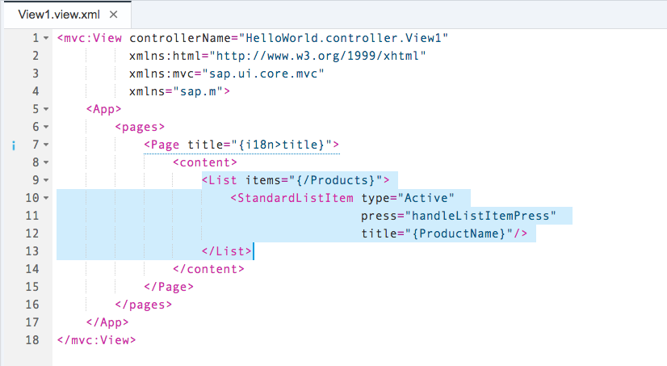
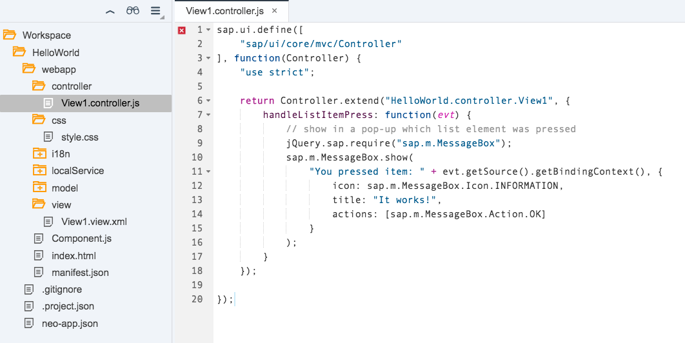
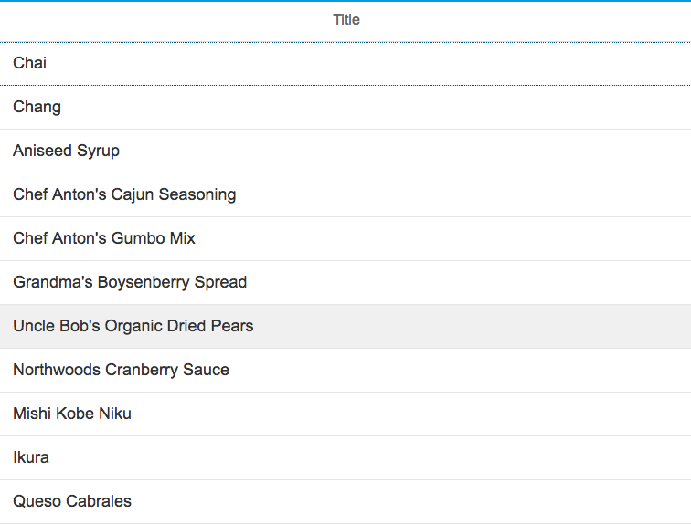

## Prerequisites  
 - **Proficiency:** Beginner 
 - **Tutorials:** This tutorial is part of a series.  The previous tutorial is part 3: [Set up the data source in the Application](https://go.sap.com/developer/tutorials/sapui5-webide-setup-datasource.html)

## Next Steps
 - The next tutorial in the series is Part 5: [Enable Routing](https://go.sap.com/developer/tutorials/sapui5-webide-enable-routing.html)

## Details
### You will learn  
Add a list to first XML view (`View1.xml`). The list will display data from the data model, that got filled with data from the Northwind data service. Every list element will represent a product entity in the data model. Thanks to the data binding, SAPUI5 takes the path of the aggregation and automatically creates as many list items as the aggregation includes (all the product entities).

For now, you will just display the product names, more specifically the attribute `ProductName`. In a future tutorial, you will add a detail view with additional information per list element, so you will also implement a mock function for the press event, which is triggered on key-press or tap on mobile devices.

You will also change the master view and controller. To fix a design-flaw of the template, we will also quickly update the CSS styling.

### Time to Complete
**15 Minutes**.

---

1.  Open the file `webapp/view/View1.view.xml` in your editor.  

    You will add a new `<List>` element, and define how every item will be displayed.
  
    ```XML
    <List items="{/Products}" >
		<StandardListItem type="Active"
			              press="handleListItemPress"
			              title="{ProductName}" />
	</List>
	```
  
    
    
    > If you see an **i** icon in the left hand side, you can ignore it.  These are information messages generated by the editor.

2.  Open the `webapp/css/style.css` file, and then add the following CSS parameters.  This will prevent overflow from hiding elements in the view on the screen.

    ```CSS
    .sapMPage>section {
		overflow-x: initial !important;
		overflow-y: initial !important;
	}
	```

    
    
3.  Open the `webapp/controller/View1.controller.js` file.  You will add an event handler function for the press event.

    ```JavaScript
    return Controller.extend("HelloWorld.controller.View1", {
		handleListItemPress: function (evt) {
			// show in a pop-up which list element was pressed
			alert("Pressed: " + evt.getSource().getBindingContext());
		}
	});
	```

    
    
    > **NOTE**:  See that alert box, red with the X?  The `alert` function is not recommended, so that warning will appear.  We are only using the alert for this tutorial, and will replace it soon, so ignore that warning for now.
    
4.  Now **RUN** your application.  

    

5.  Click on an item in your application, and a pop-up will appear.  

	 Notice that the pop-up displays the number of the item pressed, in parenthesis (in the image below: `Products(4)`).

    

## Next Steps
 - The next tutorial in the series is Part 5: [Enable Routing](https://go.sap.com/developer/tutorials/sapui5-webide-enable-routing.html)


## Additional Reading
- [Data Binding](https://sapui5.netweaver.ondemand.com/#docs/guide/68b9644a253741e8a4b9e4279a35c247.html)
- [`<List>` tag](https://sapui5.netweaver.ondemand.com/#docs/guide/295e44b2d0144318bcb7bdd56bfa5189.html)
- [`<StandardListItem>` tag](https://sapui5.netweaver.ondemand.com/explored.html#/entity/sap.m.StandardListItem/properties)

