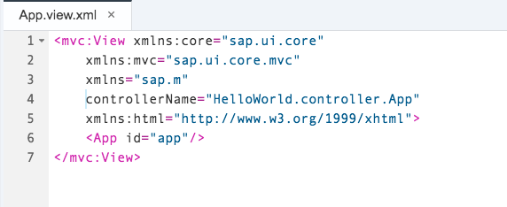
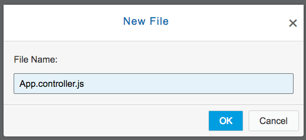
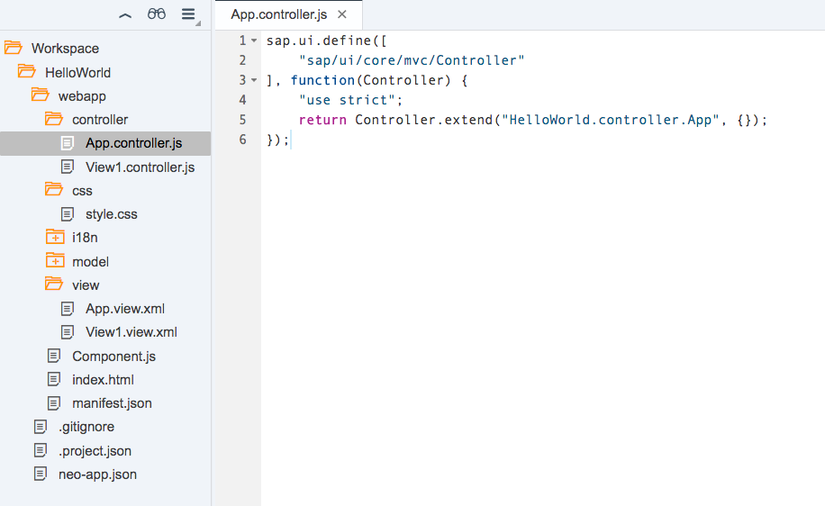
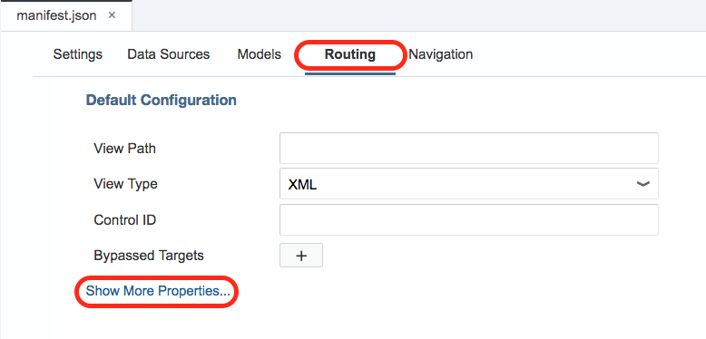
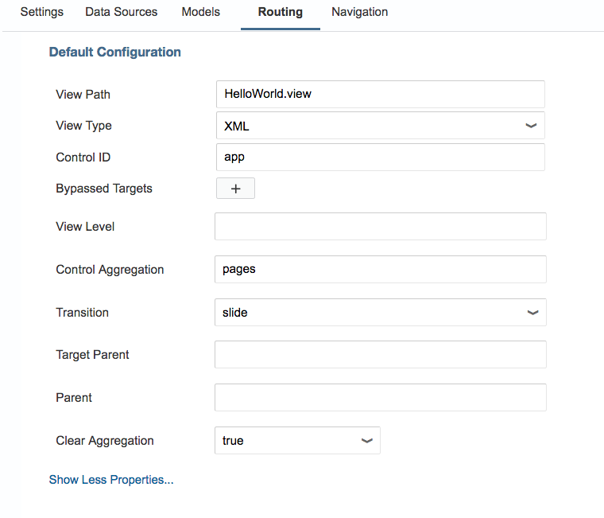
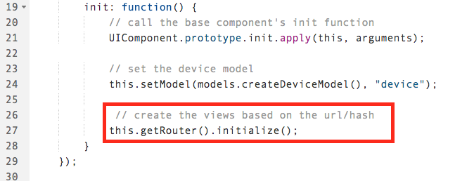

## Prerequisites  
 - **Proficiency:** Beginner 
 - **Tutorials:** This tutorial is part of a series.  The previous tutorial is part 4: [Add a list to the view](https://go.sap.com/developer/tutorials/sapui5-webide-add-list.html)

## Next Steps
 - The next tutorial in this series is Part 6: [Display List Details](https://go.sap.com/developer/tutorials/sapui5-webide-display-list-details.html)

## Details
### You will learn  
In order to enable navigating from one view to another, our app needs to be enabled for routing. With the newest version of SAPUI5, routing configurations are stored within the app descriptor called `manifest.json`.

### Time to Complete
**15 Minutes**.

---

You have to add a routing configuration to the descriptor file and initialize the router instance within the component
definition (`webapp/Component.js`).

1.  Create a new file called `webapp/view/App.view.xml`.  

    To create a new file, right click in the **view** folder, and then choose **New** --> **File**.  Enter the file name `App.view.xml`.
    
    
    
    
    
2.  Add the following code to the `App.view.xml` file:

    ```xml
    <mvc:View
		controllerName="HelloWorld.controller.App"
		xmlns="sap.m"
		xmlns:mvc="sap.ui.core.mvc"
		displayBlock="true">
		<App id="app"/>
	</mvc:View>
	```
    > Don't forget to save your files!

    
  
3.  Create a new file called `webapp/controller/App.controller.js`.  Use the same procedure as Step #2.

    

    Add the following code to the `App.controller.js` file:

	```Javascript
	sap.ui.define([
		"sap/ui/core/mvc/Controller"
	], function(Controller) {
		"use strict";
		return Controller.extend("HelloWorld.controller.App", {
		});
	});
	```

    

4.  Open the `webapp/manifest.json` file, and *change* the following line to the `"rootView"` section:

	```Javascript
	"viewName": "HelloWorld.view.App",
	```
    
	
5.  Next, in the `webapp/manifest.json` file, add the following code to the `sap.ui5` section, under `"resources"`:

    ```Javascript
    ,
		"routing": {
			"config": {
				"routerClass": "sap.m.routing.Router",
				"viewType": "XML",
				"viewPath": "HelloWorld.view",
				"controlId": "app",
				"controlAggregation": "pages",
				"transition": "slide"
			},
			"routes": [{
				"pattern": "",
				"name": "appHome",
				"target": "home"
			}],
			"targets": {
				"home": {
					"viewName": "View1",
					"viewLevel" : 1
				}
			}
		}
	```
	
    

6.  Open the `webapp/Component.js` file, and add the following to the `init:` section:

    ```javascript
    // create the views based on the url/hash
	this.getRouter().initialize();
	```
    
    
	
7.  Open the `webapp/css/style.css` file, and change the *entire* file to the following:

    ```css
    .spacerTop {
	 	margin-top: 2rem;
	 }
	 .sap-tablet .sapMDialog,
	 .sap-desktop .sapMDialog {
		min-width: 18rem;
	 }
	 .sapMMessageDialog {
		width: 18rem;
	 }
	```

    

8.  After this tutorial, you should be able to run your application again, but you will not see any changes.  All of the routing work occurs "behind the scenes" and is not visible to the user.   


## Next Steps
- The next tutorial in this series is Part 6: [Display List Details](https://go.sap.com/developer/tutorials/sapui5-webide-display-list-details.html)

## Additional Information
- [Additional reading and details on Routing and Navigation](https://sapui5.netweaver.ondemand.com/docs/guide/3d18f20bd2294228acb6910d8e8a5fb5.html)

