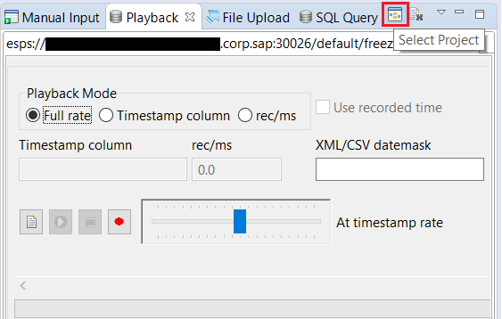
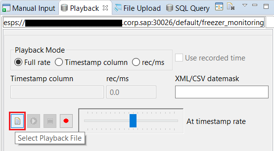
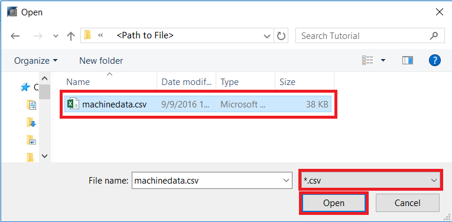
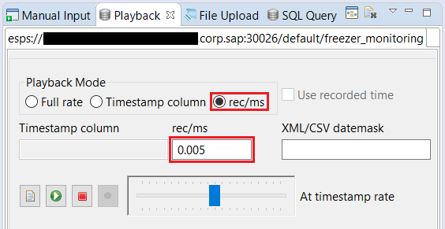

## Prerequisites  
 - **Proficiency:** Intermediate
 - **Tutorials:** [Generating Alerts using a Derived Window in SAP HANA smart data streaming](https://www.sap.com/developer/tutorials/sds-event-stream-alerts.html)

## Next Steps
- **Tutorials:** [Watch for Patterns of Events and Generate Alerts](https://www.sap.com/developer/tutorials/sds-event-stream-pattern-detection.html)

## Details
### You will learn  
- How to use the Playback tool to stream captured or simulated data from a file to test your project

### Time to Complete
**10 Min**

---
In this tutorial we will use the Playback tool to stream in simulated data from a file to test our project.  You can also use the tool to record actual data as it arrives, producing a test file that you can later use.

[ACCORDION-BEGIN [Step 1: ](Run the Project)]

Go to **SAP HANA Streaming Development** perspective.

Click the drop down arrow next to the **Run** button and select the streaming server to run this project.

You will be switched into the **SAP HANA Streaming Run-Test** perspective if the project deploys successfully.

[ACCORDION-END]

[ACCORDION-BEGIN [Step 2: ](Open viewers on the streams)]

Double-click on each of the streams in the Server view to open them in the **Stream View**.

[ACCORDION-END]

[ACCORDION-BEGIN [Step 3: ](Connect the playback tool to the project)]

Click the **Playback** tab.

Click Select Project icon in the top right corner of the **Playback** window to connect the playback tool to the current project (if you had multiple projects running it would ask you to choose).

[ACCORDION-END]

[ACCORDION-BEGIN [Step 4: ](Select the file containing the simulated data to play back)]

Download the sample data file as follows: Right click on the following link and select **Save link/target as...** [`machinedata.csv`](https://raw.githubusercontent.com/SAPDocuments/Tutorials/master/tutorials/sds-event-stream-playback/machinedata.csv)

Click Select Playback File icon shown below to select the data file to use.

- In the Open dialogue window, change the file type to **`.csv`**.
- Navigate to the location where you saved the sample data file that you just downloaded
- Choose **`machinedata.csv`**  then click **Open**.

[ACCORDION-END]

[ACCORDION-BEGIN [Step 5: ](Set the playback speed)]

Click **rec/ms**. You want to control the playback speed so that you can watch things happen at a reasonable pace. Once it's running you can speed it up or slow it down using the slider tool. Enter `0.005` in the **rec/ms** box.

[ACCORDION-END]

[ACCORDION-BEGIN [Step 6: ](Start the playback and view the results)]

Then click the Start Playback button with icon shown below.

Click each viewer tab to view the output from each stream/window.

[ACCORDION-END]
