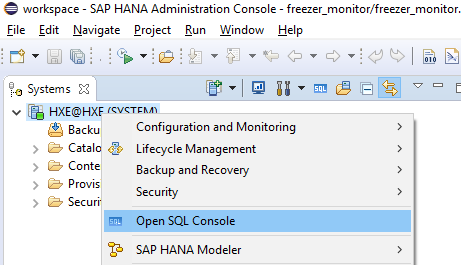
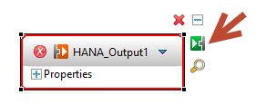
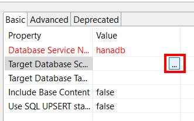
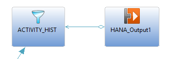
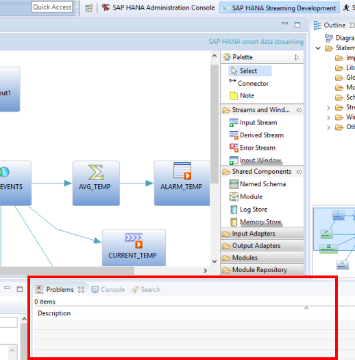
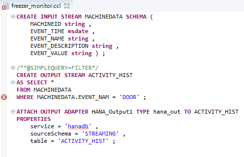

## Prerequisites  
 - **Proficiency:** Beginner
 - **Tutorials:** [Create a Streaming project with SAP HANA Streaming Analytics](https://www.sap.com/developer/tutorials/sds-create-streaming-project.html)


## Next Steps
 - [Run and Test a Streaming Project](https://www.sap.com/developer/tutorials/sds-run-test.html)

## Details
### You will learn  
How to create a table in the HANA database to store events and how to connect an output stream in your project to the database table.

### Time to Complete
**15 Min**

---

[ACCORDION-BEGIN [Step 1: ](Create a HANA Database Schema to hold the tables for our project)]

Here you will execute a SQL statement on HANA to create a database schema where we will store our event data.  While we're at it, we'll go ahead and create some tables in the database that we will use later in this tutorial.

Go to **SAP HANA Administration Console** perspective, then **Systems** view. Right click on the **tenant database** that you are working with (if you are following the HANA Express tutorial series to this point it will be called **HXE** by default). Caution: don't select the System database.

Select **Open SQL Console** menu item to open a console that will automatically connect to your system.



Select the newly created SQL console tab.

Copy the code below and paste it into the SQL console.

```SQL

    CREATE SCHEMA STREAMING;

    CREATE COLUMN TABLE "STREAMING"."DASHBOARD"
    (	"MACHINEID" 	VARCHAR(15) NOT NULL ,
    	"POWER_STATUS" VARCHAR(30),
    	"CURR_TEMP" 	DECIMAL(4,2),
    	PRIMARY KEY ("MACHINEID")
     );

    CREATE COLUMN TABLE "STREAMING"."MACHINE_REF"
    (	"MACHINEID" 	VARCHAR(15) NOT NULL ,
    	 "MACHINETYPE" 	VARCHAR(15),
    	 "MAX_TEMP" 	DECIMAL(4,2),
    	 "MIN_TEMP" 	DECIMAL(4,2),
    	 "LOCATION" 	VARCHAR(25),
    	 "TEMP_UNIT" 	VARCHAR(2),
    	 PRIMARY KEY ("MACHINEID")
    );

    CREATE COLUMN TABLE "STREAMING"."POWER_OUTAGES"
    (	"MACHINEID" 		VARCHAR(15),
    	"POWER_OFF_TIME" 	LONGDATE,
    	"POWER_ON_TIME" 	LONGDATE,
    	"DURATION_MIN" 	DOUBLE CS_DOUBLE
    );

    CREATE COLUMN TABLE "STREAMING"."ACTIVITY_HIST"
    (	"MACHINEID" 	VARCHAR(15),
    	 "EVENT_TIME" 	LONGDATE CS_LONGDATE,
    	 "EVENT_NAME" 	VARCHAR(15),
    	 "EVENT_DESCRIPTION" 	VARCHAR(100),
    	 "EVENT_VALUE" 	VARCHAR(25)
    );

    INSERT INTO "STREAMING"."MACHINE_REF"("MACHINEID", "MACHINETYPE", "MAX_TEMP", "MIN_TEMP", "LOCATION", "TEMP_UNIT") VALUES
    ( '2B','VEND',50,35,'WALG31','F');
    INSERT INTO "STREAMING"."MACHINE_REF"("MACHINEID", "MACHINETYPE", "MAX_TEMP", "MIN_TEMP", "LOCATION", "TEMP_UNIT") VALUES
    ( '1A','COOL',50,35,'FRI7','F');
    INSERT INTO "STREAMING"."MACHINE_REF"("MACHINEID", "MACHINETYPE", "MAX_TEMP", "MIN_TEMP", "LOCATION", "TEMP_UNIT") VALUES
    ( '4D','VEND',50,35,'JRB235','F');
    INSERT INTO "STREAMING"."MACHINE_REF"("MACHINEID", "MACHINETYPE", "MAX_TEMP", "MIN_TEMP", "LOCATION", "TEMP_UNIT") VALUES
    ( '5E','COOL',50,35,'WALG33','F');
    INSERT INTO "STREAMING"."MACHINE_REF"("MACHINEID", "MACHINETYPE", "MAX_TEMP", "MIN_TEMP", "LOCATION", "TEMP_UNIT") VALUES
    ( '3C','VEND',10,2,'BP762','C');
    INSERT INTO "STREAMING"."MACHINE_REF"("MACHINEID", "MACHINETYPE", "MAX_TEMP", "MIN_TEMP", "LOCATION", "TEMP_UNIT") VALUES
    ( '6F','FREEZE',32,0,'HIN88','F');
    INSERT INTO "STREAMING"."MACHINE_REF"("MACHINEID", "MACHINETYPE", "MAX_TEMP", "MIN_TEMP", "LOCATION", "TEMP_UNIT") VALUES
    ( '7G','VEND',50,35,'ORD311','F');
```

Execute the SQL script by pressing the **Execute** button (in the toolbar of the SQL console).


Check the HANA database catalog in the **SAP HANA Administration Console** to confirm that the schema has been created an contains the following tables:

- `DASHBOARD`
- `MACHINE_REF`
- `POWER_OUTAGES`
- `ACTIVITY_HIST`

The table **`MACHINE_REF`** should have 7 rows of data.

[DONE]
[ACCORDION-END]

[ACCORDION-BEGIN [Step 2: ](Connect the output stream to the database table)]
We want to capture `DOOR_OPEN` and `DOOR_CLOSE` events in the `ACTIVITY_HIST` HANA database table to track the activity for each of our freezer units.  We already have a filter in our project that isolates the door events from all other events.  Now we just need to connect the output stream to the database table.  We'll do this by adding a HANA output adapter to our project.

First, switch to the **SAP HANA Streaming Development** perspective.

Select **HANA Output** from **Output Adapters** drawer in the **Palette** and drag it to the canvas.  Use the small scroll bar at the bottom of the palette drawer if you need to scroll down (see red box in screen shot below).


Click on the **Edit Properties** tool next to the new `HANA_Output1` shape to edit the Adapter Properties.



To set the Schema property, select the value field and then click the discovery button:



Set the target schema to STREAMING and click OK


Set the Target Database Table Name to **`ACTIVITY_HIST`**

Now the adapter properties should all be set as follows:

Property                    | Value
:------------------------ | :----------------
Database Service Name       | `hanadb`
Target Database Schema Name | `STREAMING`
Target Database Table Name  | `ACTIVITY_HIST`


Now grab the **Connector** tool


And connect the adapter to the **`ACTIVITY_HIST`** stream. Click on the **`ACTIIVTY_HIST`** stream, then click on the **`HANA_Output1`** adapter.



[DONE]
[ACCORDION-END]

[ACCORDION-BEGIN [Step 3: ](Compile and check for errors)]

In the **SAP HANA Streaming Development** perspective, click the Compile Project icon shown below.


Check the **Problems** view to see if the project compiled without errors.



> If you do have compile errors, if it's easy to spot the error here, go ahead and fix it.  Sometimes it's easier to find and fix an error in the CCL editor.  You can view the underlying CCL for the project by switching to the CCL editor (see the optional step below).  In the CCL editor, compile again and any line with an error will be flagged and you can point your cursor at the error flag to see a description of the error.  See the next step for how to do that.

[DONE]
[ACCORDION-END]

## Optional

[ACCORDION-BEGIN [Step 4: ](Check your project in the CCL Editor)]

All streaming projects are defined in a variation of SQL that we call **CCL**.  So far we've been working entirely in the visual editor.  However, you can also create, edit and view projects in the CCL editor.  

Switch to the CCL editor:  either click on the **Switch to Text** tool in the Eclipse toolbar, or press F6.


Compile your project


If there are errors, point to the error flag (hover) on the line with the error to read the error message (or read it in the Problems view)



At this point, your CCL code should look like this:

```SQL
CREATE INPUT STREAM MACHINEDATA
SCHEMA (
	MACHINEID string ,
	EVENT_TIME msdate ,
	EVENT_NAME string ,
	EVENT_DESCRIPTION string ,
	EVENT_VALUE string ) ;

/**@SIMPLEQUERY=FILTER*/
CREATE OUTPUT STREAM ACTIVITY_HIST
AS SELECT *
FROM MACHINEDATA
WHERE MACHINEDATA.EVENT_NAME = 'DOOR' ;

ATTACH OUTPUT ADAPTER HANA_Output1 TYPE hana_out TO ACTIVITY_HIST
PROPERTIES
	service = 'hanadb' ,
	sourceSchema = 'STREAMING' ,
	table = 'ACTIVITY_HIST' ;
```

[DONE]
[ACCORDION-END]
