## Prerequisites  
 **Proficiency:** Beginner

## Next Steps
 [Create a Streaming Project with SAP HANA streaming analytics](http://www.sap.com/developer/tutorials/sds-create-streaming-project.html)

## Details
Install the streaming analytics plugin for SAP HANA studio, add a connection to the streaming analytics server, and create a HANA service.
### You will learn  

### Time to Complete
**10 Min**

---

[ACCORDION-BEGIN [Step 1: ](Install the plugin)]
1. Use the Download Manager to download the streaming studio plugin file.

2. Extract the contents of the streaming studio plugin file.

3. Open studio and select _Help > Install New Software_:

    

4. In the Install dialog, click **Add**:

    

5. In the Add Repository dialog, click **Local**, select the `<extracted_path>/<platform>/SAP_HANA_STREAMING/repository` folder, and click **OK**:

    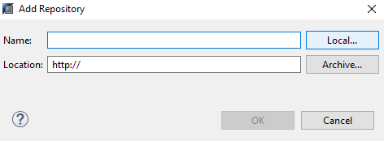

    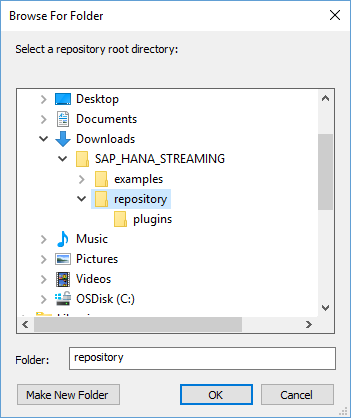

6. In the Install dialog, check SAP HANA streaming analytics, then click **Next**:

    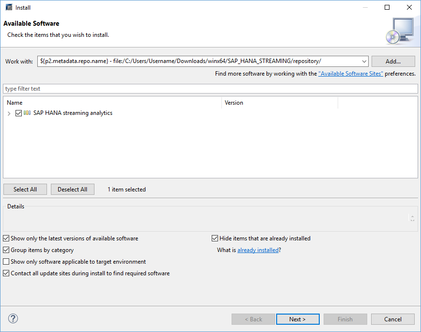

7. Review the items to be installed, then click **Next**:

    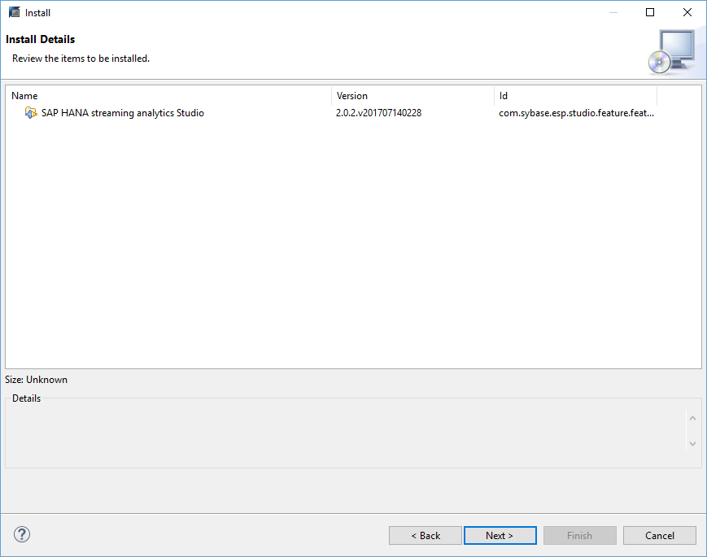

8. Review the license, accept the terms and conditions to continue, then click **Finish**:

    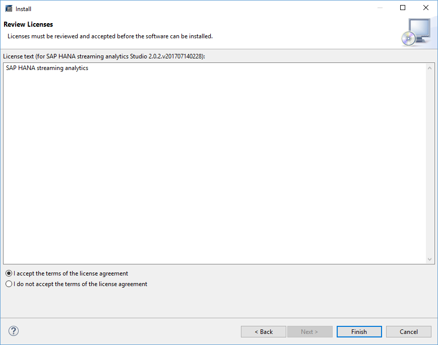

9. For any security warnings, click **OK**.

10. At the prompt to restart studio, select **Yes**.

11. If you are installing the plugin into studio for Linux, log off of the machine and log back in.

[ACCORDION-END]

[ACCORDION-BEGIN [Step 2: ](Open the streaming perspectives)]

1. In studio, select _Window > Perspective > Open Perspective > Other_, then select the **SAP HANA Streaming Development** perspective and click **OK**:

    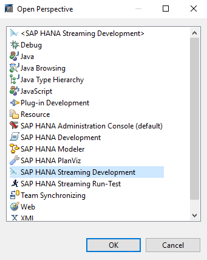

2. Select _Window > Perspective > Open Perspective > SAP HANA Streaming Run-Test_:

    

[ACCORDION-END]

[ACCORDION-BEGIN [Step 3: ](Add a streaming analytics connection)]

Here we will connect studio to the SAP HANA streaming analytics server.

1. In the **SAP HANA Streaming Run-Test** perspective, in the **Server** view, select **New Server URL**:

    

2. Enter the following connection details:
    - Host Name: The hostname or IP address for your SAP HANA installation
    - Port: 3`<instance-number>`26

    Enable SSL, then click **OK**:

      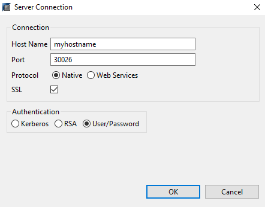

3. Right-click on the new server and select **Change User Name and Password**:

    

4. Enter the credentials for `SYSTEM` and click **OK**:

    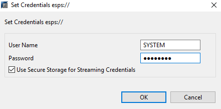

    >**Note:**
    > To automatically connect to the streaming server when starting studio, check **Use Secure Storage for Streaming Credentials**.

5. Right-click on the server and select **Connect Server**:

    

6. Open _Window > Preferences_ and select **SAP HANA streaming analytics** from the list:

    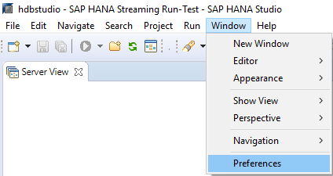

    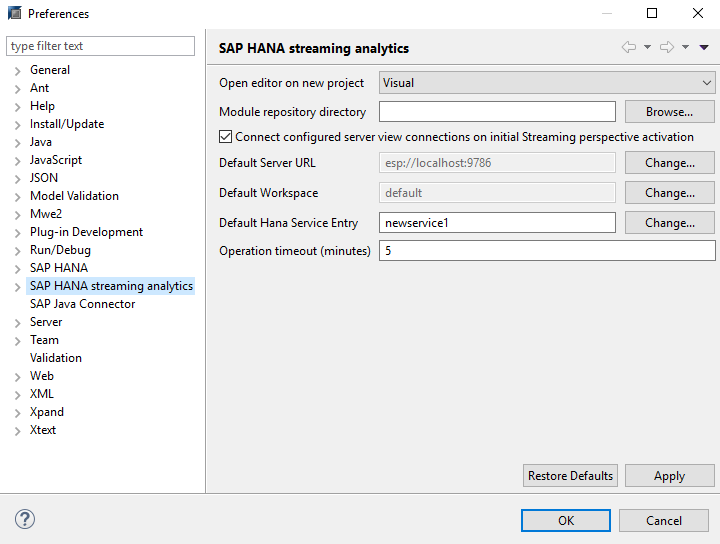

7. Set **Default Server URL** to the new server and click **OK**:

    

[ACCORDION-END]

[ACCORDION-BEGIN [Step 4: ](Add a HANA service)]

In this step we will create a named **Data Service** on the SAP HANA streaming analytics server.  In this case, the data service will connect to a particular HANA database. Streaming projects use named data services to connect to database tables.

1. Switch to the **SAP HANA Streaming Development** perspective and select the **Data Services** tab:

    

2. Right-click on the new server and select **Load Workspaces**:

    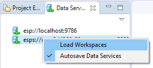

3. Right-click on the **Server-wide** folder and select **Add HANA Service**:

    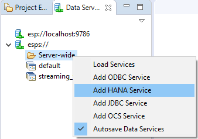

4. Select **`newservice1`** and, in the **Properties** view:
    - Enter the credentials for `SYSTEM`.
    - Check **Use Default HANA Server**.

    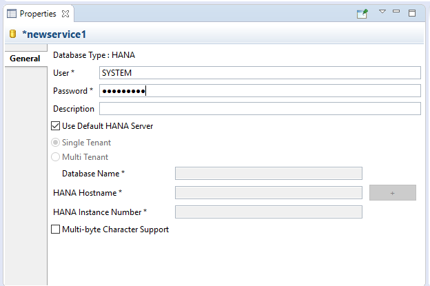

5. Right-click on **`newservice1`** and select **Rename Service**. Name the new service `hanadb`:
    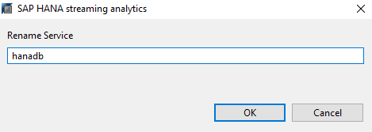

6. To confirm that the HANA service is configured properly, right-click on it and select **Discover**:

    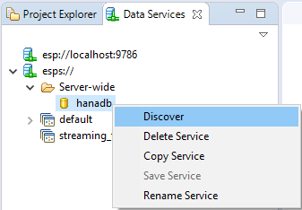

[ACCORDION-END]
