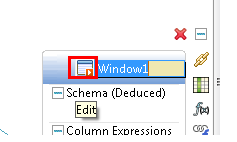
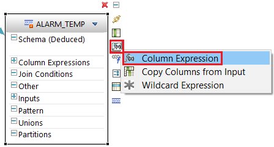
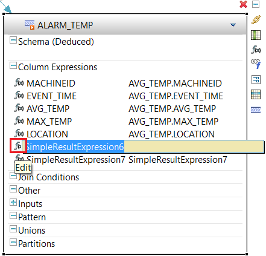
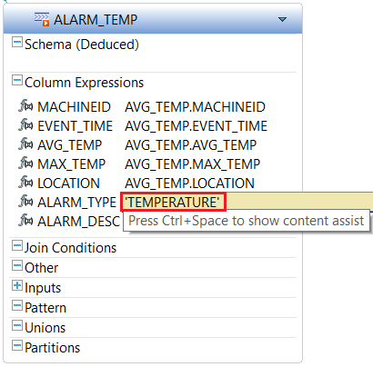
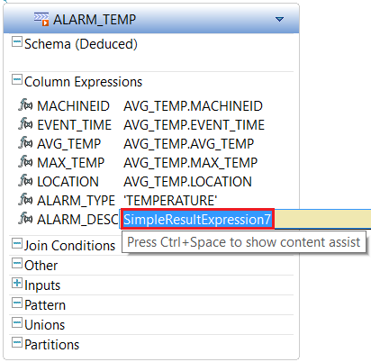

## Prerequisites  
 - **Proficiency:** Beginner
 - **Tutorials:** Using an Aggregate Window in SAP HANA Smart Data Streaming

## Next Steps
 - **Tutorials:** Run and Test a Project in SAP HANA Smart Data Streaming

## Details
### You will learn  
 - Using a Derived Window to analyze events and filter data.
 - Using reference data from a HANA table for detecting alert conditions.

### Time to Complete
**15 Min**.

---

#### Add Derived Window to Generate Alerts

1. Click **Derived Window** in the **Palette** and drop it onto the canvas.

    

2. Add a connector from **`AVG_TEMP`** to the new window.

    

3. Change the new window name to `ALARM_TEMP` and press **Enter** when done.

    

4. Click Add Column Expression **f(x)** icon shown below.

    

5. Click the **Copy Columns from Input** menu item to execute it. You can also press **c**.

    

6. Select all except for **`MIN_TEMP`** and **`TEMP_UNIT`**, then click **OK**.

    

7. Click Add Column Expression **f(x)** icon then **Column Expression** menu item to add a column to this window. Then repeat (i.e. add 2 new columns total). You can also press **c**.

    

8. Rename the first new column to `ALARM_TYPE` and press **Enter** key when done.

    

9. Rename the 2nd new column to `ALARM_DESC`.

    

10. Double-click on **`simpleResultExpression6`** to edit the expression.

    

11. Enter `'TEMPERATURE'` in the expression edit box for the **`ALARM_TYPE`** column. This will set the "type" of all alarms emitted by this window to the string "TEMPERATURE". Press **Enter** key to confirm entry.

    

12. Enter `'Machine not maintaining temperature'` in the expression box for the **`ALARM_DESC`** column. Press **Enter** key to confirm entry.

    

13. Now click **Add Query Clause** to add a query clause. We want to add a filter such that this window only contains rows for machines that have a current average temperature above the max specified for the machine.

    

14. Click the **Filter** menu item to execute it. You can also press **f**.

    

15. Double-click on **1** under the **Other** tab to edit the filter expression.

    

16. Change the filter expression to: `AVG_TEMP.AVG_TEMP > AVG_TEMP.MAX_TEMP`. Use **Ctrl+Space** for completion assist.

    

17. Click Compile Project icon to check for errors.

    

## Next Steps
 - **Tutorials:** Run and Test a Project in SAP HANA Smart Data Streaming
