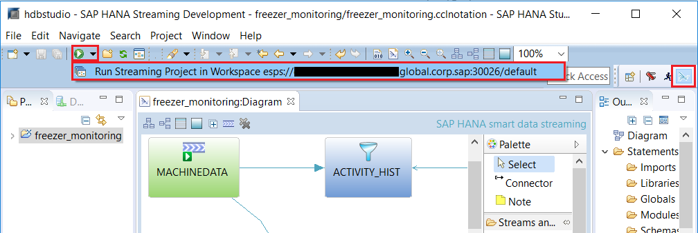
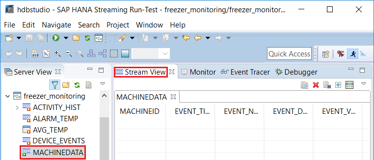
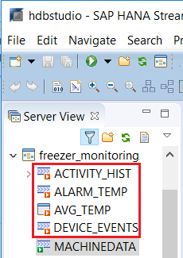
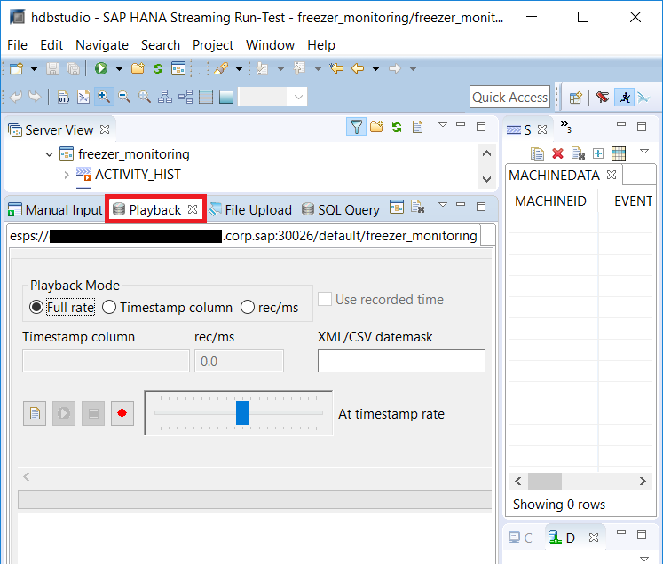
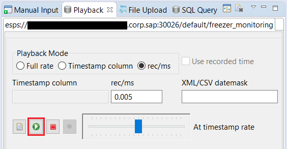
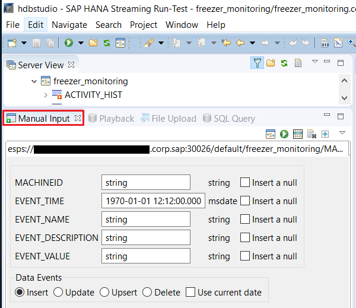
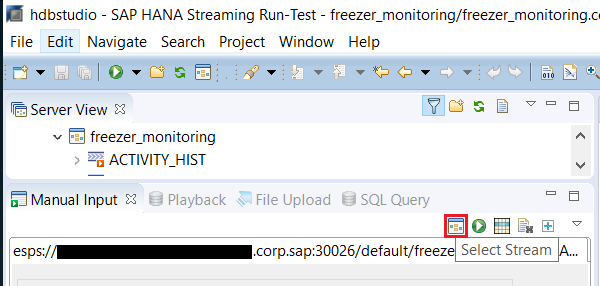
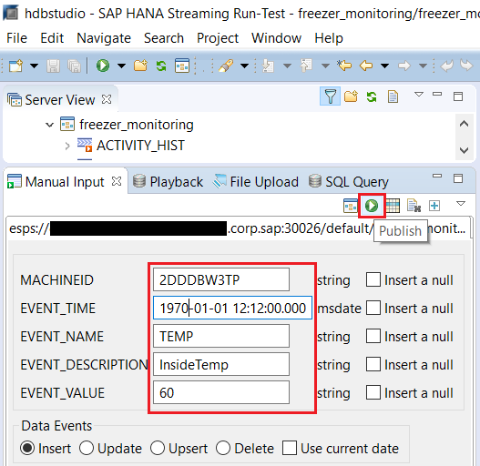
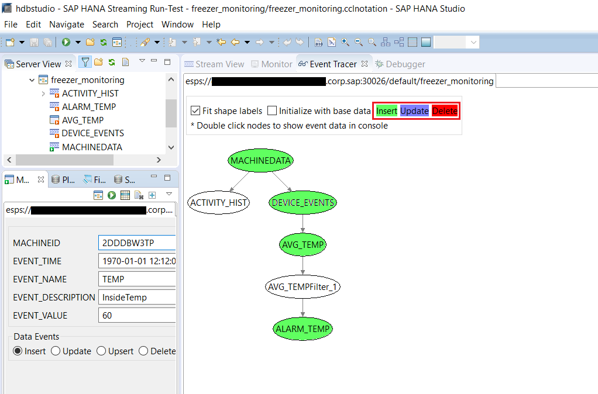

## Prerequisites  
- **Proficiency:** Beginner
- **Tutorials:** [Generating Alerts Using a Derived Window in SAP HANA Smart Data Streaming](http://www.sap.com/developer/tutorials/sds-part6-alerts.html)
- **Files:** Download the [**`machinedata.csv`**](https://raw.githubusercontent.com/SAPDocuments/Tutorials/master/tutorials/sds-event-stream-playback/machinedata.csv) file, which will be use later for playback during testing.

## Next Steps
Either of the following tutorials may be done next:
- **Tutorials:** [Watch for Patterns of Events and Use the CCL Editor in SAP HANA Smart Data Streaming](http://www.sap.com/developer/tutorials/sds-part8-patterns.html)
- **Tutorials:** [Custom Flex Operators with Advanced CCL in SAP HANA Smart Data Streaming](http://www.sap.com/developer/tutorials/sds-part9-flex-operators.html)

## Details
### You will learn  
- Running the project that you built in the previous exercises.
- Using the Playback tool to simulate a live source and stream in data from a file at a controlled rate.
- Using the Stream Viewer to view the output from each stream/window in your project.
- Using the Manual Input tool to manually generate test events and send them into your project one at a time.
- Using the Event Tracer tool to see how an event flows through the directed graph within the project.

### Time to Complete
**15 Min**.

---

[ACCORDION-BEGIN [Step 1: ](Running the project)]

In the next 10 steps you will run the project, play some data and view the results.

Go to **SAP HANA Streaming Development** perspective. Click the drop down arrow next to the **Run** button and select the streaming server to run this project. You will be switched into the **SAP HANA Streaming Run-Test** perspective after you have deployed and ran the project.

[ACCORDION-END]

[ACCORDION-BEGIN [Step 2: ](Open MACHINEDATA)]

Double-click on **`MACHINEDATA`** to open it in the **Stream View**.

Note: You won't see any data, because we haven't loaded any data yet.

[ACCORDION-END]

[ACCORDION-BEGIN [Step 3: ](Open other streams)]

Now double-click on each of the other streams/windows to open them in the **Stream View** tool.

[ACCORDION-END]

[ACCORDION-BEGIN [Step 4: ](Click playback)]

Click the **Playback** tab.

[ACCORDION-END]

[ACCORDION-BEGIN [Step 5: ](Connect the playback tool)]

Click Select Project icon in the top right corner of the **Playback** window to connect the playback tool to the current project (if you had multiple projects running it would ask you to choose).

[ACCORDION-END]

[ACCORDION-BEGIN [Step 6: ](Select the data file)]

Click Select Playback File icon shown below to select the data file to use.

[ACCORDION-END]

[ACCORDION-BEGIN [Step 7: ](Download machinedata.csv)]

If you have not downloaded the playback data already, please download the **`machinedata.csv`** file included in the prerequisites. In the Open dialogue window, change the file type to **`.csv`**. Choose **`machinedata.csv`** included in this tutorial and then click **Open**. You can also press **Alt+o**.

[ACCORDION-END]

[ACCORDION-BEGIN [Step 8: ](Control the playback speed)]

Click **rec/ms**. You want to control the playback speed so that you can watch things happen at a reasonable pace. Once it's running you can speed it up or slow it down using the slider tool. Enter `0.005` in the **rec/ms** box.

[ACCORDION-END]

[ACCORDION-BEGIN [Step 9: ](Start playback)]

Then click the Start Playback button with icon shown below.

[ACCORDION-END]

[ACCORDION-BEGIN [Step 10: ](View output)]

Click each viewer tab to view the output from each stream/window.

[ACCORDION-END]

[ACCORDION-BEGIN [Step 11: ](Using manual input and the event tracer tools)]

In the next eight steps you will use manual input and event tracer tools.

Click the **Event Tracer** tab to select it. Click on the Select Running Project button to connect to a running project. if you have multiple projects running, it would prompt you to choose one.

[ACCORDION-END]

[ACCORDION-BEGIN [Step 12: ](Choose manual input)]

Click the **Manual Input** tab.

[ACCORDION-END]

[ACCORDION-BEGIN [Step 13: ](Connect the manual input tool)]

Click **Select Stream** to connect the manual input tool to the project.

[ACCORDION-END]

[ACCORDION-BEGIN [Step 14: ](Choose MACHINEDATA)]

Click on **MACHINEDATA** and then click **OK**.

[ACCORDION-END]

[ACCORDION-BEGIN [Step 15: ](Fill in input fields)]

Fill out input fields as shown in the picture. Use one of the following as the **`MACHINEID`** since these are the existing values in the `"MACHINE_REF"` table that you are using: `2DDDBW3TP`, `EKM49RTXK`, `RB82KMY3S`, `4CBH7792RN`, `JMD51RTKK`, `GGR23RTXK`, or `8HRT4WX2`. You can alter the other values. Then click Publish button to send the event.

[ACCORDION-END]

[ACCORDION-BEGIN [Step 16: ](View the output)]

The colors in the **Event Tracer** (at the top  of studio) diagram shows how each stream/window in the project is affected by the event you just sent. Double-click on each node to view the output generated by that node in response to the event in the Console.

[ACCORDION-END]

[ACCORDION-BEGIN [Step 17: ](Select stream view)]

Click the **Stream View** tab.

[ACCORDION-END]

[ACCORDION-BEGIN [Step 18: ](Find your entry)]

Find the entry that you submitted through Manual Input.

[ACCORDION-END]

## Next Steps
Either of the following tutorials may be done next:
- **Tutorials:** [Watch for Patterns of Events and Use the CCL Editor in SAP HANA Smart Data Streaming](http://www.sap.com/developer/tutorials/sds-part8-patterns.html)
- **Tutorials:** [Custom Flex Operators with Advanced CCL in SAP HANA Smart Data Streaming](http://www.sap.com/developer/tutorials/sds-part9-flex-operators.html)
