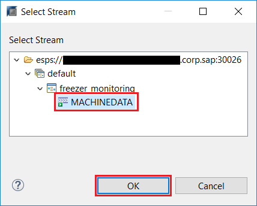

## Prerequisites  
 - **Proficiency:** Beginner
 - **Tutorials:** [Capture Streaming Output in the HANA Database](https://www.sap.com/developer/tutorials/sds-event-stream-tables.html)

## Next Steps
**Tutorial:** [Join an Event Stream to a HANA Table](https://www.sap.com/developer/tutorials/sds-stream-table-join.html)

## Details
### You will learn  
 - How to run a streaming project
 - How to use some of the streaming test tools in Eclipse. Specifically:  how to view the output from streams and how to use the manual input tool to generate an input event

### Time to Complete
**10 Min**.

---

[ACCORDION-BEGIN [Step 1: ](Run the Project)]

Go to **SAP HANA Streaming Development** perspective.

Click the drop down arrow next to the **Run** button and select the streaming server to run this project.

You will be switched into the **SAP HANA Streaming Run-Test** perspective if the project deploys successfully.

> If you get an error message saying that the project didn't start, first check for compile errors.  If it's compiling without errors but still won't start, see the Streaming Developer's Troubleshooting Guide.

[DONE]
[ACCORDION-END]

[ACCORDION-BEGIN [Step 2: ](Open viewers on the streams)]

Double-click on **`MACHINEDATA`** to open it in the **Stream View**.

> Note: You won't see any data, because we haven't loaded any data yet.

Do the same for the `ACTIVITY_HIST` stream to also open it in the **Stream View** tool.

[DONE]
[ACCORDION-END]

[ACCORDION-BEGIN [Step 3: ](Use the manual input tool to generate some input events)]

Click the **Manual Input** tab. In the default perspective layout, this is in the lower left tile.

Now click **Select Stream** tool to connect the manual input tool to your `freezer_monitor` project as shown below (the red box).

Click on **`MACHINEDATA`** and then click **OK**.

Fill in some values to create an input event.

- Enter any value for `MACHINEID`
- if the "Use Current Date" checkbox is selected it will fill in the `EVENT_TIME` automatically using the current time
- if you set the `EVENT_NAME` to `DOOR` it will pass through the filter and appear in `ACTIVITY_HIST`; any other value will not
- the `EVENT_DESCRIPTION` field can be anything you like
- set the `EVENT_VALUE` to either `Door Open` or `Door Close`

Then click Publish button to send the event.

View your event in the **Stream View** tabs. Keep in mind that ALL input events will appear in the input stream, but only events where `EVENT_NAME=DOOR` will appear in the `ACTIVITY_HIST` stream.

You can also view the `ACTIVITY_HIST` table in the HANA database to see that any events that appear in the `ACTIVITY_HIST` stream get recorded in the connected database table.

[DONE]
[ACCORDION-END]
