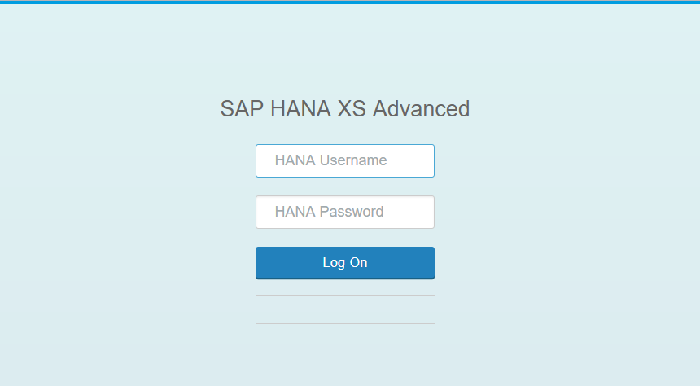
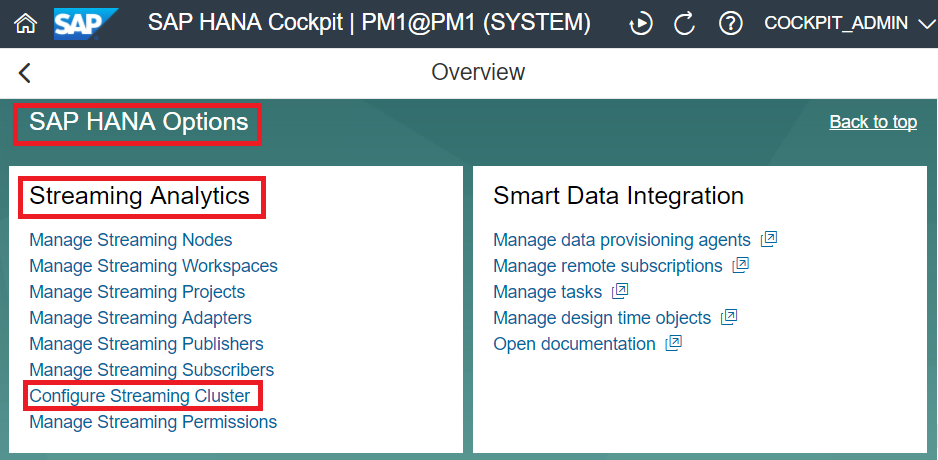
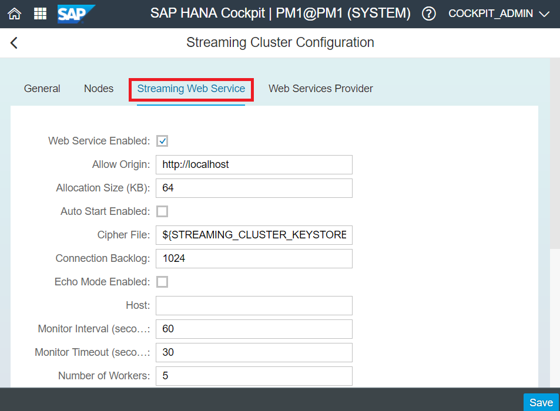

## Prerequisites
 - **Proficiency:** Intermediate
 - **System:** Ensure you have access to a HANA System with the Smart Data Streaming option installed and configured.
 - `-` Have a HANA user ID with permissions to create, compile, deploy and run a SDS project. (This can be the HANA `SYSTEM` User, which is granted full permissions during the installation process)
 - `-` Have the ability to connect to the Linux host running the Smart Data Streaming as the `<sid>adm` user.

## Next Steps
- **Tutorials** : [Publish Events to SDS via the REST Interface](https://www.sap.com/portugal/developer/tutorials/sds-rest-publish.html)

## Details
### You will learn
 - How to configure, run and test the Streaming Web Service (SWS) for SAP HANA Smart Data Streaming.
 - How to set various configurations in HANA Cockpit

### Time to Complete
**15 Min**
---

[ACCORDION-BEGIN [Step 1: ](Configuring the Streaming Web Service for SAP HANA Smart Data Streaming)]

Streaming Web Service (SWS) is one of the SAP HANA Smart Data Streaming (SDS) adapters. SWS is a scalable gateway which provides HTTP-based access to SAP HANA SDS. It provides greater scalability and performance than the older Web Service Provider (WSP). Like the WSP, the SWS can receive requests from multiple web services and publish data to multiple projects.  This contrasts with other adapters which only send and receive data from one source and publish to one project.

The configuration details for the SWS are stored in the HANA database, which can be accessed through the HANA cockpit.

To edit these settings, log into HANA Cockpit. To access Cockpit, use the URL given during installation, in the form `https://<hostname>:<port>`.

> Note: If this is the first time you are using cockpit, start by opening the **Cockpit Manager** located at port `51023`.

To edit the configuration details of SWS, navigate to the System Resource with SDS. Scroll to SAP HANA Options, where you will find the **Streaming Analytics** tile. Select **Configure Streaming Cluster**.

Navigate to the **Streaming Web Service** tab, and where you can configure various properties. If unchanged, their default values will be used.

In this configuration, leave the **Host**, which by default is, blank. This means it will be able to bind to any interface server.

Additionally note the **Port** Number, which by default is `9093`, which we will be using for the purposes of this tutorial.

Ensure that **SSL Enabled** is unchecked. And for convenience, check the **Auto Start Enabled** box, which will allow the SWS to always start up with the SDS cluster.

Finally, under **Token Validity (Seconds)**, change the value to `3000`. Click **Save** in the bottom right corner.

> Note: If you would like to turn on tracing, you can do so by checking the **Trace Enabled** and/or **Trace HTTP Enabled** box.

By enabling trace, you can check outputs in HANA Studio in the log and trace files under the host's **Diagnosis Files**. This is located in the HANA Administration Window, which can be accessed by double clicking a system in the Systems Panel.

After you click save, you will be notified that the configuration changes have been saved. Click **OK**.

Now, to run the service, since we checked the **Auto Start Enabled** box, SWS will automatically start up with the SDS Cluster. However, we will need to restart the SDS cluster for the changes to take effect. On the SDS Node, using the `<sid>adm` user, run `HDB stop && HDB start`.

When the SDS Cluster starts up again, SWS will be running.

In the next step, we will test the Streaming Web Service via the REST Interface.

[DONE]
[ACCORDION-END]

## Next Steps
- **Tutorials** : [Publish Events to SDS via the REST Interface](https://www.sap.com/portugal/developer/tutorials/sds-rest-publish.html)
