## Prerequisites  
 - **Proficiency:** intermediate
 - **Tutorials:** [Prepare sample Fiori app for translation](https://www.sap.com/developer/tutorials/sth-prepare-fiori-app-translation.html)

## Next Steps
 - **Tutorials:** [Translate a sample Fiori app](https://www.sap.com/developer/tutorials/sth-translate-fiori-app.html)

## Details
### You will learn  
You'll learn how to create a Git repository on SAP Cloud Platform and synchronize your project in SAP Web IDE with the Git repository on SAP Cloud Platform.

These steps are required for the next tutorial: [Translate a sample Fiori app](https://www.sap.com/developer/tutorials/sth-translate-fiori-app.html).

### Time to Complete
**10 Min**

[ACCORDION-BEGIN [Step 1: ](Log into your SAP Cloud Platform account)]

Log into [SAP Cloud Platform](https://account.hanatrial.ondemand.com/cockpit#/home/trialhome) by opening the following URL in a new tab: https://account.hanatrial.ondemand.com/cockpit#/home/trialhome

In the SAP Cloud Platform cockpit, choose the tile for a trial account in the Neo environment.

In the navigation area on the left, choose **Repositories > Git Repositories**.

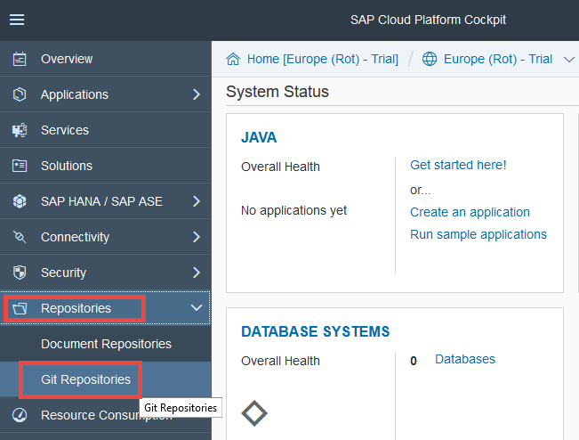

[DONE]
[ACCORDION-END]

[ACCORDION-BEGIN [Step 2: ](Create a new repository)]

Choose **New Repository**, and enter the following details:

Field             | Value
:---------------- | :----------------
Repository Name   | `sampleapprovepurchaseorders`
Description       | `Repository for Approve Purchase Order app`

Make sure the **Create empty commit** box is selected.
To create your Git repository, choose **OK**.

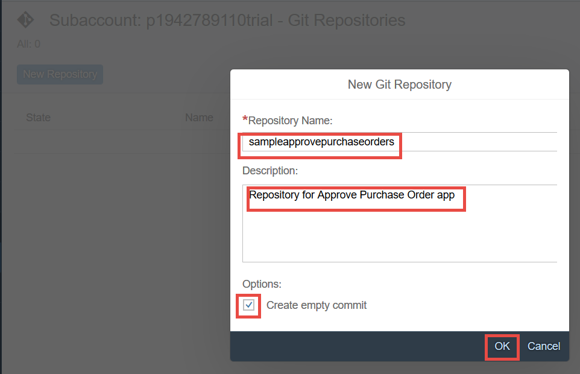

[DONE]
[ACCORDION-END]

[ACCORDION-BEGIN [Step 3: ](Open the repository overview page)]

Choose the **`sampleapprovepurchaseorders`** repository link to open the repository overview page.

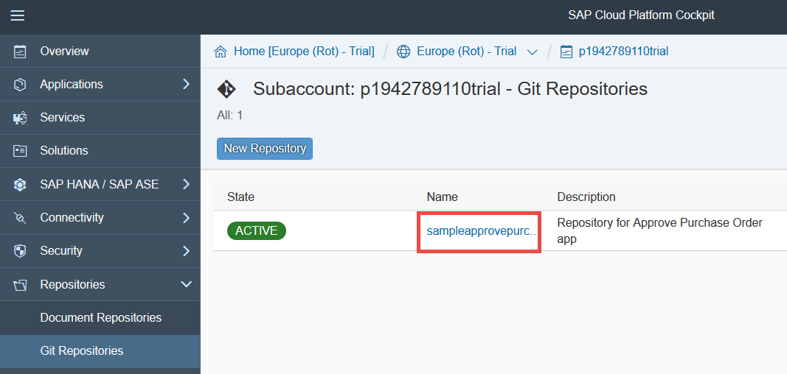

On the repository overview page, copy the repository URL:

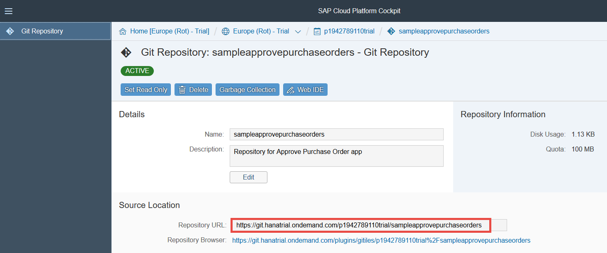

[DONE]
[ACCORDION-END]

[ACCORDION-BEGIN [Step 4: ](Initialize the local repository)]

Open your project in **SAP Web IDE**, right-click your **`sampleapprovepurchaseorders`** project folder and choose **Git** | **Initialize Local Repository**.

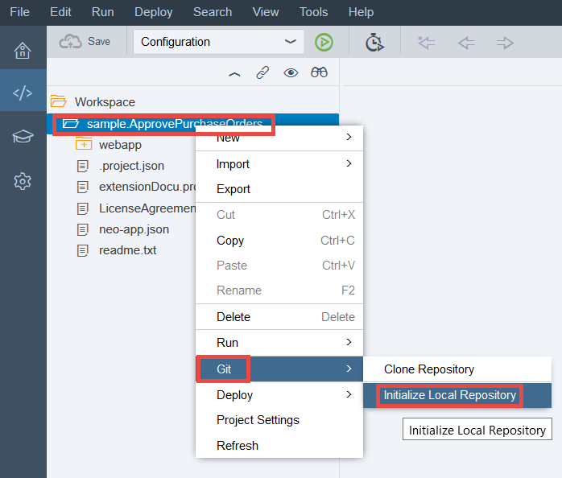

An **alert** appears in the upper right corner of the SAP Web IDE window.
Choose **Set Remote** in the alert.

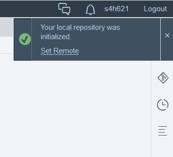

[DONE]
[ACCORDION-END]

[ACCORDION-BEGIN [Step 5: ](Enter a link to the remote repository)]

In the **Configure Git Repository** dialog box, paste the **repository URL** that you copied in step 3 in the URL field by choosing Ctrl + V. Leave the **Add configuration for Gerrit** checkbox deselected and then choose **OK**.

This will initialize your local repository and link it to the Git repository on SAP Cloud Platform.
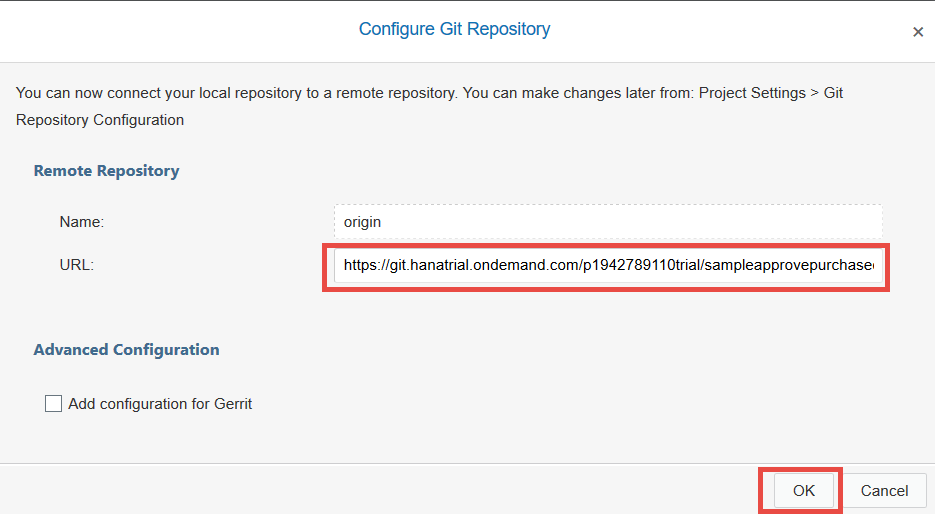

When the **Changes Fetched** dialog box opens, choose **OK**.
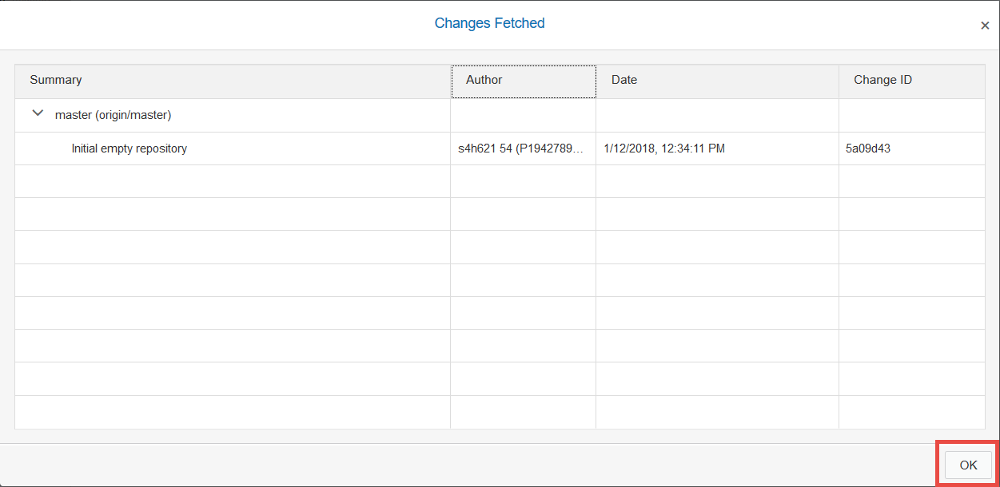

[DONE]
[ACCORDION-END]

[ACCORDION-BEGIN [Step 6: ](Open the Git pane)]

Open the Git pane in the right of **SAP Web IDE** and confirm that the correct repository (`sampleApprovePurchasePrders`) appears at the top of the Git pane.

If a different Git repository appears, choose your project folder (`sampleApprovePurchasePrders`).

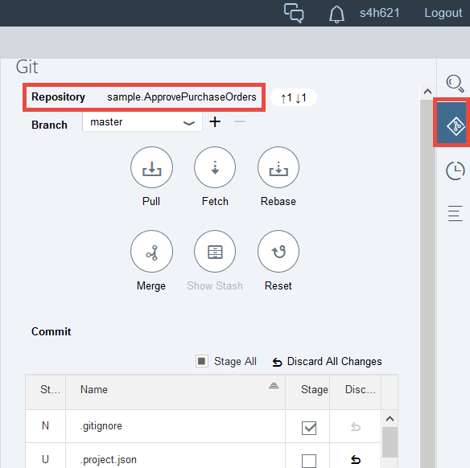

[DONE]
[ACCORDION-END]

[ACCORDION-BEGIN [Step 7: ](Perform a Git merge)]

To merge your local branch with the remote origin/master branch, choose the **Merge** button in the Git pane.
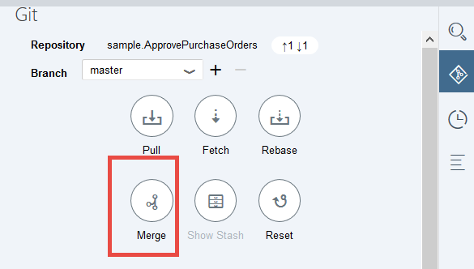

When the **Merge "master"** dialog box opens, make sure the **origin/master** remote branch is selected and choose **OK**.
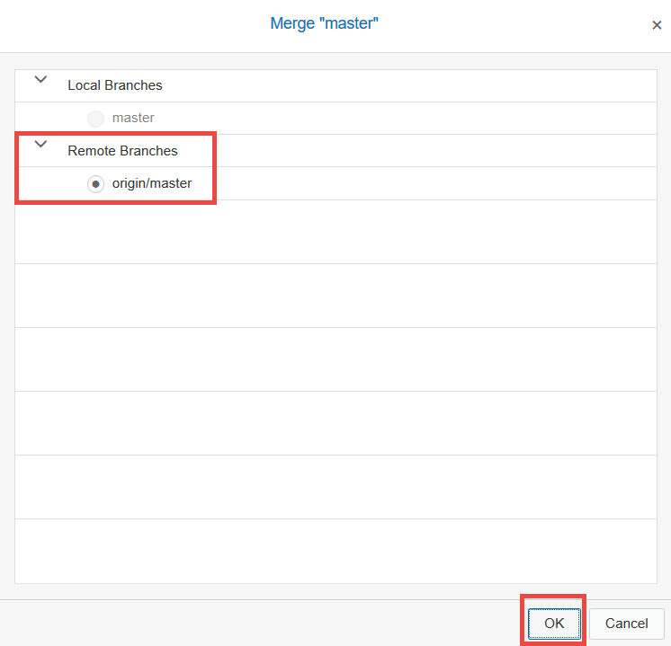

At this point, your Git repository is set up.

In the following steps, you'll commit and push your project files to the Git repository.

[DONE]
[ACCORDION-END]

[ACCORDION-BEGIN [Step 8: ](Stage files)]

Commit all project files by choosing the **Stage All** checkbox.

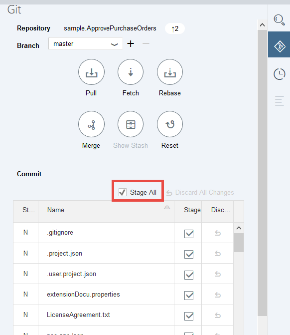

[DONE]
[ACCORDION-END]

[ACCORDION-BEGIN [Step 9: ](Enter a description for the commit)]

Scroll down in the **Git pane** and enter a description, which is required for all commits) like `Initial commit`.

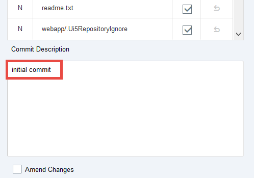

[DONE]
[ACCORDION-END]

[ACCORDION-BEGIN [Step 10: ](Commit and push your changes)]

To add your files to the master branch, choose **Commit and Push** and select **origin/master** from the menu.

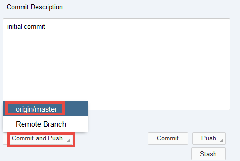

[DONE]
[ACCORDION-END]

[ACCORDION-BEGIN [Step 11: ](Enter user information)]

 If the **User Information** dialog box appears, confirm or enter your Git credentials and choose **OK** to push the changes to the remote repository.

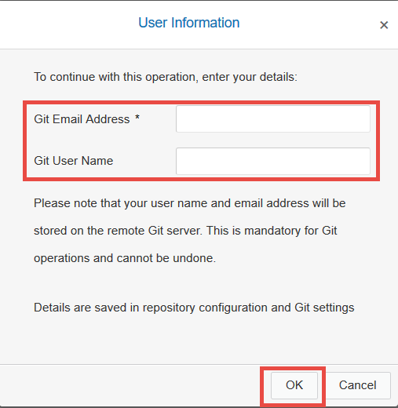

[DONE]
[ACCORDION-END]

[ACCORDION-BEGIN [Step 12: ](View updated file decorations)]

You will see a confirmation alert **Push has been completed** appear briefly in the top right of the SAP Web IDE window (just below **Logout**).
You'll also see the decorations change to **green dots**, which indicates that the files in your project match the versions in the Git repository.

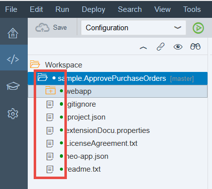

[DONE]
[ACCORDION-END]

[ACCORDION-BEGIN [Step 13: ](Start deployment to SAP Cloud Platform)]

Now it's time to deploy your app.
Right-click your **`sample.ApprovePurchaseOrders`** project folder, and choose **Deploy | Deploy to SAP Cloud Platform**.

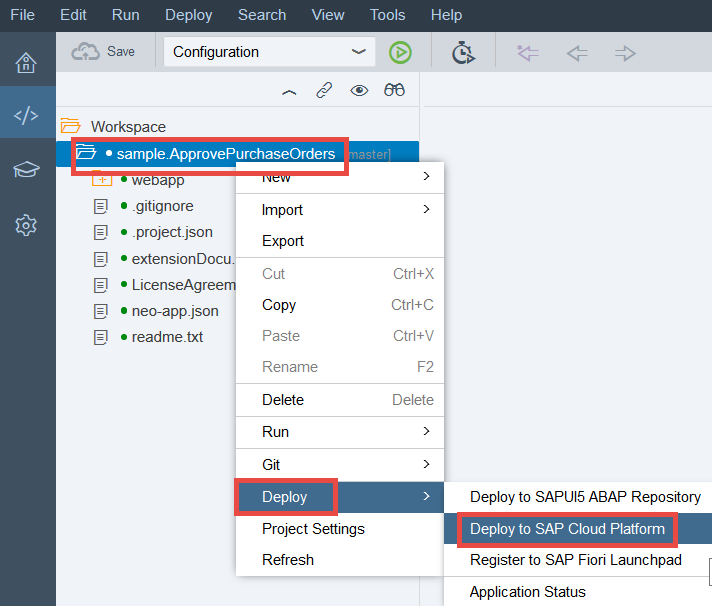

[DONE]
[ACCORDION-END]

[ACCORDION-BEGIN [Step 14: ](Finalize deployment to SAP Cloud Platform)]

In the **Deploy Application to SAP Cloud Platform** dialog box, confirm that the **Deploy a new application** and **Activate** checkboxes are selected. Then choose **Deploy**.

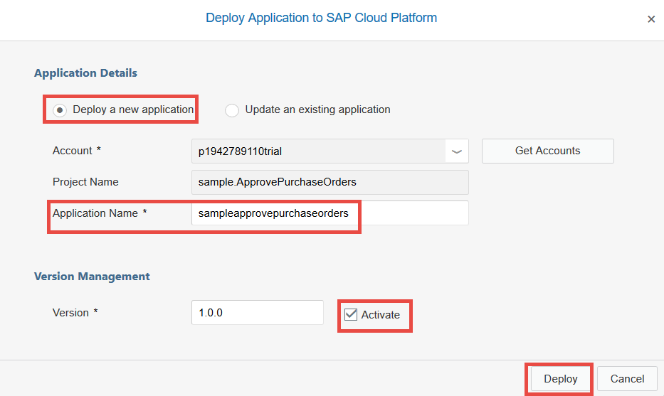

[DONE]
[ACCORDION-END]

[ACCORDION-BEGIN [Step 15: ](Confirm the deployment of your app)]

After the app has been deployed, a success message appears. Close the **Successfully Deployed** dialog box.
You've now prepared everything for the translation step.

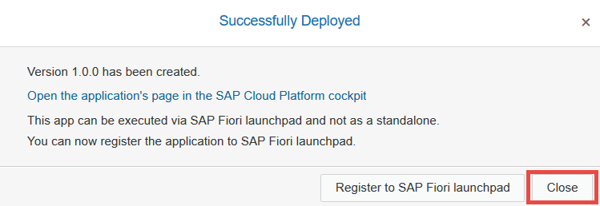

[VALIDATE_18]

[ACCORDION-END]

## Next Steps
- [Translate your app with SAP Translation Hub](https://www.sap.com/developer/tutorials/sth-translate-fiori-app.html)
