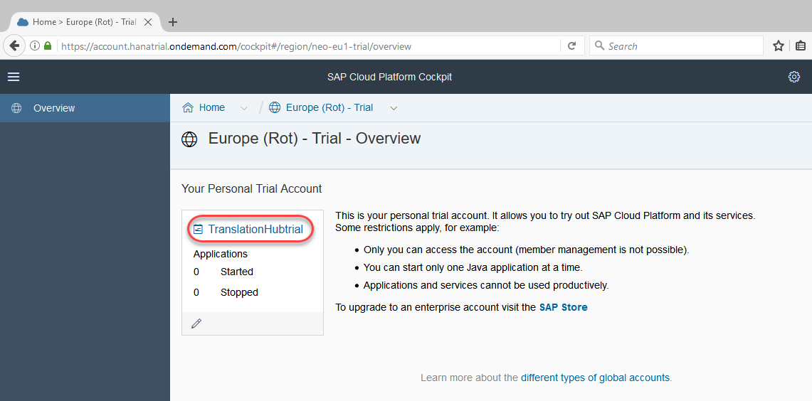
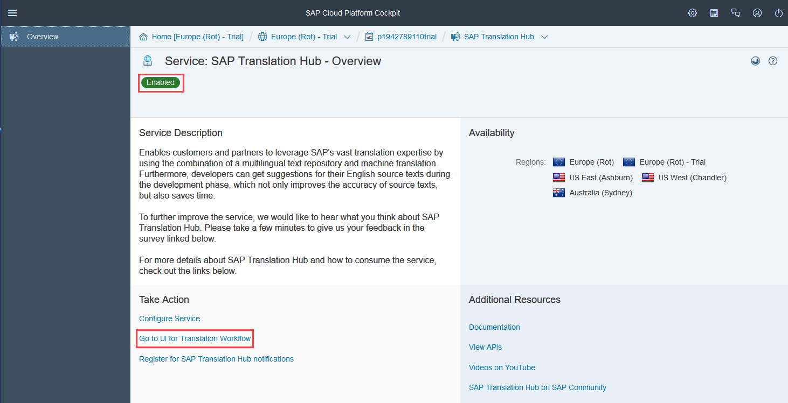

## Prerequisites  
 - **Proficiency:** Beginner
 - **Tutorials:** [Sign up for an free trial account on SAP Cloud Platform](http://www.sap.com/developer/tutorials/hcp-create-trial-account.html)

## Next Steps
 - [Prepare a sample Fiori app for translation](http://www.sap.com/developer/tutorials/sth-prepare-fiori-app-translation.html)

## Details
### You will learn  
To use SAP Translation Hub, you first need to enable the service in the cockpit.

### Time to Complete
**5 Min**.

---
[ACCORDION-BEGIN [Step 1: ](Choose tile for developer account)]

In the SAP Cloud Platform cockpit, choose the tile for your personal developer account.

[ACCORDION-END]

[ACCORDION-BEGIN [Step 2: ](Open the service catalog)]

Choose **Services** in the navigation area on the left.

[ACCORDION-END]

[ACCORDION-BEGIN [Step 3: ](Locate the SAP Translation Hub service)]

Search for the SAP Translation Hub service by entering **Transl**, and then choose the **SAP Translation Hub** tile.

[ACCORDION-END]

[ACCORDION-BEGIN [Step 4: ](Enable the service)]

Choose **Enable**.

[ACCORDION-END]

[ACCORDION-BEGIN [Step 5: ](Verify that service is enabled)]

After you enable the service, your screen should look like this:

You can now use the SAP Translation Hub service.

[ACCORDION-END]

## Next Steps
 - [Prepare a sample Fiori app for translation](http://www.sap.com/developer/tutorials/sth-prepare-fiori-app-translation.html)
